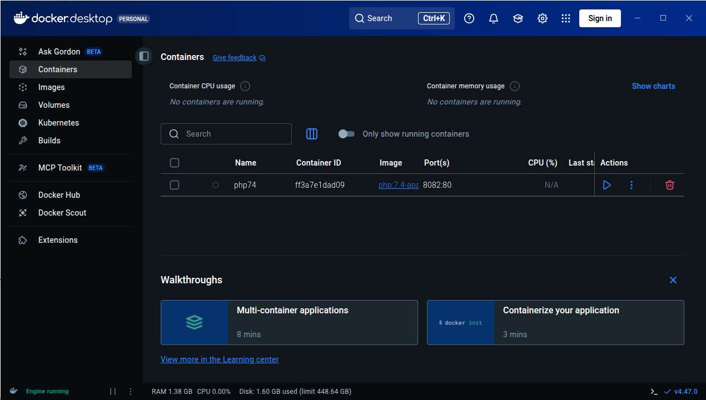
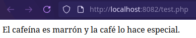
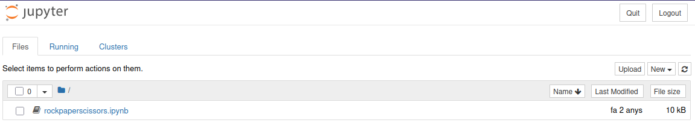
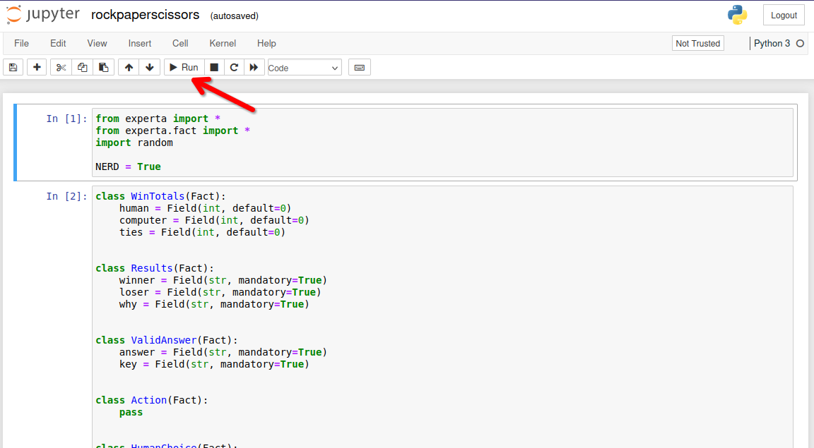
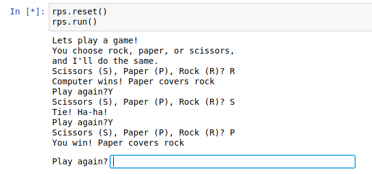
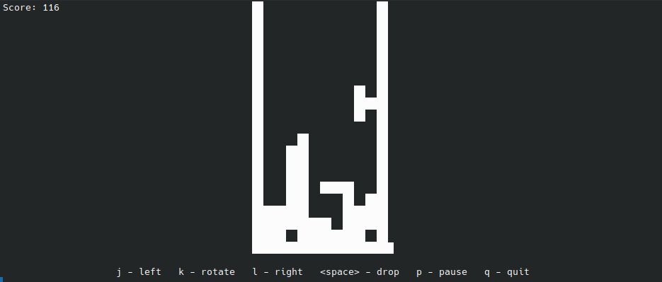

#  Introducción a docker

## Generalidades

### Imprescindibles

- [¿Qué es docker? Imagen vs contenedor](https://www.youtube.com/watch?v=FAJ1o3hb35s) 
  
    [](https://youtu.be/BbA5dpS4CcI?si=FAJ1o3hb35s)
    
    <p><iframe width="560" height="315" src="https://www.youtube.com/embed/FAJ1o3hb35s?si=byaWLqYMVSlPFpIx" title="YouTube video player" frameborder="0" allow="accelerometer; autoplay; clipboard-write; encrypted-media; gyroscope; picture-in-picture; web-share" referrerpolicy="strict-origin-when-cross-origin" allowfullscreen></iframe></p>
    
- [Curso de docker](https://youtu.be/4Dko5W96WHg?si=Ri9RgyfLWxbs0DY9&t=86)
  
    [](https://youtu.be/4Dko5W96WHg)
    <p><iframe width="560" height="315" src="https://www.youtube.com/embed/4Dko5W96WHg?si=TJyuhtQHMZg7GIt4" title="YouTube video player" frameborder="0" allow="accelerometer; autoplay; clipboard-write; encrypted-media; gyroscope; picture-in-picture; web-share" referrerpolicy="strict-origin-when-cross-origin" allowfullscreen></iframe></p>
    
- [Creación de imágenes](https://www.youtube.com/watch?v=A8oXDTDhZWU)
  
    [](https://youtu.be/A8oXDTDhZWU)
    <p><iframe width="560" height="315" src="https://www.youtube.com/embed/A8oXDTDhZWU?si=oPFtXsMsEeUI-T9o" title="YouTube video player" frameborder="0" allow="accelerometer; autoplay; clipboard-write; encrypted-media; gyroscope; picture-in-picture; web-share" referrerpolicy="strict-origin-when-cross-origin" allowfullscreen></iframe></p>
    
### Arquitectura
{width="700"}
{width="700"}
{width="500"}

## Instalación

### Instalación en Ubuntu

[https://www.digitalocean.com/community/tutorials/how-to-install-and-use-docker-on-ubuntu-20-04-es](https://www.digitalocean.com/community/tutorials/how-to-install-and-use-docker-on-ubuntu-20-04-es)

Requisitos previos:

- **apt-transport-https:** permite que el administrador de paquetes transfiera datos a través de https
- **ca-certificates:** permite que el navegador web y el sistema verifiquen los certificados de seguridad
- **curl:** transfiere datos (similar a wget)
- **software-properties-common:** agrega scripts para administrar el software

```bash
sudo apt-get install  curl apt-transport-https ca-certificates software-properties-common
```

Agregamos repositorio

```bash
# Primero clave GPG
curl -fsSL https://download.docker.com/linux/ubuntu/gpg | sudo apt-key add -

sudo add-apt-repository "deb [arch=amd64] https://download.docker.com/linux/ubuntu $(lsb_release -cs) stable"

sudo apt update

sudo apt install docker-ce

sudo systemctl status docker
```

Por defecto, el comando docker solo puede ser ejecutado por el usuario root o un usuario del grupo docker, que se crea automáticamente durante el proceso de instalación de Docker.

Para evitar escribir sudo al ejecutar el comando docker, agregue su nombre de usuario al grupo docker:

```bash
sudo usermod -aG docker ${USER}

# Cerramos y abrimos sesión de nuevo o ejecutamos
su - ${USER}

# Confirmamos los grupos de nuestro usuario
id -nG
```

### Docker Desktop

#### ¿Qué es Docker Desktop?

{width="300"}

Es la aplicación oficial de Docker que te da una **interfaz gráfica (GUI)** para manejar contenedores, además de la línea de comandos.

#### ¿Para qué sirve?

- **Gestión visual**: Ver contenedores, imágenes y volúmenes de forma gráfica
- **Configuración fácil**: Ajustar recursos (CPU, RAM) con sliders
- **Monitorización**: Ver en tiempo tiempo real qué está pasando

{width="700"}

#### Compatibilidad por Sistema Operativo

🪟 **Windows**

- **Windows 10/11** 64-bit (versiones Home, Pro, Enterprise, Education)
- **Requisitos importantes**:
  - Habilitar **WSL 2** (Windows Subsystem for Linux)
  - Virtualización activada en BIOS/UEFI
  - **Windows Home** necesita WSL 2, **Pro/Enterprise** puede usar Hyper-V

🍎 **macOS**

- **macOS 12 Monterey** o superior
- **Tipos de chip**:
  - **Apple Silicon** (M1, M2, M3, etc.)
  - **Intel** con procesador de 2010 o más nuevo
- Necesita **macOS actualizado**

🐧 **Linux** (versión nativa)

- **Distribuciones compatibles**:
  - Ubuntu 20.04 LTS o superior
  - Debian 11 o superior
  - Fedora 36 o superior
  - Arch Linux (y derivados)
- **Requisitos**: kernel 5.10+, systemd, 64-bit

#### **Guía Rápida de Instalación**

**Windows:**

1. Descarga desde [docker.com/products/docker-desktop](https://www.docker.com/products/docker-desktop/)
2. Ejecuta el instalador `.exe`
3. Sigue el asistente (marca "Use WSL 2" si tienes Windows Home)
4. Reinicia cuando termine
5. ¡Listo! Docker se inicia automáticamente

**macOS:**

1. Descarga desde la web oficial
2. Arrastra Docker.app a la carpeta Applications
3. Ejecuta desde Launchpad
4. Autoriza con contraseña del sistema
5. Espera a que configure todo (puede tardar unos minutos)

**Linux (Ubuntu/Debian ejemplo):**

  ```bash
# Opción 1: Descargar .deb oficial
wget https://desktop.docker.com/linux/main/amd64/docker-desktop-4.25.0-amd64.deb

# Opción 2: Instalar
sudo apt install ./docker-desktop-*.deb

# Iniciar
systemctl --user start docker-desktop
  ```

#### Ventajas docker desktop (GUI) vs Línea de Comandos (CLI)

✅ **Ventajas de Docker Desktop:**

- **Más fácil para empezar** - Ideal para principiantes
- **Todo integrado** - No necesitas instalar nada más
- **Debugging visual** - Ves los logs y estados de un vistazo
- **Gestión de recursos** - Controlas CPU/RAM fácilmente

❌ **Desventajas:**

- **Más pesado** - Consume más recursos de tu PC
- **Menos flexible** - Algunas opciones avanzadas solo por comandos
- **Dependes de la GUI** - Si se cierra la app, pierdes la interfaz

🎯 **Conclusión:**

- **Empezad con Docker Desktop** para aprender sin frustraciones
- **Aprended también los comandos básicos** para ser más versátiles
- Usad **ambos**: la GUI para lo cotidiano y la terminal para lo avanzado

## Uso

### Comandos básicos

#### Gestión de imagenes

```bash
docker image
docker history
docker inspect
docker save/load
docker rmi
```

#### Gestión de contenedores

```bash
docker attach
docker exec
docker inspect
docker kill
docker logs
docker pause/unpause
docker port
docker ps
docker rename
docker start/stop/restart
docker rm
docker run
docker stats
docker top
docker update
```

#### Ejemplo

```bash
# Ver los contenedores que tenemos
docker ps
CONTAINER ID   IMAGE     COMMAND   CREATED   STATUS    PORTS     NAMES

# Ver las imagenes que tenemos
docker images
REPOSITORY                             TAG       IMAGE ID       CREATED        SIZE

# Crear un contenedor con una imagen básica de debian
# Como no tenemos ninguna imagen de debian, la descarga y la ejecuta
docker run debian
# Intentamos ver el contenedor en ejecución, no aparece nada porque ya se ha cerrado
docker ps
# Podemos verlo con
docker ps -a
CONTAINER ID   IMAGE     COMMAND       CREATED              STATUS                          PORTS     NAMES
09b14daab800   debian    "bash"        2 seconds ago        Exited (0) 1 second ago                   pensive_wozniak

# Ejecutar un comando en un contenedor
docker run debian /bin/echo "Hello World"
Hello World

# Información
docker inspect debian
```

### Crear contenedor interactivo y con nombre.

[https://jolthgs.wordpress.com/2019/09/25/create-a-debian-container-in-docker-for-development/](https://jolthgs.wordpress.com/2019/09/25/create-a-debian-container-in-docker-for-development/)

Para que docker no se invente un nombre como “pensive_wozniak” (comando anterior) podemos definir el nombre que queremos.

Utilizaremos una de las imágenes de: [https://hub.docker.com/_/debian/tags](https://hub.docker.com/_/debian/tags)

```bash
# Obtenemos la imagen, en el apartado aterior la hemos ejecutado directamente con "run", esto
# la obtiene implícitamente. En este caso la vamos a descargar.
$ docker pull debian:13-slim

# --name
# -h hostname que tendrá el contenedor
# -e codificación de caracteres
# -it modo interactivo
# /bin/bash -l  la shell que se ejecutará
$ docker run --name debian-mini -h equipo1 -e LANG=C.UTF-8 -it debian:13-slim /bin/bash -l

--- Estamos dentro del contenedor ---
# Una vez dentro del contenedor podemos actualizarlo e instalar los paquetes que creamos necesarios
apt update && apt upgrade --yes && apt install sudo locales --yes
# Configurar timezone
dpkg-reconfigure tzdata

# Vamos a nuestra home y creamos un archivo
cd
echo "hola" > prueba.txt

# Salimos del contenedor
exit (o control + d)

--- Ahora volvemos a la consola de nuestro equipo ---
$ docker ps
CONTAINER ID   IMAGE     COMMAND   CREATED   STATUS    PORTS     NAMES

$ docker ps -a
CONTAINER ID   IMAGE            COMMAND          CREATED          STATUS                      PORTS     NAMES
8c6b29c818ee   debian:13-slim   "/bin/bash -l"   44 seconds ago   Exited (0) 11 seconds ago             debian-mini
```

### Imágenes

Es un instalador donde podemos incorporar nuestra aplicación. Es el punto de inicio para crear contenedores.
Hay imágenes oficiales de por ejemplo Ubuntu, Apache, etc, que fueron creadas por sus creadores oficiales.

Página oficial para imágenes: [https://hub.docker.com](https://hub.docker.com) 

Vamos a utilizar la siguiente imagen para pruebas:

[https://hub.docker.com/_/hello-world](https://hub.docker.com/_/hello-world)

Para ejecutar este contenedor “hello-word” escribimos en la terminal:

```bash
docker run hello-world
```

Una vez ejecutado, ya dispondremos de la imagen descargada, podemos ver todas las imágenes que tenemos descargadas con:

```bash
docker images

REPOSITORY                              TAG           IMAGE ID       CREATED        SIZE
hello-world                             latest        ee301c921b8a   9 months ago   9.14kB
```

Desde la página web de docker hub, podemos ver diferentes versiones de la misma imagen en la pestaña “TAGS”

{width="700"}

Podemos descargar una imagen específica y ejecutarla:

```bash
docker run hello-world:linux

docker images
REPOSITORY                              TAG           IMAGE ID       CREATED        SIZE
hello-world                             latest        ee301c921b8a   9 months ago   9.14kB
hello-world                             linux         ee301c921b8a   9 months ago   9.14kB

docker run hello-world:linux
```

Para eliminar una imagen utilizamos el parámetro `rmi` por ejemplo:

```bash
docker pull alpine

docker images
REPOSITORY                              TAG           IMAGE ID       CREATED        SIZE
alpine                                  latest        ace17d5d883e   3 weeks ago    7.73MB
hello-world                             latest        ee301c921b8a   9 months ago   9.14kB
hello-world                             linux         ee301c921b8a   9 months ago   9.14kB

# Eliminamos, opción 1
docker rmi ace17d5d883e

# Eliminamos, opción 2
docker rmi alpine

# Eliminamos, opción 3
docker rmi ace1
```

También se pueden buscar imágenes desde consola.

```bash
docker search ubuntu

NAME                             DESCRIPTION                                     STARS     OFFICIAL
ubuntu                           Ubuntu is a Debian-based Linux operating sys…   16888     [OK]
websphere-liberty                WebSphere Liberty multi-architecture images …   298       [OK]
open-liberty                     Open Liberty multi-architecture images based…   64        [OK]
neurodebian                      NeuroDebian provides neuroscience research s…   106       [OK]
ubuntu-debootstrap               DEPRECATED; use "ubuntu" instead                52        [OK]
ubuntu-upstart                   DEPRECATED, as is Upstart (find other proces…   115       [OK]
ubuntu/nginx                     Nginx, a high-performance reverse proxy & we…   112
ubuntu/squid                     Squid is a caching proxy for the Web. Long-t…   83
ubuntu/cortex                    Cortex provides storage for Prometheus. Long…   4
ubuntu/prometheus                Prometheus is a systems and service monitori…   56
ubuntu/apache2                   Apache, a secure & extensible open-source HT…   70
...
```

### Volúmenes

Los volúmenes sirven para almacenar información de manera persistente en uno o varios contenedores. Es útil para que los archivos ya estén integrados en el propio contenedor y podamos disponer de dichos archivos en diferentes contenedores diferentes.

También nos permiten compartir archivos con el contenedor. Modificarlos en local y que se modifiquen en el contenedor.

#### Operaciones con volúmenes

```bash
# Ver disponibles
docker volume ls
DRIVER    VOLUME NAME

# Creamos un volumen
docker volume create almacen
almacen

docker volume ls
DRIVER    VOLUME NAME
local     almacen

docker volume inspect almacen
[
    {
        "CreatedAt": "2024-02-20T11:10:58Z",
        "Driver": "local",
        "Labels": null,
        "Mountpoint": "/var/lib/docker/volumes/almacen/_data",
        "Name": "almacen",
        "Options": null,
        "Scope": "local"
    }
]

# Lo borramos
docker volume rm almacen
```

#### Ejemplo: compartir volúmenes con host

```bash
# Creamos un punto de montaje
docker run --rm -it -v /tmp/puntomontaje:/home ubuntu
```

#### Ejemplo: compartir volúmenes con contenedores

Vamos a crear un volumen para compartir archivos entre nuestro sistema de ficheros local y 2 contenedores (ubuntu y fedora).

```bash
docker volume create almacen

# Descargamos la imagen de ubuntu
docker pull ubuntu
# Descargamos la imagen de fedora
docker pull fedora

docker images
REPOSITORY                             TAG       IMAGE ID       CREATED        SIZE
ubuntu                                 latest    a50ab9f16797   7 days ago     69.2MB
fedora                                 latest    46243415778a   2 months ago   259MB

## Creamos un contenedor, modo interactivo
docker run --rm -it -v almacen:/home ubuntu
# dentro del contenedor
cd /home
touch prueba.txt
exit # -> Salimos del contenedor

## Creamos otro contenedor, modo interactivo
docker run --rm -it -v almacen:/home fedora
# dentro del contenedor
cd /home
ls -> existe el archivo prueba.txt
```

### Diferencias docker-compose vs DockerFile

[https://blog.elhacker.net/2022/01/gestion-contenedores-dockerfile-y-docker-compose.html](https://blog.elhacker.net/2022/01/gestion-contenedores-dockerfile-y-docker-compose.html)

#### Docker Compose

Docker Compose es una herramienta que permite simplificar el uso de Docker. A partir de archivos YAML es mas sencillo crear contenedores, conectarlos, habilitar puertos, volúmenes, etc.

Con Compose puedes crear diferentes contenedores y al mismo tiempo, en cada contenedor, diferentes servicios, unirlos a un volúmen común, iniciarlos y apagarlos, etc. Es un componente fundamental para poder construir aplicaciones y microservicios

**Parámetros docker-compose.yml**

- *“**version** ‘3’*: Los archivos docker-compose.yml son versionados, lo que significa que es muy importante indicar la versión de las instrucciones que queremos darle. A medida de que Docker evoluciona, habrá nuevas versiones, pero de todos modos, siempre hay compatibilidad hacia atrás, al indicar la versión
- *“**build** .”*: Se utiliza para indicar donde está el Dockerfile que queremos utilizar para crear el contenedor. Al definier “.” automáticamente considerará el Dockerfile existente en directorio actual.
- *“**command**”*: Una vez creado el contenedor, aqui lanzamos el comando que permite ejecutar Jekyll, en modo servidor. El comando “–host 0.0.0.0” sirve para mapear el contenedor al sistema operativo host
- *“**ports**”*: mapeamos los puertos locales, por ejemplo 4000 (webserver jekyll) y 35729 (livereload) al servidor host. Esto permite que accediendo a Localhost:4000 podamos probar el sitio generador por Jekyll
- *“**volumes**”*: lo que hacemos es mapear el directorio local se mapee directamente con el /directoriox, lugar donde hemos creado la aplicación. De este modo, cualquier cambio en el directorio local en el host, se hará de inmediato en el contenedor.

{width="500"}

Ejemplo, creación contenedor con wordpress:

```bash
mkdir /tmp/wp
cd /tmp/wp

nano docker-compose.yml
```

```bash
version: '3' #Utilizamos la versión 3

## Nos saltamos la sección network 

services:
    db:
        image: mariadb:10.3.9
        volumes:
            - data:/var/lib/mysql
        environment:
            - MYSQL_ROOT_PASSWORD=secret
            - MYSQL_DATABASE=wordpress
            - MYSQL_USER=manager
            - MYSQL_PASSWORD=secret
            ## Equivalente a
			## docker run -d --name wordpress-db \
       		## --mount source=wordpress-db,target=/var/lib/mysql \
        	## -e MYSQL_ROOT_PASSWORD=secret \
        	## -e MYSQL_DATABASE=wordpress \
        	## -e MYSQL_USER=manager \
        	## -e MYSQL_PASSWORD=secret mariadb:10.3.9

    web:
        image: wordpress:4.9.8
        depends_on:
            - db
        volumes:
            - ./target:/var/www/html
        environment:
            - WORDPRESS_DB_USER=manager
            - WORDPRESS_DB_PASSWORD=secret
            - WORDPRESS_DB_HOST=db
        ports:
            - 8080:80
            ## Equivalente a
            ## docker run -d --name wordpress \
		    ## --link wordpress-db:mysql \
		    ## --mount type=bind,source="$(pwd)"/target,target=/var/www/html \
		    ## -e WORDPRESS_DB_USER=manager \
		    ## -e WORDPRESS_DB_PASSWORD=secret \
		    ## -p 8080:80 \
		    ## wordpress:4.9.8

volumes:
    data: # creción de volumen, compose añade un prefijo por lo que se llamará worpdress_data
```

```bash
# Levantamos la aplicación
docker-compose up -d
# El parámetro -d es similar al de docker run: nos permite levantar los servicios en segundo plano.

docker-compose ps
## docker-compose ps solo muestra información de los servicios que se define en docker-compose.yaml, mientras que docker muestra todos.

# Detener servicios
docker-compose stop

# Borrar
docker-compose down

# Borrar volúmenes
docker-compose down -v
```

Cuando creamos contenedores con `docker` sin indicar un nombre, por defecto asigna uno aleatorio; mientras que en *Compose* el prefijo es el nombre del directorio y el sufijo el nombre del servicio: **wordpress_db_1**. El número indica el número de instancia. Es posible levantar más de una instancia de un mismo servicio.

Equivalencia de parámetros

| **parámetro *Docker***            | **parámetro *Composer*** |
| --------------------------------- | ------------------------ |
| `--mount`                         | `volumes`                |
| `-e`                              | `environment`            |
| `-p,--publish`                    | `ports`                  |
| se escribe el nombre de la imágen | `image`                  |

Si reiniciamos el ordenador, los contenedores estarán detenidos (stop), podremos reiniciarlos con `docker start` o `docker-compose start`. Este es el comportamiento predeterminado y el que nos interesa en un entorno de desarrollo.

Sin embargo, en otros entornos, o para casos concretos, igual queremos que un contenedor tenga el mismo estado en el que estaba antes de reiniciar la máquina (iniciado o parado).

Para eso usaremos el parámetro `restart`. En el caso de la base de datos de nuestro ejemplo, la configuración quedaría como:

```dockerfile hl_lines="4"
services:
    db:
        image: mariadb:10.3.9
        restart: unless-stopped
        volumes:
            - data:/var/lib/mysql
        environment:
            - MYSQL_ROOT_PASSWORD=secret
            - MYSQL_DATABASE=wordpress
            - MYSQL_USER=manager
            - MYSQL_PASSWORD=secret
```

Otros valores son: `no` (por defecto), `always` y `on-failure`.

#### DockerFile

**Ejemplo básico**

Nos ubicamos en la carpeta donde vayamos a trabajar con la imagen, por ejemplo voy a crear un directorio llamado `docker-images`.

Y creamos una archivo `Dockerfile` con un editor de texto.

```bash
FROM ubuntu
RUN apt update
RUN apt install python 3 -y
RUN apt install netris -y
```

Creamos la imagen según las órdenes anteriores:

```bash
docker build -t python-ubuntu .
```

***Hay un error en el Dockerfile, corregir y volver a ejecutar el build.***

Ya tenemos una imagen de ubuntu pero con python3 instalado:

```bash
docker run -it python-ubuntu

python3

Python 3.10.12 (main, Nov 20 2023, 15:14:05) [GCC 11.4.0] on linux
Type "help", "copyright", "credits" or "license" for more information.
>>>
```

Una vez salimos podemos ver todas las “capas” de la imagen:

```bash
docker history -H python-ubuntu

IMAGE          CREATED         CREATED BY                                      SIZE      COMMENT
78732fd773c4   2 minutes ago   RUN /bin/sh -c apt install netris # buildkit    1MB       buildkit.dockerfile.v0
<missing>      2 minutes ago   RUN /bin/sh -c apt install python3 -y # buil…   29.5MB    buildkit.dockerfile.v0
<missing>      3 minutes ago   RUN /bin/sh -c apt update # buildkit            45.1MB    buildkit.dockerfile.v0
<missing>      3 weeks ago     /bin/sh -c #(nop)  CMD ["/bin/bash"]            0B
<missing>      3 weeks ago     /bin/sh -c #(nop) ADD file:8d91b8bd386e0cc34…   69.2MB
<missing>      3 weeks ago     /bin/sh -c #(nop)  LABEL org.opencontainers.…   0B
<missing>      3 weeks ago     /bin/sh -c #(nop)  LABEL org.opencontainers.…   0B
<missing>      3 weeks ago     /bin/sh -c #(nop)  ARG LAUNCHPAD_BUILD_ARCH     0B
<missing>      3 weeks ago     /bin/sh -c #(nop)  ARG RELEASE                  0B
```

### Creación de imágenes propias

Para construir una imagen, se crea un `Dockerfile` con las instrucciones que especifican lo que va a ir en el entorno, dentro del contenedor (redes, volúmenes, puertos al exterior, archivos que se incluyen.

- Indica cómo y con qué construir la imagen.
- Podemos utilizar la imagen en tantos contenedores como queramos.

{width="500"}

El `DockerFile` nos permitirá definir las funciones básicas del contenedor.

Todo `Dockerfile` debe terminar en un comando `CMD` o en un `ENTRYPOINT`, pero en este caso, no lo utilizamos, ya que lanzaremos un comando directamente desde la receta de DockerCompose. Es decir, este `Dockerfile` se utiliza solamente para construir el contenedor y configurarlo. No es auto-ejecutable.

**Construir la imagen desde el Dockerfile**

```bash
$ docker build -t nombre-de-tu-imagen .
```

**Ejemplo:**

```bash
$ docker build -t mi-aplicacion:1.0 .
```

**Parámetros importantes:**

- `-t` : Etiqueta (tag) para tu imagen
- `.` : Ruta donde está el Dockerfile (usualmente el directorio actual)

Crear y ejecutar el contenedor

```bash
$ docker run -d --name nombre-contenedor nombre-de-tu-imagen
```

**Ejemplo:**

```bash
$ docker run -d --name mi-contenedor mi-aplicacion:1.0
```

## Opciones

`FROM`

Imagen del sistema operativo donde va a correr el contenedor.

!!! tip "Consejo"
    Las versiones “Alpine linux” ocupan muy poco espacio.

`RUN`

El comando **`RUN`** se ejecuta cuando se está construyendo una imagen personalizada para realizar una acción, creando una capa nueva. Este comando tiene el siguiente formato:

```dockerfile
RUN comando
```

```dockerfile
RUN [“ejecutable”, “parametro1”, …]
```

Ejemplo en windows:

```dockerfile
RUN [“Powershell”, “Get-Services”, “*”]
```

`COPY`

Sirve para copiar archivos desde nuestra máquina al contenedor. Podemos pasar un documento de texto de la máquina anfitrión al conenedor de python-ubuntu.

```dockerfile
FROM ....
RUN ....
RUN ....
COPY prueba.txt /
```

***Volvemos a construir la imagen y accedemos a ella para buscar el archivo.***

`ENV`

Podemos crear una variable y enviarla a nuestro contenedor, en mi caso por ejemplo voy a definir una variable llamada contenido que va a ir dirigida a un bloc de notas que está dentro del contenedor:

```dockerfile
....
ENV NUEVO_PATH /etc
```

Una vez regenerado la imagen y dentro del contenedor:

```bash
echo $NUEVO_PATH
/etc
```

Podemos combinar RUN con ENV

```dockerfile
ENV NUEVO_PATH /etc
RUN echo $NUEVO_PATH > /prueba.txt
```

`WORKDIR`

Nos situamos en un directorio determinado, nos puede ayudar en la copia de ficheros.

```dockerfile
.....
WORKDIR /home
COPY prueba.txt .  # Lo copia en /home
```

`EXPOSE`

Permite exponer los puertos que queramos

`LABEL`

Creamos etiquetas, por ejemplo:

```dockerfile
FROM ubuntu
LABEL version=1.0
LABEL autor=JosepGarcia
.....
```

`USER`

Sirve para establecer el usuario, debe existir. (Por defecto se utiliza root).

```dockerfile
....
RUN echo $(whoami) > /tmp/usuarioantes.txt

RUN useradd -m josepgarcia
USER josepgarcia
WORKDIR /home/josepgarcia
RUN echo $(whoami) > /tmp/usuarioahora.txt
```

`CMD`

Ejecuta comandos una vez se ha inicializado el conenedor (RUN se utiliza para crear la imagen de un contenedor).

```dockerfile
## Ejecutamos el comando top cuando se inicie el contenedor
.....
CMD top
```

`IGNORE`

Sirve para ignorar aquello que tengamos en nuestro directorio actual.

Por ejemplo:

Creamos una imagen que copie todo nuestro directorio actual al contenedor.

```bash
ls
Dockerfile  prueba.txt
```

contenido de Dockerfile:

```dockerfile
...
COPY . /tmp
...
```

Ahora le decimos que copie todo menos el archivo `Dockerfile`, para ello creamos un fichero llamado `.dockerignore` con el siguiente contenido

```bash
Dockerfile
```

### Guardar estado de los contenedores

https://www.baeldung.com/ops/docker-save-container-state

## Casos de uso

### Compatibilidad de código entre diferentes versiones de un lenguaje

```bash
mkdir /tmp/php
cd /tmp/php
```

Crear el siguiente archivo (`test.php`)

```php
<?php
// Funciona bien en php5 ya que list hace la asignación desde el último al primero
// En PHP 5, list() asigna los valores empezando desde el parámetro más a la derecha. En PHP 7, list() empieza desde el parámetro más a la izquierda.
// https://www.php.net/manual/es/function.list.php
$info = array('cafeína','marrón', 'café');

// Enumerar todas las variables
list($datos[], $datos[], $datos[]) = $info;
echo "El $datos[0] es $datos[1] y la $datos[2] lo hace especial.\n";
```

A continuación vamos a crear dos contenedores que sirva este código usando imágenes distintas , para cada versión de PHP y usando puertos distintos para acceder a cada versión de la aplicación:

```bash
$ docker run -d -p 8081:80 --name php56 -v /tmp/php:/var/www/html:ro php:5.6-apache
Unable to find image 'php:5.6-apache' locally
5.6-apache: Pulling from library/php
5e6ec7f28fb7: Pull complete 
cf165947b5b7: Pull complete 
7bd37682846d: Pull complete 
99daf8e838e1: Pull complete 
ae320713efba: Pull complete 
ebcb99c48d8c: Pull complete 
9867e71b4ab6: Pull complete 
936eb418164a: Pull complete 
bc298e7adaf7: Pull complete 
ccd61b587bcd: Pull complete 
b2d4b347f67c: Pull complete 
56e9dde34152: Pull complete 
9ad99b17eb78: Pull complete 
Digest: sha256:0a40fd273961b99d8afe69a61a68c73c04bc0caa9de384d3b2dd9e7986eec86d
Status: Downloaded newer image for php:5.6-apache
10c4c965e067c93cf0ff261ddbf358e323226ed3d54df3b5f4e69c64615194fd

#Buscamos el id del contenedor que acabamos de crear
$ docker ps
CONTAINER ID   IMAGE            COMMAND                  CREATED          STATUS          PORTS                                   NAMES
10c4c965e067   php:5.6-apache   "docker-php-entrypoi…"   18 seconds ago   Up 17 seconds   0.0.0.0:8081->80/tcp, :::8081->80/tcp   php56

#Accedermos a su consola con el id que hemos encontrado
$ docker exec -it 10c4c965e067 /bin/bash

#Ejecutamos test.php y vemos que funciona perfectamente
root@10c4c965e067:/var/www/html# php test.php
El café es marrón y la cafeína lo hace especial.

#Salimos del contenedor
root@10c4c965e067:/var/www/html# exit
```

Ahora lo intentaremos con una versión más reciente de php, la 7.4:

```bash
$ docker run -d -p 8082:80 --name php74 -v /tmp/php:/var/www/html:ro php:7.4-apache
Unable to find image 'php:7.4-apache' locally
7.4-apache: Pulling from library/php
a603fa5e3b41: Pull complete 
c428f1a49423: Pull complete 
156740b07ef8: Pull complete 
fb5a4c8af82f: Pull complete 
25f85b498fd5: Pull complete 
9b233e420ac7: Pull complete 
fe42347c4ecf: Pull complete 
d14eb2ed1e17: Pull complete 
66d98f73acb6: Pull complete 
d2c43c5efbc8: Pull complete 
ab590b48ea47: Pull complete 
80692ae2d067: Pull complete 
05e465aaa99a: Pull complete 
Digest: sha256:c9d7e608f73832673479770d66aacc8100011ec751d1905ff63fae3fe2e0ca6d
Status: Downloaded newer image for php:7.4-apache
de1a3c9f72a4003022a0dfa9e1cdd7d2733ae52d21046e342370131abc50a112

#Ahora ejecutaremos test.php de otro modo, directamente accediendo al servidor web que hemos levantado en el puerto 8082 accediendo a la url http://localhost:8082/test.php
```

El resultado desde el navegador debería ser similar a:



### Crear una imagen de un repositorio de github

Ejemplo repositorio:

[https://github.com/k4m4/kickthemout](https://github.com/k4m4/kickthemout)

Creamos el `Dockerfile`:

```dockerfile
FROM ubuntu:focal

RUN apt update -y && apt upgrade -y && apt install python3 -y
RUN apt install -y git
RUN apt install -y python3-pip
RUN apt install -y nmap
RUN git clone https://github.com/k4m4/kickthemout.git

WORKDIR /kickthemout

RUN pip3 install -r requirements.txt

CMD python3 kickthemout.py
```

Si ahora creamos nuestra imagen a partir del Dockerfile:

```bash
$ docker build -t kick:1.0 .
[+] Building 111.2s (11/11) FINISHED                                                          docker:desktop-linux
 => [internal] load build definition from Dockerfile                                                          0.1s
 => => transferring dockerfile: 316B                                                                          0.0s
 => [internal] load metadata for docker.io/library/ubuntu:focal                                               2.0s
 => [internal] load .dockerignore                                                                             0.0s
 => => transferring context: 2B                                                                               0.0s
 => [1/7] FROM docker.io/library/ubuntu:focal@sha256:8feb4d8ca5354def3d8fce243717141ce31e2c428701f6682bd2faf  2.0s
 => => resolve docker.io/library/ubuntu:focal@sha256:8feb4d8ca5354def3d8fce243717141ce31e2c428701f6682bd2faf  0.0s
 => => sha256:13b7e930469f6d3575a320709035c6acf6f5485a76abcf03d1b92a64c09c2476 27.51MB / 27.51MB              1.2s
 => => extracting sha256:13b7e930469f6d3575a320709035c6acf6f5485a76abcf03d1b92a64c09c2476                     0.7s
 => [2/7] RUN apt update -y && apt upgrade -y && apt install python3 -y                                      30.5s
 => [3/7] RUN apt install -y git                                                                             28.7s 
 => [4/7] RUN apt install -y python3-pip                                                                     33.2s 
 => [5/7] RUN git clone https://github.com/k4m4/kickthemout.git                                               1.0s 
 => [6/7] WORKDIR /kickthemout                                                                                0.1s 
 => [7/7] RUN pip3 install -r requirements.txt                                                                3.2s 
 => exporting to image                                                                                       10.0s 
 => => exporting layers                                                                                       6.8s 
 => => exporting manifest sha256:771f59312051c037aaff14313c8b0edf1e4783c1b35b62015216ef06cd7b4270             0.0s 
 => => exporting config sha256:8a78e3ef64feef584340963a82a193bc3949433f74fa5863cf3e874c6cd95025               0.0s 
 => => exporting attestation manifest sha256:98f1e53e84cf3c2fa9f69b4dd88d852ca0524e060a268f82ed3dadc386bd655  0.1s 
 => => exporting manifest list sha256:36321bf83b1c51a1200aa0742bd671f14d999633640535cfb2c72ad530c25c48        0.0s 
 => => naming to docker.io/library/kick:1.0                                                                   0.0s
 => => unpacking to docker.io/library/kick:1.0                                                                2.9s

 1 warning found (use docker --debug to expand):
 - JSONArgsRecommended: JSON arguments recommended for CMD to prevent unintended behavior related to OS signals (line 12)

View build details: docker-desktop://dashboard/build/desktop-linux/desktop-linux/ck1d95jji381mhtqspu1azv13
```

A continuación podremos crear un nuevo contenedor usando esa imagen:

```bash
$ docker run -it --name mi-kick kick:1.0

ERROR: Gateway IP could not be obtained. Please enter IP manually.

kickthemout> Enter Gateway IP (e.g. 192.168.1.1): 
```

Vemos que el script no encuentra la puerta de enlace, pero la imagen y el contenedor creados funcionan correctamente.

### Dockerizar nuestro jupyter con carpeta para notebooks

Otra forma de levantar un contenedor con docker-compose es utilizar un Dockerfile para generar la imagen (en lugar de usar una de DockerHub)

Necesitamos una carpeta con la siguiente estructura:

```bash
.
├── docker-compose.yml
├── Dockerfile
└── notebooks
    └── rockpaperscissors.ipynb
```

El fichero `Dockerfile` tiene el siguiente contenido:

```dockerfile
FROM python:3.6 #versión de python compatible con experta
RUN pip3 install experta #libreria de python para sistemas expertos
RUN pip3 install notebook #libreria para usar notebooks en python
WORKDIR /home/MIA2526 #creamos la carpeta de trabajo
CMD jupyter notebook --allow-root --ip=0.0.0.0 --port=8888 --no-browser #ejecutamos el jupyter notebook en el puerto 8888
```

Ahora, para el `docker-compose.yml` tendremos:

```docker-compose
services:
  experta:
    container_name: experta #bautizamos a nuestro contenedor
    build: . #con esta linea le indicamos que busque el Dockerfile, en lugar de buscar una imágen en un repositorio
    ports:
      - "8888:8888" #publicamos el puerto para que sea accesible desde fuera
    volumes:
      - ./notebooks:/home/MIA2526 #aquí asignamos la carpeta local notebooks con la carpeta de trabajo del contenedor
```

Y por último necesitamos el notebook para hacer pruebas, en nuestro caso es un juego de piedra, papel o tijeras:

[rockpaperscissors.ipynb](assets/rockpaperscissors.ipynb) este fichero debemos guardarlo en la carpeta `notebooks`

Ahora con toda la estructura lista y desde la raiz de la carpeta (donde estan el docker-compose.yml y el Dockerfile) ejecutamos:

```bash
$ docker-compose up
[+] Running 1/1
 ✔ Container experta  Recreated                                                                               0.1s 
Attaching to experta
experta  | [I 16:30:08.568 NotebookApp] Writing notebook server cookie secret to /root/.local/share/jupyter/runtime/notebook_cookie_secret
experta  | [I 16:30:08.784 NotebookApp] Serving notebooks from local directory: /home/MIA2324
experta  | [I 16:30:08.784 NotebookApp] Jupyter Notebook 6.4.10 is running at:
experta  | [I 16:30:08.784 NotebookApp] http://e0ec65ac1d84:8888/?token=825b1ba76502787821bc045496e3429bca02ba09720a835b
experta  | [I 16:30:08.784 NotebookApp]  or http://127.0.0.1:8888/?token=825b1ba76502787821bc045496e3429bca02ba09720a835b
experta  | [I 16:30:08.784 NotebookApp] Use Control-C to stop this server and shut down all kernels (twice to skip confirmation).
experta  | [C 16:30:08.787 NotebookApp] 
experta  |     
experta  |     To access the notebook, open this file in a browser:
experta  |         file:///root/.local/share/jupyter/runtime/nbserver-7-open.html
experta  |     Or copy and paste one of these URLs:
experta  |         http://e0ec65ac1d84:8888/?token=825b1ba76502787821bc045496e3429bca02ba09720a835b
experta  |      or http://127.0.0.1:8888/?token=825b1ba76502787821bc045496e3429bca02ba09720a835b
```

Ahora podemos hacer click directamente sobre el enlace a http://127.0.0.1:8888/?token=bebf660273e8e168c7fec90978ed56fb50db6b08d915cb14 donde veremos nuestro jupyter notebook:

{width="700"}

Si hacemos click sobre el notebook `rockpaperscissors.ipynb` podremos ver:

{width="700"}

Después de pulsar varias veces (para ir ejecutando todas las celdas) podremos ver como evoluciona nuestro juego:

{width="500"}

Para detener el contenedor que hemos lanzado con `docker-compose`, solo hemos de pulsar ++ctrl+c++

### Crear una imagen personalizada

[https://jolthgs.wordpress.com/2019/09/25/create-a-debian-container-in-docker-for-development/](https://jolthgs.wordpress.com/2019/09/25/create-a-debian-container-in-docker-for-development/)

Para crear una imagen personalizada utilizaremos el contenedor que habíamos creado en el [primer ejemplo](#crear-contenedor-interactivo-y-con-nombre), con una debian actualizada y con un fichero de texto `prueba.txt`

```bash
# Iniciamos el contenedor
$ docker start debian-mini

$ docker ps
CONTAINER ID   IMAGE            COMMAND          CREATED              STATUS         PORTS     NAMES
8c6b29c818ee   debian:13-slim   "/bin/bash -l"   About a minute ago   Up 6 seconds             debian-mini

# Entramos en el contenedor iniciado
$ docker exec -it debian-mini bash

# Instalamos el paquete
apt install bsdgames

# Ver todos los juegos incluidos
dpkg -L bsdgames | grep /usr/games

# Ejecutamos el tetris (por ejemplo)
/usr/games/tetris-bsd
# Salimos del juego con la q

# Salimos del contenedor
control + d

# Nuestra imagen
$ docker image ls
REPOSITORY   TAG       IMAGE ID       CREATED        SIZE
debian       13-slim   1caf1c703c8f   42 hours ago   117MB
```

{width="700"}

## Copias de seguridad

### Copias de contenedores

Ya estén encendidos o apagados, podemos realizar respaldos de seguridad de los contenedores. Utilizando la opción “*export*” empaquetará el contenido, generando un fichero con extensión “.*tar*” de la siguiente manera:

```bash
docker export -o fichero-resultante.tar nombre-contenedor
```

o

```bash
docker export nombre-contenedor > fichero-resultante.tar
```

### **Restauración de copias de seguridad de contenedores**

Hay que tener en cuenta, antes de nada, que no es posible restaurar el contenedor directamente, de forma automática. En cambio, sí podemos crear una imagen, a partir de un respaldo de un contenedor, mediante el parámetro “*import*” de la siguiente manera:

```bash
docker import fichero-backup.tar nombre-nueva-imagen
```

### **Copias de imágenes**

Aunque no tiene mucho sentido por que se bajan muy rápido, también tenemos la posibilidad de realizar copias de seguridad de imágenes. El proceso se realiza al utilizar el parámetro ‘*save*‘, que empaquetará el contenido y generará un fichero con extensión “*tar*“, así:

```bash
docker save nombre_imagen > imagen.tar
```

o

```bash
docker save -o imagen.tar nombre_imagen
```

### **Restaurar copias de seguridad de imágenes**

Con el parámetro ‘load’, podemos restaurar copias de seguridad en formato ‘.tar’ y de esta manera recuperar la imagen.

```bash
docker load -i fichero.tar
```

## Contenedores ejemplo

### Monitorización y Gestión

- **[Netdata](https://github.com/netdata/netdata)** - Monitorización de sistemas en tiempo real con dashboard web completo
- **[Glances](https://nicolargo.github.io/glances/)** - Monitorización del sistema via web que muestra información de CPU, memoria, red y procesos
- **[Portainer](https://www.portainer.io/)** - Interfaz web para gestionar y administrar contenedores Docker
- **[Uptime Kuma](https://github.com/louislam/uptime-kuma)** - Monitor de disponibilidad para verificar el estado de contenedores y servicios

### Proxy y Red

- **[Nginx Proxy Manager](https://nginxproxymanager.com/)** - Proxy inverso con interfaz web para gestionar hosts virtuales y certificados SSL/TLS
- **[Acestream](https://acestream.org/)** - Motor P2P para streaming de video, útil para integrar canales en Jellyfin
- **[Libreddit](https://github.com/spikecodes/libreddit)** - Interfaz alternativa para Reddit libre de publicidad y tracking (modo lectura)
- **[Invidious](https://github.com/iv-org/invidious)** - Interfaz alternativa para YouTube que respeta la privacidad

### Multimedia y Entretenimiento

- **[Jellyfin](https://jellyfin.org/)** - Servidor multimedia libre para organizar y streaming de películas, series y música
- **[Soulseek](https://www.slsknet.org/)** - Cliente para la red P2P Soulseek especializada en compartir música
- **[youtube-dl](https://github.com/ytdl-org/youtube-dl)** - Herramienta para descargar videos y audio de YouTube y otros sitios
- **[Photoprism](https://www.photoprism.app/)** - Servicio de gestión y visualización de fotos personales con funciones de IA

### Productividad y Organización

- **[Nextcloud](https://nextcloud.com/)** - Plataforma de colaboración y almacenamiento en la nube auto-alojado
- **[Linkding](https://github.com/sissbruecker/linkding)** - Marcador social para guardar y organizar enlaces web
- **[GitBucket](https://gitbucket.github.io/)** - Plataforma Git auto-alojada similar a GitHub
- **[SearXNG](https://github.com/searxng/searxng)** - Metabuscador privado que agrega resultados de múltiples motores de búsqueda

### Seguridad y Contraseñas

- **[Vaultwarden](https://github.com/dani-garcia/vaultwarden)** - Implementación alternativa del gestor de contraseñas Bitwarden, más ligera y eficiente

### Automatización del Hogar

- **[Home Assistant](https://www.home-assistant.io/)** - Plataforma de domótica de código abierto para automatizar y controlar dispositivos del hogar
- **[Homebridge](https://homebridge.io/)** - Puente que permite integrar dispositivos no compatibles con el ecosistema Apple HomeKit
- **[Camera.UI](https://github.com/camera-ui/camera-ui)** - Aplicación para gestionar y visualizar cámaras de seguridad con integración HomeKit

### Utilidades y Mantenimiento

- **[Homepage](https://github.com/gethomepage/homepage)** - Dashboard personalizable como página de inicio para acceder a todos los servicios
- **[Watchtower](https://containrrr.dev/watchtower/)** - Servicio que actualiza automáticamente los contenedores Docker cuando hay nuevas versiones disponibles

## Ejercicios

### **Ejercicio1**

Instala docker desktop en tu PC. Guarda una captura de pantalla que demuestre que funciona en tu PC.

### Ejercicio2

Asegúrate de que puedes reproducir todos los casos de uso vistos [más arriba](#casos-de-uso). Guarda varias capturas de pantalla donde se pueda ver que han funcionado los diferentes casos.

### Ejercicio 3

Crea 2 contenedores, uno con python 3.11 y otro con python 3.9. Explica los pasos que has seguido para conseguirlo y muestra pantalla con los contenedores funcionando.

### Ejercicio 4

Elige alguna de las imágenes propuestas en los [Contenedores de ejemplo](#contenedores-ejemplo) (o cualquiera a tu elección de [DockerHub](https://hub.docker.com/)), escribe un `docker-compose.yml` y muéstralo con capturas y en funcionamiento en la memoria en PDF.

## Tarea entregable

Recopila todas las capturas y explicaciones de los 4 ejercicios en una memoria en PDF que justifique todo el trabajo realizado.