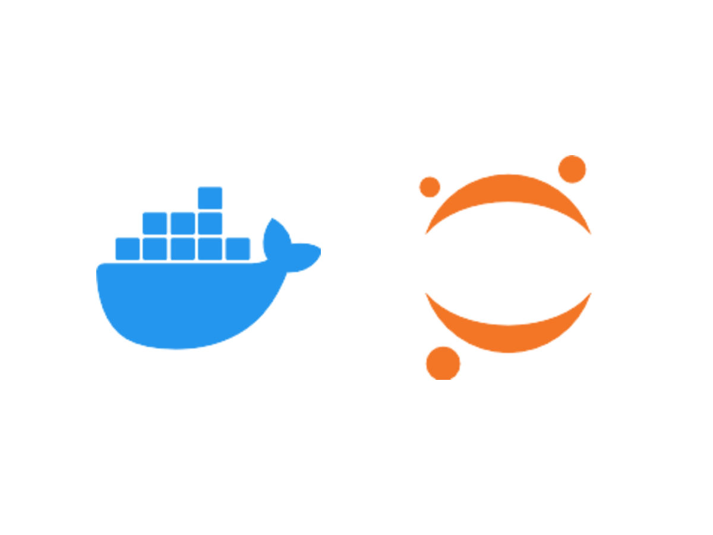

<!--
theme: gaia
size: 16:9
_class: lead
paginate: true
marp: false
backgroundColor: #000
backgroundImage: url('img/hero-backgroundIES.jpg')
-->
<style>
section::after {
  content: attr(data-marpit-pagination) '/' attr(data-marpit-pagination-total);}
img[alt~="center"] {
  display: block;
  margin: 0 auto;
}
section img {
  max-height: 380px;
  width: auto;
}
table {
  margin-left: auto;
  margin-right: auto;
}
footer {
  font-size: 20px;
 }
header {
  font-size: 16px;
 }
</style>
<style scoped>
section {
  @extend .markdown-body;
  font-size: 28px;
  justify-content: top;
 }
</style>


# UD00: Presentación y curso rápido de Docker
#### Modelos de Inteligencia Artificial
###### version: 2026-08-27
___
<!-- footer: d.martinezpena@edu.gva.es -->
<!-- header: Modelos de Inteligencia Artificial 26-27 (UD00_1)-->
# ¿Qué veremos?
1. El curso, el módulo y cómo se evalúa
2. El calendario del curso
3. Por qué los contenedores
4. Docker: imágenes, contenedores y volúmenes
5. Dockerfile y Compose
6. El entorno de prácticas del curso
___

## El módulo 5071

<!-- RA son las siglas de resultado de aprendizaje: la capacidad que el alumnado debe demostrar al terminar el módulo, la unidad de medida de toda la evaluación del curso — se repite en cada unidad, así que a partir de aquí se da por conocido. ECTS son los European Credit Transfer System, el crédito académico europeo de carga de trabajo; no es habitual en un ciclo de FP, pero este curso de especialización sí los usa. El curso de especialización dura 600 horas y 36 ECTS, repartidas en cinco módulos (5071 a 5075); se accede desde ciclos de grado superior de la familia de informática, como ASIR, DAM, DAW, telecomunicaciones o mecatrónica y robótica industrial. (§3.1 y §3.2 de los apuntes) -->

| | |
|---|---|
| Código | **5071** · Modelos de Inteligencia Artificial |
| Duración | **90 h** · 3 h/semana · 4 ECTS |
| Curso | Especialización en **IA y Big Data** |
| Resultados de aprendizaje | **6** propios (RA1-RA6) + el **proyecto intermodular** (RA7) |

> Del 1 de octubre al 28 de mayo. Clases de **lunes a jueves**: los viernes son para tareas y talleres.
___

<style scoped>section { font-size: 24px; }</style>

## Esta unidad no desarrolla un RA propio

<!-- El RA7-i es el criterio i) del RA7: «trabaja de forma colaborativa y ética, mostrando autonomía, responsabilidad y respeto a la normativa de protección de datos y propiedad intelectual». El RD 279/2021 es el real decreto que fija el currículo del ciclo y desarrolla los seis resultados de aprendizaje del módulo 5071. -->

El currículo desarrolla **6 RA** para el módulo (RA1-RA6). La UD00 es la unidad de **presentación y puesta en marcha** que prepara el terreno: sin ella, los RA1-RA6 perderían horas configurando entornos.

Lo que sí trabaja se asocia al **RA7-i** (ética y cuidado del entorno de trabajo) y a los **hábitos de trabajo** del curso.
___
<style scoped>section { font-size: 24px; }</style>

## Al terminar la unidad serás capaz de…

- **Describir** el curso de especialización y el papel del módulo 5071 en él.
- **Explicar** cómo se evalúa el módulo: criterios, calificación y recuperación.
- **Identificar** el entorno del curso: Aules, la web, Python, Jupyter y Docker.
- **Diferenciar** contenedor, imagen, volumen y red, y qué aporta Docker frente a una máquina virtual.
- **Crear, ejecutar, detener y eliminar** contenedores con `docker run`.
- **Escribir** un `Dockerfile` sencillo y **orquestar** varios servicios con Compose.
- **Levantar** el contenedor de prácticas con Jupyter y las bibliotecas del curso.
___

## Cómo se evalúa

<!-- Estas reglas proceden de la Orden 8/2025 de la Comunitat Valenciana, modificada por la Orden 5/2026. (§4 de los apuntes) -->

* Cada **RA** se califica de **1 a 10, sin decimales**
* Nota de cada RA = **40 %** tareas, talleres y ejercicios + **60 %** prueba escrita
* **Una prueba por RA** en Moodle, al cerrar cada unidad
* Hace falta **5 o más en CADA RA** para aprobar el módulo

> Puedes aprobar las dos evaluaciones y suspender el módulo por **un solo RA**.
___

## Obligatoria y no calificable: los tres entregables

Tres entregables, marcados **hecho / no hecho**:

1. **Taller 1** · verificación del entorno → memoria en PDF
2. **Taller 2** · contenedor de prácticas → informe breve
3. **Notebook** de la unidad → con las respuestas de la actividad

> Son la prueba de que tu entorno funciona. Sin ellos no se pueden hacer las prácticas de la UD02.
___

## El calendario, en un vistazo

| Cuándo | Qué |
|---|---|
| 1 – 8 oct | UD00 · presentación y Docker |
| 12 oct – 3 dic | UD01 y UD02 |
| 7 dic – 14 ene | UD05 · sistemas expertos |
| 18 ene – 11 mar | UD03 (PLN) y UD04 (robótica) |
| 15 mar – 23 abr | UD06 · ética y legalidad |
| 26 abr – 28 may | **Proyecto intermodular (RA7)** |
___

## Las interrupciones del curso

| Cuándo | Qué |
|---|---|
| 22 dic – 6 ene | Vacaciones de Navidad |
| 17 y 18 mar | Fallas |
| 25 mar – 5 abr | Vacaciones de Pascua |

> **Marzo es el mes más roto del curso**: tenlo en cuenta antes de dejar una entrega para el final.
___

## Instalar Docker en Linux

<!-- Los paquetes previos cumplen cada uno un papel: apt-transport-https permite transferir paquetes por https, ca-certificates verifica certificados de seguridad, curl transfiere datos como wget y software-properties-common gestiona los repositorios de software. GPG son las siglas de GNU Privacy Guard, el sistema de firma criptográfica que permite comprobar que el paquete descargado es el original de Docker y no ha sido alterado. (§5.2 de los apuntes) -->

```bash
# 1. Clave GPG y repositorio oficial de Docker
# 2. Instalar el motor
sudo apt install docker-ce docker-ce-cli containerd.io docker-compose-plugin
# 3. Poder usarlo sin sudo
sudo usermod -aG docker $USER
```

> El paso 3 no surte efecto **hasta cerrar y volver a abrir la sesión**. Es el error del primer día.
___

## Docker Desktop

<!-- En macOS hace falta macOS 12 Monterey o superior, con chip Apple Silicon o Intel de 2010 en adelante; en Linux se pide kernel 5.10 o superior con systemd, sobre distribuciones como Ubuntu 20.04, Debian 11, Fedora 36 o Arch Linux. WSL 2 es Windows Subsystem for Linux, la capa que permite ejecutar un kernel Linux real dentro de Windows; es el motor que usa Docker Desktop en Windows Home, que no tiene Hyper-V. (§5.2 de los apuntes) -->

Para **Windows y macOS** es la vía normal; en Linux es opcional.

* Incluye el motor, la interfaz gráfica y Compose
* En Windows se apoya en **WSL 2**
* En Linux se instala con el `.deb` oficial

> Comprueba siempre la instalación con `docker run hello-world` antes de seguir.
___

## El problema: «en mi máquina funciona»

* Cada equipo tiene un Python distinto, con versiones distintas de cada biblioteca
* Un notebook que va en clase **falla en casa**, y al revés
* Reproducir un resultado ajeno se vuelve imposible
* En IA esto es más grave: los resultados **no son comparables**

> La IA se hace con **entornos reproducibles**.
___

## Contenedor frente a máquina virtual

<!-- Además de estas filas, un servidor físico soporta solo decenas de máquinas virtuales frente a cientos o miles de contenedores, y la reproducibilidad es alta en contenedores por la imagen inmutable y sus capas, media en las máquinas virtuales. (§6.2 de los apuntes) -->

| | Máquina virtual | Contenedor |
|---|---|---|
| Qué virtualiza | Hardware completo | Solo el proceso |
| Sistema operativo | Uno **propio** por máquina | Comparte el **kernel** del anfitrión |
| Arranque | Minutos | **Segundos** |
| Tamaño | Gigabytes | Megabytes |
___

## Lo mismo, en un dibujo


___

## Imagen y contenedor

* **Imagen**: la plantilla, inmutable, hecha de **capas**
* **Contenedor**: una **instancia en ejecución** de esa imagen
* **Registro** (Docker Hub): donde viven las imágenes

> Una imagen, muchos contenedores. Como una clase y sus objetos.
___

## Las tres piezas de Docker
<!-- El daemon escucha por defecto en el socket Unix /var/run/docker.sock; pertenecer al grupo docker da permiso de lectura y escritura sobre él, que es justo lo que falta si aparece «permission denied» al ejecutar docker run. -->

* **Cliente** (`docker`): el comando que escribes tú. Solo manda órdenes
* **Daemon** (`dockerd`): el servicio que las ejecuta — descarga imágenes, crea contenedores
* **Registro** (Docker Hub): el almacén público de imágenes

> Tú nunca hablas con el contenedor: hablas con el **daemon**. Sin permiso sobre su *socket*, nada funciona.
___

## El recorrido completo


___

## El mismo código, dos entornos

<!-- La última versión de experta es la 1.9.4, del 16 de noviembre de 2019, y declara soportar Python de 3.5 a 3.8. El fallo está documentado como el issue 34 del repositorio, abierto desde julio de 2023; la causa es su dependencia frozendict 1.2, que usa collections.Mapping. (§6.5 de los apuntes) -->

`experta` es el motor de reglas de la UD02 y la UD05. Última versión: **2019**.

```bash
PRUEBA="pip install -q experta && python -c 'import experta'"

docker run --rm python:3.9-slim  bash -c "$PRUEBA"   # funciona
docker run --rm python:3.12-slim bash -c "$PRUEBA"   # falla
```

* `collections.Mapping` **desapareció en Python 3.10**
* Se arregla con **tres líneas** antes del import
___

## Tres lecciones

1. **El entorno importa**: el mismo código y dos resultados distintos
2. **Las dependencias se abandonan**: elegir una biblioteca es apostar por quien la mantiene
3. **Se puede convivir con ello**: un parche documentado y sigues adelante

> Lo que no vale es descubrirlo el día de la entrega.
___

## Los comandos que usarás el 90 % del tiempo
<!-- (§7.1 y §7.2 de los apuntes) -->

```bash
docker run -it --name mi-python python:3.12 bash   # crear y entrar
docker ps -a                                       # qué contenedores tengo
docker images                                      # qué imágenes tengo
docker start / stop / rm                           # ciclo de vida
docker run -d -p 8080:80 nginx                     # servicio en segundo plano
```

> `-it` interactivo · `-d` en segundo plano · `-p` publicar puerto · `--rm` borrar al salir
___

## Volúmenes: que los datos sobrevivan

<!-- Los volúmenes nombrados los gestiona Docker en /var/lib/docker/volumes; son la opción recomendada para datos que no necesitas ver desde el host, como cachés o bases de datos. (§7.4 de los apuntes) -->

Un contenedor es **desechable**: lo que escribes dentro desaparece al borrarlo.

```bash
docker run --rm -v "$PWD":/app -w /app python:3.12 python app.py
```

* **bind mount**: una carpeta tuya se ve dentro del contenedor
* **volumen nombrado**: Docker gestiona el almacenamiento

> Tus notebooks viven **en tu equipo**, no dentro del contenedor.
___

## Dockerfile: la receta

<!-- EXPOSE solo documenta el puerto y no lo publica; hace falta -p en docker run o ports en Compose. ENTRYPOINT fija el ejecutable y se puede combinar con CMD para pasarle los argumentos. (§8.1 de los apuntes) -->

```dockerfile
FROM python:3.12-slim
WORKDIR /home/mia
COPY requirements-ia.txt .
RUN pip install -r requirements-ia.txt
EXPOSE 8888
CMD ["jupyter", "notebook", "--ip=0.0.0.0"]
```

> Cada instrucción es una **capa** y las capas se **cachean**: por eso las dependencias van antes que el código, para no reinstalarlas en cada cambio.
___

## Lo que se acumula sin darte cuenta
<!-- (§8.4 de los apuntes) -->

```bash
docker images              # ¿cuánto ocupan?
docker rmi <imagen>        # borrar una concreta
docker image prune         # borrar las huérfanas, sin etiqueta
docker image prune -a      # TODAS las que no use ningún contenedor
```

> `prune -a` decide por ti: se lleva también las imágenes que construiste y no has publicado. Mira antes con `docker images`.
___

## Compose: describir en vez de recordar

<!-- Para ordenar el arranque entre servicios se usa depends_on, normalmente junto con un healthcheck que espera a que el servicio esté realmente listo, mediante la condición service_healthy. (§9 de los apuntes) -->

```yaml
services:
  mia:
    build: .
    ports:
      - "8888:8888"
    volumes:
      - ../notebooks:/home/mia
```

```bash
docker compose up -d     # levantar
docker compose down      # parar y limpiar
```
___

## Nuestro entorno de prácticas

<!-- El token JUPYTER_TOKEN se fija para que la URL de acceso sea siempre la misma, en vez de un token aleatorio distinto cada vez que arranca el contenedor. (§10 de los apuntes) -->

* Un `Dockerfile` con **Python 3.12** y las bibliotecas del curso
* Un `docker-compose.yml` que publica **Jupyter** en el puerto 8888
* Un volumen para que **tus notebooks** queden en tu equipo

```bash
docker compose up -d      # y Jupyter en http://localhost:8888
```
___

## Copias de seguridad
<!-- (§11 de los apuntes) -->

| Qué copias | Comandos | Conserva |
|---|---|---|
| Una **imagen** | `docker save` / `docker load` | Capas, etiquetas y metadatos |
| Un **contenedor** | `docker export` / `docker import` | Solo los ficheros, aplanados |

> Con `save` puedes seguir trabajando sobre la imagen; con `export` obtienes una foto plana.
___

<style scoped>section { font-size: 22px; }</style>

## Puntos clave

- El curso de especialización dura **600 h / 36 ECTS**; el módulo 5071 son **90 h** en la Comunitat Valenciana.
- El módulo desarrolla **6 RA** más el **RA7** de proyecto intermodular, con nota consensuada.
- **La normativa exige alcanzar todos los RA**; el centro lo concreta en **≥ 5 en cada uno**. Cada RA: **40 % tareas + 60 % prueba**. Se pierde la evaluación continua con más del **15 % de inasistencia**.
- Un **contenedor** es una instancia ejecutable de una **imagen**: aislamiento por procesos, ligereza y reproducibilidad.
- Los contenedores son **efímeros**: los datos se conservan con **volúmenes** o *bind mounts*.
- Un `Dockerfile` define la imagen **por capas**, y el orden de las instrucciones aprovecha la caché.
___
<style scoped>section { font-size: 26px; }</style>

## Las dos sesiones
<!-- (§15 de los apuntes) -->

**6 h en dos semanas** (1-8 de octubre), a 3 h por semana.

| Semana | Contenido | Evidencia |
|---|---|---|
| 1 | Presentación del curso, del módulo y de la evaluación · instalar Docker · imagen, contenedor, registro | Docker funcionando (`docker run hello-world`) |
| 2 | `docker run` y volúmenes · Dockerfile y Compose · contenedor de prácticas de IA | **Taller 1** y el entorno levantado |

> Si el horario es 2 h + 1 h, el bloque de **2 h** es el único que admite trabajo con contenedores.
___

## ¿Y ahora?

1. Instala Docker y haz el **Taller 1**
2. Levanta el entorno con el **Taller 2**
3. Ejecuta el **notebook** de la unidad y entrégalo

> En la **UD01**: sistemas de IA, dónde se aplican y qué técnicas usan.
