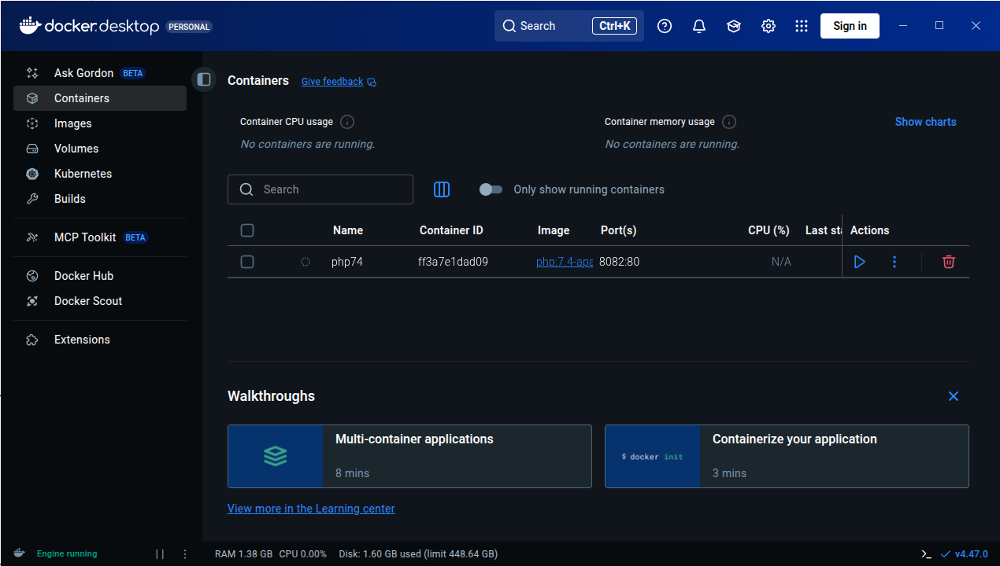
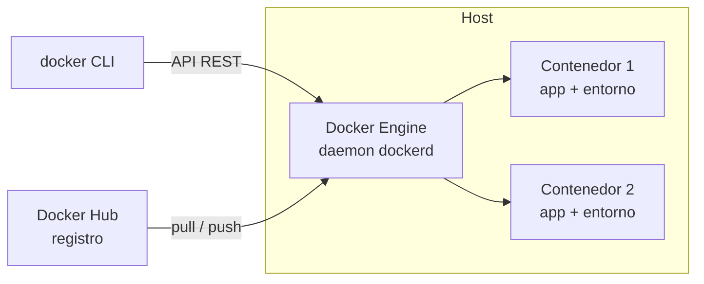
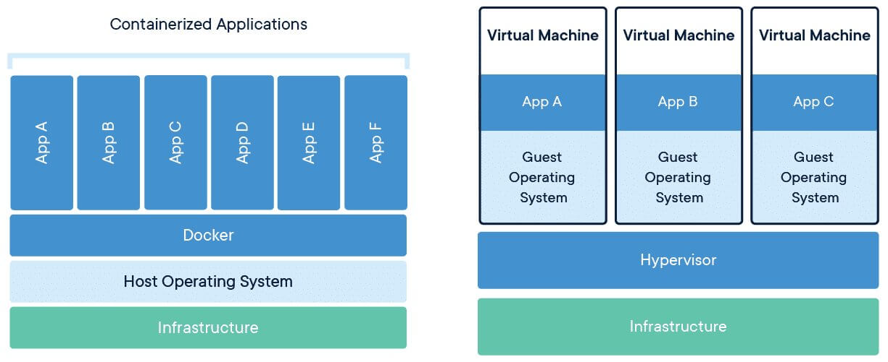
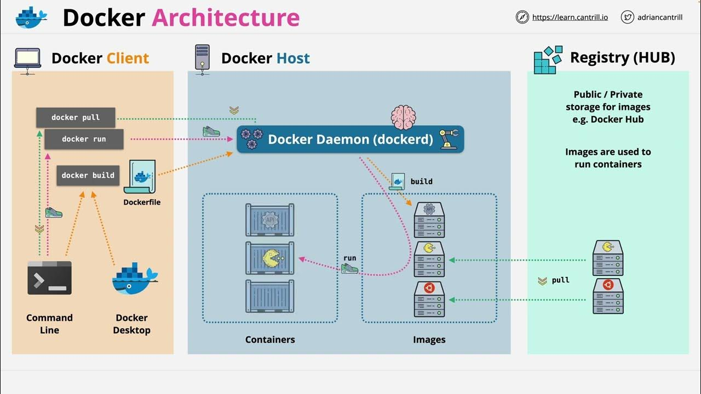
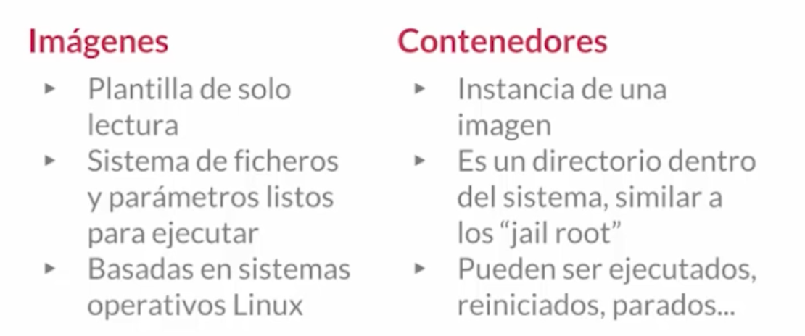
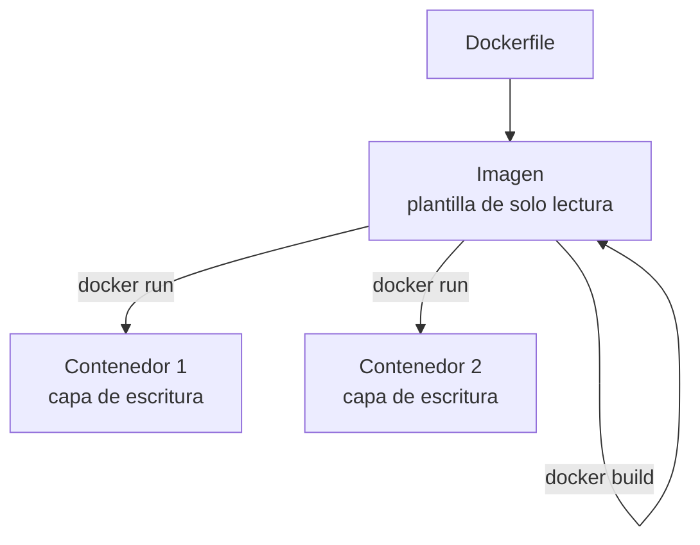
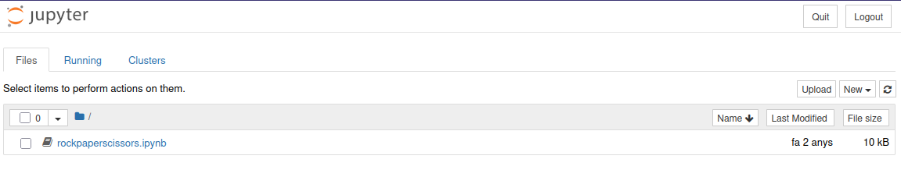
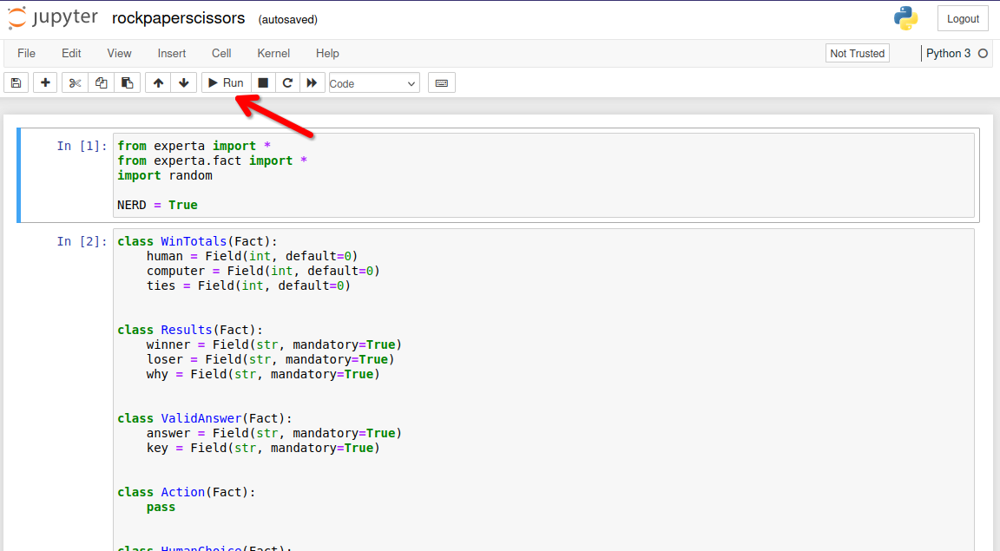
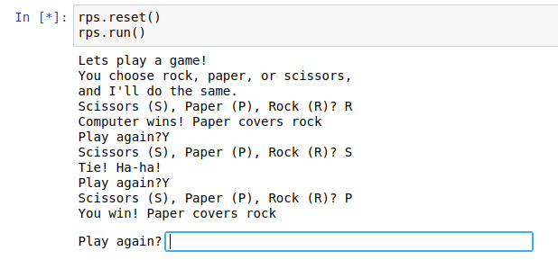

# UD00 — Presentación del módulo y curso rápido de Docker

!!! info "Unidad 0 · 6 h · semanas 1-2 (1 al 8 de octubre)"
    Unidad transversal de presentación y arranque del curso. **No tiene prueba escrita**: el entorno
    de trabajo es **requisito** para el resto del módulo, y el entregable del Taller 1 se marca como
    **hecho / no hecho**.

## 1. Introducción

Esta primera unidad tiene un doble objetivo. Por una parte, **situar el curso**: qué es el curso
de especialización en Inteligencia Artificial y Big Data, qué se va a aprender en el módulo 5071
*Modelos de Inteligencia Artificial* y cómo se va a evaluar. Por otra, **dejar listo el entorno de
trabajo**: sin herramientas fiables y reproducibles, cualquier práctica de IA se convierte en una
lucha contra configuraciones que no funcionan. Por eso el núcleo técnico de la unidad es un
**curso rápido de Docker**, la tecnología que nos permitirá ejecutar el mismo entorno de Python y
Jupyter en cualquier equipo.

!!! important "La idea que sostiene la unidad"
    La IA se hace con **entornos reproducibles**: si cada alumno tiene una configuración distinta,
    los resultados no son comparables. Docker resuelve ese problema empaquetando el entorno completo
    en un contenedor.

<!-- VIDEO: vídeo breve (2-3 min) que muestre a una persona creando un entorno de desarrollo "a mano" y luego ejecutando el mismo entorno en otra máquina gracias a Docker -->

## 2. Resultados de aprendizaje y objetivos

La UD00 es **transversal** (no desarrolla un RA propio del módulo): sirve de nivelador tecnológico
y de presentación. Las competencias que trabaja se asocian a la **ética y el cuidado del entorno
de trabajo** (RA7-i) y a los **hábitos de trabajo** del curso.

| Objetivo | Descripción |
|---|---|
| O1 | Describir el curso de especialización IA y Big Data y el papel del módulo 5071 en él. |
| O2 | Explicar cómo se evalúa el módulo (criterios, calificación, recuperación). |
| O3 | Identificar el entorno de trabajo del curso: Aules, web, Python, Jupyter y Docker. |
| O4 | Diferenciar contenedor, imagen, volumen y red, y explicar qué ventajas aporta Docker frente a las máquinas virtuales. |
| O5 | Crear, ejecutar, detener y eliminar contenedores con `docker run`. |
| O6 | Escribir un `Dockerfile` sencillo y levantarlo con `docker build`. |
| O7 | Orquestar varios servicios con Docker Compose y conservar datos con volúmenes. |
| O8 | Levantar un contenedor de prácticas con Jupyter y las bibliotecas del curso. |

!!! note "¿Por qué no tiene RA propio?"
    El currículo del RD 279/2021 desarrolla 6 resultados de aprendizaje para el módulo 5071
    (RA1-RA6). La UD00 es una **unidad de presentación y puesta en marcha** que prepara el terreno
    para esas unidades: sin ella, los RA1-RA6 perderían horas en configurar entornos.

## 3. Presentación del curso y del módulo (RA7-i)

### 3.1 El curso de especialización en IA y Big Data

El **curso de especialización en Inteligencia Artificial y Big Data** es un título de **Grado
Superior** (familia Informática y Comunicaciones) de **600 horas y 36 ECTS** establecido por el
RD 279/2021. Su competencia general es *programar y aplicar sistemas inteligentes que optimizan la
gestión de la información y la explotación de datos masivos, garantizando la seguridad y la ética*.

Se organiza en **cinco módulos**:

| Código | Módulo | Horas en CV |
|---|---|---|
| 5071 | Modelos de Inteligencia Artificial | 90 |
| 5072 | Sistemas de aprendizaje automático | 90 |
| 5073 | Programación de Inteligencia Artificial | 210 |
| 5074 | Sistemas de Big Data | 90 |
| 5075 | Big Data aplicado | 120 |

El acceso se realiza desde titulaciones de grado superior de la familia de informática y otras
relacionadas (ASIR, DAM, DAW, telecomunicaciones, mecatrónica y robótica industrial).

!!! tip "Una frase para recordar"
    Este curso enseña a **construir sistemas inteligentes** (5071, 5072, 5073) y a **tratar datos
    a gran escala** (5074, 5075). El módulo 5071 es la base conceptual de los sistemas de IA.

### 3.2 El módulo 5071 *Modelos de Inteligencia Artificial*

El módulo 5071 se imparte a lo largo de todo el curso (**90 horas, 3 horas semanales**, 4 ECTS) y
desarrolla **6 resultados de aprendizaje** (RA1-RA6), más el **RA7 de proyecto integrador
transversal**:

| RA | Qué aprenderás |
|---|---|
| RA1 | Caracterizar sistemas de IA y relacionarlos con la eficiencia operativa |
| RA2 | Utilizar modelos de IA para implementar sistemas de resolución de problemas |
| RA3 | Relacionar el procesamiento del lenguaje natural (PLN) con sus aplicaciones |
| RA4 | Analizar sistemas robotizados y evaluar su diseño e implementación |
| RA5 | Aplicar sistemas expertos y valorar los controladores inteligentes |
| RA6 | Aplicar principios legales y éticos (privacidad, sesgos, normativa) |
| RA7 | Proyecto integrador transversal de todo el curso (definición → datos → modelos → Big Data → comunicación) |

### 3.3 El proyecto integrador (RA7)

El **RA7** es un **proyecto común a todo el curso de especialización**: se desarrolla en **equipos**
durante el bloque final (semanas 25-29) y en él **confluyen todos los módulos** del título. El
alumnado define un problema, obtiene datos, aplica modelos de IA, integra soluciones de Big Data,
comunica resultados y evalúa críticamente el trabajo realizado.

Es transversal por dos razones:
1. Lo **imparten todos los docentes** del curso, no solo el del 5071.
2. La **nota se consensúa** entre el equipo docente, valorando la contribución de cada miembro.

!!! important "Implicación para este módulo"
    El contenido del 5071 (UD00-UD06) **finaliza a finales de abril** porque las últimas semanas del
    curso se dedican por completo al proyecto integrador. Desde el primer día, el proyecto te
    permitirá aplicar lo aprendido en este módulo.

## 4. Cómo se evalúa el módulo

La evaluación se rige por la **Orden 8/2025** de la Comunitat Valenciana (modificada por la
**Orden 5/2026**). Lo que debes saber desde el primer día:

Los **pesos de cada RA, la nota mínima y el reparto 40/60** están en la
[página de información importante](../index.md), que es la referencia única: si algún día cambian,
cambian allí. Aquí van las reglas que conviene tener claras desde el primer día y que no dependen de
los pesos:

| Aspecto | Regla |
|---|---|
| Calificación por RA | De **1 a 10, sin decimales** (art. 5.1) |
| Evaluación continua | Se pierde al superar el **15 % de inasistencia** (asistencia ≥ 85 %) |
| Evaluaciones parciales | Dos parciales **informativos** (fin del 1.er y 2.º trimestre) |
| Recuperación | Programa individual por **cada RA no superado**; en junio, solo los RA pendientes |
| Esta unidad (UD00) | **No se califica**: es requisito. Sus **tres entregables** (los dos talleres y el notebook) se marcan **hecho / no hecho** |

!!! warning "Asistencia"
    Si superas el **15 % de faltas** perderás la evaluación continua del módulo (art. 7.3 Orden
    8/2025). Es un criterio objetivo, no una decisión del profesor.

!!! tip "Evaluación inicial"
    Durante el primer mes realizaremos una **evaluación inicial o diagnóstica** (obligatoria antes
    de finalizar el segundo mes lectivo). No cuenta para la nota: sirve para conocer tus
    competencias previas y adaptar el ritmo del curso.

## 5. Entorno de trabajo del curso

| Herramienta | Para qué la usaremos |
|---|---|
| **Aules** (Moodle de la GVA) | Entrega de tareas, pruebas, avisos y calificaciones |
| **Web del curso** (mkdocs) | Teoría, ejercicios, talleres y notebooks en el navegador |
| **Python + Jupyter** | Notebooks de prácticas con las bibliotecas de IA |
| **Docker** | Entornos reproducibles y el contenedor de prácticas |
| **Git (opcional)** | Control de versiones de tus proyectos |

<!-- IMAGEN: esquema del flujo de trabajo del curso: Aules (entrega) → web (teoría) → Docker (entorno) → Jupyter (prácticas) -->

!!! note "Sobre Aules"
    Aules es la **plataforma oficial de e-learning de la Conselleria de Educación**, basada en
    **Moodle**. Accederás con tu usuario (NIA) y desde ahí se gestionan las tareas del módulo.

### El stack de IA del curso

Las prácticas se basan en **Python** con estas bibliotecas:

`numpy`, `pandas`, `matplotlib`, `scikit-learn`, `scikit-fuzzy`, `nltk`, `spaCy`, `torch` y
`experta`.

Este stack se ejecutará en un **contenedor de prácticas de IA** que montaremos en el taller 2 de
esta unidad.
### 5.2 Instalar Docker

Antes de nada, Docker tiene que funcionar en tu máquina. Estos pasos están probados en el aula.

#### Instalación en Ubuntu

[https://www.digitalocean.com/community/tutorials/how-to-install-and-use-docker-on-ubuntu-20-04-es](https://www.digitalocean.com/community/tutorials/how-to-install-and-use-docker-on-ubuntu-20-04-es)

Requisitos previos:

- **apt-transport-https:** permite que el administrador de paquetes transfiera datos a través de https
- **ca-certificates:** permite que el navegador web y el sistema verifiquen los certificados de seguridad
- **curl:** transfiere datos (similar a wget)
- **software-properties-common:** agrega scripts para administrar el software

```bash
sudo apt-get install  curl apt-transport-https ca-certificates software-properties-common
```

Agregamos repositorio

```bash
# Primero clave GPG
curl -fsSL https://download.docker.com/linux/ubuntu/gpg | sudo apt-key add -

sudo add-apt-repository "deb [arch=amd64] https://download.docker.com/linux/ubuntu $(lsb_release -cs) stable"

sudo apt update

sudo apt install docker-ce

sudo systemctl status docker
```

Por defecto, el comando docker solo puede ser ejecutado por el usuario root o un usuario del grupo docker, que se crea automáticamente durante el proceso de instalación de Docker.

Para evitar escribir sudo al ejecutar el comando docker, agregue su nombre de usuario al grupo docker:

```bash
sudo usermod -aG docker ${USER}

# Cerramos y abrimos sesión de nuevo o ejecutamos
su - ${USER}

# Confirmamos los grupos de nuestro usuario
id -nG
```

#### Docker Desktop

##### ¿Qué es Docker Desktop?

{width="300"}

Es la aplicación oficial de Docker que te da una **interfaz gráfica (GUI)** para manejar contenedores, además de la línea de comandos.

##### ¿Para qué sirve?

- **Gestión visual**: Ver contenedores, imágenes y volúmenes de forma gráfica
- **Configuración fácil**: Ajustar recursos (CPU, RAM) con sliders
- **Monitorización**: Ver en tiempo tiempo real qué está pasando

{width="700"}

##### Compatibilidad por Sistema Operativo

🪟 **Windows**

- **Windows 10/11** 64-bit (versiones Home, Pro, Enterprise, Education)
- **Requisitos importantes**:
  - Habilitar **WSL 2** (Windows Subsystem for Linux)
  - Virtualización activada en BIOS/UEFI
  - **Windows Home** necesita WSL 2, **Pro/Enterprise** puede usar Hyper-V

🍎 **macOS**

- **macOS 12 Monterey** o superior
- **Tipos de chip**:
  - **Apple Silicon** (M1, M2, M3, etc.)
  - **Intel** con procesador de 2010 o más nuevo
- Necesita **macOS actualizado**

🐧 **Linux** (versión nativa)

- **Distribuciones compatibles**:
  - Ubuntu 20.04 LTS o superior
  - Debian 11 o superior
  - Fedora 36 o superior
  - Arch Linux (y derivados)
- **Requisitos**: kernel 5.10+, systemd, 64-bit

##### **Guía Rápida de Instalación**

**Windows:**

1. Descarga desde [docker.com/products/docker-desktop](https://www.docker.com/products/docker-desktop/)
2. Ejecuta el instalador `.exe`
3. Sigue el asistente (marca "Use WSL 2" si tienes Windows Home)
4. Reinicia cuando termine
5. ¡Listo! Docker se inicia automáticamente

**macOS:**

1. Descarga desde la web oficial
2. Arrastra Docker.app a la carpeta Applications
3. Ejecuta desde Launchpad
4. Autoriza con contraseña del sistema
5. Espera a que configure todo (puede tardar unos minutos)

**Linux (Ubuntu/Debian ejemplo):**

```bash
# Paso 1: Descargar el .deb oficial (siempre la última versión)
wget https://desktop.docker.com/linux/main/amd64/docker-desktop-amd64.deb

# Paso 2: Instalar
sudo apt install ./docker-desktop-*.deb

# Paso 3: Iniciar
systemctl --user start docker-desktop
```

??? warning "Problemas con Ubuntu 24.04"
    Si tienes problemas con Ubuntu 24.04, yo me he encontrado dos:
    
    1. Problema de permisos
        ```bash
        ...
        S'estan processant els activadors per a desktop-file-utils (0.27-2build1)…
        N: La baixada es duu a terme fora de l'entorn segur com a root ja que el fitxer «/home/ubuntu/docker-desktop-4.27.2-amd64.deb» no és accessible per l'usuari «_apt». - pkgAcquire::Run (13: Permission denied)
        ```
    
        Lo he resuelto cambiando los permisos del deb:
        ```bash
        # Change ownership of the file to make it accessible
        sudo chown _apt:root /home/ubuntu/docker-desktop-4.27.2-amd64.deb
        # Or alternatively, change permissions to make it readable
        sudo chmod 644 /home/ubuntu/docker-desktop-4.27.2-amd64.deb
        ```
    
    2. Lanzas Docker-desktop, aparece el icono, pero desaparece y la aplicación no incia:
        Parece un problema con un cambio en Ubuntu 24.04 que he resuelto con la información de este [post](https://askubuntu.com/questions/1511725/ubuntu-24-04-docker-desktop-is-not-starting/1519662#1519662): 
        ```bash
        sudo sysctl -w kernel.apparmor_restrict_unprivileged_userns=0
        systemctl --user restart docker-desktop
        ```
    
        En algunos casos parece que la solución anterior solo sirve hasta que reinicias, si es así, prueba esto también:
        
        Crea un nuevo fichero:
        ```bash
        sudo nano /etc/apparmor.d/opt.docker-desktop.bin.com.docker.backend
        ```
    
        Escribe dentro el siguiente contenido:
        ```bash
        abi <abi/4.0>,
    
        include <tunables/global>
    
        /opt/docker-desktop/bin/com.docker.backend flags=(default_allow) {
        userns,
    
        # Site-specific additions and overrides. See local/README for details.
        include if exists <local/opt.docker-desktop.bin.com.docker.backend>
        }
        ```
    
        Reinicia el servicio `apparmor.service`:
        ```bash
        sudo systemctl restart apparmor.service
        ```

##### Ventajas docker desktop (GUI) vs Línea de Comandos (CLI)

✅ **Ventajas de Docker Desktop:**

- **Más fácil para empezar** - Ideal para principiantes
- **Todo integrado** - No necesitas instalar nada más
- **Debugging visual** - Ves los logs y estados de un vistazo
- **Gestión de recursos** - Controlas CPU/RAM fácilmente

❌ **Desventajas:**

- **Más pesado** - Consume más recursos de tu PC
- **Menos flexible** - Algunas opciones avanzadas solo por comandos
- **Dependes de la GUI** - Si se cierra la app, pierdes la interfaz

🎯 **Conclusión:**

- **Empezad con Docker Desktop** para aprender sin frustraciones
- **Aprended también los comandos básicos** para ser más versátiles
- Usad **ambos**: la GUI para lo cotidiano y la terminal para lo avanzado

!!! warning "Comprueba la instalación antes de seguir"
    `docker run hello-world` debe terminar sin errores. Si te responde
    `permission denied while trying to connect to the Docker daemon socket`, te falta el paso de
    añadir tu usuario al grupo `docker` **y cerrar y abrir sesión**.

## 6. Curso rápido de Docker: conceptos (RA7-i)

### 6.1 El problema: entornos que no se reproducen

¿Cuántas veces funciona "en mi ordenador" y no en el del compañero? La causa es que los entornos
difieren: versiones de Python, bibliotecas, sistema operativo, configuraciones. **Docker resuelve
este problema** empaquetando la aplicación y todo lo que necesita en un **contenedor**.

!!! note "Definición"
    **Docker** es una plataforma abierta para desarrollar, distribuir y ejecutar aplicaciones.
    Permite separar la aplicación de la infraestructura mediante contenedores: entornos aislados y
    ligeros que incluyen todo lo necesario para ejecutar la aplicación.



<!-- VIDEO: «¿Qué es docker? Imagen vs contenedor» (YouTube, ~10 min) — validado en aula; revisar el ID: en el sitio antiguo la miniatura y el iframe apuntan a vídeos distintos -->

### 6.2 Contenedores frente a máquinas virtuales

| Característica | Máquina virtual | Contenedor |
|---|---|---|
| Aislamiento | Por hardware (hipervisor) | Por procesos (namespaces del kernel) |
| Sistema operativo | SO completo con su propio kernel | Comparte el kernel del host |
| Arranque | Minutos | Segundos |
| Tamaño | Gigabytes | Megabytes |
| Carga en un servidor | Decenas | Cientos/miles |
| Reproducibilidad | Media | Alta (imagen inmutable + capas) |

!!! tip "¿Y entonces las VMs son inútiles?"
    No. Las VMs siguen siendo necesarias cuando se requiere **aislamiento total de kernel** o se
    ejecutan sistemas operativos distintos. La práctica habitual es combinarlas: una VM con Docker
    encima. En este curso trabajaremos con contenedores porque son **ligeros y reproducibles**.

#### La arquitectura de Docker en imágenes

{width="900"}

{width="900"}

{width="500"}

### 6.3 Imágenes y contenedores

- **Imagen**: plantilla **de solo lectura** (un paquete inmutable con el SO base, la aplicación y
  las dependencias). Se construye por **capas**.
- **Contenedor**: **instancia ejecutable** creada a partir de una imagen. Añade una capa de
  escritura por encima de la imagen.



!!! note "La regla de las capas"
    Cada instrucción del `Dockerfile` crea una **capa**. Al reconstruir una imagen, solo se
    regeneran las capas que han cambiado: por eso **el orden de las instrucciones importa** para
    aprovechar la caché.

### 6.4 El registro y el primer contenedor

Docker Hub es el registro público por defecto: se usa `pull` para **descargar** imágenes y `push`
para **subirlas**. Nuestro primer comando será:

```bash
docker run hello-world
```

La primera vez, Docker descarga la imagen `hello-world`, crea un contenedor a partir de ella,
ejecuta un mensaje de confirmación y lo detiene. Ese es exactamente el ciclo completo de Docker en
una sola línea.

!!! tip "Comprueba tu instalación"
    Antes de seguir, verifica que Docker está instalado y el demonio en marcha:

    ```bash
    docker --version
    docker run hello-world
    ```

### 6.5 Mismo código, dos entornos: el caso de `experta`

El argumento definitivo a favor de los contenedores se ve mejor con una biblioteca que usaremos de
verdad en este módulo: `experta`, el motor de reglas de la UD02 y la UD05.

| Dato | Valor |
|---|---|
| Última versión | **1.9.4**, del 16/11/2019 |
| Python que declara soportar | 3.5 a **3.8** |
| Mantenimiento | **abandonado**; fallo abierto como *issue* #34 desde julio de 2023 |
| Causa | su dependencia `frozendict==1.2` usa `collections.Mapping`, que **desapareció en Python 3.10** |

Monta dos contenedores con **el mismo código** y compara:

```bash
# Contenedor A: Python 3.9, experta funciona tal cual
docker run --rm python:3.9-slim bash -c \
  "pip install -q experta && python -c 'from experta import KnowledgeEngine; print(1)'"

# Contenedor B: Python 3.12, el mismo codigo revienta
docker run --rm python:3.12-slim bash -c \
  "pip install -q experta && python -c 'from experta import KnowledgeEngine; print(1)'"
```

El contenedor B falla con `AttributeError: module 'collections' has no attribute 'Mapping'`, y se
arregla con tres líneas **antes** del import, las mismas que verás en los notebooks de la UD02:

```python
import collections, collections.abc
for nombre in ("Mapping", "Iterable", "MutableMapping"):
    if not hasattr(collections, nombre):
        setattr(collections, nombre, getattr(collections.abc, nombre))

from experta import KnowledgeEngine   # ahora sí
```

!!! important "Tres lecciones en un solo ejemplo"
    1. **El entorno importa**: mismo código, misma biblioteca, dos resultados. Sin fijar la versión
       de Python, «en mi máquina funciona» no significa nada.
    2. **Las dependencias se abandonan**: `experta` no publica nada desde 2019. Elegir una
       biblioteca es apostar también por quien la mantiene.
    3. **Se puede convivir con ello**: un parche documentado y versionado, y sigues adelante. Lo que
       no vale es descubrirlo el día de la entrega.

## 7. Curso rápido de Docker: uso básico (RA7-i)

### 7.1 El ciclo de vida de un contenedor

| Comando | Qué hace |
|---|---|
| `docker run` | Crea y arranca un contenedor nuevo (descarga la imagen si falta) |
| `docker ps` | Lista los contenedores en marcha |
| `docker ps -a` | Lista también los detenidos |
| `docker stop` | Detiene un contenedor (envía SIGTERM) |
| `docker start` | Reactiva un contenedor parado conservando sus cambios |
| `docker rm` | Elimina un contenedor (parado) |
| `docker rmi` | Elimina una imagen |

!!! important "`docker run` no borra el contenedor"
    Cuando el proceso principal termina, el contenedor **se detiene pero no se elimina**. Cada
    `docker run` crea un contenedor nuevo; por eso conviene usar `--rm` en los contenedores
    desechables y limpiar con `docker rm` los que ya no se usen.

### 7.2 Flags clave de `docker run`

| Flag | Significado | Ejemplo |
|---|---|---|
| `-it` | Interactivo + terminal (para entrar a un shell) | `docker run -it ubuntu bash` |
| `-d` | En segundo plano (detached) | `docker run -d -p 8080:80 nginx` |
| `-p` | Publica un puerto (host:contenedor) | `docker run -p 8888:8888 ...` |
| `-v` | Monta un volumen o bind mount | `docker run -v "$PWD":/app ...` |
| `--rm` | Elimina el contenedor al terminar | `docker run --rm hello-world` |
| `--name` | Asigna un nombre al contenedor | `docker run --name mi-python ...` |

### 7.3 Qué ocurre dentro de `docker run`

Cuando ejecutas `docker run`, el demonio hace lo siguiente:

1. Comprueba si la imagen está en la caché local; si no, la **descarga** (`pull`).
2. **Crea el contenedor**: añade una capa de escritura sobre las capas de solo lectura.
3. **Monta el filesystem** (y los volúmenes o binds indicados) y crea la **interfaz de red**.
4. **Arranca el proceso principal** (el comando indicado, o el `CMD` de la imagen).
5. Cuando ese proceso termina, el contenedor **se detiene** (no se elimina).

<!-- IMAGEN: secuencia visual de `docker run -p 8080:80 nginx`: pull → crear → red → arrancar → navegador -->

### 7.4 Volúmenes y persistencia

Los contenedores son **efímeros**: al eliminarlos se pierden sus datos. Para conservarlos:

- **Volúmenes gestionados** (*named volumes*): los gestiona Docker (en `/var/lib/docker/volumes`).
  Son la opción recomendada para datos que no necesitas ver desde el host (cachés, datasets, bases
  de datos).
- **Bind mounts**: montan una **carpeta real del host** dentro del contenedor. Son ideales para el
  código y los notebooks del curso: editas en tu equipo y el contenedor ve los cambios al instante.

```bash
# bind mount: la carpeta practicas del host se ve en /app dentro del contenedor
docker run --rm -v "$PWD/practicas":/app -w /app python:3.12 python app.py
```

!!! tip "Bind mount vs volumen"
    Para **notebooks y código** del curso usa un **bind mount** (`-v ./practicas:/home/jovyan/work`):
    son ficheros reales de tu equipo. Los **volúmenes nombrados** quedan para datos que no necesitas
    tocar desde el host.

## 8. El Dockerfile: construir imágenes reproducibles (RA7-i)

### 8.1 Instrucciones esenciales

Un `Dockerfile` es un **guion** que describe cómo construir la imagen. Siempre empieza por `FROM`
(la imagen base).

| Instrucción | Qué hace |
|---|---|
| `FROM` | Define la imagen base (obligatoria) |
| `WORKDIR` | Establece el directorio de trabajo |
| `COPY` | Copia ficheros del contexto de build a la imagen |
| `RUN` | Ejecuta un comando **durante el build** (instalar, compilar) |
| `ENV` | Define variables de entorno |
| `EXPOSE` | **Documenta** el puerto (no lo publica; hace falta `-p`) |
| `CMD` | Comando por defecto en runtime (sobrescribible en `docker run`) |
| `ENTRYPOINT` | Ejecutable fijo; se puede combinar con `CMD` para los argumentos |

```dockerfile
FROM python:3.12-slim
WORKDIR /app
COPY requirements.txt .
RUN pip install --no-cache-dir -r requirements.txt
COPY app.py .
CMD ["python", "app.py"]
```

### 8.2 La caché de capas

Cada instrucción crea una capa. Docker **reutiliza las capas en caché** mientras las instrucciones
y su contenido no cambien. Por eso se copia `requirements.txt` **antes** que el código: así las
dependencias se instalan una vez y se cachean.

!!! note "Buenas prácticas para un curso rápido"
    - Anclar la versión de la imagen base (`FROM python:3.12-slim`, no `FROM python`).
    - Usar `.dockerignore` para excluir del build context `.git`, `*.pyc`, `.env`, datasets grandes.
    - Unir `apt-get update && apt-get install` en un solo `RUN`.
    - Un **proceso por contenedor** y contenedores **efímeros**.

### 8.3 Construir y ejecutar

```bash
docker build -t mi-app .       # construye la imagen desde el Dockerfile del directorio actual
docker run -p 8000:8000 mi-app # ejecuta la imagen publicando el puerto 8000
```

### 8.4 Gestionar las imágenes que acumulas

Es un instalador donde podemos incorporar nuestra aplicación. Es el punto de inicio para crear contenedores.
Hay imágenes oficiales de por ejemplo Ubuntu, Apache, etc, que fueron creadas por sus creadores oficiales.

Página oficial para imágenes: [https://hub.docker.com](https://hub.docker.com)

Vamos a utilizar la siguiente imagen para pruebas:

[https://hub.docker.com/_/hello-world](https://hub.docker.com/_/hello-world)

Para ejecutar este contenedor “hello-word” escribimos en la terminal:

```bash
docker run hello-world
```

Una vez ejecutado, ya dispondremos de la imagen descargada, podemos ver todas las imágenes que tenemos descargadas con:

```bash
docker images

REPOSITORY                              TAG           IMAGE ID       CREATED        SIZE
hello-world                             latest        ee301c921b8a   9 months ago   9.14kB
```

Desde la página web de docker hub, podemos ver diferentes versiones de la misma imagen en la pestaña “TAGS”

{width="700"}

Podemos descargar una imagen específica y ejecutarla:

```bash
docker run hello-world:linux

docker images
REPOSITORY                              TAG           IMAGE ID       CREATED        SIZE
hello-world                             latest        ee301c921b8a   9 months ago   9.14kB
hello-world                             linux         ee301c921b8a   9 months ago   9.14kB

docker run hello-world:linux
```

Para eliminar una imagen utilizamos el parámetro `rmi` por ejemplo:

```bash
docker pull alpine

docker images
REPOSITORY                              TAG           IMAGE ID       CREATED        SIZE
alpine                                  latest        ace17d5d883e   3 weeks ago    7.73MB
hello-world                             latest        ee301c921b8a   9 months ago   9.14kB
hello-world                             linux         ee301c921b8a   9 months ago   9.14kB

# Eliminamos, opción 1
docker rmi ace17d5d883e

# Eliminamos, opción 2
docker rmi alpine

# Eliminamos, opción 3
docker rmi ace1
```

También se pueden buscar imágenes desde consola.

```bash
docker search ubuntu

NAME                             DESCRIPTION                                     STARS     OFFICIAL
ubuntu                           Ubuntu is a Debian-based Linux operating sys…   16888     [OK]
websphere-liberty                WebSphere Liberty multi-architecture images …   298       [OK]
open-liberty                     Open Liberty multi-architecture images based…   64        [OK]
neurodebian                      NeuroDebian provides neuroscience research s…   106       [OK]
ubuntu-debootstrap               DEPRECATED; use "ubuntu" instead                52        [OK]
ubuntu-upstart                   DEPRECATED, as is Upstart (find other proces…   115       [OK]
ubuntu/nginx                     Nginx, a high-performance reverse proxy & we…   112
ubuntu/squid                     Squid is a caching proxy for the Web. Long-t…   83
ubuntu/cortex                    Cortex provides storage for Prometheus. Long…   4
ubuntu/prometheus                Prometheus is a systems and service monitori…   56
ubuntu/apache2                   Apache, a secure & extensible open-source HT…   70
...
```

## 9. Docker Compose: varios servicios a la vez (RA7-i)

Compose orquesta **múltiples contenedores** (p. ej. la aplicación + una base de datos) mediante un
fichero `compose.yaml`.

```yaml
services:
  jupyter:
    image: jupyter/scipy-notebook
    ports:
      - "8888:8888"
    volumes:
      - ./practicas:/home/jovyan/work
    environment:
      - JUPYTER_TOKEN=cursoia
```

| Comando | Qué hace |
|---|---|
| `docker compose up -d` | Crea y arranca los servicios en segundo plano |
| `docker compose down` | Detiene y elimina contenedores (y la red por defecto) |
| `docker compose down -v` | Además borra los volúmenes nombrados (¡borra datos!) |
| `docker compose config` | Muestra la configuración resuelta sin arrancar nada |
| `docker compose logs -f` | Sigue los logs de los servicios |
| `docker compose exec` | Ejecuta un comando dentro de un contenedor en marcha |

Para ordenar el arranque se usa `depends_on` (con `condition: service_healthy` y un `healthcheck`
para esperar a que un servicio esté listo).

!!! warning "`down -v` borra datos"
    `docker compose down -v` elimina también los **volúmenes nombrados**. Úsalo solo cuando quieras
    empezar de cero; tus notebooks se perderían.

## 10. El contenedor de prácticas de IA (RA7-i)

El entorno del curso se levantará con la imagen **`jupyter/scipy-notebook`**, que ya incluye
numpy, scipy, scikit-learn, pandas, matplotlib y otras bibliotecas científicas.

!!! tip "¿Por qué `python:3.12-slim` y no Alpine?"
    La variante `-slim` usa **Debian (glibc)**; la `-alpine` usa **musl libc**. Bibliotecas como
    scikit-learn y torch **solo publican wheels para glibc**: en Alpine habría que compilar desde
    fuente (torch puede tardar 30-60 min). Con `-slim` todo el stack se instala con wheels
    precompilados. Los Jupyter Docker Stacks científicos también se construyen sobre Ubuntu (glibc).

El contenedor de prácticas:

- Publica el puerto **8888** (Jupyter).
- Monta tu carpeta de prácticas en `/home/jovyan/work` (bind mount) para que los notebooks sean
  ficheros reales de tu equipo.
- Fija el token con `JUPYTER_TOKEN` para que la URL sea determinista.

```bash
docker compose up -d
# abre http://localhost:8888 y usa el token cursoia
docker compose exec jupyter bash   # para entrar dentro
docker compose down               # cuando termines
```

Lo pondrás en marcha paso a paso en el **Taller 2** de esta unidad.

### 10.1 Construir la imagen con un Dockerfile propio

Otra forma de levantar un contenedor con docker-compose es utilizar un Dockerfile para generar la imagen (en lugar de usar una de DockerHub)

Necesitamos una carpeta con la siguiente estructura:

```bash
.
├── docker-compose.yml
├── Dockerfile
└── notebooks
    └── rockpaperscissors.ipynb
```

El fichero `Dockerfile` tiene el siguiente contenido:

```dockerfile
#versión de python compatible con experta
FROM python:3.6
#libreria de python para sistemas expertos
RUN pip3 install experta
#libreria para usar notebooks en python
RUN pip3 install notebook 
#creamos la carpeta de trabajo
WORKDIR /home/MIA2526
#ejecutamos el jupyter notebook en el puerto 8888
CMD jupyter notebook --allow-root --ip=0.0.0.0 --port=8888 --no-browser 
```

Ahora, para el `docker-compose.yml` tendremos:

```docker-compose
services:
  experta:
    container_name: experta #bautizamos a nuestro contenedor
    build: . #con esta linea le indicamos que busque el Dockerfile, en lugar de buscar una imágen en un repositorio
    ports:
      - "8888:8888" #publicamos el puerto para que sea accesible desde fuera
    volumes:
      - ./notebooks:/home/MIA2526 #aquí asignamos la carpeta local notebooks con la carpeta de trabajo del contenedor
```

Y por último necesitamos el notebook para hacer pruebas, en nuestro caso es un juego de piedra, papel o tijeras:

[rockpaperscissors.ipynb](assets/rockpaperscissors.ipynb) este fichero debemos guardarlo en la carpeta `notebooks`

Ahora con toda la estructura lista y desde la raiz de la carpeta (donde estan el docker-compose.yml y el Dockerfile) ejecutamos:

```bash
$ docker-compose up
[+] Running 1/1
 ✔ Container experta  Recreated                                                                               0.1s 
Attaching to experta
experta  | [I 16:30:08.568 NotebookApp] Writing notebook server cookie secret to /root/.local/share/jupyter/runtime/notebook_cookie_secret
experta  | [I 16:30:08.784 NotebookApp] Serving notebooks from local directory: /home/MIA2324
experta  | [I 16:30:08.784 NotebookApp] Jupyter Notebook 6.4.10 is running at:
experta  | [I 16:30:08.784 NotebookApp] http://e0ec65ac1d84:8888/?token=825b1ba76502787821bc045496e3429bca02ba09720a835b
experta  | [I 16:30:08.784 NotebookApp]  or http://127.0.0.1:8888/?token=825b1ba76502787821bc045496e3429bca02ba09720a835b
experta  | [I 16:30:08.784 NotebookApp] Use Control-C to stop this server and shut down all kernels (twice to skip confirmation).
experta  | [C 16:30:08.787 NotebookApp] 
experta  |     
experta  |     To access the notebook, open this file in a browser:
experta  |         file:///root/.local/share/jupyter/runtime/nbserver-7-open.html
experta  |     Or copy and paste one of these URLs:
experta  |         http://e0ec65ac1d84:8888/?token=825b1ba76502787821bc045496e3429bca02ba09720a835b
experta  |      or http://127.0.0.1:8888/?token=825b1ba76502787821bc045496e3429bca02ba09720a835b
```

Ahora podemos hacer click directamente sobre el enlace a <http://127.0.0.1:8888/?token=bebf660273e8e168c7fec90978ed56fb50db6b08d915cb14> donde veremos nuestro jupyter notebook:

{width="700"}

Si hacemos click sobre el notebook `rockpaperscissors.ipynb` podremos ver:

{width="700"}

Después de pulsar varias veces (para ir ejecutando todas las celdas) podremos ver como evoluciona nuestro juego:

{width="500"}

Para detener el contenedor que hemos lanzado con `docker-compose`, solo hemos de pulsar ++ctrl+c++

!!! caution "Actualizado respecto al material antiguo"
    El `Dockerfile` de partida fijaba `python:3.6`, fuera de soporte desde 2021. La versión del
    curso usa **`python:3.12-slim`** e instala las dependencias desde `requirements-ia.txt`.
    Los ficheros listos para usar están en `entorno/`, junto a esta unidad. Con Python 3.12,
    `experta` necesita el parche del apartado 6.5.

## 11. Copias de seguridad de imágenes y contenedores (RA7-i)

### Copias de contenedores

Ya estén encendidos o apagados, podemos realizar respaldos de seguridad de los contenedores. Utilizando la opción “*export*” empaquetará el contenido, generando un fichero con extensión “.*tar*” de la siguiente manera:

```bash
docker export -o fichero-resultante.tar nombre-contenedor
```

o

```bash
docker export nombre-contenedor > fichero-resultante.tar
```

### **Restauración de copias de seguridad de contenedores**

Hay que tener en cuenta, antes de nada, que no es posible restaurar el contenedor directamente, de forma automática. En cambio, sí podemos crear una imagen, a partir de un respaldo de un contenedor, mediante el parámetro “*import*” de la siguiente manera:

```bash
docker import fichero-backup.tar nombre-nueva-imagen
```

### **Copias de imágenes**

Aunque no tiene mucho sentido por que se bajan muy rápido, también tenemos la posibilidad de realizar copias de seguridad de imágenes. El proceso se realiza al utilizar el parámetro ‘*save*‘, que empaquetará el contenido y generará un fichero con extensión “*tar*“, así:

```bash
docker save nombre_imagen > imagen.tar
```

o

```bash
docker save -o imagen.tar nombre_imagen
```

### **Restaurar copias de seguridad de imágenes**

Con el parámetro ‘load’, podemos restaurar copias de seguridad en formato ‘.tar’ y de esta manera recuperar la imagen.

```bash
docker load -i fichero.tar
```
## 12. Puntos clave de la unidad

- El curso de especialización IA y Big Data dura **600 horas / 36 ECTS** y el módulo 5071 se imparte
  en **90 horas** en la Comunitat Valenciana.
- El módulo 5071 desarrolla **6 RA** más el **RA7 de proyecto integrador transversal** (común a todo
  el curso, semanas 25-29, nota consensuada).
- **La normativa** exige alcanzar **todos los RA** del módulo; el centro lo concreta en **cada RA ≥ 5**. La nota de cada RA combina **40 % las entregas +
  60 % la prueba escrita**; se pierde la evaluación continua superando el **15 % de inasistencia**.
- El entorno de trabajo usa **Aules** (Moodle), la web del curso, **Python + Jupyter** y **Docker**.
- Un **contenedor** es una instancia ejecutable de una **imagen**; Docker aporta aislamiento por
  procesos, ligereza y reproducibilidad frente a las máquinas virtuales.
- Los contenedores son **efímeros**: los datos se conservan con **volúmenes** o **bind mounts**.
- Un `Dockerfile` define la imagen por capas; el **orden de las instrucciones** aprovecha la caché.
- **Compose** orquesta varios servicios con un solo fichero.

## 13. Glosario

| Término | Definición |
|---|---|
| **Contenedor** | Instancia ejecutable de una imagen con su propia capa de escritura |
| **Imagen** | Plantilla de solo lectura que define el entorno (SO base + app + dependencias) |
| **Capa** | Cada instrucción del Dockerfile; las capas se reutilizan en caché |
| **Dockerfile** | Fichero que describe cómo construir una imagen |
| **Registro** | Repositorio de imágenes (p. ej. Docker Hub) |
| **Daemon (dockerd)** | Proceso de Docker que hace el trabajo pesado |
| **CLI (docker)** | Cliente de línea de comandos que envía órdenes al daemon |
| **Bind mount** | Montaje de una carpeta real del host dentro del contenedor |
| **Volumen** | Almacenamiento gestionado por Docker para persistir datos |
| **Compose** | Herramienta para orquestar varios contenedores con un fichero YAML |
| **Servicio** | Un contenedor definido dentro de un `compose.yaml` |
| **Healthcheck** | Comprobación del estado de un servicio para ordenar el arranque |
| **RA (resultado de aprendizaje)** | Capacidad que el alumnado debe demostrar al terminar un módulo |
| **CE (criterio de evaluación)** | Evidencia observable que permite comprobar un RA |
| **FE (formación en empresa)** | Fase en empresa del alumnado (opcional en este curso, según centro) |

## 14. FAQ

??? question "¿Docker es una máquina virtual?"
    No. Las VMs virtualizan **hardware** (cada una con su kernel); los contenedores virtualizan el
    **sistema operativo** (comparten el kernel del host) y aíslan por procesos. Por eso son más
    ligeros y arrancan en segundos.

??? question "¿Pierdo mis datos si elimino un contenedor?"
    Sí, a menos que los guardes fuera: en un **volumen** o en un **bind mount**. Por eso en las
    prácticas montamos tu carpeta de trabajo dentro del contenedor.

??? question "¿Por qué `EXPOSE` no me deja abrir el navegador?"
    Porque `EXPOSE` solo **documenta** el puerto. Para que sea accesible hay que **publicarlo** con
    `-p` (o `ports:` en Compose).

??? question "¿Qué pasa si `docker run` me pide descargar una imagen muy grande?"
    Solo ocurre la **primera vez**. Después, Docker reutiliza la imagen desde la caché local. Si la
    imagen es demasiado grande, se puede empezar con variantes más ligeras (`-slim`) y anclar la
    versión.

??? question "¿El RA7 cuenta para la nota del módulo 5071?"
    Sí. El RA7 aporta el **20 %** de la nota final del módulo (RA1-RA6 el 80 %). Además, como es
    transversal, se evalúa de forma **consensuada** por todo el equipo docente del curso.

??? question "¿Puedo instalar Docker en cualquier equipo?"
    Docker funciona en Linux, Windows y macOS. En este curso lo usaremos en el aula y para los
    talleres; si tu equipo no lo soporta, el entorno gestionado del aula será el plan B.

## 15. Sesiones

La unidad son **6 h en dos semanas** (1-8 de octubre), a 3 h por semana.

| Semana | Fechas | Horas | Contenido | Evidencia |
|---|---|---|---|---|
| 1 | 1-2 oct | 3 | Presentación del curso, del módulo y de la evaluación · instalación de Docker · conceptos: imagen, contenedor, registro | Docker funcionando (`docker run hello-world`) |
| 2 | 5-8 oct | 3 | `docker run` y volúmenes · Dockerfile y Compose · contenedor de prácticas de IA | **Taller 1** (hecho / no hecho) y entorno del curso levantado |

!!! note "Si el horario del módulo son 2 h + 1 h"
    Cada semana se parte en dos sesiones. El **bloque de 2 h** es el único que admite trabajo con
    contenedores (descargas, construcción de imágenes, resolución de errores); la sesión de **1 h**
    se dedica a los conceptos, al repaso y a cerrar el taller. La primera semana es corta: el curso
    empieza el jueves 1 de octubre.

## A. Anexo · chuleta de comandos

Referencia rápida para consultar en clase, no para memorizar.

#### Gestión de imagenes

```bash
docker image
docker history
docker inspect
docker save/load
docker rmi
```

#### Gestión de contenedores

```bash
docker attach
docker exec
docker inspect
docker kill
docker logs
docker pause/unpause
docker port
docker ps
docker rename
docker start/stop/restart
docker rm
docker run
docker stats
docker top
docker update
```

#### Ejemplo

```bash
# Ver los contenedores que tenemos
docker ps
CONTAINER ID   IMAGE     COMMAND   CREATED   STATUS    PORTS     NAMES

# Ver las imagenes que tenemos
docker images
REPOSITORY                             TAG       IMAGE ID       CREATED        SIZE

# Crear un contenedor con una imagen básica de debian
# Como no tenemos ninguna imagen de debian, la descarga y la ejecuta
docker run debian
# Intentamos ver el contenedor en ejecución, no aparece nada porque ya se ha cerrado
docker ps
# Podemos verlo con
docker ps -a
CONTAINER ID   IMAGE     COMMAND       CREATED              STATUS                          PORTS     NAMES
09b14daab800   debian    "bash"        2 seconds ago        Exited (0) 1 second ago                   pensive_wozniak

# Ejecutar un comando en un contenedor
docker run debian /bin/echo "Hello World"
Hello World

# Información
docker inspect debian
```

### Crear contenedor interactivo y con nombre

[https://jolthgs.wordpress.com/2019/09/25/create-a-debian-container-in-docker-for-development/](https://jolthgs.wordpress.com/2019/09/25/create-a-debian-container-in-docker-for-development/)

Para que docker no se invente un nombre como “pensive_wozniak” (comando anterior) podemos definir el nombre que queremos.

Utilizaremos una de las imágenes de: [https://hub.docker.com/_/debian/tags](https://hub.docker.com/_/debian/tags)

```bash
# Obtenemos la imagen, en el apartado aterior la hemos ejecutado directamente con "run", esto
# la obtiene implícitamente. En este caso la vamos a descargar.
$ docker pull debian:13-slim

# --name
# -h hostname que tendrá el contenedor
# -e codificación de caracteres
# -it modo interactivo
# /bin/bash -l  la shell que se ejecutará
$ docker run --name debian-mini -h equipo1 -e LANG=C.UTF-8 -it debian:13-slim /bin/bash -l

--- Estamos dentro del contenedor ---
# Una vez dentro del contenedor podemos actualizarlo e instalar los paquetes que creamos necesarios
apt update && apt upgrade --yes && apt install sudo locales --yes
# Configurar timezone
dpkg-reconfigure tzdata

# Vamos a nuestra home y creamos un archivo
cd
echo "hola" > prueba.txt

# Salimos del contenedor
exit (o control + d)

--- Ahora volvemos a la consola de nuestro equipo ---
$ docker ps
CONTAINER ID   IMAGE     COMMAND   CREATED   STATUS    PORTS     NAMES

$ docker ps -a
CONTAINER ID   IMAGE            COMMAND          CREATED          STATUS                      PORTS     NAMES
8c6b29c818ee   debian:13-slim   "/bin/bash -l"   44 seconds ago   Exited (0) 11 seconds ago             debian-mini
```

## B. Anexo · catálogo de contenedores para experimentar

#### Monitorización y Gestión

- **[Netdata](https://github.com/netdata/netdata)** - Monitorización de sistemas en tiempo real con dashboard web completo
- **[Glances](https://nicolargo.github.io/glances/)** - Monitorización del sistema via web que muestra información de CPU, memoria, red y procesos
- **[Portainer](https://www.portainer.io/)** - Interfaz web para gestionar y administrar contenedores Docker
- **[Uptime Kuma](https://github.com/louislam/uptime-kuma)** - Monitor de disponibilidad para verificar el estado de contenedores y servicios

#### Proxy y Red

- **[Nginx Proxy Manager](https://nginxproxymanager.com/)** - Proxy inverso con interfaz web para gestionar hosts virtuales y certificados SSL/TLS
- **[Acestream](https://acestream.org/)** - Motor P2P para streaming de video, útil para integrar canales en Jellyfin
- **[Libreddit](https://github.com/spikecodes/libreddit)** - Interfaz alternativa para Reddit libre de publicidad y tracking (modo lectura)
- **[Invidious](https://github.com/iv-org/invidious)** - Interfaz alternativa para YouTube que respeta la privacidad

#### Multimedia y Entretenimiento

- **[Jellyfin](https://jellyfin.org/)** - Servidor multimedia libre para organizar y streaming de películas, series y música
- **[Soulseek](https://www.slsknet.org/)** - Cliente para la red P2P Soulseek especializada en compartir música
- **[youtube-dl](https://github.com/ytdl-org/youtube-dl)** - Herramienta para descargar videos y audio de YouTube y otros sitios
- **[Photoprism](https://www.photoprism.app/)** - Servicio de gestión y visualización de fotos personales con funciones de IA

#### Productividad y Organización

- **[Nextcloud](https://nextcloud.com/)** - Plataforma de colaboración y almacenamiento en la nube auto-alojado
- **[Linkding](https://github.com/sissbruecker/linkding)** - Marcador social para guardar y organizar enlaces web
- **[GitBucket](https://gitbucket.github.io/)** - Plataforma Git auto-alojada similar a GitHub
- **[SearXNG](https://github.com/searxng/searxng)** - Metabuscador privado que agrega resultados de múltiples motores de búsqueda

#### Seguridad y Contraseñas

- **[Vaultwarden](https://github.com/dani-garcia/vaultwarden)** - Implementación alternativa del gestor de contraseñas Bitwarden, más ligera y eficiente

#### Automatización del Hogar

- **[Home Assistant](https://www.home-assistant.io/)** - Plataforma de domótica de código abierto para automatizar y controlar dispositivos del hogar
- **[Homebridge](https://homebridge.io/)** - Puente que permite integrar dispositivos no compatibles con el ecosistema Apple HomeKit
- **[Camera.UI](https://github.com/camera-ui/camera-ui)** - Aplicación para gestionar y visualizar cámaras de seguridad con integración HomeKit

#### Utilidades y Mantenimiento

- **[Homepage](https://github.com/gethomepage/homepage)** - Dashboard personalizable como página de inicio para acceder a todos los servicios
- **[Watchtower](https://containrrr.dev/watchtower/)** - Servicio que actualiza automáticamente los contenedores Docker cuando hay nuevas versiones disponibles

!!! note "Uso de este catálogo"
    Sirve para elegir imagen en la fase 4 del Taller 1. Antes de proponer una, comprueba en
    Docker Hub que sigue mantenida: hay imágenes populares con años sin actualizar.

## 16. Recursos

- [Diapositivas](UD00_Diapositivas.md)
- **Práctica** — se hace, no se entrega ni puntúa:
    - [Ejercicios de autoevaluación](UD00_Ejercicios.md)
    - [Notebooks guiados](UD00_ActividadesGuiadas.md) — `N01`, entorno Python para IA
- **Entregas** — se entregan en Moodle y se califican **hecho / no hecho**: no llevan nota, pero son
  requisito para las prácticas de la UD02:
    - [T01 · Verificación del entorno y primer contenedor](UD00_T01_Verificacion_entorno_ES.md)
    - [T02 · Contenedor de prácticas de IA](UD00_T02_Contenedor_practicas_ES.md)
- Los notebooks se abren desde **Práctica** y **Entregas**, con descarga y apertura en Colab.

??? note "Referencias de la unidad"
    Documentación oficial de Docker:

    - [What is Docker?](https://docs.docker.com/get-started/overview/)
    - [What is a container?](https://docs.docker.com/get-started/docker-concepts/the-basics/what-is-a-container/)
    - [Dockerfile reference](https://docs.docker.com/reference/dockerfile/)
    - [Compose Quickstart](https://docs.docker.com/compose/gettingstarted/)
    - [Building best practices](https://docs.docker.com/build/building/best-practices/)

    Normativa y plataforma:

    - [RD 279/2021](https://www.boe.es/eli/es/rd/2021/04/20/279) — currículo del curso de especialización
    - [Orden 8/2025 de la Comunitat Valenciana](https://dogv.gva.es/datos/2025/04/30/pdf/2025_13083_es.pdf) — evaluación
    - [Aules GVA](https://portal.edu.gva.es/aules/) — plataforma del centro

## 17. Evaluación

- **Entregas de la unidad**: el informe de los talleres 1 y 2, en Moodle. Se califican **hecho / no
  hecho**; son requisito para las prácticas de la UD02, pero **no puntúan** ni tienen ítem en el
  libro de calificaciones.
- **Evaluación inicial**: diagnóstica, sin nota, antes del segundo mes lectivo.
- **La normativa exige alcanzar todos los RA** del módulo para superarlo (art. 5.1 de la Orden
  8/2025: la calificación del módulo está *«en función de la consecución de los RA»*; y las
  Instrucciones 26-27, que impiden calificar positivamente un módulo con RA no superados). El
  centro concreta ese mandato exigiendo **≥ 5 en cada RA**.

## 18. Recuperación

Si no superas la tarea de esta unidad, se activará un **programa de recuperación individual**
(art. 14.4 Orden 8/2025) con actividades y criterios de evaluación específicos para el RA
correspondiente.

---
[Volver al índice](../index.md)
