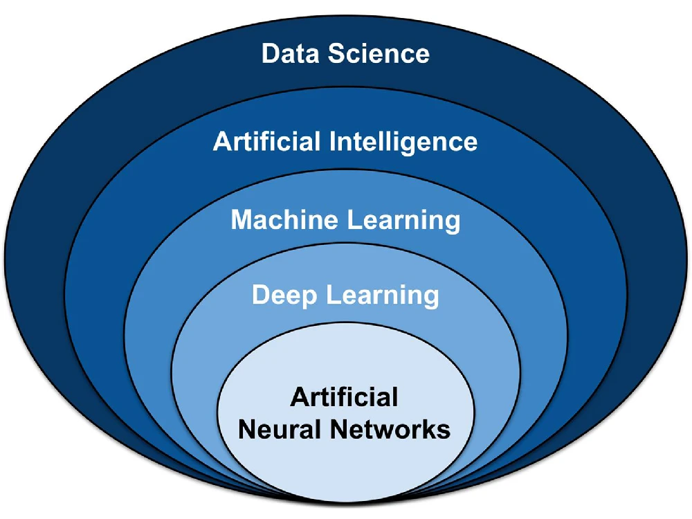
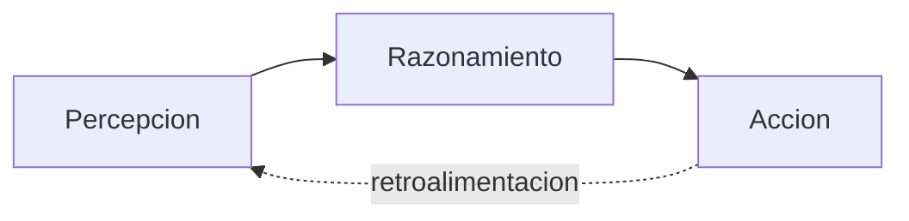
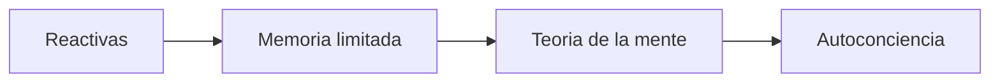
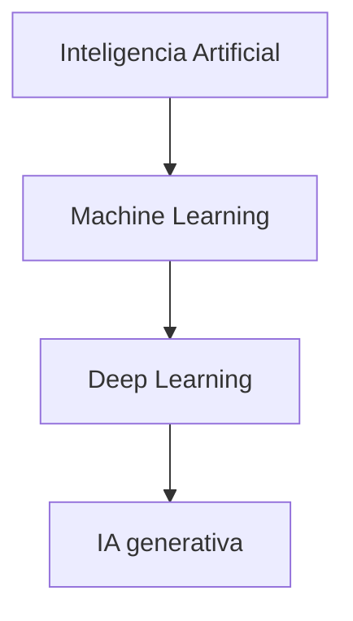

<!--
theme: gaia
size: 16:9
_class: lead
paginate: true
marp: false
backgroundColor: #000
backgroundImage: url('img/hero-backgroundIES.jpg')
-->

# UD01: Caracterización de sistemas de IA
#### Modelos de Inteligencia Artificial
###### version: 2026-08-27

---
<!-- footer: d.martinezpena@edu.gva.es -->
<!-- header: Modelos de Inteligencia Artificial 26-27 (UD01_1)-->

<!-- Cada bloque de este índice se corresponde con un criterio de RA1: bloques 1 y 2 con RA1-a, bloque 3 con RA1-c, bloque 4 con RA1-b y bloques 5-6 con RA1-d. -->

# ¿Qué veremos?
1. Fundamentos de los sistemas inteligentes
2. Escuelas de pensamiento y clasificaciones de la IA
3. IA, machine learning, deep learning e IA generativa
4. Campos de aplicación
5. Nuevas formas de interacción y eficiencia operativa
6. Beneficios, riesgos y ética

---

## RA1 y sus criterios de evaluación

<!-- Estos cuatro criterios de evaluación proceden del anexo I del RD 279/2021, el real decreto que fija el currículo del ciclo; la letra de cada CE es la numeración oficial de la norma, no un orden nuestro. (§1 de los apuntes) -->

**RA1**: caracteriza sistemas de IA y su relación con la mejora de la eficiencia operativa.

| CE | Criterio |
|---|---|
| a | Principios de los sistemas inteligentes |
| b | Campos de aplicación de la IA |
| c | Técnicas básicas de la IA |
| d | Nuevas formas de interacción y mejora operativa |

---

## Hilo conductor de la unidad
<!-- (§2 de los apuntes) -->

**Antes de programar nada hace falta saber qué es un sistema inteligente, cómo se clasifica y qué mejora aporta.**

Fundamentos → clasificar → distinguir técnicas → identificar campos → conectar con la mejora operativa.

El taller 3 cierra la unidad calculando esa mejora con KPIs sobre un caso de negocio.

---
<!-- _class: lead -->
# 1. Fundamentos de los sistemas inteligentes (RA1-a)

---

## ¿Qué es la inteligencia artificial?

La **IA** permite a las máquinas **simular** aprendizaje, comprensión, resolución de problemas, decisión y creatividad humanas.

Ve e identifica objetos, entiende y responde al lenguaje, aprende de la experiencia y puede **actuar de forma autónoma** (un coche autónomo).

---

## El ciclo percepción → razonamiento → acción
<!-- (§3.2 de los apuntes) -->

**Percepción**: datos, sensores, texto, imagen, audio. **Razonamiento**: modelo, reglas o búsqueda. **Acción**: respuesta, decisión, control.

---

## Características de un sistema inteligente

<!-- Cuando la tarea se complica y definir todas las reglas se vuelve inviable, entra el aprendizaje automático (machine learning): en vez de que alguien programe las reglas a mano, el propio algoritmo deduce los patrones a partir de los datos. (§3.3 de los apuntes) -->

| Característica | Descripción |
|---|---|
| **Autonomía** | Opera sin supervisión humana constante |
| **Adaptación** | Aprende de los datos y mejora con la experiencia |
| **Toma de decisiones** | Recomienda o actúa a partir de datos, no solo de reglas fijas |

Un termostato con reglas `si...entonces...` ya es, formalmente, IA basada en reglas.

---

## IA débil frente a IA fuerte

<!-- AGI son las siglas de artificial general intelligence, inteligencia artificial general; en la bibliografía aparece también como strong AI. Ejemplos de IA fuerte solo existen en la ficción: el T-800 de Terminator, Wall-E, J.A.R.V.I.S. Ningún sistema real se aproxima a esa flexibilidad. (§3.4 de los apuntes) -->

**Débil (narrow)**: una tarea concreta, reactiva, no flexible, sin conciencia. **Es toda la IA que existe hoy** (Siri, Alexa).

**Fuerte (AGI)**: igualaría a una persona en cualquier tarea, sería proactiva y flexible. **Es puramente teórica**: ningún sistema actual se aproxima.

La IA débil también tiene riesgos: ejecuta su tarea sin evaluar consecuencias como lo haría una persona.

---
<!-- _class: lead -->
# 2. Escuelas y clasificaciones de la IA (RA1-a)

---

## Dos escuelas: convencional y computacional

<!-- Con el auge del machine learning, buena parte de lo que hacía la escuela convencional se ha ido llevando al campo computacional: no son compartimentos estancos, sino una evolución histórica del campo. Las dos técnicas que aquí solo se nombran se estudian más adelante: los sistemas expertos de la columna convencional, en la UD05, y la lógica difusa de la computacional, en la UD02. (§3.5 de los apuntes) -->

| | Convencional | Computacional |
|---|---|---|
| Cómo razona | Análisis formal explícito | Aprendizaje a partir de datos |
| Técnicas | Reglas, sistemas expertos | Redes neuronales, difusa |
| Originó | La automatización clásica | El machine learning actual |

---

## Russell y Norvig (1995): cuatro categorías

<!-- Los autores son Stuart Russell y Peter Norvig (1995). El test de Turing lo propuso Alan Turing en 1950 en «Computing Machinery and Intelligence»: una máquina lo supera si un interrogador humano no distingue sus respuestas de las de una persona; aquí da nombre a la categoría de los sistemas que actúan como humanos sin replicar su razonamiento. Las dos últimas categorías, leyes del pensamiento y agentes racionales, exigen una capacidad de cómputo que, para el caso general, todavía es inalcanzable. (§3.5 de los apuntes) -->

| Categoría | Enfoque |
|---|---|
| **Sistemas cognitivos** | Piensan como humanos |
| **Test de Turing** | Actúan como humanos |
| **Leyes del pensamiento** | Piensan con lógica formal |
| **Agentes racionales** | Actúan racionalmente |

De *Artificial Intelligence: A Modern Approach*, el libro de texto de IA más usado.

---

## Hintze (2016): clasificación por capacidades

<!-- La clasificación es de Arend Hintze, investigador de la Universidad de Michigan (2016). Deep Blue, el ejemplo de sistema reactivo, era la máquina de ajedrez de IBM que venció a Kasparov en 1997. La teoría de la mente consistiría en representarse lo que piensan y sienten otros agentes, la base de la interacción social; la autoconciencia sería que el sistema se representara a sí mismo, conociendo sus propios estados internos. (§3.5 de los apuntes) -->

**Reactivas**: Deep Blue, sin memoria. **Memoria limitada**: coches autónomos. **Teoría de la mente** y **autoconciencia**: aún teóricas, ningún sistema actual llega ahí.

---

## Breve historia de la IA

<!-- LLM son las siglas de large language model, modelo grande de lenguaje, entrenado con enormes volúmenes de texto; ChatGPT es el ejemplo más conocido. Dartmouth (1956) es la conferencia en la que John McCarthy acuñó el término «inteligencia artificial». El perceptrón de Frank Rosenblatt (1958) fue la primera red neuronal capaz de aprender. TensorFlow es la librería de aprendizaje automático de Google. Falta en esta línea del tiempo un hito de 2011: Watson, de IBM, gana en el concurso de televisión Jeopardy!, un hito que suele señalarse como el momento en que emerge la ciencia de datos como disciplina. -->

- **1950** Test de Turing
- **1956** Dartmouth acuña «inteligencia artificial»
- **1958** perceptrón de Rosenblatt
- **1997** Deep Blue vence a Kasparov
- **2015** Google libera TensorFlow, código abierto
- **2016** AlphaGo gana en Go
- **2017** *Attention Is All You Need* propone el **Transformer**, base de los LLM y la IA generativa
- **2022** los LLM cambian la industria

 

---
<!-- _class: lead -->
# 3. IA, ML, DL e IA generativa (RA1-c)

---

## Cajas anidadas
<!-- (§4 de los apuntes) -->

**Todo ML es IA, pero no toda IA es ML.** Todo DL es ML, y la IA generativa es una parte del DL.

---

## Cómo funciona un modelo de ML

<!-- Las features son las características con las que se representa cada ejemplo: una casa, por ejemplo, se convierte en [superficie, habitaciones, edad]. El objetivo de fondo de todo el proceso se llama generalización: que el modelo acierte con datos nuevos, no solo con los de entrenamiento. Lo contrario es el sobreajuste, cuando el modelo memoriza los datos que ha visto en vez de aprender el patrón; por eso el paso de evaluación usa datos que nunca ha visto. -->

1. **Representar** los datos como vectores de *features*.
2. **Entrenar**: ajustar parámetros para minimizar el error.
3. **Evaluar** con datos no vistos (evita el sobreajuste).
4. **Inferir**: predecir sobre datos nuevos en producción.

`Precio = A·superficie + B·habitaciones − C·edad + base`: el ML busca los valores de A, B, C.

---

## Tipos de aprendizaje

<!-- Algoritmos supervisados típicos: árboles de decisión, k-vecinos (KNN), naive Bayes, SVM —máquinas de vectores soporte—, regresión logística, random forest. No supervisados: k-means y DBSCAN para clustering, y PCA, análisis de componentes principales, para reducir dimensiones. Todos disponibles en la librería scikit-learn de Python, con la misma interfaz fit/predict. (§4.2 de los apuntes) -->

| Tipo | Datos | Ejemplos |
|---|---|---|
| **Supervisado** | Etiquetados | Spam, precio de vivienda |
| **No supervisado** | Sin etiquetas | Segmentar clientes |
| **Refuerzo** | Recompensas | Robots, juegos |
| **Semi / auto-supervisado** | Pocas o ninguna etiqueta | Entrenar LLM |

 

---

<!-- IMAGEN: ejemplo generado con MidJourney (ya en el repo) -->

## Deep learning e IA generativa

<!-- CNN es convolutional neural network, red convolucional; RNN es recurrent neural network y LSTM, long short-term memory, las dos pensadas para secuencias. Backpropagation es la retropropagación del error, que junto con el gradiente descendente ajusta los pesos de la red. El modelo de base es el foundation model. RLHF significa aprendizaje por refuerzo con feedback humano (reinforcement learning from human feedback) y RAG, retrieval-augmented generation: conecta el modelo a fuentes de datos externas para ganar precisión. Más allá del Transformer existe Mamba (2023), una arquitectura alternativa basada en modelos de espacio de estados, con menor coste computacional para secuencias largas. (§4.3 y §4.4 de los apuntes) -->

**DL**: redes con muchas capas, backpropagation, necesita datos y GPU. **CNN** (imágenes), **RNN/LSTM** (secuencias), **Transformers** (atención, base de los LLM).

**IA generativa**: modelo de base entrenado con datos masivos → ajuste (*fine-tuning*, RLHF) → generación, a veces con **RAG**. Los **agentes de IA** van un paso más allá: actúan, no solo responden.

🔗 <a href="https://thispersondoesnotexist.com/" target="_blank" rel="noopener">Cara generada por IA (ThisPersonDoesNotExist)</a>

---
<!-- _class: lead -->
# 4. Campos de aplicación (RA1-b)

---

## Campos de aplicación de la IA

<!-- El scoring de la fila de finanzas es la puntuación de riesgo crediticio: estimar la probabilidad de impago antes de conceder un préstamo. La IA también está en usos cotidianos que no parecen IA: buscadores que aprenden de los datos, termostatos que se adaptan al comportamiento, ciberseguridad que detecta patrones de ataque, y sistemas que identifican noticias falsas analizando fuentes y lenguaje. (§5.1 de los apuntes) -->

| Campo | Ejemplo | Beneficio |
|---|---|---|
| Industria | Mantenimiento predictivo | Menos paradas |
| Salud | Diagnóstico por imagen | Mayor precisión |
| Finanzas | Fraude, scoring | Menos pérdidas |
| Comercio, educación, RRHH | Recomendación, tutoría, cribado de CV | Más ventas, menos tiempo |

---

## Casos de estudio con beneficio medible

<!-- PLN es el procesamiento del lenguaje natural, la rama que trabaja texto y voz; se estudia entera en la UD03. Un cuarto caso, no en esta diapositiva: en salud, sistemas de IA analizan llamadas de emergencia para reconocer un paro cardíaco más rápido que un operador humano, y usan visión artificial para detectar infecciones en TAC pulmonar. (§5.2 de los apuntes) -->

**Fraude en banca**: modelo de ML sobre datos etiquetados → alerta inmediata en vez de revisión manual posterior.

**Mantenimiento predictivo**: sensores predicen el fallo antes de que ocurra → sustitución programada, menos paradas.

**Atención al cliente con PLN**: chatbot 24/7 para consultas frecuentes, deriva las complejas a personas.

---
<!-- _class: lead -->
# 5. Nuevas interacciones y eficiencia operativa (RA1-d)

---

## Nuevas formas de interacción

<!-- PLN significa procesamiento del lenguaje natural. Las tareas concretas detrás de estas interacciones son análisis de sentimiento, reconocimiento de entidades o NER (nombres, lugares, fechas), clasificación de texto, traducción automática y resumen automático. (§6.1 de los apuntes) -->

| Interacción | Ejemplo |
|---|---|
| **Asistente virtual** | Siri, Alexa |
| **Chatbot** | Soporte de tienda online |
| **Voz / visión** | Transcripción, lectura de documentos |
| **Agentes autónomos** | Reservar un vuelo |

Detrás del texto y la voz hay tareas de **PLN** — se estudian en la UD03.

---

## Eficiencia operativa y KPIs

<!-- KPI son las siglas de key performance indicator, indicador clave de rendimiento: la métrica que se elige para saber si un objetivo se está cumpliendo. FCR es first contact resolution, el porcentaje de consultas resueltas en el primer contacto; AHT es average handling time, el tiempo medio de gestión de una consulta. OEE es overall equipment effectiveness (disponibilidad por rendimiento por calidad de una máquina); MTBF es mean time between failures, el tiempo medio entre dos averías. -->

La IA mejora la eficiencia cuando reduce **costes, tiempos o errores**. Se mide comparando **antes/después** con indicadores: tiempo de ciclo, coste unitario, tasa de error, disponibilidad.

KPIs por ámbito: **FCR** y **AHT** (atención al cliente), **OEE** y **MTBF** (industria).

---

## Ejemplo resuelto: un centro de atención
<!-- (§6.2 de los apuntes) -->

1.000 consultas/día, 3 €/5 min cada una. Un chatbot resuelve el 60 % en 10 s a 0,10 €.

Coste antes: 1.000 × 3 € = **3.000 €**. Coste después: 600 × 0,10 € + 400 × 3 € = **1.260 €**.

**Reducción de coste ≈ 58 %**, y el tiempo medio baja de 5 a ~2 minutos.

---
<!-- _class: lead -->
# 6. Beneficios, riesgos y ética

---

## Una visión general (se profundiza en la UD06)

<!-- El RGPD es el Reglamento (UE) 2016/679, de protección de las personas físicas en el tratamiento de datos personales; se estudia en la UD06. El model drift es el desgaste del modelo: la realidad se va separando de los datos con los que se entrenó y sus predicciones empeoran sin que nada se haya roto. El AI Act (Reglamento UE 2024/1689) entra en vigor por fases: prácticas prohibidas desde el 2 de febrero de 2025, sanciones desde el 2 de agosto de 2025 y aplicación general desde el 2 de agosto de 2026. Su artículo 51 presume riesgo sistémico cuando el cómputo acumulado del entrenamiento de un modelo supera los 10 elevado a 25 FLOPS, operaciones de coma flotante por segundo. -->

**Beneficios**: automatización de tareas repetitivas, mejor toma de decisiones, disponibilidad 24×7, menos errores humanos.

**Riesgos**: datos con sesgos, modelos alterados, *model drift*, privacidad.

**Marco normativo**: el **AI Act** clasifica la IA por riesgo (prácticas prohibidas desde 2/2025); el **RGPD** limita el uso de datos personales.

---

## Puntos clave de la unidad

Un sistema inteligente **percibe, razona y actúa**; se clasifica por tarea (débil/fuerte), por escuela (convencional/computacional) y por capacidades (Russell-Norvig, Hintze).

**IA > ML > DL > IA generativa**: todo ML es IA, pero no toda IA es ML.

Las nuevas interacciones (chatbots, voz, visión, agentes) mejoran la eficiencia operativa reduciendo coste, tiempo o error — y eso se mide con KPIs.

---

## La unidad en la práctica

<!-- La rúbrica de evaluación de los cuatro talleres está publicada en la página del taller 4 (línea del tiempo). (§11 de los apuntes) -->

**4 talleres**: mapa de sistemas inteligentes · técnicas en casos reales · nuevas interacciones · línea del tiempo de la IA.

**Actividad guiada**: notebook demo de aprendizaje supervisado, no supervisado y medición de la mejora operativa.

---

## Evaluación

<!-- Esta exigencia de 5 o más por RA viene de la normativa: el artículo 5.1 de la Orden 8/2025 liga la calificación del módulo a la consecución de los RA, y las Instrucciones 26-27 impiden calificar positivamente un módulo con algún RA no superado. (§14 de los apuntes) -->

| Peso | Instrumento |
|---|---|
| 40 % | Media de los 4 talleres |
| 60 % | Prueba escrita del RA1 |

Hace falta un **5 o más** en el RA para superarlo.

---
<!-- _class: lead -->
# ¿Preguntas?

Diapositivas, apuntes y talleres en el sitio del módulo.
