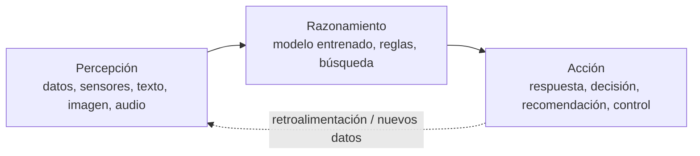
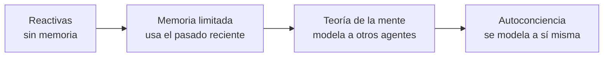
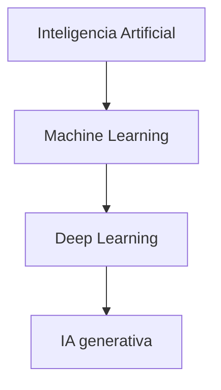
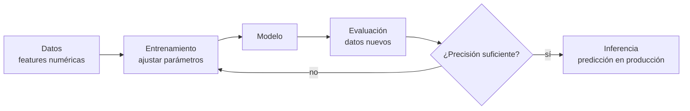
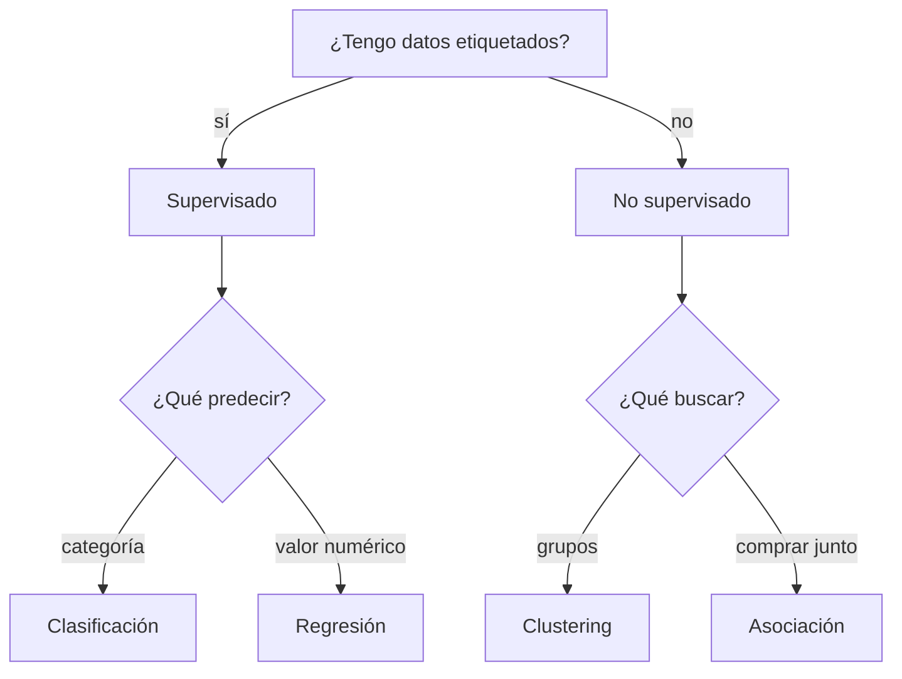

# UD01 — Caracterización de sistemas de IA

!!! info "Unidad 1 · 12 h · semanas 3-6 (12 de octubre al 6 de noviembre)"

## 1. Resultado de aprendizaje y criterios de evaluación

**RA1** — Caracteriza sistemas de Inteligencia Artificial relacionándolos con la mejora de la
eficiencia operativa de las organizaciones y empresas.

| CE | Criterio de evaluación |
|---|---|
| RA1-a | Se han identificado los principios fundamentales de los sistemas inteligentes. |
| RA1-b | Se ha recopilado información sobre campos donde se aplica Inteligencia Artificial. |
| RA1-c | Se han identificado las técnicas básicas a utilizar en el entorno de la IA. |
| RA1-d | Se han identificado nuevas formas de interacciones en los negocios que mejoran la eficiencia operativa. |

!!! note "Bloque de contenidos oficial (RD 279/2021, anexo I)"
    El currículo para este RA dice textualmente:

    *Caracterización de sistemas de Inteligencia Artificial:*

    - *Principios de los sistemas inteligentes.*
    - *Campos de aplicación.*
    - *Técnicas de la Inteligencia Artificial.*
    - *Nuevas formas de interacción.*

## 2. Objetivos de la unidad

| Objetivo | Descripción |
|---|---|
| O1 | Explicar qué es un sistema inteligente y cuáles son sus principios fundamentales. |
| O2 | Distinguir las escuelas de pensamiento y las clasificaciones de la IA (débil/fuerte, Russell-Norvig, Hintze). |
| O3 | Distinguir IA, aprendizaje automático, aprendizaje profundo e IA generativa. |
| O4 | Enumerar los principales campos de aplicación de la IA con ejemplos reales. |
| O5 | Distinguir las técnicas básicas de la IA y saber qué problema resuelve cada una. |
| O6 | Relacionar las nuevas formas de interacción (asistentes, chatbots, visión, voz) con la mejora de la eficiencia operativa. |
| O7 | Identificar en casos prácticos qué técnica usar y qué mejora operativa aporta. |

## 3. Fundamentos de los sistemas inteligentes (RA1-a)

### 3.1 ¿Qué es la inteligencia artificial?

La **inteligencia artificial (IA)** es la tecnología que permite a las máquinas **simular el
aprendizaje, la comprensión, la resolución de problemas, la toma de decisiones y la creatividad**
humanas. Las aplicaciones dotadas de IA pueden ver e identificar objetos, entender y responder al
lenguaje, aprender de la experiencia, recomendar decisiones e incluso **actuar de forma
autónoma** (p. ej. un coche autónomo).

### 3.2 El ciclo percepción → razonamiento → acción

Un **sistema inteligente** percibe su entorno, razona sobre esa información y actúa para
conseguir un objetivo:



- **Percepción**: captar datos del mundo (texto, imagen, audio, sensores, registros de negocio).
- **Razonamiento**: procesar los datos para obtener conocimiento o tomar decisiones (un modelo
  entrenado, un conjunto de reglas, una búsqueda).
- **Acción**: actuar sobre el entorno o sobre las personas (responder, recomendar, controlar un proceso).

### 3.3 Características de un sistema inteligente

| Característica | Descripción |
|---|---|
| **Autonomía** | Opera sin supervisión humana constante |
| **Adaptación** | Aprende de los datos y mejora con la experiencia |
| **Toma de decisiones** | Recomienda o actúa basándose en datos, no solo en reglas fijas |

!!! note "IA basada en reglas vs. IA que aprende"
    La IA **más elemental** puede ser un conjunto de reglas `si... entonces...` programadas a
    mano (un termostato que enciende la calefacción si baja de 18 ºC es, formalmente, un sistema
    de IA basado en reglas). Pero cuando la tarea se complica, definir todas las reglas es
    imposible: ahí entra el **aprendizaje automático**, que deduce los patrones de los datos.

### 3.4 IA débil frente a IA fuerte

La clasificación más simple de la IA es **según la tarea que resuelve**: hay tareas concretas y
acotadas (jugar al ajedrez) y tareas abiertas que exigen contexto, ética o creatividad (gestionar
una cocina sin intervención humana). De ahí surgen dos categorías:

- **IA débil o estrecha (narrow/weak)**: diseñada para **una tarea o un conjunto limitado de
  tareas**. Es **reactiva** (no actúa si no se la activa), **no flexible** (colapsa ante lo no
  previsto), queda **limitada por lo que programó una persona** y **no tiene conciencia**: computa,
  no razona en sentido humano. Los asistentes virtuales (Siri, Alexa) son el ejemplo típico —
  operan dentro de un rango de respuestas definido en su base de datos y, fuera de él, dan
  respuestas inadecuadas o directamente no responden. **Es toda la IA que existe hoy.**
- **IA general o fuerte (AGI/strong)**: igualaría o superaría la inteligencia humana en
  **cualquier** tarea intelectual, sería **proactiva**, **flexible** (aprendería una tarea nueva a
  partir de una parecida) y se **autorregularía**. **Es puramente teórica**: ningún sistema actual
  se aproxima, más allá de la ficción (T-800, Wall-E, J.A.R.V.I.S.).

!!! warning "La IA débil también tiene riesgos"
    Precisamente por no considerar un contexto amplio ni reglas sociales o éticas, la IA débil
    ejecuta su tarea con eficacia y sin matices: no evalúa consecuencias como lo haría una persona.
    Es una tecnología incompleta y potencialmente peligrosa si se usa sin prudencia, o si quien la
    programa busca causar daño — el motivo de fondo de la UD06.

### 3.5 Escuelas de pensamiento y clasificaciones de la IA

Además de por la tarea, la IA se puede clasificar por **cómo llega a sus resultados** (la escuela
de pensamiento) o por **qué capacidades tiene** (Russell-Norvig, Hintze). Ninguna de las tres es
«la correcta»: son lentes distintas sobre el mismo campo.

#### Dos escuelas: convencional y computacional

| | IA convencional (simbólico-deductiva) | IA computacional (subsimbólico-inductiva) |
|---|---|---|
| Cómo razona | Análisis formal y estadístico explícito | Aprendizaje interactivo a partir de datos empíricos |
| Técnicas | Razonamiento basado en casos, sistemas expertos, redes bayesianas | Redes neuronales, máquinas de vectores soporte, sistemas difusos, computación evolutiva |
| Qué originó | La «automatización» clásica (reglas + estadística) | El **aprendizaje automático** actual |

Con el auge del *machine learning*, buena parte de lo que hacía la escuela convencional se ha ido
llevando al campo computacional — no son compartimentos estancos.

#### Clasificación de Russell y Norvig (1995)

En *Artificial Intelligence: A Modern Approach* — el libro de texto de IA más usado en el mundo —,
Stuart Russell y Peter Norvig proponen cuatro categorías según el **origen del comportamiento
inteligente**:

| Categoría | Enfoque | Ejemplo de aplicación |
|---|---|---|
| **Sistemas cognitivos** | Piensan como humanos: emulan el proceso de decisión | Modelos cognitivos, aprendizaje |
| **Test de Turing** | Actúan como humanos, sin pasar por el razonamiento | Robótica, actuadores en el mundo físico |
| **Leyes del pensamiento** | Piensan con lógica formal, sin excepciones | Sistemas expertos (aproximaciones acotadas) |
| **Agentes racionales** | Actúan racionalmente, sin razonamiento lógico explícito | Agentes de software actuales |

Las dos últimas exigen una capacidad de cómputo que, para el caso general, todavía es
inalcanzable.

#### Los tests de Turing y de Lovelace: ¿demuestran que un sistema es inteligente?

La fila «Test de Turing» de la tabla anterior remite a una propuesta muy concreta. **Alan Turing**
planteó en 1950, en *Computing Machinery and Intelligence*, el **juego de la imitación**: un
interrogador humano conversa por escrito con una persona y con una máquina, sin saber cuál es
cuál; si tras el interrogatorio no logra distinguirlas de forma fiable, la máquina **pasa el
test**. Es una prueba **conductual**: no exige que la máquina piense, solo que actúe de forma
indistinguible de como lo haría una persona.

Casi un siglo antes, **Ada Lovelace** ya había puesto en duda que eso bastara. En 1843, en la
«Nota G» que acompañaba su traducción de un trabajo sobre la máquina analítica de Babbage, escribió
que *«la máquina analítica no tiene pretensión de originar nada; puede hacer cualquier cosa que
sepamos ordenarle que ejecute»* — para Lovelace, una máquina solo repite lo que alguien programó,
nunca **origina** algo genuinamente nuevo. El propio Turing cita esta «objeción de Lovelace» en su
artículo de 1950 y responde que una máquina sí podría «sorprendernos», sin zanjar el debate.

Esa objeción, no la conversación, es lo que en 2001 formalizaron Selmer Bringsjord, Paul Bello y
David Ferrucci en el **test de Lovelace**: un sistema lo supera si produce un resultado que su
propio programador **no puede explicar cómo se generó** a partir del código que escribió — un test
sobre **creatividad y originalidad**, no sobre saber conversar. En 2014, Mark Riedl propuso una
versión más manejable, el **test de Lovelace 2.0**: pedir al sistema artefactos creativos concretos
(un relato, un poema, una imagen) que cumplan unos requisitos dados por un evaluador humano, que
juzga si el resultado los satisface — más fácil de repetir y de comparar entre sistemas que el
criterio original.

!!! note "Por qué importan los dos, no solo el de Turing"
    El test de Turing mide si una máquina puede **imitar** una conversación humana. El de Lovelace
    mide algo distinto: si puede **originar** algo que no es una consecuencia previsible de su
    programación. Superar el primero no implica superar el segundo — y es justo la pregunta de
    fondo al hablar de IA fuerte (§3.4): ¿la creatividad de una IA generativa es real, o solo una
    recombinación muy sofisticada de lo que ya ha visto?

#### Clasificación de Hintze (2016)

Arend Hintze (Universidad de Michigan) propuso una clasificación por **capacidades**, de la más
simple a la más avanzada — la más citada para explicar hacia dónde evoluciona la IA:



- **Máquinas reactivas**: sin memoria ni capacidad de usar experiencia pasada. **Deep Blue**
  (IBM, venció a Kasparov en 1997) es el ejemplo perfecto: evalúa el tablero en tiempo real, sin
  ningún concepto de lo ocurrido antes.
- **Memoria limitada**: usan observaciones recientes para decidir, sin guardarlas a largo plazo.
  Los **vehículos autónomos** actuales encajan aquí: memorizan velocidad y trayectoria de otros
  coches para decidir un cambio de carril, pero esa información es transitoria.
- **Teoría de la mente** *(teórica)*: formaría representaciones sobre lo que piensan y sienten
  otros agentes — la base de la interacción social. Ningún sistema actual llega a esto.
- **Autoconciencia** *(teórica)*: el sistema se representaría a sí mismo, conocería sus propios
  estados internos. Es el paso final, y el más lejano, del desarrollo de la IA.

!!! tip "Cómo no perderse entre tres clasificaciones"
    Si te preguntan «¿qué tipo de IA es esto?», identifica primero la **tarea** (débil casi
    siempre, hoy), después la **escuela** (¿reglas explícitas o aprendida de datos?) y por último,
    si aplica, el **nivel de Hintze** (¿tiene memoria de lo que ha visto?). Las tres respuestas
    pueden convivir para el mismo sistema.

### 3.6 Breve historia de la IA

| Año | Hito |
|---|---|
| 1950 | Alan Turing publica *Computing Machinery and Intelligence* y propone el **Test de Turing** |
| 1956 | Dartmouth: John McCarthy acuña el término **inteligencia artificial** |
| 1958 | Frank Rosenblatt publica el **perceptrón**, primera red neuronal que aprende (concebido en 1957; máquina Mark I Perceptron construida entre 1958 y 1960) |
| 1997 | Deep Blue (IBM) vence al campeón de ajedrez Kasparov |
| 2011 | Watson (IBM) gana en *Jeopardy!*; emerge la ciencia de datos |
| 2015 | Google libera **TensorFlow** como código abierto, democratizando las herramientas de deep learning |
| 2016 | AlphaGo (DeepMind) vence en Go (más de 14,5 billones de jugadas tras 4 movimientos) |
| **2017** | **Vaswani et al. publican *Attention Is All You Need*** y proponen la arquitectura **Transformer**, basada solo en mecanismos de atención: elimina la recurrencia y las convoluciones. Es la base técnica de los LLM y de la IA generativa posterior |
| 2022 | Los **grandes modelos de lenguaje (LLM)**, p. ej. ChatGPT, cambian la industria |
| 2024-26 | Modelos **multimodales** y **agentes de IA** autónomos |

### 3.7 Tipos de IA según su forma

La IA se presenta en dos formas generales:

- **IA de software**: programas que procesan información sin cuerpo físico (asistentes virtuales,
  buscadores, análisis de imágenes, reconocimiento de voz y rostro, motores de traducción).
- **IA "encarnada" (embodied)**: sistemas con presencia física que interactúan con el mundo
  (robots, coches autónomos, drones, internet de las cosas).

Muchas aplicaciones combinan ambas: un coche autónomo usa visión y decisiones de software dentro
de un vehículo físico.

## 4. IA, machine learning, deep learning e IA generativa (RA1-c)

La relación entre estos términos se representa como cajas anidadas:



!!! tip "Regla para recordar"
    **Todo machine learning es IA, pero no toda IA es machine learning.** Y todo deep learning es
    machine learning, y la IA generativa es una parte del deep learning.

### 4.1 Aprendizaje automático (machine learning, ML)

El ML crea **modelos** entrenando un algoritmo sobre datos para hacer predicciones o tomar
decisiones **sin ser programado explícitamente** para cada caso. Su objetivo central es la
**generalización**: que el modelo acierte con datos **nuevos**, no solo con los de entrenamiento.

En lugar de programar reglas manuales (filtro de spam por criterios a mano), el modelo **aprende**
de ejemplos etiquetados y deduce los criterios por sí mismo.

#### Cómo funciona un modelo de ML, paso a paso



1. **Representar los datos numéricamente**: cada ejemplo se convierte en un vector de
   *features* (características). P. ej., una casa se representa como `[superficie, habitaciones, edad]`.
2. **Entrenar**: el algoritmo ajusta sus **parámetros** (los pesos de la fórmula) para que el
   error entre su salida y la respuesta correcta sea mínimo. Se usa una **función de pérdida** y
   un optimizador (gradiente descendente).
3. **Evaluar**: se comprueba el rendimiento con **datos que el modelo no ha visto** (test), no
   solo con los de entrenamiento, para asegurar que **generaliza** y no memoriza (sobreajuste).
4. **Inferir**: en producción, el modelo predice sobre datos nuevos (a esto se le llama *AI inference*).

!!! note "Ejemplo con números"
    Para predecir el precio de una casa: `Precio = A·superficie + B·habitaciones − C·edad + base`.
    El objetivo del ML es encontrar los valores de `A`, `B`, `C` y `base` que minimizan el error
    con las ventas conocidas.

### 4.2 Tipos de aprendizaje

| Tipo | Datos | Objetivo | Ejemplos |
|---|---|---|---|
| **Supervisado** | Etiquetados (con respuesta) | Predecir la respuesta de datos nuevos | Clasificación (spam/no spam), regresión (precio) |
| **No supervisado** | Sin etiquetas | Encontrar estructura oculta | Clustering (segmentar clientes), asociación, reducción de dimensionalidad |
| **Refuerzo (RL)** | Interacción con el entorno | Maximizar recompensa por prueba-error | Robots, juegos, control |
| **Semi-supervisado** | Muchos sin etiquetar + pocos etiquetados | Combinar ambos | Cuando etiquetar es caro |
| **Auto-supervisado** | Sin etiquetas humanas | Aprender de la propia estructura (p. ej. ocultar palabras y predecirlas) | Entrenamiento de LLM |

- **Supervisado** → clasificación (categorías) y regresión (valores continuos). Algoritmos típicos:
  árboles de decisión, k-vecinos (KNN), naive Bayes, SVM, regresión logística, random forest.
- **No supervisado** → clustering (k-means, DBSCAN), detección de anomalías, PCA.

#### 4.2.1 ¿Qué algoritmo elegir?



Un vistazo a los algoritmos más usados (todos disponibles en `scikit-learn`):

| Algoritmo | Tipo | Cómo funciona (resumen) | Ejemplo de uso |
|---|---|---|---|
| **k-vecinos (KNN)** | Supervisado | Clasifica según los k ejemplos más cercanos | Recomendar producto similar |
| **Árbol de decisión** | Supervisado | Serie de preguntas `si/entonces` aprendidas de los datos | Decidir aprobar un préstamo |
| **Naive Bayes** | Supervisado | Probabilidades con supuesto de independencia | Clasificar spam / análisis de sentimiento |
| **Regresión logística** | Supervisado | Probabilidad de pertenecer a una clase | Predecir abandono de cliente |
| **Random forest** | Supervisado | Combinación de muchos árboles | Mantenimiento predictivo |
| **k-means** | No supervisado | Agrupa en k grupos por cercanía al centro | Segmentar clientes |
| **DBSCAN** | No supervisado | Agrupa por densidad, detecta anomalías | Detectar transacciones atípicas |

!!! example "Primer contacto con scikit-learn"
    Todos estos algoritmos comparten la misma interfaz `fit` / `predict`, y se evalúan dividiendo
    los datos en **entrenamiento y prueba** (`train_test_split`). Por ejemplo, para clasificar
    especies con el dataset *Iris*:

    ```python
    from sklearn.datasets import load_iris
    from sklearn.model_selection import train_test_split
    from sklearn.tree import DecisionTreeClassifier

    X, y = load_iris(return_X_y=True)
    X_train, X_test, y_train, y_test = train_test_split(X, y, test_size=0.3, random_state=42)

    modelo = DecisionTreeClassifier()
    modelo.fit(X_train, y_train)          # entrena con los datos etiquetados
    precision = modelo.score(X_test, y_test)  # evalúa con datos nuevos
    print("Precisión:", precision)
    ```

    Este mismo patrón (`fit` → `score`) se repetirá en las prácticas de la UD02 y siguientes; en
    esta unidad solo necesitas reconocerlo.

### 4.3 Aprendizaje profundo (deep learning, DL)

El DL usa **redes neuronales artificiales con muchas capas** (entrada, capas ocultas, salida).
Cada conexión tiene un **peso** y cada neurona una **activación no lineal**: la red puede modelar
patrones muy complejos. Se entrena con **backpropagation + gradiente descendente** y necesita
**muchos datos y GPU**.

- **CNN**: redes convolucionales, especializadas en imágenes (visión).
- **RNN/LSTM**: redes recurrentes, pensadas para secuencias (texto, series temporales).
- **Transformers** (2017): arquitectura con **mecanismo de atención**; base de los LLM y de casi
  toda la IA moderna.
- **Mamba** (2023): arquitectura alternativa basada en *state space models*.

Ventajas del DL: aprende representaciones complejas sin extraer características a mano.
Inconvenientes: necesita muchos datos y cómputo, y es menos explicable.

### 4.4 IA generativa

La **IA generativa** (gen AI) crea contenido nuevo (texto, imágenes, vídeo, audio) a partir de un
**prompt**. Funciona en tres fases:

1. **Entrenamiento**: se crea un **modelo de base** (foundation model) entrenado con enormes
   volúmenes de datos (texto de internet, imágenes...). Los **LLM** (ChatGPT, GPT-4, BERT,
   Llama, Gemini) son el ejemplo más común.
2. **Ajuste (tuning)**: se adapta a la tarea con *fine-tuning* o *RLHF* (refuerzo con feedback
   humano).
3. **Generación y evaluación**: se genera y se mejora de forma continua; técnicas como **RAG**
   conectan el modelo a fuentes de datos externas para mayor precisión.

**Agentes de IA / agentic AI**: programas autónomos que **diseñan su propio flujo de trabajo** y
usan herramientas (apps, servicios) para lograr objetivos. Es el paso natural después de la IA
generativa: no solo responden, **actúan**.

## 5. Campos de aplicación de la IA (RA1-b)

| Campo | Ejemplos de aplicación | Beneficio típico |
|---|---|---|
| Industria y logística | Mantenimiento predictivo, optimización de rutas, control de calidad visual | Menos paradas, menos costes |
| Salud | Diagnóstico asistido por imagen, triaje de pacientes, descubrimiento de fármacos | Mayor precisión, menos errores |
| Finanzas y banca | Detección de fraude, scoring crediticio, atención al cliente | Menos pérdidas, más velocidad |
| Comercio y retail | Recomendación de productos, previsión de demanda, chatbots de venta | Más ventas, menos stock roto |
| Marketing | Segmentación de clientes, análisis de sentimiento, personalización | Campañas más rentables |
| Educación | Tutoría adaptativa, corrección automática, análisis de abandono | Menos abandono, más personalización |
| Administración | Automatización de trámites, asistentes virtuales | Menos tiempos y costes |
| Transporte | Conducción asistida, gestión del tráfico, mantenimiento de flotas | Seguridad y eficiencia |
| Recursos humanos | Cribado de CV, emparejado con ofertas, entrevistas asistidas | Menos tiempo de contratación |

### 5.1 La IA en la vida cotidiana

Muchas tecnologías que usas a diario son IA, aunque no lo parezca (Parlamento Europeo):

| Uso cotidiano | Cómo interviene la IA |
|---|---|
| **Compras online y publicidad** | Recomendaciones personalizadas según búsquedas y compras; optimización de inventario y logística |
| **Buscadores** | Aprenden de los datos para devolver resultados relevantes |
| **Asistentes de voz** | Responden, recomiendan y organizan rutinas |
| **Traducción automática** | Traduce texto y voz; subtítulos automáticos |
| **Hogar y ciudad inteligente** | Termostatos que aprenden del comportamiento; regulación del tráfico |
| **Coches** | Asistentes de seguridad, navegación |
| **Ciberseguridad** | Detecta y combate ciberataques reconociendo patrones |
| **Desinformación** | Detecta noticias falsas analizando fuentes y lenguaje |
| **Agricultura** | Monitoriza animales, riego y fertilizantes para reducir costes e impacto ambiental |
| **Administración pública** | Alertas tempranas de catástrofes, trámites automatizados |

### 5.2 Casos de estudio con beneficio medible

**Caso 1 · Detección de fraude en banca (RA1-b, RA1-c, RA1-d)**
Un banco entrena un modelo de ML con **datos históricos etiquetados** (transacción fraudulenta o
no). El modelo analiza en tiempo real importe, ubicación, horario y hábitos de cada cliente.
*Antes*: revisión manual posterior a la pérdida. *Después*: alerta inmediata y bloqueo preventivo.
**Mejora operativa**: menos pérdidas económicas y menor fricción para clientes legítimos.

**Caso 2 · Mantenimiento predictivo en industria (RA1-b, RA1-c)**
Sensores en máquinas envían datos (temperatura, vibración, horas de uso). Un modelo de ML
predice cuándo fallará un equipo antes de que ocurra.
*Antes*: averías inesperadas y paradas de línea. *Después*: sustitución programada.
**Mejora operativa**: menos paradas, menos costes de reparación, mayor disponibilidad.

**Caso 3 · Atención al cliente con PLN (RA1-c, RA1-d)**
Un **chatbot** con PLN responde consultas frecuentes (estado de pedido, devoluciones) y deriva
las complejas a personas.
*Antes*: colas y horario limitado. *Después*: atención 24/7 e inmediata.
**Mejora operativa**: menor coste por consulta, más satisfacción, agentes dedicados a casos difíciles.

**Caso 4 · Salud: detección precoz (RA1-b)**
Un programa con IA analiza llamadas de emergencia para **reconocer un paro cardíaco** durante la
llamada, más rápido que un operador humano; también se usa visión para detectar infecciones en
TAC pulmonar.
**Mejora operativa**: menor tiempo de respuesta y mayor precisión en el diagnóstico.

## 6. Nuevas formas de interacción y eficiencia operativa (RA1-d)

### 6.1 Nuevas interacciones

| Interacción | Qué es | Ejemplo |
|---|---|---|
| **Asistente virtual** | Responde por voz o texto a peticiones del usuario | Siri, Alexa, asistentes corporativos |
| **Chatbot** | Conversación automatizada en web/mensajería | Chat de soporte de una tienda online |
| **Interacción por voz** | Transcribe y analiza audio | Transcripción de reuniones, análisis de llamadas |
| **Interacción por visión** | Lee e interpreta imágenes/vídeo | Lectura de documentos, control de accesos, inspección visual |
| **Agentes autónomos** | Ejecutan tareas y usan herramientas por sí solos | Reservar vuelo, tramitar una incidencia |

#### El PLN detrás de las interacciones por texto y voz

El **procesamiento del lenguaje natural (PLN)** es la técnica de IA que permite entender y
generar lenguaje humano — se estudia a fondo en la UD03. Detrás de un chatbot, un asistente de voz
o un análisis de opiniones hay varias tareas de PLN:

| Tarea de PLN | Qué hace | Ejemplo |
|---|---|---|
| **Análisis de sentimiento** | Determina si un texto es positivo, negativo o neutro | Valorar opiniones de clientes |
| **Reconocimiento de entidades (NER)** | Identifica nombres, lugares, fechas | Extraer `María`, `Madrid`, `05/05` de un texto |
| **Clasificación de texto** | Asigna un texto a una categoría | Spam, tipo de incidencia, idioma |
| **Traducción automática** | Convierte texto de un idioma a otro | Documentos, subtítulos |
| **Resumen de texto** | Condensa documentos largos | Resumir informes y artículos |
| **Reconocimiento de voz** | Convierte audio en texto | Transcripción de llamadas |

Un *pipeline* de PLN típico es: **preprocesado** (tokenización, minúsculas, eliminación de
palabras vacías, lematización) → **extracción de características** (bolsa de palabras, TF-IDF,
embeddings) → **modelo** (ML o redes profundas, p. ej. *transformers* como BERT) → **salida**
(clasificación, traducción, respuesta). En el notebook de la unidad verás un ejemplo de
sentimiento con `scikit-learn`.

### 6.2 Eficiencia operativa

La IA mejora la **eficiencia operativa** cuando reduce **costes, tiempos o errores** en un
proceso. Indicadores que suelen mejorar:

| Caso | Antes (sin IA) | Después (con IA) |
|---|---|---|
| Atención al cliente | Colas, horario limitado | Chatbot 24/7, respuesta inmediata |
| Inspección de calidad | Revisión manual, errores | Visión artificial: más rápida y constante |
| Previsión de demanda | Roturas de stock o excedentes | Predicción con ML: menos pérdidas |
| Detección de fraude | Revisión posterior | Detección en tiempo real |

#### 6.3 Cómo medir la mejora (KPIs)

Para saber si una solución de IA merece la pena, se compara el proceso **antes y después** con
indicadores objetivos:

| Indicador | Qué mide |
|---|---|
| **Tiempo de ciclo** | Cuánto tarda una operación (respuesta, inspección, trámite) |
| **Coste unitario** | Coste por consulta, por pedido, por transacción |
| **Tasa de error** | Errores humanos o del proceso por cada N operaciones |
| **Disponibilidad** | Horas al día en que el servicio está operativo |
| **Rendimiento** | Operaciones por unidad de tiempo o por empleado |

Según el tipo de proceso, se usan KPIs específicos que conviene conocer por su nombre, porque
aparecen en informes y ofertas de las empresas de IA:

| Ámbito | KPI | Qué mide |
|---|---|---|
| Atención al cliente | **FCR** (*first contact resolution*) | % de consultas resueltas en el primer contacto |
| Atención al cliente | **AHT** (*average handling time*) | Tiempo medio de gestión de una consulta |
| Atención al cliente | **Containment rate** | % de consultas cerradas por la IA sin intervención humana |
| Industria | **OEE** (*overall equipment effectiveness*) | Disponibilidad × rendimiento × calidad de una máquina |
| Industria | **MTBF** (*mean time between failures*) | Tiempo medio entre dos averías |
| Operaciones | **Cycle time** | Tiempo total de una operación de principio a fin |
| Operaciones | **Coste por documento** | Coste de procesar cada documento (contrato, factura, email) |

!!! tip "KPI ≠ mejora anecdótica"
    Decir "el chatbot funciona muy bien" no sirve para justificar una inversión. Lo que vale es un
    KPI comparado: *"la tasa de resolución en el primer contacto pasó de X a Y"* o *"el tiempo
    medio de gestión bajó de 5 minutos a 2"*. En el ejemplo siguiente se hace exactamente eso.

**Ejemplo resuelto**: un centro de atención recibe 1.000 consultas/día, cada una cuesta 3 € y
tarda 5 min. Un chatbot resuelve el 60 % de las consultas en 10 segundos y a un coste de 0,10 €.

- Coste diario antes: 1.000 × 3 € = **3.000 €**.
- Coste diario después: 600 × 0,10 € + 400 × 3 € = 60 € + 1.200 € = **1.260 €**.
- **Reducción de coste ≈ 58 %** y de tiempo medio de atención de 5 min a ~2 min.

Este tipo de análisis (identificar indicador → estimar antes/después → decidir) es exactamente lo
que se practica en el taller 3.

### 6.4 De la técnica al beneficio

| Técnica de IA | Ejemplo de uso | Mejora operativa típica |
|---|---|---|
| Clasificación (supervisado) | Priorizar incidencias, cribar CV | Menos tiempo y errores de clasificación |
| Regresión (supervisado) | Prever demanda, precios | Menos stock roto, mejor fijación de precios |
| Clustering (no supervisado) | Segmentar clientes | Campañas más rentables |
| Detección de anomalías | Fraude, averías | Menos pérdidas y paradas |
| PLN | Chatbots, sentimiento, resúmenes | Atención 24/7, menos coste por consulta |
| Visión artificial | Inspección, lectura de documentos | Menos errores y tiempo de inspección |
| Robótica | Almacén, fabricación | Mayor velocidad y seguridad |
| Sistemas expertos | Diagnóstico técnico, rutas | Conocimiento experto disponible 24/7 |
| IA generativa / agentes | Redacción, tramitación | Automatización de tareas repetitivas |

!!! tip "De identificar a implementar"
    En esta unidad aprenderás a **identificar** oportunidades (qué técnica encaja y qué mejora
    aporta). **Implementar** modelos y sistemas es el trabajo de las unidades siguientes.

### 6.5 Ejemplo guiado: de un problema de negocio a una solución de IA

Para cerrar el bloque, recorremos juntos los pasos que repetirás en el taller 3. El caso es
completamente ficticio para no depender de datos externos.

**Problema**: una tienda online recibe 200 reclamaciones de devolución al día por email. Hoy, dos
personas leen cada correo, lo clasifican a mano y lo enrutan. Tardan unos 8 minutos por correo y
el error de clasificación ronda el 15 %.

**Paso 1 · Elegir el KPI.** Medimos el **tiempo de ciclo** (8 min/reclamación), la **tasa de error**
(15 %) y el **coste** (2 personas × jornada completa).

**Paso 2 · Identificar la técnica.** Clasificar texto en categorías (devolución, cambio, defecto,
consulta) es una tarea de **PLN + clasificación supervisada** (p. ej. naive Bayes o un árbol de
decisión sobre textos vectorizados).

**Paso 3 · Estimar el antes/después.** Con un clasificador que resuelve el 70 % de los correos
en 30 segundos y el resto lo revisa una persona:

- Tiempo medio por correo: 0,30 × 0,5 min + 0,70 × 8 min ≈ **5,8 min** (frente a 8).
- Error de clasificación objetivo: **< 5 %** (frente al 15 %).
- Las dos personas pasan de clasificar a **tratar solo los casos complejos**.

**Paso 4 · Decidir y comunicar.** El responsable presenta la mejora con los KPIs antes/después y
señala los riesgos (correos ambiguos, privacidad de los datos de los clientes según el RGPD).

!!! note "El papel del ejemplo guiado"
    Este mismo esquema —*problema → KPI → técnica → antes/después → decisión*— es el que define
    qué es **caracterizar un sistema de IA** (RA1): no hace falta entrenar todavía el modelo, solo
    identificar correctamente qué técnica encaja y qué mejora operativa aporta.

## 7. Beneficios, riesgos y ética (visión general)

- **Beneficios** (para valorar la eficiencia operativa): automatización de tareas repetitivas,
  más y más rápida información de los datos, mejor toma de decisiones, menos errores humanos,
  disponibilidad 24×7, menor riesgo físico.
- **Riesgos** (se estudian a fondo en UD06): datos con sesgos o manipulación, modelos robados o
  alterados, fallos operativos (*model drift*), problemas de privacidad y ética. Un ejemplo
  relevante: la formación de los modelos puede reforzar sesgos de género si los datos de
  entrenamiento los contienen.
- **Marco normativo**: el **AI Act** (Reglamento UE 2024/1689) clasifica la IA por riesgo y entra
  en vigor por fases: las prácticas prohibidas desde **2/2/2025**, las sanciones desde **2/8/2025**
  y la aplicación general desde **2/8/2026**. Un modelo de IA de uso general con **riesgo
  sistémico** se presume cuando el cómputo acumulado de su entrenamiento supera los **10²⁵ FLOPS**
  (art. 51). El **RGPD** limita además el uso de datos personales, lo que obliga a equilibrar el
  entrenamiento masivo con la **minimización de datos**. Todo esto se trabaja en la UD06.
- **IA responsable**: explicabilidad, equidad, robustez, rendición de cuentas, privacidad y
  cumplimiento normativo (RGPD, AI Act).

## 8. Puntos clave de la unidad

- Un sistema inteligente **percibe, razona y actúa**, y se caracteriza por autonomía, adaptación y toma de decisiones.
- La IA se clasifica por **tarea** (débil/fuerte), por **escuela** (convencional/computacional) y por **capacidades** (Russell-Norvig, Hintze) — son lentes complementarias, no excluyentes.
- **IA > ML > DL > IA generativa**: todo ML es IA, pero no toda IA es ML.
- Aprendizaje **supervisado** (con etiquetas: clasificación/regresión), **no supervisado** (patrones sin etiquetas: clustering), **por refuerzo** (recompensas), **semi** y **auto-supervisado**.
- El **deep learning** (redes profundas) domina visión, lenguaje y generación, pero requiere datos y cómputo.
- La IA ya está en la vida cotidiana (compras, buscadores, asistentes, traducción, coches, ciberseguridad).
- Las **nuevas interacciones** (chatbots, voz, visión, agentes) mejoran la **eficiencia operativa** reduciendo coste, tiempo o error.

## 9. Glosario

| Término | Definición |
|---|---|
| **IA (inteligencia artificial)** | Tecnología que simula capacidades humanas (aprender, razonar, decidir) |
| **Sistema inteligente** | Sistema que percibe, razona y actúa para lograr un objetivo |
| **IA débil / fuerte** | Orientada a una tarea concreta (toda la actual) frente a IA general al nivel humano (teórica) |
| **IA convencional / computacional** | Escuela simbólico-deductiva (reglas explícitas) frente a subsimbólica-inductiva (aprende de datos) |
| **Test de Turing** | Un interrogador conversa con una persona y una máquina; si no las distingue, la máquina lo supera |
| **Test de Lovelace** | El sistema origina un resultado que su propio programador no puede explicar a partir del código |
| **Teoría de la mente / autoconciencia** | Niveles teóricos de la clasificación de Hintze, aún sin sistemas reales |
| **ML (machine learning)** | Técnicas que aprenden patrones de los datos sin programación explícita |
| **Deep learning** | Subconjunto del ML basado en redes neuronales profundas |
| **IA generativa** | IA que crea contenido nuevo (texto, imagen, audio) |
| **LLM** | Modelo de lenguaje grande (p. ej. ChatGPT) entrenado con enormes volúmenes de texto |
| **Modelo** | Resultado del entrenamiento de un algoritmo sobre datos |
| **Entrenamiento** | Proceso de ajustar los parámetros del modelo con datos |
| **Generalización** | Capacidad del modelo de acertar con datos nuevos |
| **Supervisado** | Aprendizaje con ejemplos etiquetados |
| **No supervisado** | Aprendizaje que encuentra estructura sin etiquetas |
| **Refuerzo (RL)** | Aprendizaje por prueba-error con recompensas |
| **Clasificación** | Tarea supervisada de predecir categorías |
| **Regresión** | Tarea supervisada de predecir valores continuos |
| **Clustering** | Agrupación no supervisada de datos similares |
| **PLN** | Procesamiento del lenguaje natural (texto y voz) |
| **Visión por computador** | IA que interpreta imágenes y vídeo |
| **Robot** | Sistema físico que percibe y actúa en su entorno |
| **Sistema experto** | IA basada en reglas de un experto humano |
| **Agente de IA** | Programa autónomo que usa herramientas para lograr objetivos |
| **Prompt** | Instrucción de texto que se da a un modelo generativo |
| **Eficiencia operativa** | Reducción de costes, tiempos o errores en un proceso |

## 10. FAQ

??? question "¿Todo lo que usa datos es machine learning?"
    No. Hay IA que no es ML (sistemas basados en reglas, búsquedas heurísticas). El ML es la
    familia de técnicas que aprende patrones de los datos; todo ML es IA, pero no toda IA es ML.

??? question "¿En qué se diferencian IA débil e IA fuerte, y por qué toda la IA actual es débil?"
    La IA débil resuelve una tarea concreta y no se adapta más allá de lo programado; la fuerte
    igualaría a una persona en cualquier tarea. La fuerte es un objetivo teórico: ningún sistema
    actual generaliza tan ampliamente como para considerarse IA general.

??? question "¿Qué diferencia hay entre clasificación y regresión?"
    La **clasificación** predice una categoría (spam/no spam); la **regresión** predice un valor
    numérico continuo (precio de una vivienda).

??? question "¿Cuándo conviene usar aprendizaje profundo y cuándo no?"
    Conviene con **muchos datos y tareas complejas** (imágenes, audio, texto). Con datos pequeños
    o problemas sencillos, un modelo clásico (árbol, KNN, regresión logística) suele bastar y es
    más explicable.

??? question "¿Un chatbot entiende de verdad lo que le digo?"
    Los chatbots modernos con PLN/LLM **procesan estadísticamente el lenguaje** y generan
    respuestas plausibles, pero no tienen comprensión ni intenciones humanas; pueden equivocarse
    y conviene verificar sus respuestas.

??? question "¿La IA va a sustituir a las personas?"
    La IA **automatiza tareas** concretas, no profesiones enteras. Lo habitual es que cambie el
    trabajo: las personas se centran en casos complejos y la IA en tareas repetitivas. La
    pregunta de fondo es de organización y ética, no solo técnica.

??? question "¿Qué es la IA generativa y en qué se diferencia de la IA predictiva?"
    La IA **predictiva** estima un resultado (probabilidad, categoría, valor). La IA **generativa**
    crea contenido nuevo (texto, imagen, audio) a partir de un prompt, usando modelos como los
    LLM o los modelos de difusión.

## 11. Planificación sesión a sesión

| Semana | Horas | Contenido | CE | Evidencia / actividad |
|---|---|---|---|---|
| 3 | 3 | Fundamentos; escuelas de pensamiento y clasificaciones (débil/fuerte, Russell-Norvig, Hintze) | RA1-a | Ejercicios bloque A, Notebook 2 |
| 4 | 3 | Campos de aplicación de la IA | RA1-b | Ejercicios bloque C |
| 5 | 3 | Técnicas de la IA (ML, PLN, visión, robótica, sistemas expertos) | RA1-c | Ejercicios bloques B y D, Notebook 3 |
| 6 | 3 | Nuevas interacciones, eficiencia operativa y KPIs; entrega | RA1-d | Ejercicios bloques E y F, Talleres 3 y 4, notebook demo |

## 12. Tabla final RA/CE

| CE | Dónde se trabaja | Con qué se evalúa |
|---|---|---|
| RA1-a | §3 | Ejercicios bloque A, Notebook 2, Notebook 5, prueba del RA1 |
| RA1-b | §5 | Ejercicios bloque C, Notebook 2, prueba del RA1 |
| RA1-c | §4, §6.1 | Ejercicios bloques B y D, Notebook 3, prueba del RA1 |
| RA1-d | §6 | Ejercicios bloques E y F, Notebook 4, prueba del RA1 |

## 13. Recursos

- [Diapositivas](UD01_Diapositivas.md)
- **Práctica** — se hace, no se entrega ni puntúa:
    - [Ejercicios de autoevaluación](UD01_Ejercicios.md)
    - [Notebooks guiados](UD01_ActividadesGuiadas.md) — el notebook demo del profesor
- **Entregas** — las cuatro se corrigen con rúbrica; [qué se entrega](UD01_Entregas.md):
    - [N02 · mapa de sistemas inteligentes](notebooks/UD01_N02_mapa_sistemas.ipynb) · [N03 · técnicas en casos reales](notebooks/UD01_N03_tecnicas_casos.ipynb) · [N04 · nuevas interacciones](notebooks/UD01_N04_nuevas_interacciones.ipynb) · [N05 · línea del tiempo](notebooks/UD01_N05_linea_tiempo.ipynb)
- Los notebooks se abren desde **Práctica** y **Entregas**, con descarga y apertura en Colab.

??? note "Referencias de la unidad"
    - [IBM · ¿Qué es la IA?](https://www.ibm.com/topics/artificial-intelligence)
    - [IBM · ¿Qué es el machine learning?](https://www.ibm.com/topics/machine-learning)
    - [IBM · ¿Qué es el PLN?](https://www.ibm.com/topics/natural-language-processing)
    - [scikit-learn · Aprendizaje supervisado](https://scikit-learn.org/stable/supervised_learning.html)
    - [Parlamento Europeo · ¿Qué es la IA y cómo se usa?](https://www.europarl.europa.eu/topics/en/article/20200827STO85804/artificial-intelligence-opportunities-and-risks)
    - [AI Act (UE 2024/1689)](https://www.boe.es/doue/2024/1689/L00001-00144.pdf)
    - [Russell y Norvig · AIMA (sitio oficial)](https://aima.cs.berkeley.edu/)
    - [Arend Hintze · «Understanding the four types of AI» (The Conversation, 2016)](https://theconversation.com/understanding-the-four-types-of-ai-from-reactive-robots-to-self-aware-beings-67616)
    - [Vaswani et al. · Attention Is All You Need (2017)](https://arxiv.org/abs/1706.03762)

## 14. Evaluación

| Peso | Instrumento |
|---|---|
| **40 %** actividades | Los **4 talleres**, cada uno con su rúbrica en la tarea de Moodle. Pesan lo mismo, así que es su media |
| **60 %** prueba escrita | Prueba del RA1 en Moodle: preguntas de test y de desarrollo sobre el contenido de la unidad |

- **La normativa exige alcanzar todos los RA** del módulo para superarlo (art. 5.1 de la Orden
  8/2025: la calificación del módulo está *«en función de la consecución de los RA»*; y las
  Instrucciones 26-27, que impiden calificar positivamente un módulo con RA no superados). El
  centro concreta ese mandato exigiendo **≥ 5 en cada RA**.

## 15. Recuperación

Actividades del programa de recuperación individual por RA (art. 14.4 Orden 8/2025):
repetir el análisis del caso real con un caso distinto y las pruebas de autoevaluación de esta unidad.

---
[Volver al índice](../index.md)
