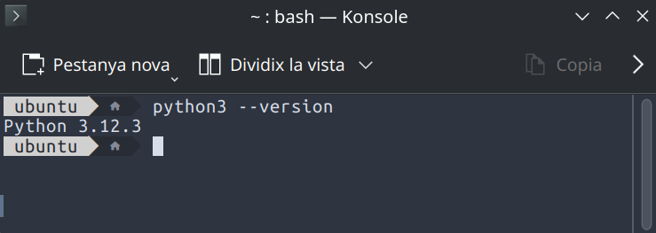
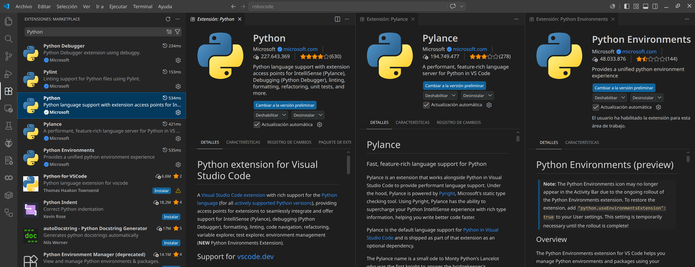
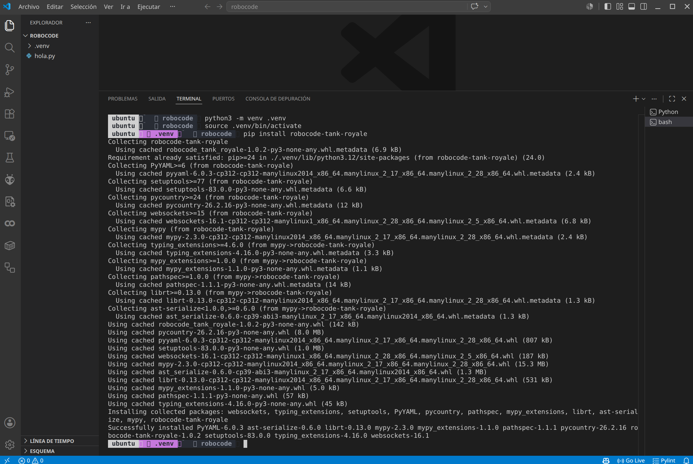
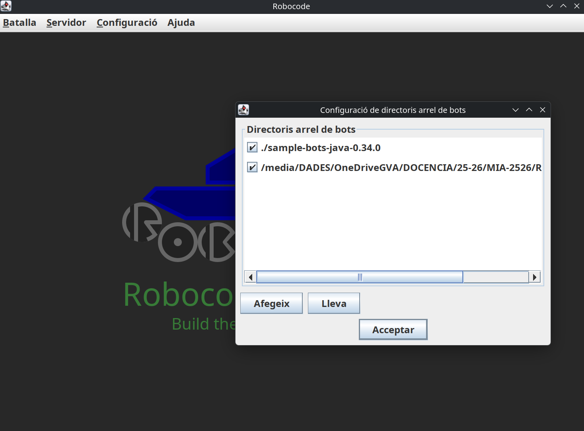
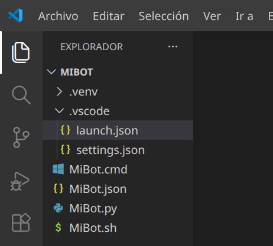
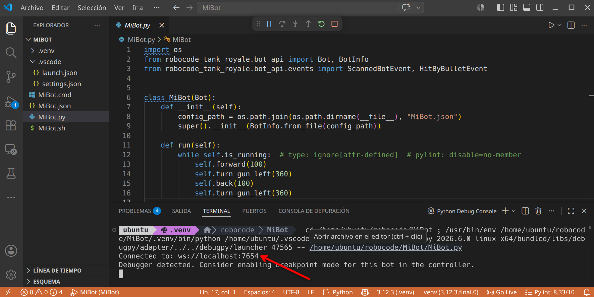
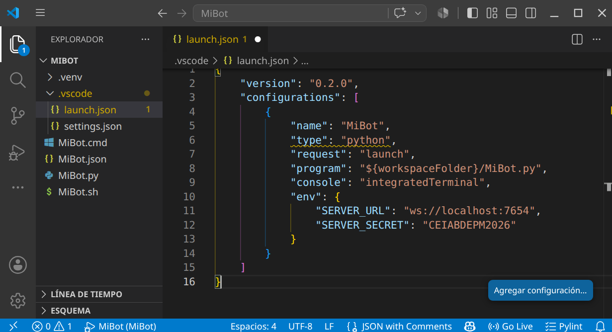

# Robocode TankRoyale en Python

## Antes de empezar

Leed primero la [Comparativa Java vs Python](UD01_P00_Comparativa_Java_VS_Python_ES.md) para entender las diferencias y elegir vuestro camino.

Esta guía es la versión **Python** de la actividad Robocode. Si buscáis la versión Java, id a [P01 Robocode (Java)](UD01_P01_RobocodeTankRoyale_ES.md).

## Preparación del entorno

### Requisitos previos

- **Python 3.10 o superior** instalado en el sistema
- **VS Code** (Visual Studio Code) u otro editor de código
- Conexión a Internet para instalar dependencias

### Comprobación de Python

Abrid un terminal y ejecutad:

```sh
python3 --version
```



!!! tip "Windows"
    Si usas Windows, el comando es `python --version` en lugar de `python3 --version`.

Si no tenéis Python instalado, descargadlo desde https://www.python.org/downloads/ o usad el gestor de paquetes de vuestro sistema:

=== "Linux (Debian/Ubuntu)"
    ```sh
    sudo apt install python3 python3-pip python3-venv
    ```
=== "Linux (Fedora)"
    ```sh
    sudo dnf install python3 python3-pip
    ```
=== "macOS"
    ```sh
    brew install python3
    ```
=== "Windows"
    Descargad el instalador desde https://www.python.org/downloads/ y marcad la opción "Add Python to PATH"

### VS Code y extensiones

Si aún no tenéis VS Code, descargadlo desde https://code.visualstudio.com/

Una vez instalado, añadid las siguientes extensiones:

1. **Python** (de Microsoft) — todo el soporte para Python: linting, debugging, IntelliSense
2. **Pylance** (de Microsoft) — completado de código y tipado avanzado
3. *Opcional*: **Python Environments** (de Microsoft)



### Instalación de la API de Robocode

La API de Python para Robocode Tank Royale se distribuye como paquete pip:

```sh
pip install robocode-tank-royale
```

O si trabajáis con entornos virtuales:

```sh
python3 -m venv .venv
# Linux/macOS:
source .venv/bin/activate
# Windows PowerShell:
# .venv\Scripts\Activate.ps1
# Windows CMD:
# .venv\Scripts\activate.bat

pip install robocode-tank-royale
```



## La GUI de Robocode Tank Royale

### Descarga y ejecución de la GUI

La GUI (interfaz gráfica) de Robocode es **independiente del lenguaje**. El proceso es idéntico tanto si usáis Java como Python:

1. Id a https://github.com/robocode-dev/tank-royale/releases
2. Descargad la última versión del fichero `robocode-tankroyale-gui-x.y.z.jar`
3. Ejecutadlo:

```sh
java -jar robocode-tankroyale-gui-x.y.z.jar
```

!!! warning "Java necesario para la GUI"
    La GUI requiere Java 11 o superior para ejecutarse, independientemente de que vuestro bot esté escrito en Python. Si no tenéis Java, ved el [Taller T01: Preparar entorno para Java](UD01_T01_IDE_ES.md) o instalad OpenJDK:
    ```sh
    sudo apt install default-jdk   # Linux
    ```

### Configuración inicial de la GUI

Una vez abierta la GUI:

1. Descargad y descomprimid los **Bots de ejemplo** desde la misma página de releases
2. Id a `Config` → `Bot Root Directories` y añadid la carpeta donde habéis descomprimido los bots de ejemplo
3. *Opcional*: descargad y descomprimid `sounds.zip` de los [releases de sonidos](https://github.com/robocode-dev/sounds/releases) en el mismo directorio que el JAR

```
[directorio padre]
├── robocode-tankroyale-gui-x.y.z.jar
├── sounds/
│   ├── bots_collision.wav
│   ...
│   └── wall_collision.wav
└── bots/               <-- carpeta de bots de ejemplo
```



!!! tip "Consejo"
    Jugad un poco con el entorno GUI, explorad las opciones, tipos de batallas, cread alguna ronda, inicializad bots, añadidlos, ajustad la velocidad de juego, etc.

## Vuestro primer Bot en Python

### Estructura del proyecto

Cread una carpeta para vuestro bot (por ejemplo, `MiBot`) con la siguiente estructura:

```
MiBot/
├── MiBot.py
├── MiBot.json
├── MiBot.cmd          (Windows)
└── MiBot.sh           (Linux/macOS)
```

### Fichero de configuración JSON

El bot necesita un fichero `.json` con la información del bot. Cread `MiBot.json`:

```json
{
  "name": "MiBot",
  "version": "1.0",
  "authors": ["Vuestro Nombre"],
  "description": "Mi primer bot con Python",
  "homepage": "",
  "countryCodes": ["es"],
  "platform": "Python",
  "programmingLang": "Python 3.x"
}
```

### Código básico del Bot

Cread `MiBot.py` con el siguiente contenido:

```python
import os
from robocode_tank_royale.bot_api import Bot, BotInfo
from robocode_tank_royale.bot_api.events import ScannedBotEvent, HitByBulletEvent


class MiBot(Bot):
    def __init__(self):
        config_path = os.path.join(os.path.dirname(__file__), "MiBot.json")
        super().__init__(BotInfo.from_file(config_path))

    def run(self):
        while self.is_running:  # type: ignore[attr-defined]  # pylint: disable=no-member
            self.forward(100)
            self.turn_gun_left(360)
            self.back(100)
            self.turn_gun_left(360)

    def on_scanned_bot(self, scanned_bot_event: ScannedBotEvent):
        del scanned_bot_event
        self.fire(1)

    def on_hit_by_bullet(self, hit_by_bullet_event: HitByBulletEvent):
        bearing = self.calc_bearing(hit_by_bullet_event.bullet.direction)
        self.turn_right(90 - bearing)


def main():
    bot = MiBot()
    bot.start()


if __name__ == "__main__":
    main()
```

!!! tip "VS Code: Pylint/Pylance no encuentran el paquete"
    Si después de seleccionar el intérprete del venv (`Ctrl+Shift+P` → "Python: Select Interpreter" → `./.venv/bin/python`) los errores persisten, es porque Pylint usa su propio intérprete y Pylance necesita el fichero `.vscode/settings.json`.

    Cread la carpeta `.vscode/` dentro de la carpeta de vuestro bot (`/home/ubuntu/robocode/MiBot/`) y añadid el siguiente fichero:

    ```json title=".vscode/settings.json"
    {
        "python.defaultInterpreterPath": "${workspaceFolder}/.venv/bin/python",
        "python.linting.pylintEnabled": false,
        "python.linting.enabled": false,
        "python.analysis.autoImportCompletions": true
    }
    ```

    !!! note ""
        Si no tenéis Pylint instalado en el venv (solo lo tiene el sistema), VS Code puede ejecutar el Pylint del sistema que no ve los paquetes instalados en el venv. Opciones: (1) desactivar Pylint (`"python.linting.enabled": false`) y confiar solo en Pylance, o (2) instalar Pylint en el venv: `pip install pylint`.

    Los subrayados rojos desaparecerán al recargar la ventana (`Ctrl+Shift+P` → "Developer: Reload Window").

### Scripts de inicio

#### Windows (`MiBot.cmd`)

```cmd
@echo off
python MiBot.py %*
```

#### Linux/macOS (`MiBot.sh`)

```sh
#!/usr/bin/env sh
python3 "$(dirname "$0")/MiBot.py" "$@"
```

Hacedlo ejecutable:

```sh
chmod 755 MiBot.sh
```



### Prueba del bot

1. Iniciad la GUI de Robocode (`java -jar robocode-tankroyale-gui-x.y.z.jar`)
2. Abrid un terminal en el directorio de vuestro bot
3. Ejecutad:

```sh
python3 MiBot.py
```

Si todo va bien, veréis un mensaje similar a:

```
Connected to: ws://localhost:7654
```

Y vuestro bot aparecerá en la lista de bots disponibles en la GUI.



## Configuración del servidor y secrets

### Secrets del servidor

El servidor de Robocode puede requerir una contraseña (secret) para conectarse. Esta contraseña se genera automáticamente la primera vez que lanzáis la GUI.

Para habilitar los secrets:

1. Id a `Config` → `Server Options` → `Enable server secrets` en la GUI
2. O editad `server.properties` y añadid:

```properties
server-secrets-enabled=true
bots-secrets=CEIABDEPM2025
```

### Conectar el bot con secret

Estableced la variable de entorno `SERVER_SECRET` antes de ejecutar el bot:

=== "Linux/macOS"
    ```sh
    export SERVER_SECRET=CEIABDEPM2025
    python3 MiBot.py
    ```
=== "Windows CMD"
    ```cmd
    set SERVER_SECRET=CEIABDEPM2025
    python MiBot.py
    ```
=== "Windows PowerShell"
    ```powershell
    $Env:SERVER_SECRET = "CEIABDEPM2025"
    python MiBot.py
    ```

### Conectarse a un servidor remoto

Si el profesor indica una IP remota, podéis especificarla con `SERVER_URL`:

=== "Linux/macOS"
    ```sh
    export SERVER_URL=ws://192.168.1.100:7654
    export SERVER_SECRET=CEIABDEPM2025
    python3 MiBot.py
    ```
=== "Windows CMD"
    ```cmd
    set SERVER_URL=ws://192.168.1.100:7654
    set SERVER_SECRET=CEIABDEPM2025
    python MiBot.py
    ```

### Uso con VS Code (launch.json)

Para mayor comodidad, podéis configurar VS Code para ejecutar el bot con las variables de entorno definidas en el fichero `.vscode/launch.json`:

Cread la carpeta `.vscode/` dentro del proyecto y el fichero `launch.json`:

```json
{
    "version": "0.2.0",
    "configurations": [
        {
            "name": "MiBot",
            "type": "python",
            "request": "launch",
            "program": "${workspaceFolder}/MiBot.py",
            "console": "integratedTerminal",
            "env": {
                "SERVER_URL": "ws://localhost:7654",
                "SERVER_SECRET": "CEIABDEPM2025"
            }
        }
    ]
}
```



Ahora podéis ejecutar el bot directamente desde VS Code pulsando `F5` o yendo a `Run` → `Start Debugging`.

!!! Danger "El servidor debe estar en marcha"
    El servidor (la GUI) debe estar inicializado **antes** de lanzar el bot. Si no, obtendréis un error:
    ```
    Could not create web socket for URL: ws://localhost:7654
    ```

## API de Python: diferencias clave con Java

La API de Python utiliza **snake_case** en lugar de **camelCase**. Aquí tenéis una tabla de correspondencia:

| Java | Python |
|---|---|
| `setTurnLeft(degrees)` | `set_turn_left(degrees)` |
| `setForward(dist)` | `set_forward(dist)` |
| `setTurnRadarLeft(degrees)` | `set_turn_radar_left(degrees)` |
| `setAdjustRadarForBodyTurn(bool)` | `set_adjust_radar_for_body_turn(bool)` |
| `distanceTo(x, y)` | `distance_to(x, y)` |
| `bearingTo(x, y)` | `bearing_to(x, y)` |
| `gunBearingTo(x, y)` | `gun_bearing_to(x, y)` |
| `getX()` | `self.x` (propiedad) |
| `getY()` | `self.y` (propiedad) |
| `getSpeed()` | `self.speed` (propiedad) |
| `getEnergy()` | `self.energy` (propiedad) |
| `getTurnRemaining()` | `self.turn_remaining` (propiedad) |
| `getGunHeat()` | `self.gun_heat` (propiedad) |
| `isRunning()` | `self.is_running` (propiedad) |
| `onScannedBot(e)` | `on_scanned_bot(self, e)` |
| `e.getX()` | `e.x` (propiedad) |
| `e.getY()` | `e.y` (propiedad) |
| `e.getSpeed()` | `e.speed` (propiedad) |
| `e.getDirection()` | `e.direction` (propiedad) |
| `Double.POSITIVE_INFINITY` | `float("inf")` |
| `Math.min(a, b)` | `min(a, b)` |
| `Math.cos(angle)` | `math.cos(angle)` |
| `Math.toRadians(degrees)` | `math.radians(degrees)` |

## ¿Cómo mejoro mi Bot?

Dividiremos todo lo que debemos conocer en 4 apartados:

### Conociendo el campo de batalla

Sigue atentamente la documentación de RCTR sobre la [**anatomía** de los Bots](https://robocode-dev.github.io/tank-royale/articles/anatomy.html)

Puntos importantes:

* Si el radar no se mueve, no detecta
* Inicialmente el robot, el cañón y el radar se mueven conjuntamente (pero se puede cambiar)
* El Bot se simplifica a un cuadrado de 36x36 unidades.
* Para las colisiones (con Bots o paredes) se simula como un círculo de 18 unidades de radio.

A continuación revisa las **[coordenadas y ángulos](https://robocode-dev.github.io/tank-royale/articles/coordinates-and-angles.html)**

Puntos importantes:

- Este apartado es totalmente diferente al de Robocode Original.

Estudia también las [**físicas**](https://robocode-dev.github.io/tank-royale/articles/physics.html)

Puntos importantes:

- Se frena más rápido que se acelera.
- Cuanto más rápido vas, más lento giras.
- El cañón gira máximo 20º por turno.
- El radar gira máximo 45º por turno.
- La potencia de tiro influye en el daño provocado y los puntos conseguidos, pero también en el calentamiento del cañón.
- Inicialmente el cañón está caliente (3 unidades), al principio has de esperar a que se enfríe para disparar.
- El atropello da más puntos que los disparos (pero te resta energía)
- Si chocas con una pared, pierdes puntos.
- La energía que te sobra en una ronda no da puntos (modo kamikaze con el último robot?)

Por último ten en cuenta las [**puntuaciones**](https://robocode-dev.github.io/tank-royale/articles/scoring.html)

Puntos importantes:

- Consigues puntos si:
  - tu disparo golpea a otro Bot (sino, te resta)
  - eres el que mata al Bot
  - cada vez que otro Bot muere, pero tu sigues vivo
  - eres el último robot vivo
  - atropellas a otro Bot
  - si matas por atropello a otro Bot
- El último Bot que quede vivo no tiene porqué ser el ganador.

#### Eventos propios

Definimos una condición, y cuando esta se cumple se dispara un evento:

```python
from robocode_tank_royale.bot_api.events import Condition

class TurnCompleteCondition(Condition):
    def __init__(self, bot):
        super().__init__()
        self.bot = bot

    def test(self):
        return self.bot.turn_remaining == 0
```

Podríamos usar esta condición en un fragmento similar a este:

```python
self.wait_for(TurnCompleteCondition(self))
```

Podríamos usar funciones lambda de la siguiente manera:

```python
self.wait_for(Condition(lambda: self.turn_remaining == 0))
```

El resultado de los dos fragmentos sería el mismo.

### Personalizar mi Bot

Podemos establecer colores para el cuerpo, torreta de cañón, el radar, el arco de escaneo y de la bala:

```python
verde = Color.from_rgb(0, 255, 0)
self.set_body_color(Color.from_rgb(0, 0, 0))
self.set_turret_color(Color.from_rgb(255, 0, 0))
self.set_radar_color(Color.from_rgb(255, 0, 0))
self.set_scan_color(Color.from_rgb(255, 255, 0))
self.set_bullet_color(Color.from_rgb(255, 255, 255))
```

Puedes encontrar la lista completa de colores disponibles en la API de Robocode TankRoyale.

### Técnicas de escaneo (Radar)

Sentidos de nuestro Bot:

Sentido del **tacto**, tu Bot sabe cuando:

- golpea una pared (`on_hit_wall`),
- es alcanzado por un disparo (`on_hit_by_bullet`),
- es alcanzado por otro Bot (`on_hit_bot`).

Sentido de la **vista**, tu Bot sabe cuándo ha visto otro robot, pero sólo si lo escanea (`on_scanned_bot`)

**Otros** sentidos, tu robot también sabe cuándo ha muerto (`on_death`), cuándo ha muerto otro robot (`on_bot_death`).

Además también es consciente de sus balas y sabe cuando una bala ha sido disparada (`on_bullet_fired`) ha alcanzado a un oponente (`on_bullet_hit`), cuando una bala golpea una pared (`on_bullet_wall_hit`) o cuando una bala golpea a otra bala (`on_bullet_hit_bullet`).

Configurar correctamente tu Bot con:

```python
self.set_adjust_radar_for_body_turn(True)   # True si el radar debe ajustar/compensar el giro del cuerpo;
                                            # False si el radar gira con el cuerpo (por defecto).
self.set_adjust_gun_for_body_turn(True)     # True si el cañón debe ajustar/compensar el giro del cuerpo;
                                            # False si el cañón gira con el cuerpo (por defecto).
self.set_adjust_radar_for_gun_turn(True)    # True si el radar debe ajustar/compensar el giro del cañón;
                                            # False si el radar gira con el cañón (por defecto).
```

Que el radar siempre de vueltas:

```python
self.set_turn_radar_left(float("inf"))  # grados - cantidad de grados a girar a la izquierda. Si es negativo, gira a la derecha.
```

Revisa el API (`rescan()` y `set_rescan()`)

Fijar el radar en un enemigo (one on one radar):

- Escaneo con multiplicador

  ```python
  def on_scanned_bot(self, e: ScannedBotEvent):
      factor = 1.9
      self.set_turn_radar_left(factor * self.radar_bearing_to(e.x, e.y))
  ```

  Según el factor:

  - `1.0` - Bloqueo de radar delgado. Debe llamar a scan() para evitar perder el bloqueo. Que Dios te ayude si alguna vez te saltas un turno.
  - `1.9` - El arco del radar comienza amplio y se estrecha lentamente tanto como sea posible mientras se mantiene en el objetivo.
  - `2.0`: el arco del radar recorre un ángulo fijo. El ángulo exacto elegido depende de las posiciones del enemigo y del radar cuando se detecta al enemigo por primera vez. El ángulo se incrementará si es necesario para mantener el bloqueo.

- Arco de radar Ancho

  ```python
  def on_scanned_bot(self, e: ScannedBotEvent):
      wide = 36.0
      # Ángulo absoluto hacia el objetivo
      angle_to_enemy = self.radar_bearing_to(e.x, e.y)
      # Distancia que queremos escanear desde el centro del enemigo a cada lado
      extra_turn = min(
          math.degrees(math.atan(wide / self.distance_to(e.x, e.y))),
          self.max_radar_turn_rate
      )
      # Ajustamos el giro del radar para que vaya más allá en la dirección que ya gira
      if angle_to_enemy < 0:
          angle_to_enemy -= extra_turn
      else:
          angle_to_enemy += extra_turn
      # Giramos el radar
      self.set_turn_radar_left(angle_to_enemy)
  ```

- Radar Oscilante (variable global que sepa la dirección y nos ayude a cambiarla de vez en cuando)

- Escaneo más inteligente (seguir al cercano? según la situación?)

- Nos interesa mantener una lista de enemigos? `e.scanned_bot_id`? y por ejemplo fijar el radar en el más débil?

### Técnicas de desplazamiento (Movimiento)

#### Pensamiento lateral

Si has jugado baloncesto antes, sabes que si quieres defender a alguien que sostiene el balón, debes maximizar tu movimiento lateral enfrentándote siempre a él (de frente). Lo mismo ocurre con tu robot.

Para conseguir esta posición debemos hacer algo similar a esto:

```python
self.turn_left(self.bearing_to(e.x, e.y) + 90)
```

que siempre colocará tu robot perpendicular (90 grados) a tu enemigo.

#### ¿Hacia adelante o hacia atrás?

Cuando te enfrentas a un oponente, la idea de "adelante" y "atrás" (del primer Bot) se vuelven algo obsoletas. Probablemente estés pensando más en términos de "atacar a la izquierda" o "atacar a la derecha". Para realizar un seguimiento de la dirección del movimiento, simplemente declara una variable como hicimos para oscilar el radar.

```python
class MiBot(Bot):
    def __init__(self):
        super().__init__(BotInfo.from_file("MiBot.json"))
        self.move_direction = 1
```

luego, cuando quieras mover tu robot, simplemente puedes decir:

```python
self.set_forward(100 * self.move_direction)
```

Puedes cambiar de dirección cambiando el valor de move_direction de 1 a -1 así:

```python
self.move_direction *= -1
```

#### Cambiar de dirección

El enfoque más intuitivo para cambiar de dirección es simplemente cambiar la dirección del movimiento cada vez que golpeas una pared o golpeas a otro robot de esta manera:

```python
def on_hit_wall(self, e: HitWallEvent):
    self.move_direction *= -1

def on_hit_bot(self, e: HitBotEvent):
    self.move_direction *= -1
```

Sin embargo, descubrirás que si haces eso, terminarás presionando obstinadamente contra un robot que te embiste desde un costado (como un perro en celo). Esto se debe a que se llama a `on_hit_bot`tantas veces que `move_direction` sigue cambiando y nunca te alejas.

Un mejor enfoque es simplemente probar para ver si tu robot se ha detenido. Si es así, probablemente significa que has golpeado algo y querrás cambiar de dirección. Puedes hacerlo con el código:

```python
if self.speed == 0:
    self.move_direction *= -1
```

Ponlo en tu método que maneje el movimiento y podrás manejar todos los eventos de impacto con las paredes u otros Bots.

#### ¿Bailamos?

**Dando vueltas (Círculos)**

Puedes rodear a tu enemigo simplemente usando las técnicas anteriores:

```python
class MiBot(Bot):
    def __init__(self):
        super().__init__(BotInfo.from_file("MiBot.json"))
        self.move_direction = 1
        self.ultimo_enemigo_visto = 0

    def run(self):
        while self.is_running:  # type: ignore[attr-defined]  # pylint: disable=no-member
            self.do_move()
            self.go()

    def on_scanned_bot(self, e: ScannedBotEvent):
        self.ultimo_enemigo_visto = self.bearing_to(e.x, e.y)

    def do_move(self):
        if self.speed == 0:
            self.move_direction *= -1
        self.set_turn_left(self.ultimo_enemigo_visto + 90)
        self.set_forward(1000 * self.move_direction)
```

Objetivo: rodea a tu enemigo usando el código de movimiento anterior, como un tiburón rodeando a su presa en el agua.

**Evita Ametrallamiento**

Un problema que puedes notar con el anterior tipo de movimiento es que es presa fácil para los objetivos predictivos porque sus movimientos son tan... predecibles.

Para evadir las balas de manera más efectiva, debes moverte de lado a lado o "atacar". Una buena forma de hacerlo es cambiar de dirección después de un cierto número de "tics", así:

```python
def do_move(self):
    if self.speed == 0:
        self.move_direction *= -1
    self.set_turn_left(self.ultimo_enemigo_visto + 90)
    if self.turn_number % 20 == 0:
        self.move_direction *= -1
        self.set_forward(1000 * self.move_direction)
```

Mira como se balancea hacia adelante y hacia atrás usando el código de movimiento anterior. Observa lo bien que esquiva las balas. Pero ojo, porque puede afectar a tu precisión de disparo.

**Cada vez más cerca**

Notarás que tanto el primero como este último tipo de movimientos tienen otro problema: se atascan fácilmente en las esquinas y terminan golpeándose contra las paredes. Un problema adicional es que si tu enemigo está lejos, disparan mucho pero no aciertan mucho.

Para hacer que tu robot se acerque a tu enemigo, simplemente modifica el código para que se gire ligeramente hacia su enemigo, así:

```python
self.set_turn_left(self.ultimo_enemigo_visto + (90 - (15 * self.move_direction)))
```

15 es un factor en grados que puedes modificar y ajustar. ¡Prueba!

Modificando el primero conseguimos una variación que utiliza el código anterior para lanzarse en espiral hacia su enemigo.

Mientras que con el segundo que utiliza el código anterior para acercarse cada vez más. También es bastante bueno para evadir balas.

Fíjate que ninguno de los Bots anteriores queda atrapado en una esquina por mucho tiempo.

#### Evitando las paredes

Un problema con todos los Bots anteriores es que golpean mucho las paredes y golpearlas agota tu energía. Una mejor estrategia sería detenerse antes de chocar contra las paredes. ¿Pero cómo?

**Agregar un evento personalizado**

Lo primero que debemos hacer es decidir qué tan cerca permitiremos que nuestro robot llegue a las paredes:

```python
class WallAvoider(Bot):
    def __init__(self):
        super().__init__(BotInfo.from_file("WallAvoider.json"))
        self.wall_margin = 60
        self.too_close_to_wall = 0
        self.move_direction = 1
```

A continuación, agregamos un evento personalizado que se activará cuando se cumpla una determinada condición dentro del método `run()`:

```python
def run(self):
    # ... inicialización ...
    # No te acerques mucho a las paredes
    self.add_custom_event(Condition("TooCloseToWalls", lambda: (
        self.x <= self.wall_margin or
        self.x >= self.arena_width - self.wall_margin or
        self.y <= self.wall_margin or
        self.y >= self.arena_height - self.wall_margin
    )))
    # ... resto del bucle ...
```

Necesitamos hacer override del método `test()` para devolver un valor booleano cuando ocurra nuestro evento personalizado.

**Gestionar el evento personalizado**

Lo siguiente que debemos hacer es manejar el evento, que se puede hacer así:

```python
def on_custom_event(self, e: CustomEvent):
    if e.condition.name == "TooCloseToWalls":
        self.move_direction *= -1
        self.set_forward(100 * self.move_direction)
```

Sin embargo, el problema con ese enfoque es que este evento podría dispararse una y otra vez, provocando que cambiemos rápidamente de un lado a otro, sin alejarnos nunca. O si ya aparecemos cerca de la pared quedamos atrapados.

Para evitar este "sacudida de la muerte" deberíamos tener una variable que indique que estamos manejando el evento:

```python
def on_custom_event(self, e: CustomEvent):
    if e.condition.name == "TooCloseToWalls":
        if self.too_close_to_wall <= 0:
            self.too_close_to_wall += self.wall_margin
            self.set_max_speed(0)
```

**Manejo de los dos modos**

Hay dos últimos problemas que debemos resolver. En primer lugar, tenemos un método `do_move()` donde colocamos todo nuestro código de movimiento normal. Si estamos tratando de alejarnos de una pared, no queremos que se llame a nuestro código de movimiento normal, creando (una vez más) la "sacudida de la muerte". En segundo lugar, queremos volver eventualmente al movimiento "normal", por lo que eventualmente deberíamos tener el "tiempo de espera" de la variable `too_close_to_wall`.

Podemos resolver ambos problemas con la siguiente implementación de `do_move()`:

```python
def do_move(self):
    if self.too_close_to_wall > 0:
        self.too_close_to_wall -= 1
    if self.speed == 0:
        self.set_max_speed(8)
        self.move_direction *= -1
        self.set_forward(1000 * self.move_direction)
```

Con todo el código anterior evitamos chocar contra las paredes. Observa cómo se desliza suavemente hacia los lados pero nunca (bueno, rara vez) los golpea.

#### Bot multimodo

Además de los colores que elijas, la mayor parte de la personalidad de tu robot está en su código de movimiento. Por otra parte, situaciones diferentes requieren tácticas diferentes. Usando el ejemplo de evitar paredes, es posible que desees codificar tu bot para que cambie los "modos" según ciertos criterios. Podrías pensar en algo como esto:

```python
MODO_RONDAR = 0
MODO_ESQUIVAR = 1
MODO_ASESINO = 2

class MultiModeBot(Bot):
    def __init__(self):
        super().__init__(BotInfo.from_file("MultiModeBot.json"))
        self.modo_robot = MODO_RONDAR

    def on_bot_death(self, e: BotDeathEvent):
        if self.enemy_count > 10:
            self.modo_robot = MODO_RONDAR
        elif self.enemy_count > 1:
            self.modo_robot = MODO_ESQUIVAR
        elif self.enemy_count == 1:
            self.modo_robot = MODO_ASESINO

    def do_move(self):
        if self.modo_robot == MODO_RONDAR:
            # ronda
            pass
        elif self.modo_robot == MODO_ESQUIVAR:
            # esquiva
            pass
        elif self.modo_robot == MODO_ASESINO:
            # asesina
            pass
```

Los detalles se dejan (como siempre) como ejercicio para el alumnado.

### Técnicas de ataque (Disparo)

#### Técnicas básicas

- Separa el movimiento del cañón del movimiento del Bot (`set_adjust_gun_for_body_turn`)
- Técnica de apuntado básica: `set_turn_gun_left` o `set_turn_gun_right` junto con `gun_bearing_to`

#### Fórmula de cálculo de potencia de fuego

Otro aspecto importante al disparar es calcular la potencia de fuego de tu bala. La documentación del método `fire()` explica que puedes disparar una bala en el rango de `0.1` a `3.0`. Como probablemente ya habrás concluido, es una buena idea disparar balas de baja potencia cuando tu enemigo está lejos y balas de alta resistencia cuando está cerca.

```python
def smart_fire(self, distance):
    if distance > 200 or self.energy < 15:
        self.fire(1)
    elif distance > 50:
        self.fire(2)
    else:
        self.fire(3)
```

Podrías usar una serie de declaraciones if-elif-else para determinar la potencia de fuego, en función de si el enemigo está a 50 unidades, a 200, etc (como en el fragmento anterior). Pero tales construcciones son demasiado rígidas. Después de todo, el rango de posibles valores de potencia de fuego cae a lo largo de un continuo, no de bloques discretos. Un mejor enfoque es utilizar una fórmula. He aquí un ejemplo:

```python
self.set_fire(400 / self.distance_to(e.x, e.y))
```

Con esta fórmula, a medida que aumenta la distancia del enemigo, la potencia de fuego disminuye. Asimismo, a medida que el enemigo se acerca, la potencia de fuego aumenta. Los valores superiores a 3 se reducen a 3, por lo que nunca dispararemos una bala mayor que 3, pero probablemente deberíamos reducir el valor de todos modos (solo para estar seguros) de esta manera:

```python
self.set_fire(min(500 / self.distance_to(e.x, e.y), 3))
```

#### Evitar disparos prematuros

Una situación que encontraras es que tu Bot dispare antes de haber girado el arma hacia el objetivo. Para evitar disparos prematuros, usa la propiedad `gun_turn_remaining` para ver qué tan lejos está tu cañón del objetivo y no dispare hasta que esté cerca.

Además, no puedes disparar si el arma está "caliente" desde el último disparo y llamar a `fire()` o `set_fire()` solo desperdiciará un turno. Podemos probar si el arma está fría llamando a `gun_heat`.

#### Apuntando de manera predictiva

O... "Usar la trigonometría para impresionar a tus amigos y destruir a tus enemigos".

Si quisiéramos poder golpear a un robot que recorre las paredes siempre fallaríamos, necesitamos poder predecir dónde estará en el futuro, pero ¿cómo podemos hacerlo?

$$
Distancia = Velocidad \times Tiempo
$$

Usando la anterior fórmula podemos calcular cuánto tiempo tardará una bala en llegar allí.

- **Distancia**: se puede encontrar llamando a `distance_to(e.x, e.y)`

- **Velocidad**: según la documentación de RCTR, una bala viaja a una velocidad de:
  $$
  20 - potenciaDeFuego \times 3
  $$

- **Tiempo**: podemos calcular el tiempo resolviendo:
  $$
  Tiempo = {Distancia \over Velocidad}
  $$

El siguiente código lo hace:

```python
# calcular la potencia basado en la distancia
enemy_distance = self.distance_to(e.x, e.y)
fire_power = min(500 / enemy_distance, 3)
# calcular la velocidad de la bala
bullet_speed = 20 - fire_power * 3
# calculamos el tiempo que necesita la bala para impactar al enemigo
time = int(enemy_distance / bullet_speed)
```

#### Obteniendo futuras coordenadas X, Y

A continuación, debemos calcular la posición futura de nuestro enemigo:

```python
import math

# Calcular la velocidad actual de tu enemigo
enemy_velocity = e.speed
# Calcular la dirección actual del enemigo
enemy_direction = e.direction
# Descomponer el desplazamiento en las coordenadas X e Y
# Componente X del desplazamiento COSENO
delta_x = enemy_velocity * math.cos(math.radians(enemy_direction))
# Componente Y del desplazamiento SENO
delta_y = enemy_velocity * math.sin(math.radians(enemy_direction))

# Calcular las coordenadas futuras
future_x = e.x + (delta_x * time)
future_y = e.y + (delta_y * time)
```

#### Girando el arma al punto previsto

Ahora debemos apuntar nuestro cañón al lugar previsto de impacto:

```python
self.set_turn_gun_left(self.gun_bearing_to(future_x, future_y))
```

#### ¡Disparando!

Por último disparamos nuestro cañón:

```python
if self.gun_turn_remaining <= 0 and self.gun_heat == 0:
    self.fire(fire_power)
```

#### Mejor aún...!

Aquí te dejo algunas mejoras para que las valores:

- ¿Debemos esperar siempre a que el arma esté completamente en la dirección calculada?
- Cuando nuestro enemigo se acerca a una pared, nuestros disparos impactan en ella.
- ¿Puedo saber a quién disparo si mi previsión de impacto falla mucho?

## Investigación y desarrollo propio

A partir de aquí el trabajo será individual de cada alumno (puede solaparse con el paso 3). Deberéis investigar/prever a vuestros adversarios (los conocidos, y los de vuestros compañeros). Aplicar las técnicas que consideréis más útiles para intentar quedar lo más arriba posible en la tabla de clasificación.

Algunos recursos adicionales:

- [Documentación oficial de la API Python](https://robocode-dev.github.io/tank-royale/api/python/)
- [Tutorial oficial "My First Bot for Python"](https://robocode-dev.github.io/tank-royale/tutorial/python/my-first-bot-for-python.html)
- [The Book of Robocode](https://book.robocode.dev/) — estrategias avanzadas
- [RoboWiki](https://robowiki.net/) — conocimiento comunitario (código en Java, conceptos universales)
