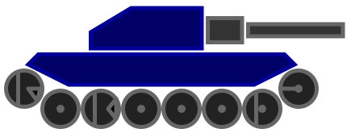

# Entregable de Robocode Tankroyale

## Introducción

Robocode es un juego de programación donde el objetivo es codificar un bot en forma de tanque virtual para competir contra otros bots en un campo de batalla virtual. El jugador es el programador del bot, que no tendrá influencia directa en el juego. En cambio, el jugador debe escribir un programa para el cerebro del robot. El programa dice cómo debe comportarse y reaccionar el robot ante los eventos que ocurren en el campo de batalla.

El nombre Robocode proviene de una versión anterior del juego y es una abreviatura de "Código de robot". Con esta nueva versión, se utiliza el mundo "bot" en lugar de "robot".

El juego está diseñado para ayudarte a aprender a programar y mejorar tus habilidades de programación y divertirte mientras lo haces. Robocode también es útil a la hora de estudiar o mejorar el aprendizaje automático (En nuestro caso solo Inteligencia Artificial) en un juego rápido en tiempo real.

Las batallas de Robocode tienen lugar en un campo de batalla, donde pequeños robots tanque automatizados luchan hasta que solo queda uno, como en un juego Battle Royale. De ahí el nombre Tank Royale.

Robocode no contiene sangre, visceras, personas ni política. Las batallas son simplemente por la emoción de la competición que tanto nos gusta.

Documentación del juego: https://robocode-dev.github.io/tank-royale/

Repositorio en GitHub: https://github.com/robocode-dev/tank-royale

Documentación de la API:

- **Java (JVM)**
  - [API overview](https://robocode-dev.github.io/tank-royale/api/java/)
  - [Bot API](https://robocode-dev.github.io/tank-royale/api/java/dev/robocode/tankroyale/botapi/package-summary.html)

- **.Net**
  - [API overview](https://robocode-dev.github.io/tank-royale/api/dotnet/index.html)
  - [Bot API](https://robocode-dev.github.io/tank-royale/api/dotnet/api/Robocode.TankRoyale.BotApi.html)

!!! danger "Importante"
    Ojo! RCTR se basa en una versión más antigua de RoboCode, con un API diferente, y por lo tanto los robots anteriores, y el funcionamiento del campo de batalla han cambiado sustancialmente.

    Por lo tanto, mucha de la documentación que encontrareis es sobre el sistema antiguo, en la que la parte de estrategias es válida, pero no el código que la acompaña. La tarea de traducción del antiguo sistema al nuevo se ha llevado a cabo en forma de un "bridge" entre las dos versiones, y está disponible en GitHub: https://github.com/robocode-dev/robocode-api-bridge

    En cuanto a la documentación y estrategias, la API antigua todavía se puede encontrar en: https://robocode.sourceforge.io/docs/robocode/

    Y una página que contaba con muchisima información sobre estrategias, robots, código, etc ya solo está disponible en archive.org, la última versión cacheada que he encontrado disponible está en: https://web.archive.org/web/20200323061702/http://robowiki.net/

## Objetivo de la práctica

Usando RoboCode Tank Royale (RCTR) intentaremos ponernos en el papel de los primeros programadores que dotaban de "inteligencia" a los primeros sistemas. Tal y como hemos visto en el apartado de teoría estos sistemas solo reaccionan ante estímulos que previamente haya previsto su programador, carecen de intuición (a no ser que sea simulada) y el resultado de su inteligencia es tan bueno como lo sea su programación.

El profesor establecerá unos robots (simples) que deberemos derrotar para superar la práctica, dotando de cierta "inteligencia" a nuestro robot. No sirve que sea por suerte o de manera aleatoria, debe estar razonada y documentada.

El siguiente paso, una vez aprobado, será una competición entre todo el alumnado para valorar quien ha sido el que mejor Bot ha diseñado, obteniendo así mayor nota que el resto.

## Pasos a seguir

1. **Preparación del entorno**

    En una sesión conjunta prepararemos nuestro entorno de trabajo, instalaremos todo lo necesario y haremos algún combate de pruebas.

2. **Mi primer Bot**

    Siguiendo la guía de la documentación, y con la ayuda del profesor todo el alumnado generará su primer Bot de muestra, aprenderemos a añadirlo a la batalla y a depurar su funcionamiento.

3. **¿Cómo mejoro mi Bot?**

    Con la ayuda del profesor estudiaremos diferentes estrategias y mejoras que podemos aplicar a nuestro robot para así dotarle de inteligencia.

4. **Investigación y desarrollo propio**

    A partir de aquí el trabajo será individual de cada alumno (puede solaparse con el paso 3). Deberéis investigar/prever a vuestros adversarios (los conocidos, y los de vuestros compañeros). Aplicar las técnicas que consideréis más útiles para intentar quedar lo más arriba posible en la tabla de clasificación.

## ¿Qué debo entregar?

A través de la plataforma de AULES todo el alumnado deberá entregar **un archivo ZIP** que contenga:

El código fuente de su Bot (el nombre del bot será el nombre de su autor más los 4 últimos dígitos de su DNI o NIE (sin letras)) y la memoria justificativa en formato PDF.

**El código fuente** del Bot incluye (ejemplo con mi nombre):

- Archivo .java con la clase del Bot (`David4849.java`)
- Archivo .json que incluirá la información completa del autor (`David4849.json`)
- Archivos para inicializar el Bot en Windows y Linux (`David4849.cmd` y `David4849.sh`)

**La memoria** en formato PDF debe contener al menos los siguientes apartados:

- Datos del alumno
- Descripción del funcionamiento: estructura, sistema basado en casos, analisis y evolución de la solución, etc.
- Descripción detallada de los métodos definidos y/o usados
- Conclusiones
- Webgrafia/Bibliografía

## Requisitos mínimos

- **Versión 0.33.1 de la API** (Añadido el 09/10/25, habían pasado demasiadas versiones, probamos esta y si hay algun problema, decidimos.)
- Modo melé
- 10 asaltos
- RamFire, Walls, SpinBot
- Ganar por puntuación acumulada
- Tamaño del campo: 2000 x 2000
- Velocidad de enfriamiento: 0.1
- Máximo tiempo de inactividad: 450
- No llamar a métodos prohibidos
- Demostrar IA (no por azar)
