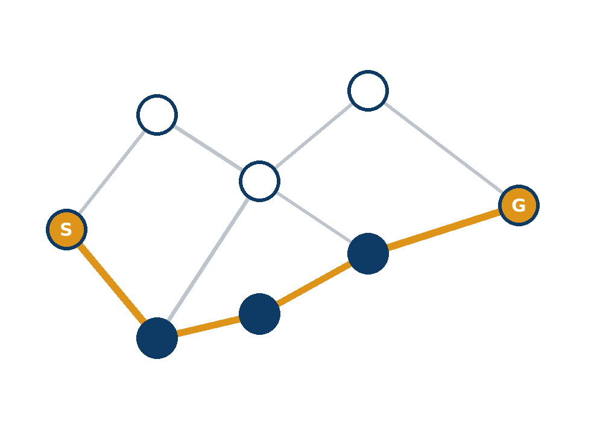
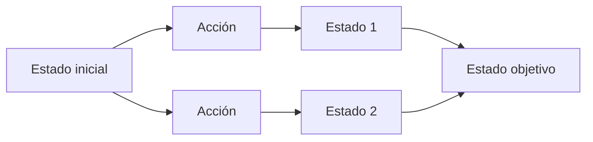
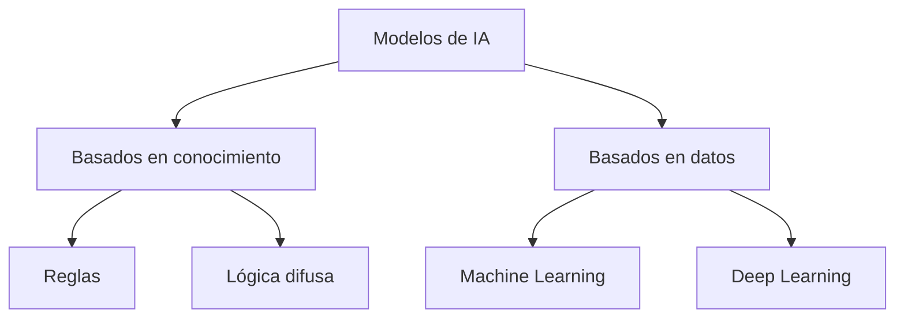
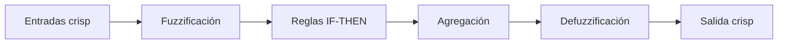
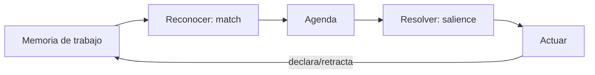

<!--
theme: gaia
size: 16:9
_class: lead
paginate: true
marp: false
backgroundColor: #000
backgroundImage: url('img/hero-backgroundIES.jpg')
-->
<style>
section::after {
  content: attr(data-marpit-pagination) '/' attr(data-marpit-pagination-total);}
img[alt~="center"] {
  display: block;
  margin: 0 auto;
}
table {
  margin-left: auto;
  margin-right: auto;
}
footer {
  font-size: 20px;
 }
header {
  font-size: 16px;
 }
</style>
<style scoped>
section {
  @extend .markdown-body;
  font-size: 28px;
  justify-content: top;
 }
</style>


# UD02: Modelos de IA y resolución de problemas
#### Modelos de Inteligencia Artificial
###### version: 2026-08-27

---
<!-- footer: d.martinezpena@edu.gva.es -->
<!-- header: Modelos de Inteligencia Artificial 26-27 (UD02_1)-->
<style scoped>section { font-size: 28px; }</style>

<!-- Cada bloque de este índice se corresponde con un criterio de RA2: bloque 1 con RA2-a, bloque 2 con RA2-b, bloque 3 con RA2-c, bloque 4 con RA2-d, bloque 5 con RA2-e y bloque 6 con RA2-f. -->

# ¿Qué veremos?
1. Sistema de resolución de problemas y búsqueda
2. Clasificación de modelos de IA
3. Automatización de tareas
4. Razonamiento impreciso: lógica difusa
5. Sistemas basados en reglas
6. Adecuación del modelo, y Robocode como caso completo

---

## RA2 y sus criterios de evaluación
<!-- (§2 de los apuntes) -->

**RA2**: implementa sistemas de resolución de problemas con modelos de IA.

| CE | Criterio |
|---|---|
| a | Requisitos de un SRP |
| b, c | Clasificación de modelos de IA y automatización de tareas |
| d, e | Razonamiento impreciso y sistemas basados en reglas |
| f | Adecuación del modelo |

---

## Hilo conductor de la unidad

<!-- La unidad son 12 horas repartidas entre las semanas 7 y 10 del curso, del 9 de noviembre al 3 de diciembre. (§3 de los apuntes) -->

**Antes de programar IA hay que saber formalizar un problema y elegir bien el modelo.**

Modelar → clasificar → automatizar → razonar (difuso y por reglas) → decidir → implementar.

El cierre de la unidad, Robocode, recorre las seis fases con un bot de combate real.

---
<!-- _class: lead -->
# 1. Sistema de resolución de problemas (RA2-a)

---

## Cinco requisitos de un SRP

<!-- Los cinco requisitos no son independientes entre sí: un sistema puede cumplir muy bien cuatro y fallar por el quinto, como un algoritmo de búsqueda óptimo que nadie sabe usar porque no tiene una interfaz comprensible. -->

1. **Representación**: elegir estructura y modelo fieles al problema.
2. **Razonamiento y decisión**: lógica, aprendizaje o búsqueda heurística.
3. **Aprendizaje y adaptabilidad**: mejorar con la experiencia.
4. **Eficiencia computacional**: respuestas rápidas y escalables.
5. **Interacción con las personas usuarias**: interfaz comprensible.

---

## El espacio de estados

<!-- AIMA es «Artificial Intelligence: A Modern Approach», el manual de referencia de Stuart Russell y Peter Norvig que fija estos cinco elementos formales de un sistema de resolución de problemas. (§4.2 de los apuntes) -->



Un problema bien planteado responde a: ¿estado inicial?, ¿acciones aplicables?, ¿modelo de transición?, ¿test de objetivo?, ¿coste de camino?

---

## Ejemplos clásicos de representación

<!-- En las 8 reinas, sin restricciones (cualquier casilla del tablero) hay 4.426.165.368 arreglos posibles; limitando a una reina por columna se reduce a 8!=40.320. En el 15-puzzle, las soluciones óptimas pueden necesitar hasta 80 movimientos. (§4.3 de los apuntes) -->

| Problema | Representación | Detalle |
|---|---|---|
| Jarras 8-5-3 | `[jarra8, jarra5, jarra3]` | De `[8,0,0]` a `[4,4,0]` |
| Misioneros y caníbales | `⟨m,c,barca⟩` | De `⟨3,3,1⟩` a `⟨0,0,0⟩` |
| 8-reinas | Permutación de 1..8 | 40.320 arreglos, **92 soluciones** |
| 15-puzzle | Matriz 4×4 | ≈10,46·10¹² estados |

---

## La explosión combinatoria

El número de estados crece **exponencialmente** con el tamaño del problema (factor de ramificación `b` elevado a profundidad `d`).

Un espacio real (rutas de reparto, planificación) es enorme: hace falta una estrategia de búsqueda y, cuando se puede, una heurística.

---

## BFS, DFS y A*

<!-- En memoria, BFS y A* son O(b elevado a d) en el peor caso porque guardan todos los estados de un nivel; DFS es mucho más ligera, O(b por d), porque solo mantiene el camino actual. (§4.4 de los apuntes) -->

| Criterio | BFS | DFS | A* |
|---|---|---|---|
| Estructura | Cola (FIFO) | Pila (LIFO) | Cola de prioridad `f=g+h` |
| Completa | Sí | No | Sí |
| Óptima | Sí (coste unitario) | No | Sí (heurística admisible) |
| Cuándo usar | Camino más corto en pasos | Exploración exhaustiva | Ruta óptima con costes variados |

---

## Heurística: A* en el 8-puzzle

<!-- La distancia de Manhattan suma, para cada ficha, los pasos horizontales y verticales que le faltan hasta llegar a su posición correcta en el objetivo. (§4.4 de los apuntes) -->

`f(n) = g(n) + h(n)`: coste acumulado más una estimación de lo que falta.

Heurísticas admisibles habituales: número de fichas mal colocadas, o distancia de Manhattan.

**Regla práctica** (Red Blob Games): usa el algoritmo más simple que puedas — BFS si todos los costes son iguales, A* con la heurística más simple si buscas un único objetivo.

---
<!-- _class: lead -->
# 2. Clasificación de modelos de IA (RA2-b)

---

## Por paradigma de aprendizaje

<!-- En scikit-learn, el supervisado se implementa con regresión logística, SVM o árboles; el no supervisado con k-means, DBSCAN o PCA; el de refuerzo queda fuera del stack estándar del curso. (§5.1 de los apuntes) -->

| | Supervisado | No supervisado | Refuerzo |
|---|---|---|---|
| Datos | Etiquetados | Sin etiquetas | Recompensas |
| Objetivo | Predecir la salida | Descubrir patrones | Maximizar recompensa |
| Ejemplos | Spam, precio de coche | Segmentar clientes | AlphaGo, robots |

**Todo ML es IA, pero no toda IA es ML**: reglas y lógica difusa son IA sin aprender de datos.

---

## Por tipo de análisis y por base

<!-- Gartner llama al análisis prescriptivo «la última frontera» de la analítica, porque no se limita a predecir sino que recomienda o ejecuta directamente la decisión óptima. (§5.2 y §5.3 de los apuntes) -->

| Análisis | Pregunta | Ejemplo |
|---|---|---|
| Descriptivo | ¿Qué pasó? | Informe de ventas |
| Predictivo | ¿Qué pasará? | Previsión de demanda |
| Prescriptivo | ¿Qué hacer? | Precio óptimo a fijar |

Basados en **conocimiento** (reglas explícitas, interpretable) frente a basados en **datos** (ML/DL, flexible pero caja negra).

---

## Mapa de los modelos de IA

<!-- El diagrama se simplifica para la diapositiva: dentro de «basados en conocimiento» también entran los sistemas expertos (MYCIN, XCON), y dentro de Machine Learning se distinguen supervisado, no supervisado y refuerzo. (§5.3 de los apuntes) -->



---
<!-- _class: lead -->
# 3. Automatización de tareas (RA2-c)

---

## RPA frente a IA

<!-- RPA son las siglas de robotic process automation, automatización robótica de procesos: replica tareas humanas repetitivas en la interfaz, sin razonar sobre datos. BPM son las siglas de business process management (gestión de procesos de negocio): la capa que orquesta los flujos y conecta la decisión de la IA con la ejecución del RPA. (§6.1 de los apuntes) -->

| | RPA | IA |
|---|---|---|
| Qué hace | **Hace**: replica tareas en la interfaz | **Piensa**: reconoce patrones y decide |
| Base | Reglas predefinidas | Datos y modelos |
| Se adapta | No | Sí, con la experiencia |

**RPA no es IA**: se complementan — la IA decide, el RPA ejecuta. IA + BPM + RPA = automatización inteligente.

---

## Agentes software y tareas cognitivas

<!-- OCR es el reconocimiento óptico de caracteres y NER el reconocimiento de entidades nombradas (named entity recognition); son las dos técnicas típicas de extracción. Google Speech-to-Text y Microsoft Azure Speech Service son ejemplos de sistemas de reconocimiento de voz que automatizan la transcripción. -->

De más simple a más avanzado: reflejo simple → reflejo con modelo → basado en objetivos → basado en utilidad → con aprendizaje.

Tareas cognitivas automatizables: **extracción** (OCR, NER), **clasificación** (spam, prioridades, reconocimiento de voz) y **generación** (IA generativa).

---
<!-- _class: lead -->
# 4. Razonamiento impreciso: lógica difusa (RA2-d)

---

## De lo booleano a lo difuso
<!-- (§7.1 de los apuntes) -->

La lógica clásica solo admite verdadero/falso. La **lógica difusa** (Zadeh, 1965) permite grados de verdad entre 0 y 1.

Modela la **vaguedad** del lenguaje humano — la probabilidad, en cambio, modela la incertidumbre.

Ejemplo: "18 ºC es frío con 0,7" en vez de "18 ºC es frío: sí/no".

---

## Funciones de pertenencia

<!-- En scikit-fuzzy cada función tiene su propia llamada: trimf para la triangular, trapmf para la trapezoidal, gaussmf para la gaussiana y sigmf para la sigmoidal. (§7.2 de los apuntes) -->

| Función | Forma | Uso típico |
|---|---|---|
| Triangular | Pico en un punto | Variables simples |
| Trapezoidal | Meseta central | Intervalos |
| Gaussiana | Campana suave | Variables continuas |
| Sigmoidal | Escalón suave | Extremos |

Se recomiendan entre 3 y 7 curvas por variable, solapadas para que no existan huecos.

---

## El sistema de inferencia difuso (FIS)

<!-- En Sugeno/TSK la salida de cada regla no es un conjunto difuso sino una función z=f(x,y); resulta menos intuitiva que Mamdani pero más eficiente para tareas de control. (§7.4 de los apuntes) -->



Dos familias: **Mamdani** (salida difusa defuzzificada, la usa `scikit-fuzzy`) y **Sugeno/TSK** (salida funcional).

---

## Lógica difusa en el mundo real

<!-- El Metro de Sendai es de 1987. El autofocus de Canon usa 12 entradas (claridad y velocidad del objetivo) para sus 13 reglas. Otro caso histórico son los hornos de cemento de Dinamarca (1976) y los aires acondicionados Mitsubishi, que calientan y enfrían 5 veces más rápido con un 24 % menos de consumo. (§7.5 de los apuntes) -->

Metro de Sendai (frenado y aceleración) · autofocus de Canon (13 reglas, 1,1 KB) · ABS de los frenos · lavadoras y aires acondicionados.

**Control de tráfico**: ajuste de semáforos según el flujo vehicular en tiempo real.

**Apoyo al diagnóstico médico**: valoración preliminar cuando los resultados de las pruebas no son concluyentes.

---

## Práctica: el problema de la propina
<!-- (§7.6 de los apuntes) -->

```python
calidad = ctrl.Antecedent(np.arange(0, 11, 1), 'calidad')
servicio = ctrl.Antecedent(np.arange(0, 11, 1), 'servicio')
propina = ctrl.Consequent(np.arange(0, 26, 1), 'propina')

regla1 = ctrl.Rule(calidad['mala'] | servicio['pobre'], propina['baja'])
sim.compute()
# Propina sugerida: ~20%
```

`scikit-fuzzy==0.5.0`: fija la versión, es una librería semi-mantenida.

---
<!-- _class: lead -->
# 5. Sistemas basados en reglas (RA2-e)

---

## El ciclo reconocer-actuar
<!-- RETE no es una sigla: es la palabra latina para «red», por la red de nodos con la que indexa las condiciones para no reevaluar todas las reglas en cada ciclo. (§8.1 de los apuntes) -->



Motores industriales usan el algoritmo **RETE** (Forgy, 1974) para no reevaluar todas las reglas.

---

## Encadenamiento, CLIPS y experta

<!-- CLIPS son las siglas de C Language Integrated Production System. Lo desarrolló la NASA entre 1985 y 1996, y es de dominio público desde 1996. -->

**Hacia delante** (data-driven): parte de los hechos, deduce hechos nuevos — lo usan CLIPS y `experta`.

**Hacia atrás** (goal-driven): parte de una meta y pregunta solo lo necesario — propio del diagnóstico (MYCIN).

`experta`: librería Python inspirada en CLIPS, fork de `pyknow`, motor RETE con sintaxis nativa.

---

## Reglas en el día a día

**Sistemas de recomendación**: Amazon sugiere productos con reglas sobre el historial de compras.

**Soporte al diagnóstico médico**: reglas sobre síntomas dan una recomendación preliminar antes de la atención profesional.

Ventaja frente al ML: el razonamiento es **transparente y explicable**.

---

## Práctica con experta

<!-- experta es de 2019 (versión 1.9.4) y fija frozendict==1.2, que a su vez usa collections.Mapping, eliminado en Python 3.10; por eso hace falta el parche antes del import. (§8.5 de los apuntes) -->

```python
# PARCHE para Python 3.10+
if not hasattr(collections, 'Mapping'):
    collections.Mapping = collections.abc.Mapping
from experta import *

class DiagnosticoVehiculo(KnowledgeEngine):
    @Rule(Fact(bateria="descargada"), Fact(luces="no_encienden"))
    def bateria(self):
        self.declare(Fact(causa="bateria_descargada"))
```

---

## Sistemas expertos que cambiaron su sector

<!-- DEC son las siglas de Digital Equipment Corporation, el fabricante de los ordenadores VAX, comprado por Compaq en 1998 y hoy parte de HP; CMU es Carnegie Mellon University, donde se desarrolló XCON. MYCIN usaba encadenamiento hacia atrás y factores de certeza sobre unas 500-600 reglas. La tabla no incluye Dendral (Stanford, años 70), considerado el primer sistema experto completo, dedicado a identificar moléculas orgánicas. (§8.6 de los apuntes) -->

| Sistema | Origen | Dato relevante |
|---|---|---|
| MYCIN | Stanford, 1972 | 65-70 % de acierto |
| XCON/R1 | DEC, 1978 | ~25 M$/año de ahorro |
| SID | DEC, años 80 | 93 % de puertas del VAX 9000 |

**Reglas** si el dominio está acotado y hace falta explicabilidad; **ML** si hay datos y patrones complejos.

---
<!-- _class: lead -->
# 6. Adecuación del modelo (RA2-f)

---

## Cinco criterios para elegir modelo

<!-- La regla de "empieza simple" coincide con varias fuentes: la guía de problem framing de Google, el mapa de selección de estimadores de scikit-learn y la recomendación de Azure ML de probar varios algoritmos en paralelo. Un estudio con 45 datasets tabulares (unas 10.000 muestras) mostró que los modelos basados en árboles siguen siendo estado del arte y más rápidos de entrenar que el deep learning. -->

**Datos** disponibles · **explicabilidad** exigida · **coste** de cómputo y mantenimiento · **precisión** requerida · **tiempo real** o latencia admisible.

**La regla de oro**: empieza simple. Reglas o heurística → árbol/regresión → ensamble → deep learning, solo si hace falta.

El teorema **No Free Lunch** (Wolpert y Macready, 1997): ningún algoritmo es mejor en promedio sobre todos los problemas.

---
<!-- _class: lead -->
# Caso de estudio: Robocode

---

## Robocode como sistema de resolución de problemas

**Representación**: el estado del bot y del campo de batalla en variables legibles cada turno. **Razonamiento**: reglas fijas, lógica difusa o una combinación para decidir disparo y movimiento.

**Eficiencia**: decisión en tiempo real, turno a turno. **Adecuación (CE f)**: sin datos previos, el punto de partida es la regla o heurística, no el ML.

---

## Puntos clave de la unidad

Un SRP se formaliza con estado inicial, acciones, transición, objetivo y coste; BFS/DFS/A* recorren el espacio de estados con garantías distintas. Los modelos se clasifican por aprendizaje, análisis y base (conocimiento/datos).

RPA hace, la IA piensa; la difusa modela vaguedad, las reglas ejecutan reconocer-actuar. Elegir modelo (CE f): datos, explicabilidad, coste, precisión, tiempo real — empieza simple.

---

## La unidad en la práctica

**5 talleres**: control difuso (`scikit-fuzzy`) · sistema de reglas (`experta`) · preparar el entorno · GitHub · Markdown.

**Actividad entregable**: Robocode Tank Royale, del 23 de noviembre al 3 de diciembre.

---

## Evaluación

<!-- La exigencia de un 5 en cada RA viene del art. 5.1 de la Orden 8/2025 (la calificación depende de la consecución de los RA) y de las Instrucciones 26-27, que impiden aprobar un módulo con algún RA no superado. (§17 de los apuntes) -->

| Peso | Instrumento |
|---|---|
| 40 % | Talleres + Robocode |
| 60 % | Prueba escrita del RA2 |

Hace falta un **5 o más** en el RA para superarlo.

---
<!-- _class: lead -->
# ¿Preguntas?

Diapositivas, apuntes y talleres en el sitio del módulo.
