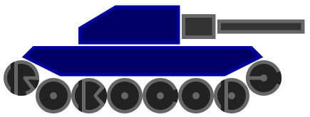

# UD02 — Actividad entregable: Robocode Tank Royale

!!! important "Cierre de la unidad"
    Robocode es la práctica de cierre del RA2, del **23 de noviembre al 3 de diciembre**. Cuenta
    dentro de las entregas de la unidad, y es **la más importante de las tres**: `T01` y `T02` son
    talleres cortos y sus técnicas se vuelven a evaluar en el RA5, mientras que aquí construyes un
    bot que compite y escribes su memoria. Los talleres `T03`, `T04` y `T05` son **puesta a punto**:
    hay que hacerlos, pero no puntúan. El peso exacto de cada entrega está en el libro de
    calificaciones de Moodle.

## Introducción

Robocode es un juego de programación donde el objetivo es codificar un bot en forma de tanque
virtual para competir contra otros bots en un campo de batalla. Quien juega es quien programa el
bot: no hay control directo durante la partida. El programa dice cómo debe comportarse y
reaccionar el bot ante los eventos del campo de batalla — es, en la práctica, el sistema de
resolución de problemas del §10 de la teoría hecho código.

El nombre viene de una versión anterior del juego ("Código de robot"); esta versión usa "bot" en
vez de "robot". Las batallas tienen lugar en un campo donde varios bots luchan hasta que solo
queda uno, como en un *Battle Royale* — de ahí Tank **Royale**.

{width=30%}

- Documentación del juego: <https://robocode-dev.github.io/tank-royale/>
- Repositorio en GitHub: <https://github.com/robocode-dev/tank-royale>
- API Java: [overview](https://robocode-dev.github.io/tank-royale/api/java/) ·
  [Bot API](https://robocode-dev.github.io/tank-royale/api/java/dev/robocode/tankroyale/botapi/package-summary.html)

!!! danger "Tank Royale no es el Robocode clásico"
    RCTR se basa en una versión más antigua de Robocode, pero con un API distinto: los bots
    antiguos y el funcionamiento del campo de batalla han cambiado sustancialmente. Mucha
    documentación que encontrarás en internet es del sistema antiguo — la estrategia sigue siendo
    válida, pero el código no. Hay un puente entre las dos versiones en
    [robocode-api-bridge](https://github.com/robocode-dev/robocode-api-bridge), la documentación y
    estrategias de la API antigua siguen en
    [robocode.sourceforge.io](https://robocode.sourceforge.io/docs/robocode/), y un archivo con
    mucha información histórica sobre estrategias y robots está cacheado en
    [Wayback Machine](https://web.archive.org/web/20200323061702/http://robowiki.net/).

## Antes de empezar

1. Elige lenguaje con la [comparativa Java vs Python](UD02_Robocode_Comparativa_ES.md).
2. Completa el [Taller 3](UD02_T03_Preparar_entorno_ES.md) para dejar listo tu entorno.
3. Sigue el tutorial completo: [Robocode en Java](UD02_Robocode_Java_ES.md) o
   [Robocode en Python](UD02_Robocode_Python_ES.md), según el lenguaje elegido.

## Objetivo de la práctica

Usando Robocode Tank Royale, te pones en el papel de los primeros programadores que dotaban de
«inteligencia» a los primeros sistemas: reaccionan solo ante estímulos que su programador previó,
no tienen intuición y el resultado es tan bueno como lo sea su programación — el mismo debate del
§9 de la teoría sobre cuándo usar reglas y cuándo aprendizaje.

El profesor establecerá unos bots simples que tu bot deberá derrotar para superar la práctica: no
sirve ganar por azar, tiene que estar razonado y documentado. Después habrá una competición entre
todo el alumnado.

## Pasos a seguir

1. **Preparación del entorno** — en una sesión conjunta, instalación y primer combate de pruebas.
2. **Mi primer bot** — con la guía de la documentación y el profesor, generar el primer bot,
   añadirlo a la batalla y depurar su funcionamiento.
3. **¿Cómo mejoro mi bot?** — estudiar estrategias y mejoras para dotarlo de comportamiento
   inteligente (radar, movimiento, disparo — ver los tutoriales).
4. **Investigación y desarrollo propio** — trabajo individual: prever a los adversarios (los
   conocidos y los de tus compañeros) y aplicar las técnicas que consideres más útiles para subir
   en la clasificación.

## Qué debes entregar

A través de Moodle, un archivo **ZIP** que contenga el código fuente de tu bot (nombre: tu nombre
más los 4 últimos dígitos de tu DNI/NIE, sin letras) y la memoria justificativa en PDF.

- `TuNombreNNNN.java` (Java) o `TuNombreNNNN.py` (Python) — clase del bot
- `TuNombreNNNN.json` — información del autor
- `TuNombreNNNN.cmd` y `TuNombreNNNN.sh` — arranque en Windows y Linux

**La memoria en PDF** debe incluir, al menos: datos del alumnado, descripción del funcionamiento
(estructura, sistema basado en reglas/casos, análisis y evolución de la solución...), descripción
detallada de los métodos definidos o usados, conclusiones y webgrafía/bibliografía.

## Requisitos mínimos de la competición

- **Versión 0.34.0 de la API** (multi-idioma y con escalado)
- Modo **classic**, 10 asaltos, tamaño de campo 2000×2000
- Adversarios de referencia: `RamFire`, `Walls`, `SpinBot`
- Gana quien acumule más puntuación; velocidad de enfriamiento 0.1; tiempo máximo de inactividad 450
- No se permite llamar a métodos prohibidos ni ganar por azar: **hay que demostrar IA**
- Los combates se graban y se devuelven como feedback

## Rúbrica

> Rúbrica real de la tarea en Moodle (`assign_8288613`, método `rubric`). Suma **10 puntos**: el
> peso del resultado en combate (criterios 3 y 4) es de **8 sobre 10** — se premia el
> comportamiento del bot, no solo la documentación.

### Criterio 1 · Entrega de ficheros (0-1 punto)

| Puntos | Nivel |
|---|---|
| 0 | No entregados |
| 0,2 | Faltan archivos o es imposible hacer funcionar el bot |
| 0,4 | Se entregan todos o casi todos los ficheros, pero el docente no consigue hacer funcionar el bot |
| 0,6 | Ficheros con el formato correcto; el bot funciona con grandes correcciones del docente |
| 0,8 | Ficheros con el formato correcto; el bot funciona con pequeñas correcciones del docente |
| 1 | Se entregan únicamente los ficheros solicitados, con el formato correcto, y el bot funciona sin que el docente deba modificarlos |

### Criterio 2 · Memoria (0-1 punto)

| Puntos | Nivel |
|---|---|
| 0 | No entregada |
| 0,25 | Insuficiente |
| 0,5 | Suficiente |
| 0,75 | Bien |
| 1 | Muy bien |

### Criterio 3 · Resultado de la melé final, todos contra todos (0-3 puntos)

| Puntos | Nivel |
|---|---|
| 0 | No entregado |
| 0,5 | Ni gana ni se acerca en ninguna de las rondas |
| 1 | No gana ninguna ronda, pero queda relativamente cerca de la cabeza en las 3 |
| 2 | Gana al menos una de las 3 rondas |
| 3 | Gana las 3 rondas |

### Criterio 4 · Resultado contra RamFire, Walls y SpinBot (0-5 puntos)

Configuración: 3 rondas × 10 asaltos.

| Puntos | Nivel |
|---|---|
| 0 | No entregado |
| 1 | Queda al final de la clasificación y muy alejado en puntos |
| 2 | Queda al final, pero relativamente cerca en puntuación |
| 3 | No gana ninguna ronda, pero queda cerca de la cabeza en alguna |
| 4 | Gana al menos una de las 3 rondas |
| 5 | Gana las 3 rondas |

!!! note "Soluciones"
    Las soluciones no se publican: se corrigen en clase y en la competición final.

---
[Volver a la UD02](UD02_ES.md) · [Comparativa Java/Python](UD02_Robocode_Comparativa_ES.md)
