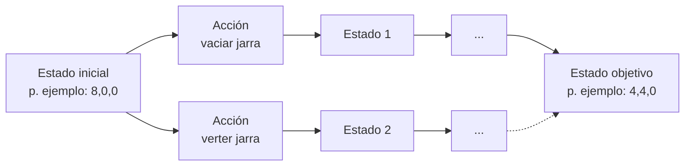
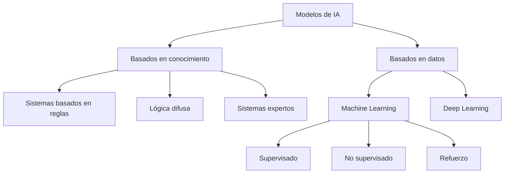
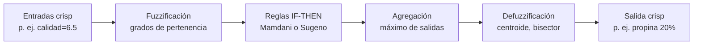
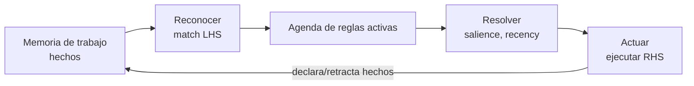

# UD02 — Modelos de IA y resolución de problemas

!!! info "Unidad 2 · 12 h · semanas 7-10 (9 de noviembre al 3 de diciembre)"

## 1. Introducción

En la UD01 aprendiste a **identificar** sistemas de IA y a relacionarlos con la eficiencia
operativa. En esta unidad damos un paso más: no solo reconocer la IA, sino **formalizar y
resolver problemas con modelos de IA**. Para ello recorremos un camino progresivo:

1. Primero, **qué debe cumplir un sistema** que resuelve problemas con IA, y **cómo se representa
   un problema** para que una máquina pueda resolverlo (espacio de estados y algoritmos de
   búsqueda).
2. Después, **cómo se clasifican los modelos de IA** (por aprendizaje, por análisis, por
   conocimiento frente a datos).
3. A continuación, **qué se puede automatizar** y con qué tecnología (RPA frente a IA, agentes).
4. Luego, las dos familias de razonamiento que tocarás en el laboratorio: **lógica difusa** y
   **sistemas basados en reglas**.
5. Por último, **cómo elegir el modelo adecuado** para cada problema (CE f).

El núcleo práctico usa dos librerías de Python que ya están en el stack del curso: `scikit-fuzzy`
(lógica difusa) y `experta` (sistemas basados en reglas). La unidad se cierra con **Robocode Tank
Royale**: programar un bot que compite en un campo de batalla es, literalmente, implementar un
sistema de resolución de problemas de principio a fin.

!!! quote "Hilo conductor de la unidad"
    *Antes de programar IA hay que saber formalizar un problema y elegir bien el modelo. Lo
    haremos paso a paso: modelar → clasificar → automatizar → razonar (difuso y por reglas) →
    decidir → implementar.*

<!-- VIDEO: vídeo breve que muestre cómo un problema cotidiano (p. ej. un puzzle o una ruta en un mapa) se traduce a estados y acciones para que un algoritmo lo resuelva -->

## 2. Resultado de aprendizaje y criterios de evaluación

**RA2** — Utiliza modelos de sistemas de Inteligencia Artificial implementando sistemas de
resolución de problemas.

| CE | Criterio de evaluación |
|---|---|
| RA2-a | Se han determinado los requisitos básicos a implementar en un sistema de resolución de problemas. |
| RA2-b | Se han clasificado modelos de Inteligencia Artificial. |
| RA2-c | Se han caracterizado los modelos de automatización de tareas. |
| RA2-d | Se han caracterizado los modelos de razonamiento impreciso. |
| RA2-e | Se han caracterizado los modelos de sistemas basados en reglas. |
| RA2-f | Se ha valorado la adecuación de los modelos a la implementación del sistema de resolución de problemas. |

!!! note "Bloque de contenidos oficial (RD 279/2021, anexo I)"
    El currículo para este RA dice textualmente:

    *Utilización de modelos de Inteligencia Artificial:*

    - *Requisitos básicos de un sistema de resolución de problemas.*

    *Modelos de sistemas de Inteligencia Artificial:*

    - *Automatización de tareas.*
    - *Sistemas de razonamiento impreciso.*
    - *Sistemas basados en reglas.*

## 3. Objetivos de la unidad

| Objetivo | Descripción |
|---|---|
| O1 | Enumerar los requisitos básicos de un sistema de resolución de problemas de IA. |
| O2 | Formalizar un problema como espacio de estados (estado inicial, acciones, transición, objetivo). |
| O3 | Aplicar búsqueda en anchura, en profundidad y A* y saber cuándo usar cada una. |
| O4 | Clasificar modelos de IA por paradigma de aprendizaje, por tipo de análisis y por base de conocimiento/datos. |
| O5 | Diferenciar RPA de IA y describir la automatización inteligente y los agentes software. |
| O6 | Explicar la lógica difusa: conjuntos difusos, funciones de pertenencia, reglas, Mamdani/Sugeno y defuzzificación. |
| O7 | Implementar un control difuso sencillo con `scikit-fuzzy`. |
| O8 | Describir el ciclo reconocer-actuar de un sistema basado en reglas y el papel de CLIPS y de `experta`. |
| O9 | Implementar un sistema basado en reglas con `experta` (con el parche de compatibilidad). |
| O10 | Elegir el modelo adecuado a un problema según datos, explicabilidad, coste y tiempo real. |
| O11 | Implementar un sistema de resolución de problemas completo (Robocode) dotando de comportamiento a un bot. |

## 4. Sistema de resolución de problemas (RA2-a)

### 4.1 Cinco requisitos de un sistema de resolución de problemas

Antes de formalizar un problema concreto, conviene fijar **qué debe cumplir** cualquier sistema de
IA que pretenda resolver problemas de forma efectiva y útil:

1. **Representación del problema**: elegir una estructura de datos y un modelo que reflejen
   fielmente el dominio. En PLN, por ejemplo, convertir texto a vectores numéricos; en un puzzle,
   una matriz de fichas (§4.2).
2. **Razonamiento y toma de decisiones**: aplicar técnicas lógicas, de aprendizaje o de búsqueda
   heurística para llegar a una solución a partir de la información disponible.
3. **Aprendizaje y adaptabilidad**: mejorar el rendimiento con la experiencia — aprendizaje
   automático o por refuerzo cuando el problema lo permite.
4. **Eficiencia computacional**: usar algoritmos y estructuras que den respuestas rápidas y
   escalables (por eso importa tanto BFS/DFS/A*, §4.3).
5. **Interacción con las personas usuarias**: una interfaz comprensible que facilite la
   comunicación entre el sistema y quien lo usa.

!!! tip "No son independientes"
    Un sistema puede cumplir muy bien 4 requisitos y fallar estrepitosamente por el quinto: un
    algoritmo de búsqueda óptimo (requisito 4) que nadie sabe usar porque no tiene interfaz
    (requisito 5) no resuelve el problema en la práctica.

### 4.2 El espacio de estados

Muchos problemas de IA se resuelven convirtiéndolos en una **búsqueda**: existe un conjunto de
configuraciones posibles (los **estados**) y unas **acciones** que pasan de un estado a otro.
Ese grafo de estados conectados por acciones es el **espacio de estados**.



Un **sistema de resolución de problemas** necesita, formalmente (base AIMA):

1. **Estado inicial**: la configuración de partida.
2. **Acciones aplicables**: qué movimientos se pueden hacer en cada estado.
3. **Modelo de transición**: función que, dado un estado y una acción, produce el siguiente estado.
4. **Test de objetivo**: cómo saber que hemos llegado a la solución.
5. **Coste de camino**: el coste de cada acción (para encontrar la solución más barata).

Además, se elige la **representación** (cómo codificar cada estado) y la **estrategia de
búsqueda** (completa, óptima, memoria).

!!! tip "Regla para recordar"
    Un problema de IA bien planteado es aquel del que sabes responder: *¿cuál es el estado
    inicial?, ¿qué acciones puedo aplicar?, ¿cuándo he terminado?* Si no sabes responderlas, el
    problema no está bien formalizado.

### 4.3 Ejemplos clásicos de representación

| Problema | Representación | Detalle |
|---|---|---|
| **Jarras 8-5-3** | Triple `[jarra8, jarra5, jarra3]` | De `[8,0,0]` a `[4,4,0]` en 7 pasos; las acciones son "verter hasta vaciar o llenar" |
| **Misioneros y caníbales** | Vector `⟨m,c,barca⟩` | De `⟨3,3,1⟩` a `⟨0,0,0⟩`; se descartan los estados donde los caníbales superan a los misioneros |
| **8-reinas** | Una columna por reina (permutación de 1..8) | Sin restricciones hay 4.426.165.368 arreglos; con restricciones 8!=40.320; solo **92 soluciones** |
| **15-puzzle** | Matriz 4×4 con las fichas | 16!/2 ≈ 10,46·10¹² estados (la mitad alcanzable); soluciones óptimas de hasta 80 movimientos |

!!! note "La explosión combinatoria"
    Estos problemas "de juguete" sirven para medir algo esencial: el número de estados crece
    **exponencialmente** con el tamaño (factor de ramificación `b` elevado a profundidad `d`).
    Un espacio de estados real (rutas de reparto, planificación de tareas) es enorme: por eso
    hace falta una **estrategia de búsqueda** y, cuando se puede, una **heurística**.

### 4.4 Algoritmos de búsqueda: BFS, DFS y A*

| Criterio | Búsqueda en anchura (BFS) | Búsqueda en profundidad (DFS) | A* |
|---|---|---|---|
| Estructura | Cola (FIFO) | Pila (LIFO) | Cola de prioridad por `f = g + h` |
| Completa | Sí | No (en espacios infinitos) | Sí |
| Óptima | Sí (coste unitario) | No | Sí (heurística admisible) |
| Memoria | O(b^d) | O(b·d) | O(b^d) |
| Cuándo usar | Camino más corto en número de pasos | Exploración exhaustiva, backtracking | Ruta óptima con costes variados y buena heurística |

- **BFS** explora por niveles: encuentra el camino más corto en pasos, pero consume mucha memoria
  (guarda todos los estados del nivel).
- **DFS** baja hasta el fondo: usa poca memoria, pero puede no encontrar la solución óptima (o no
  terminar en espacios infinitos). Es la base del *backtracking* (8-reinas).
- **A\*** combina el coste acumulado `g(n)` con una **heurística** `h(n)` (una estimación de lo que
  falta): `f(n) = g(n) + h(n)`. Con una heurística admisible (que no sobreestime), A* es completo y
  óptimo. Se usa mucho en videojuegos, mapas y planificación de rutas.

!!! example "Ejemplo de heurística"
    En un puzzle 8-puzzle (3×3), la heurística "número de fichas mal colocadas" o la "distancia de
    Manhattan" (suma de pasos horizontales+verticales de cada ficha hasta su posición correcta)
    estiman cuánto queda. Con esa `h`, A* guía la búsqueda hacia el objetivo en lugar de explorar
    a ciegas.

!!! tip "Regla práctica (Red Blob Games)"
    *"Usa el algoritmo más simple que puedas"*: si todos los costes son iguales y solo quieres el
    camino más corto en pasos, BFS basta. Si los costes varían, Dijkstra. Si apuntas a un único
    objetivo, prefiere A* con la heurística más simple posible (p. ej. Manhattan en rejillas).

## 5. Clasificación de modelos de IA (RA2-b)

### 5.1 Por paradigma de aprendizaje

| Criterio | Supervisado | No supervisado | Refuerzo |
|---|---|---|---|
| Datos | Etiquetados (ground truth) | Sin etiquetas | Estados, acciones, recompensas |
| Objetivo | Predecir la salida correcta | Descubrir patrones | Maximizar recompensa acumulada |
| Tareas | Clasificación, regresión | Clustering, asociación, reducción de dim. | Control, juegos, robótica |
| Ejemplos | Spam, precio de un coche | Segmentación de clientes (k-means) | Robot que aprende a andar, AlphaGo |
| Algoritmos (scikit-learn) | Regresión logística, SVM, árboles | k-means, DBSCAN, PCA | (fuera del stack estándar) |

!!! note "Recordatorio de la UD01"
    **Todo ML es IA, pero no toda IA es ML.** Los sistemas basados en reglas o en lógica difusa son
    IA, pero no aprenden de datos. En esta unidad estudiamos precisamente esos modelos "no-ML".

### 5.2 Por tipo de análisis

| Fase | Pregunta | Ejemplo |
|---|---|---|
| **Descriptivo** | ¿Qué pasó? | Informe de ventas |
| **Predictivo** | ¿Qué pasará? | Previsión de demanda |
| **Prescriptivo** | ¿Qué hacer? | Qué precio fijar y qué ocurre si lo cambio |

El **prescriptivo** es el que aporta más valor: no solo predice, **recomienda o ejecuta** la
decisión óptima (Gartner lo llama "la última frontera" de la analítica).

### 5.3 Basados en conocimiento frente a basados en datos

| Criterio | Basados en conocimiento | Basados en datos (ML/DL) |
|---|---|---|
| Conocimiento | Explícito (reglas IF-THEN) | Implícito (aprendido de los datos) |
| Ejemplos | Sistemas expertos, lógica difusa, termostato | Árboles, regresión, redes neuronales |
| Ventajas | Interpretable, fácil de mantener, explica el razonamiento | Flexible, escala a tareas complejas |
| Limitaciones | Frágil en tareas complejas; adquisición de conocimiento difícil | Requiere datos y cómputo; caja negra |
| Requisito | Experto + ingeniero del conocimiento | Datos etiquetados suficientes y representativos |



!!! tip "Dos formas de resolver el mismo problema"
    Un termostato con reglas `SI temperatura < 18 ENTONCES calefacción ON` es IA basada en
    conocimiento (reglas). Un sistema que aprende de datos históricos qué temperatura poner según
    la hora y la estación es ML. La elección depende del problema (lo veremos en el CE f).

## 6. Modelos de automatización de tareas (RA2-c)

### 6.1 RPA frente a IA

| Criterio | RPA | IA |
|---|---|---|
| Qué hace | **Hace**: replica tareas humanas repetitivas en la interfaz (GUI, formularios) | **Piensa/aprende**: reconoce patrones, decide, mejora con los datos |
| Base | Procesos (*process-driven*), reglas predefinidas | Datos (*data-driven*), modelos |
| Se adapta | No: los flujos hay que mantenerlos si cambia el sistema | Sí: aprende de la experiencia |
| Ejemplo | Un robot que copia datos de un email a un ERP | Un modelo que clasifica si el email es urgente o no |

!!! important "RPA no es IA"
    La distinción de IBM es clara: RPA **automatiza procesos** replicando acciones en pantalla;
    la IA **razona sobre datos**. Se complementan: la IA da decisión y el RPA ejecuta. Cuando se
    combinan IA + BPM (orquestación de flujos) + RPA (ejecución) hablamos de **automatización
    inteligente** (IA).

### 6.2 Agentes software

Un **agente de IA** es un programa que percibe su entorno y actúa para lograr un objetivo. Se
ordenan de más simple a más avanzado:

| Tipo de agente | Cómo decide | Ejemplo |
|---|---|---|
| **Reflejo simple** | Reglas `si... entonces...` directas | Termostato |
| **Reflejo con modelo** | Mantiene un estado interno del mundo | Robot aspiradora que "recuerda" la habitación |
| **Basado en objetivos** | Busca y planifica para alcanzar una meta | Navegador que elige una ruta |
| **Basado en utilidad** | Maximiza una utilidad (coste, tiempo, riesgo) | Ruta que minimiza peajes y tiempo |
| **Con aprendizaje** | Aprende de la experiencia | Motor de recomendación |

### 6.3 Tareas cognitivas automatizables

La IA automatiza **tareas cognitivas** que antes requerían juicio humano:

- **Extracción**: leer documentos (OCR), extraer entidades (NER), capturar datos de facturas.
- **Clasificación**: spam, incidencias, prioridades. Los **sistemas de reconocimiento de voz**
  (Google Speech-to-Text, Microsoft Azure Speech Service) son otro caso de automatización de
  tareas: convierten habla en texto y automatizan la transcripción o los comandos de voz.
- **Generación**: redactar respuestas, resúmenes o informes (IA generativa).

!!! example "Caso con cifra (ilustrativo)"
    En automatización de back-office, un sistema que extrae datos de emails y mensajería puede
    reducir el cierre contable mensual de varios días a uno, con menor tasa de error. Las cifras
    concretas dependen de cada despliegue; en la práctica se mide con KPIs (tiempo de ciclo,
    coste por documento, tasa de error) como vimos en la UD01. Otro ejemplo habitual es la
    **detección de fraude**: algoritmos de aprendizaje automático que analizan patrones en
    transacciones financieras para señalar operaciones sospechosas, reduciendo la carga de
    revisión manual.

## 7. Razonamiento impreciso: lógica difusa (RA2-d)

### 7.1 De lo booleano a lo difuso

La lógica clásica solo admite **verdadero/falso** (0/1). La **lógica difusa** (Zadeh, 1965)
permite grados de verdad **entre 0 y 1**: algo puede ser *parcialmente verdadero*. Modela la
**vaguedad** del lenguaje humano (la probabilidad, en cambio, modela la incertidumbre). Es la
familia de modelos que se usa cuando los datos son **incompletos o inciertos** y aun así hay que
decidir algo razonable.

| Variable | Valor clásico | Valor difuso |
|---|---|---|
| Temperatura | "18 ºC es frío" (sí/no) | "18 ºC es frío con 0,7" |
| Velocidad | Rápida o no | "Rápida con 0,6, media con 0,4" |

### 7.2 Conjuntos difusos y funciones de pertenencia

Un **conjunto difuso** asigna a cada valor un **grado de pertenencia** µ(x) ∈ [0,1] mediante una
**función de pertenencia**. Las más usadas:

| Función | Forma | Uso típico |
|---|---|---|
| **Triangular** (`trimf`) | Pico en un punto | Variables simples (p. ej. "media") |
| **Trapezoidal** (`trapmf`) | Meseta central | Intervalos ("normal") |
| **Gaussiana** (`gaussmf`) | Campana suave | Variables continuas suaves |
| **Sigmoidal** (`sigmf`) | Escalón suave | Extremos ("frío", "caliente") |

!!! tip "Diseño de variables"
    No importa tanto la forma exacta como el **número y la posición** de las funciones: se
    recomiendan entre **3 y 7 curvas** por variable, solapadas para que no existan "huecos".

### 7.3 Operaciones difusas

Zadeh definió las operaciones básicas sobre grados de pertenencia:

- **AND (intersección)**: mínimo de los grados (`µ_A ∧ µ_B = min(µ_A, µ_B)`).
- **OR (unión)**: máximo (`µ_A ∨ µ_B = max(µ_A, µ_B)`).
- **NOT (complemento)**: `1 − µ`.

En `scikit-fuzzy`, las reglas usan por defecto `fmin`/`fmax` para AND/OR (se pueden cambiar a
producto/suma difusa).

### 7.4 El sistema de inferencia difuso (FIS)



1. **Fuzzificar**: convertir cada entrada numérica en grados de pertenencia.
2. **Aplicar reglas** `SI calidad es mala O servicio es pobre ENTONCES propina es baja`.
3. **Agregar**: combinar la salida de todas las reglas.
4. **Defuzzificar**: obtener un número nítido. Métodos típicos: **centroide** (centro de gravedad),
   **bisector**, **MOM/SOM/LOM**.

Hay dos familias de sistemas: **Mamdani** (la salida es un conjunto difuso que luego se
defuzzifica; la implementa `scikit-fuzzy`) y **Sugeno/TSK** (la salida de cada regla es una
función `z = f(x,y)`, más eficiente para control).

### 7.5 Aplicaciones reales

- **Metro de Sendai (Japón, 1987)**: control difuso de aceleración y frenado.
- **Autofocus de Canon**: 12 entradas (claridad y velocidad del objetivo), **13 reglas**, solo
  **1,1 KB** de memoria.
- **ABS** (frenos): estima el agarre con lógica difusa sobre la temperatura del freno.
- **Electrodomésticos**: lavadoras Hitachi (peso/suciedad → programa), vacuolas Matsushita.
- **Control industrial**: hornos de cemento (Dinamarca, 1976), aires acondicionados Mitsubishi
  (calienta/enfría 5× más rápido con un 24 % menos de consumo).
- **Control de tráfico**: ajuste de los tiempos de los semáforos en función del flujo vehicular en
  tiempo real, para reducir la espera de los vehículos.
- **Apoyo al diagnóstico médico**: evaluación de síntomas cuando los resultados de las pruebas no
  son concluyentes, para dar una valoración preliminar que considere varios factores a la vez.

### 7.6 Práctica con `scikit-fuzzy`

`pip install -U scikit-fuzzy` (versión 0.5.0, 2024). Ejemplo clásico: el **problema de la
propina** — la propina depende de la calidad del servicio y de la comida.

```python
import numpy as np
import skfuzzy as fuzz
from skfuzzy import control as ctrl

# 1. Variables (universo de discurso)
calidad = ctrl.Antecedent(np.arange(0, 11, 1), 'calidad')
servicio = ctrl.Antecedent(np.arange(0, 11, 1), 'servicio')
propina = ctrl.Consequent(np.arange(0, 26, 1), 'propina')

# 2. Funciones de pertenencia
calidad.automf(3, names=['mala', 'aceptable', 'excelente'])
servicio.automf(3, names=['pobre', 'aceptable', 'bueno'])
propina['baja'] = fuzz.trimf(propina.universe, [0, 5, 10])
propina['media'] = fuzz.trimf(propina.universe, [10, 15, 20])
propina['alta'] = fuzz.trimf(propina.universe, [15, 20, 25])

# 3. Reglas
regla1 = ctrl.Rule(calidad['mala'] | servicio['pobre'], propina['baja'])
regla2 = ctrl.Rule(servicio['aceptable'], propina['media'])
regla3 = ctrl.Rule(servicio['bueno'] | calidad['excelente'], propina['alta'])

# 4. Sistema y simulación
sistema = ctrl.ControlSystem([regla1, regla2, regla3])
sim = ctrl.ControlSystemSimulation(sistema)
sim.input['calidad'] = 6.5
sim.input['servicio'] = 9.8
sim.compute()
print(f"Propina sugerida: {sim.output['propina']:.2f}%")
# Salida esperada: Propina sugerida: ~20% (el valor exacto depende del universo)
```

!!! warning "Compatibilidad de la librería"
    `scikit-fuzzy` es una librería **semi-mantenida** (última versión 2024). Para los ejercicios
    del curso funciona sin problemas, pero conviene fijar la versión (`scikit-fuzzy==0.5.0`) en
    el entorno reproducible del contenedor.

## 8. Sistemas basados en reglas (RA2-e)

### 8.1 El ciclo reconocer-actuar

Un **sistema de producción** (o sistema basado en reglas) tiene:

- **Memoria de trabajo**: los hechos conocidos en cada momento.
- **Base de conocimiento**: las reglas `SI <condiciones> ENTONCES <acciones>`.
- **Motor de inferencia**: ejecuta el ciclo **reconocer-actuar**.

El ciclo se repite hasta que no queden reglas aplicables:

1. **Reconocer (match)**: se comparan los hechos de la memoria de trabajo con las condiciones de
   las reglas; las reglas cuyas condiciones se cumplen van a la **agenda**.
2. **Resolver (resolve)**: si hay varias reglas activas, se elige una según prioridad
   (*salience*), frescura de los hechos o especificidad.
3. **Actuar (act)**: se ejecuta la parte `ENTONCES`, que modifica la memoria de trabajo
   (declarar/retractar hechos) y el ciclo se repite.



Los motores industriales usan el **algoritmo RETE** (Forgy, 1974) para no reevaluar todas las
reglas cada vez: construye una red de filtrado en memoria.

### 8.2 Encadenamiento hacia delante y hacia atrás

- **Hacia delante (forward chaining, data-driven)**: parte de los hechos y deduce hechos nuevos.
  Ideal para monitorización, planificación y entornos dinámicos. Es el que usan CLIPS y `experta`.
- **Hacia atrás (backward chaining, goal-driven)**: parte de una **meta** y busca qué hechos la
  sustentan (preguntando al usuario solo lo necesario). Ideal para diagnóstico (MYCIN, Prolog).

### 8.3 CLIPS y `experta`

**CLIPS** (*C Language Integrated Production System*) es el motor de reglas de referencia,
desarrollado por la NASA (1985-1996) y de dominio público desde 1996. `experta` es una librería
de Python **inspirada en CLIPS** (fork de `pyknow`) que implementa un motor RETE con sintaxis
nativa de Python.

### 8.4 Ejemplos cotidianos de sistemas basados en reglas

Antes de los grandes sistemas expertos históricos (§8.6), los sistemas basados en reglas están en
aplicaciones que usas a diario:

- **Sistemas de recomendación**: plataformas de comercio electrónico como Amazon sugieren
  productos relacionados aplicando reglas sobre el historial de compras y el comportamiento del
  usuario.
- **Soporte al diagnóstico médico**: en asistencia remota, reglas basadas en los síntomas
  declarados dan una recomendación preliminar antes de que la persona sea atendida por un
  profesional.

Se usan mucho porque el razonamiento es **transparente**: las reglas son explícitas y una persona
puede leer exactamente por qué el sistema tomó esa decisión — al contrario que una red neuronal.

### 8.5 Práctica con `experta`

!!! warning "Compatibilidad con Python 3.10+ (obligatorio)"
    `experta` (1.9.4, de 2019) fija `frozendict==1.2`, que usa `collections.Mapping`, eliminado en
    Python 3.10. Sin parche, `from experta import *` falla. Dos soluciones:
    - **En el código** (más didáctico): añadir el monkey-patch antes del import.
    - **En el entorno** (más limpio): `pip install "frozendict>=2.3"` + `pip install --no-deps
      experta` + `pip install schema==0.6.7`.

```python
# PARCHE para Python 3.10+ (issue #34 de experta)
import collections
import collections.abc
if not hasattr(collections, 'Mapping'):
    collections.Mapping = collections.abc.Mapping
    collections.Iterable = collections.abc.Iterable
    collections.MutableMapping = collections.abc.MutableMapping

from experta import *

class DiagnosticoVehiculo(KnowledgeEngine):
    @DefFacts()
    def inicio(self):
        yield Fact(accion="diagnosticar")

    @Rule(Fact(accion="diagnosticar"), salience=10)
    def arrancar(self):
        print("Iniciando diagnóstico del vehículo...")
        self.declare(Fact(bateria="descargada"))
        self.declare(Fact(luces="no_encienden"))

    @Rule(Fact(bateria="descargada"), Fact(luces="no_encienden"))
    def bateria(self):
        self.declare(Fact(causa="bateria_descargada"))

    @Rule(Fact(causa="bateria_descargada"))
    def resultado(self):
        print("CAUSA PROBABLE: Batería descargada")

engine = DiagnosticoVehiculo()
engine.reset()   # activa DefFacts e InitialFact
engine.run()     # ejecuta el ciclo reconocer-actuar
```

**Salida esperada:**

```text
Iniciando diagnóstico del vehículo...
CAUSA PROBABLE: Batería descargada
```

### 8.6 Sistemas expertos reales

| Sistema | Origen | Qué hacía | Dato relevante |
|---|---|---|---|
| **MYCIN** | Stanford (1972) | Diagnóstico de infecciones y antibióticos (backward chaining + factores de certeza) | ~500-600 reglas; acierto del 65-70 % frente a facultativos |
| **XCON/R1** | CMU/DEC (1978) | Configuración de ordenadores VAX | Ahorró a DEC del orden de 25 M$/año |
| **SID** | DEC (años 80) | Diseño de puertas de la CPU del VAX 9000 | Generó el **93 %** de las puertas lógicas |
| **Dendral** | Stanford (años 70) | Identificación de moléculas orgánicas | Primer sistema experto "completo" |

!!! tip "Cuándo usar reglas y cuándo ML"
    Usa **reglas** cuando el dominio esté acotado, la explicabilidad sea exigible (auditoría,
    normativa) o no haya datos. Usa **ML** cuando haya datos abundantes y patrones complejos. Una
    práctica habitual es el **híbrido**: reglas como guardarraíl/validación y ML para la decisión
    fina.

## 9. Adecuación del modelo (RA2-f)

### 9.1 Criterios para elegir modelo

| Criterio | Pregunta guía |
|---|---|
| **Datos disponibles** | ¿Hay datos? ¿Etiquetados? ¿Representativos? |
| **Explicabilidad** | ¿Necesito justificar la decisión (auditoría, normativa)? |
| **Coste** | ¿Cuánto cuesta el cómputo, el etiquetado y el mantenimiento? |
| **Precisión requerida** | ¿Cuánto mejora frente a una solución no-ML (baseline)? |
| **Tiempo real / latencia** | ¿La decisión debe ser instantánea (RPA/reglas) o admite espera? |

!!! tip "La regla de oro: empieza simple"
    - **Google (problem framing)**: "El ML es una herramienta especializada; no quieras una
      solución compleja cuando una más simple funciona". Primero optimiza la solución **no-ML** y
      úsala como *benchmark*.
    - **scikit-learn**: su mapa de selección te hace probar primero estimadores simples y avanzar
      ("Try next") solo si no alcanzas el objetivo.
    - **Azure ML**: "No tengas miedo a una competición en paralelo entre varios algoritmos".
    - **No Free Lunch** (Wolpert y Macready, 1997): ningún algoritmo es mejor en promedio sobre
      todos los problemas → la elección depende de las suposiciones sobre tu problema.

### 9.2 Secuencia práctica recomendada

1. **Reglas o heurística** (explicable, sin datos).
2. **Árbol de decisión / regresión logística** (datos tabulares pequeños).
3. **Ensamble** (Random Forest / XGBoost) si hace falta precisión.
4. **Deep learning** solo si hay datos masivos y el problema lo exige.

!!! note "Evidencia para «empezar simple»"
    Un estudio con 45 datasets tabulares de tamaño medio (~10.000 muestras) mostró que los modelos
    basados en árboles siguen siendo estado del arte, además de más rápidos de entrenar que el
    deep learning. No siempre hace falta una red neuronal.

## 10. Caso de estudio: Robocode como sistema de resolución de problemas completo

Los cinco requisitos del §4.1 y la elección de modelo del §9 dejan de ser teoría en cuanto se
programa un bot de **Robocode Tank Royale** (el [taller `T04`](UD02_T04_Robocode_ES.md) de la
unidad):

- **Representación**: el estado del bot (posición, energía, rumbo del radar) y del campo de
  batalla se traduce a variables que el programa puede leer en cada turno.
- **Razonamiento**: decidir hacia dónde disparar o moverse es exactamente el problema de elegir
  modelo del §9 — puedes usar reglas fijas («si el enemigo está a menos de 100 px, dispara»),
  lógica difusa sobre la distancia y el ángulo, o una combinación.
- **Eficiencia**: el bot decide en tiempo real, turno a turno; una lógica demasiado costosa
  computacionalmente pierde el combate por lentitud, no por mala estrategia.
- **Adecuación del modelo (CE f)**: no hay datos de entrenamiento previos sobre "cómo gana este
  bot en concreto", así que el punto de partida natural es la regla o heurística (§9.2, paso 1),
  no el aprendizaje automático.

## 11. Puntos clave de la unidad

- Un sistema de resolución de problemas de IA debe cumplir **5 requisitos**: representación,
  razonamiento, aprendizaje/adaptabilidad, eficiencia computacional e interacción con el usuario.
- Un problema se formaliza con **estado inicial, acciones, transición, objetivo y coste**; la
  búsqueda recorre el **espacio de estados**.
- **BFS** es completa y óptima en pasos pero usa mucha memoria; **DFS** usa poca memoria pero no es
  óptima; **A\*** es óptimo con heurística admisible.
- Los modelos de IA se clasifican por **aprendizaje** (supervisado/no supervisado/refuerzo), por
  **análisis** (descriptivo/predictivo/prescriptivo) y por **base** (conocimiento vs datos).
- **RPA "hace" y la IA "piensa"**: la automatización inteligente combina IA + BPM + RPA.
- La **lógica difusa** modela la vaguedad con grados de pertenencia [0,1], funciones de
  pertenencia, reglas Mamdani/Sugeno y defuzzificación por centroide.
- Los **sistemas basados en reglas** ejecutan el ciclo **reconocer-actuar** con un motor RETE;
  `experta` es su port Python (requiere parche en Py3.10+).
- Para elegir modelo (**CE f**): valora **datos, explicabilidad, coste, precisión y tiempo real** y
  **empieza por el modelo más simple**.

## 12. Glosario

| Término | Definición |
|---|---|
| **Espacio de estados** | Grafo de configuraciones posibles conectadas por acciones |
| **Estado** | Configuración concreta de un problema en un momento dado |
| **Búsqueda en anchura (BFS)** | Algoritmo que explora el espacio por niveles (cola) |
| **Búsqueda en profundidad (DFS)** | Algoritmo que explora hasta el fondo (pila) |
| **A\*** | Búsqueda con heurística: f = g + h (coste acumulado + estimación) |
| **Heurística** | Estimación del coste restante hasta el objetivo |
| **Backtracking** | Exploración con retroceso (base de DFS) |
| **RPA** | Automatización robótica de procesos: replica tareas en la interfaz |
| **Automatización inteligente** | Combinación de IA (decisión) + BPM (orquestación) + RPA (ejecución) |
| **Agente de IA** | Programa que percibe y actúa para lograr un objetivo |
| **Lógica difusa** | Lógica con grados de verdad en [0,1] (Zadeh, 1965) |
| **Función de pertenencia** | Asigna a cada valor su grado de pertenencia µ(x) |
| **Variable lingüística** | Variable con términos difusos (frío, templado, caliente) |
| **FIS** | Sistema de inferencia difuso (fuzzificar → reglas → defuzzificar) |
| **Mamdani** | Inferencia difusa con salida difusa defuzzificada |
| **Sugeno/TSK** | Inferencia con salida funcional, más eficiente para control |
| **Defuzzificación** | Conversión del resultado difuso a número nítido (centroide...) |
| **Sistema de producción** | Sistema basado en reglas con memoria de trabajo y motor de inferencia |
| **Ciclo reconocer-actuar** | match → resolve → act hasta agotar la agenda |
| **RETE** | Algoritmo de emparejamiento eficiente de reglas |
| **Salience** | Prioridad numérica de una regla |
| **Forward chaining** | Encadenamiento hacia delante (data-driven) |
| **Backward chaining** | Encadenamiento hacia atrás (goal-driven), propio del diagnóstico |
| **CLIPS** | Motor de reglas de la NASA (1985-1996), referencia histórica |
| **No Free Lunch** | Teorema: ningún algoritmo es mejor en promedio sobre todos los problemas |

## 13. FAQ

??? question "¿Un problema «de juguete» como el de las jarras sirve para algo real?"
    Sí: es la misma técnica que usan los planificadores de rutas, los motores de búsqueda de rutas
    en logística o los sistemas de planificación de tareas. Si aprendes a representar estados y
    acciones, sabes formalizar problemas reales.

??? question "¿A* siempre encuentra la solución más corta?"
    Con una heurística **admisible** (que nunca sobreestime el coste restante), sí. Si la
    heurística sobreestima, A* pierde la garantía de optimalidad (pero suele ser más rápido).

??? question "¿La lógica difusa es lo mismo que la probabilidad?"
    No. La difusa modela la **vaguedad** (pertenencia imprecisa: "hace calor") y la probabilidad
    modela la **incertidumbre** ("hay un 60 % de que llueva"). Son matemáticas distintas.

??? question "¿`experta` no funciona en Python moderno?"
    La librería (2019) tiene un problema de dependencias con Python 3.10+. Con el parche
    `collections.Mapping = collections.abc.Mapping` (o instalando `frozendict>=2.3` y `--no-deps`)
    funciona bien en el entorno del curso.

??? question "¿Un sistema basado en reglas aprende de los datos?"
    No: las reglas las escribe un experto. No aprende solo, pero es **totalmente explicable** (puede
    justificar cada decisión), algo que el ML no siempre puede.

??? question "¿Cuándo conviene usar RPA en lugar de un modelo de ML?"
    Si la tarea es **repetitiva y con reglas claras** (copiar datos entre sistemas, rellenar
    formularios), RPA. Si exige **juicio, patrones o lenguaje**, IA/ML. Y a menudo se combinan.

??? question "¿Por qué el entregable de la unidad es un juego (Robocode) y no un dataset?"
    Porque un bot de combate obliga a decidir en tiempo real con información incompleta — es un
    sistema de resolución de problemas completo y compacto, más cercano a control que a
    clasificación, y permite comparar en la práctica una solución por reglas con una por lógica
    difusa (§10).

## 14. Planificación sesión a sesión

| Semana | Horas | Contenido | CE | Evidencia / actividad |
|---|---|---|---|---|
| 7 | 3 | Requisitos de un SRP; espacio de estados y representación; BFS/DFS/A* | RA2-a | Ejercicios bloque A |
| 8 | 3 | Clasificación de modelos; automatización de tareas | RA2-b, RA2-c | Ejercicios bloques B y C |
| 9 | 3 | Lógica difusa (teoría + Notebook 1 scikit-fuzzy) | RA2-d | Notebook 1 |
| 9-10 | 3 | Sistemas basados en reglas (teoría + Notebook 2 experta); CE f | RA2-e, RA2-f | Notebook 2 |
| 9-10 | — | Talleres 3-5: preparar el entorno, GitHub y Markdown para Robocode | — | Talleres 3-5 |
| 10 | 3 | Robocode Tank Royale: entrega y evaluación | RA2-a, RA2-f | `T04` Robocode |

## 15. Tabla final RA/CE

| CE | Dónde se trabaja | Con qué se evalúa |
|---|---|---|
| RA2-a | §4 | Ejercicios bloque A, Robocode |
| RA2-b | §5 | Ejercicios bloque B |
| RA2-c | §6 | Ejercicios bloque C |
| RA2-d | §7 | Ejercicios bloque D, Notebook 1 |
| RA2-e | §8 | Ejercicios bloque E, Notebook 2 |
| RA2-f | §9, §10 | Ejercicios bloque F, Robocode |

## 16. Recursos

- [Diapositivas](UD02_Diapositivas.md)
- **Práctica** — se hace, no se entrega ni puntúa:
    - [Ejercicios de autoevaluación](UD02_Ejercicios.md)
- **Entregas**:
    - con rúbrica: [`N01` · control difuso](notebooks/UD02_N01_control_difuso.ipynb) · [`N02` · sistema de reglas](notebooks/UD02_N02_sistema_reglas.ipynb) · [`T04` · Robocode Tank Royale](UD02_T04_Robocode_ES.md), la práctica de cierre del RA2
    - de **hecho / no hecho**, requisito sin nota: [T01 · preparar el entorno](UD02_T01_Preparar_entorno_ES.md) · [T02 · GitHub](UD02_T02_GitHub_ES.md) · [T03 · Markdown](UD02_T03_Markdown_ES.md)
- **Documentación de Robocode**: [comparativa Java/Python](UD02_Robocode_Comparativa_ES.md) · [tutorial Java](UD02_Robocode_Java_ES.md) · [tutorial Python](UD02_Robocode_Python_ES.md)
- Los notebooks se abren desde **Práctica** y **Entregas**, con descarga y apertura en Colab.

??? note "Referencias de la unidad"
    - [Red Blob Games · A*](https://www.redblobgames.com/pathfinding/a-star/introduction.html)
    - [Wikipedia · A*](https://en.wikipedia.org/wiki/A*_search_algorithm)
    - [scikit-fuzzy (pythonhosted)](https://pythonhosted.org/scikit-fuzzy/)
    - [experta (readthedocs)](https://experta.readthedocs.io/)
    - [CLIPS](https://www.clipsrules.net/)
    - [IBM · RPA](https://www.ibm.com/think/topics/rpa)
    - [IBM · Automatización inteligente](https://www.ibm.com/think/topics/intelligent-automation)
    - [scikit-learn · Elegir el estimador](https://scikit-learn.org/stable/machine_learning_map.html)
    - [arXiv · Tree-based vs DL en tabulares](https://arxiv.org/abs/2207.08815)
    - [Robocode Tank Royale · documentación oficial](https://robocode-dev.github.io/tank-royale/)

## 17. Evaluación

| Peso | Instrumento |
|---|---|
| **40 %** actividades | **`T04` Robocode** y los notebooks **`N01`** y **`N02`**, cada uno con su rúbrica. Robocode es el de más peso, con diferencia. Los talleres **`T01`**-**`T03`** se entregan como **hecho / no hecho** y no puntúan |
| **60 %** prueba escrita | Prueba del RA2 en Moodle: preguntas de test y de desarrollo sobre el contenido de la unidad |

- **La normativa exige alcanzar todos los RA** del módulo para superarlo (art. 5.1 de la Orden
  8/2025: la calificación del módulo está *«en función de la consecución de los RA»*; y las
  Instrucciones 26-27, que impiden calificar positivamente un módulo con RA no superados). El
  centro concreta ese mandato exigiendo **≥ 5 en cada RA**.

## 18. Recuperación

Actividades del programa de recuperación individual por RA (art. 14.4 Orden 8/2025): repetir la
resolución de un problema de búsqueda con un caso distinto y las pruebas de autoevaluación de la
unidad.

---
[Volver al índice](../index.md)
