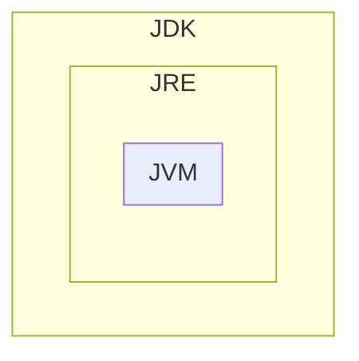
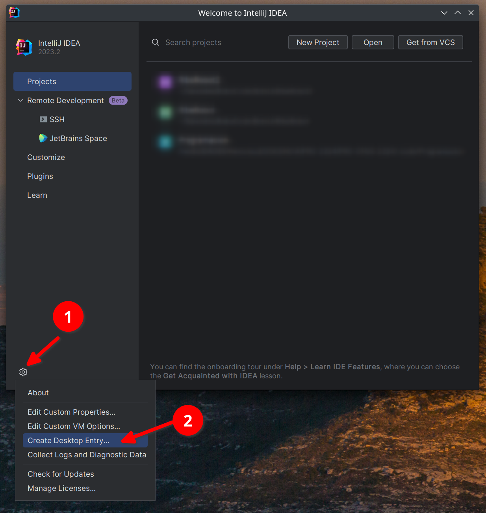
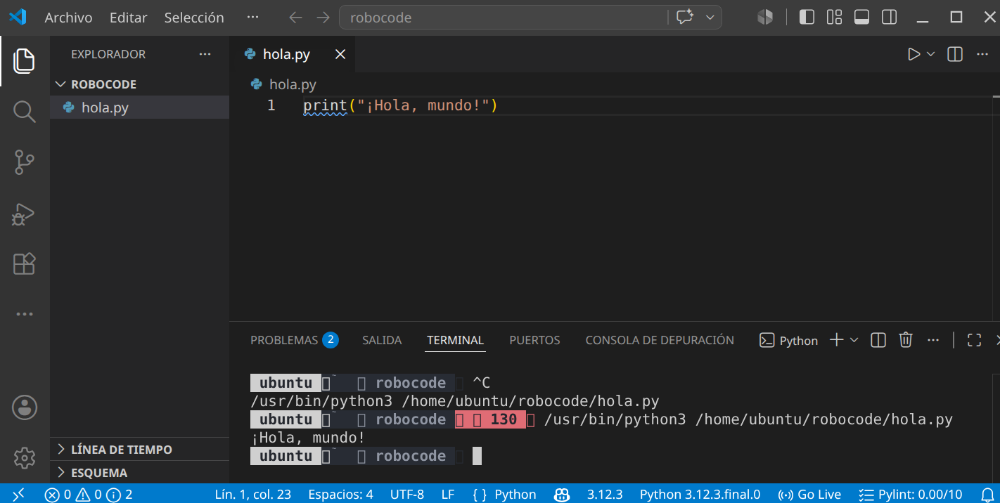
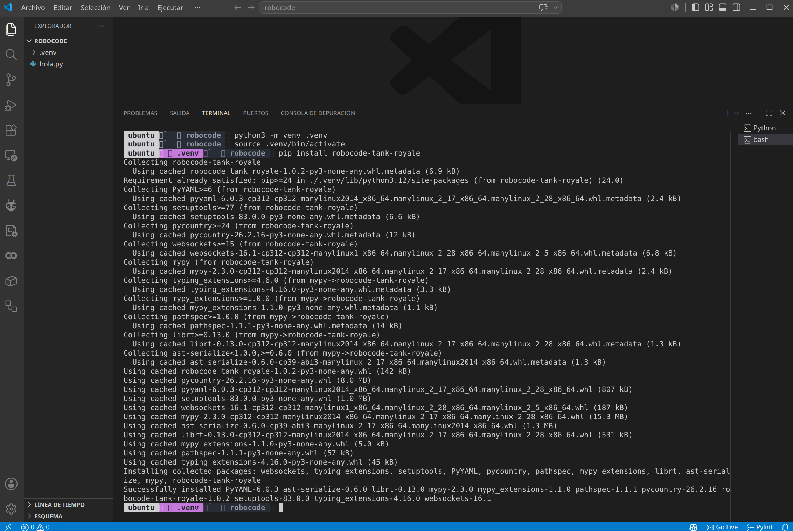

# UD02 · Taller 1 — Preparar el entorno para Robocode (Java o Python)

!!! important "Entrega · hecho / no hecho"
    Se entrega en Moodle y se califica como **hecho / no hecho**: no lleva nota ni ítem en el
    libro de calificaciones, pero **es requisito**. Sin el entorno del lenguaje elegido no se puede hacer
    [`T04` Robocode](UD02_T04_Robocode_ES.md).

**Objetivo**: dejar listo el entorno de desarrollo del lenguaje elegido — Java con IntelliJ IDEA o
Python con VS Code — y comprobarlo con un programa mínimo, antes de instalar la API de Robocode.
Consulta antes la [comparativa Java vs Python](UD02_Robocode_Comparativa_ES.md) si aún no has
elegido lenguaje. Sigue solo el bloque de tu lenguaje.

## Java

### Fase 1 — Instala el JDK

El **JDK** (Java Development Kit) incluye el compilador y las herramientas para desarrollar en
Java; contiene a su vez el **JRE** (entorno de ejecución) y este a la **JVM** (máquina virtual,
la que interpreta el *bytecode*).



Usa **Java SE** (Standard Edition), la versión de este curso. Recomendado:
[Adoptium](https://adoptium.net/) (antes AdoptOpenJDK, fundación Eclipse), sin las
restricciones de licencia que Oracle introdujo desde el JDK 11 para uso comercial.

!!! tip "En GNU/Linux"
    ```bash
    sudo apt install default-jdk       # instala el JDK predeterminado
    java --version                     # comprueba la versión activa
    sudo update-alternatives --config java   # si tienes varias versiones instaladas
    ```

Tras instalar, comprueba que `JAVA_HOME` apunta a la carpeta de instalación y que `PATH`
incluye su subcarpeta `bin` — la mayoría de instaladores lo hacen automáticamente; en
GNU/Linux con `.tar.gz` hay que definirlas a mano.

### Fase 2 — Instala y activa IntelliJ IDEA

Descarga la *toolbox* desde [jetbrains.com/idea](https://www.jetbrains.com/idea/) y sigue la
[guía de instalación](https://www.jetbrains.com/help/idea/installation-guide.html#toolbox) de
tu sistema operativo.

!!! note "Licencia del centro"
    El instituto tiene licencia de JetBrains para el alumnado con correo
    `@ieseduardoprimo.es`. Actívala en *Administrar licencias* apuntando al servidor
    `https://iesepm.fls.jetbrains.com/`
    ([instrucciones](https://www.jetbrains.com/help/license_server/Activating_license.html)).

{width=60%}

### Fase 3 — Primer programa y verificación

Crea un proyecto Java nuevo siguiendo la
[guía oficial de tu primera aplicación](https://www.jetbrains.com/help/idea/creating-and-running-your-first-java-application.html)
con una clase `HolaMundo.java` que imprima un mensaje, y ejecútala desde el propio IDE.

### Fase 4 — Instala la API de Robocode

Se instala más adelante, dentro del propio [tutorial de Robocode en Java](UD02_Robocode_Java_ES.md)
(usa Maven para gestionar la dependencia).

## Python

### Fase 1 — Instala Python

```bash
# Linux (Debian/Ubuntu)
sudo apt install python3 python3-pip python3-venv
# macOS
brew install python3
# Windows: descarga el instalador de python.org y marca "Add Python to PATH"
```

```bash
python3 --version   # en Windows: python --version
```

### Fase 2 — Instala VS Code y las extensiones

Descarga [VS Code](https://code.visualstudio.com/) e instala, desde el mercado de extensiones,
**Python** y **Pylance** (ambas de Microsoft): dan *linting*, depuración, IntelliSense y
tipado avanzado.

### Fase 3 — Entorno virtual y primer programa

```bash
python3 -m venv .venv
source .venv/bin/activate      # Windows: .venv\Scripts\activate
```

Crea `hola.py`:

```python
print("¡Hola, mundo!")
```

```bash
python3 hola.py
```



### Fase 4 — Instala la API de Robocode

```bash
pip install robocode-tank-royale
```



## Entrega del Taller 1

Un documento PDF con:

| Si elegiste | Evidencia mínima |
|---|---|
| Java | Captura de `java --version`; capturas de `HolaMundo.java` editado, compilado y ejecutado en IntelliJ |
| Python | Captura de `python3 --version`; captura de VS Code con `hola.py` abierto, la extensión Python visible y la terminal mostrando la salida |

!!! note "Soluciones"
    No aplica: este taller es de preparación del entorno, no tiene solución que corregir — se
    comprueba que el entorno funciona.

---
[Volver a la UD02](UD02_ES.md) · [Taller 2](UD02_T02_GitHub_ES.md) · [Comparativa Java/Python](UD02_Robocode_Comparativa_ES.md)
