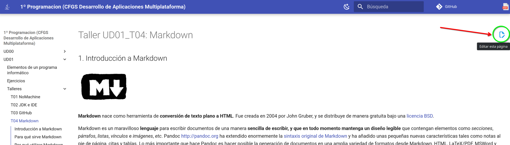
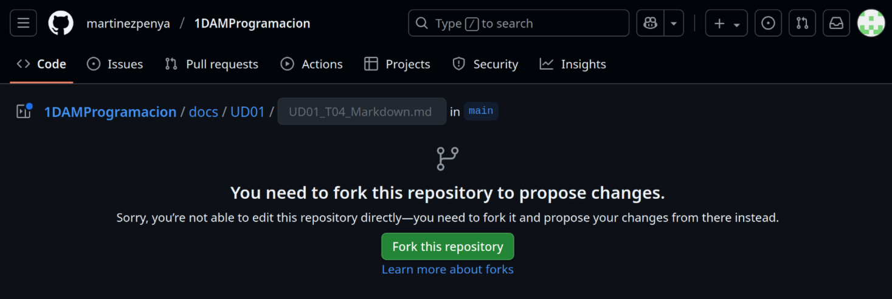
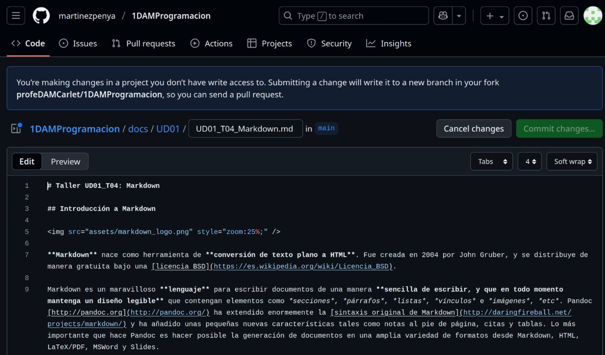
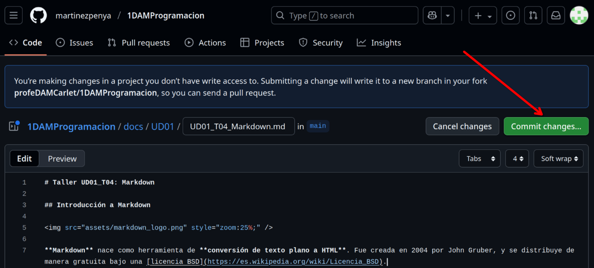
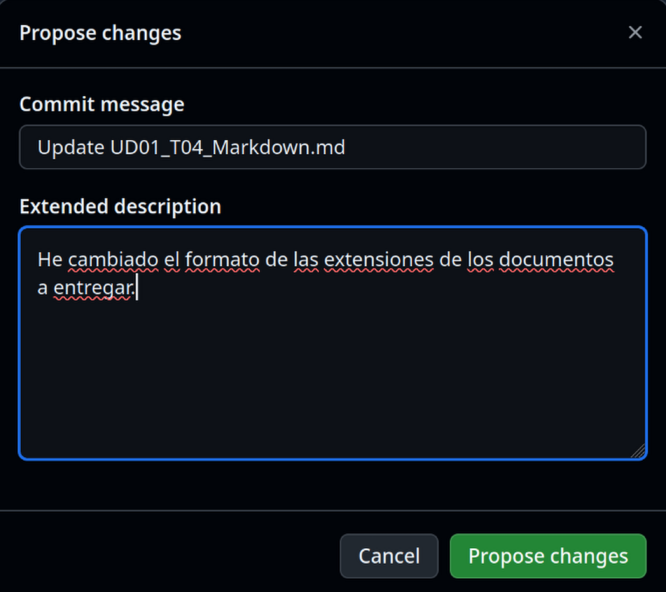
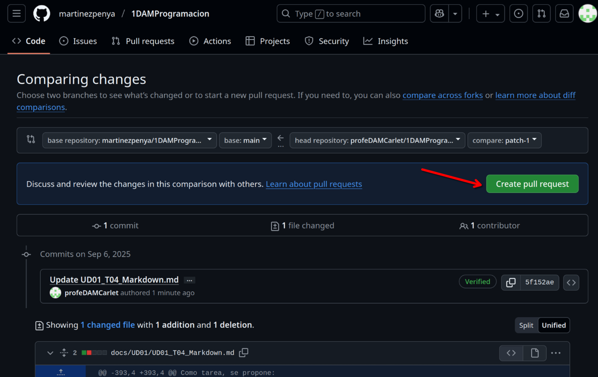
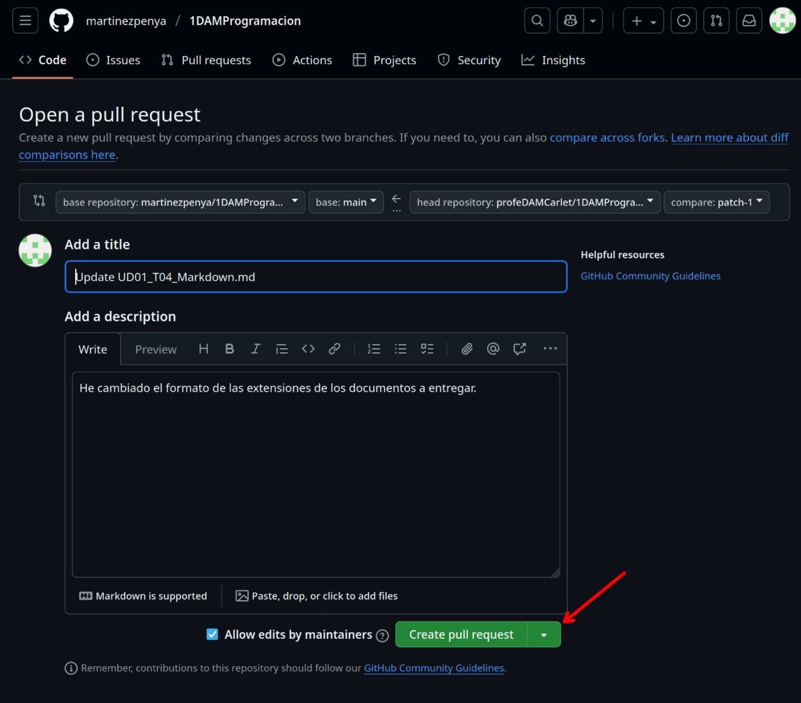
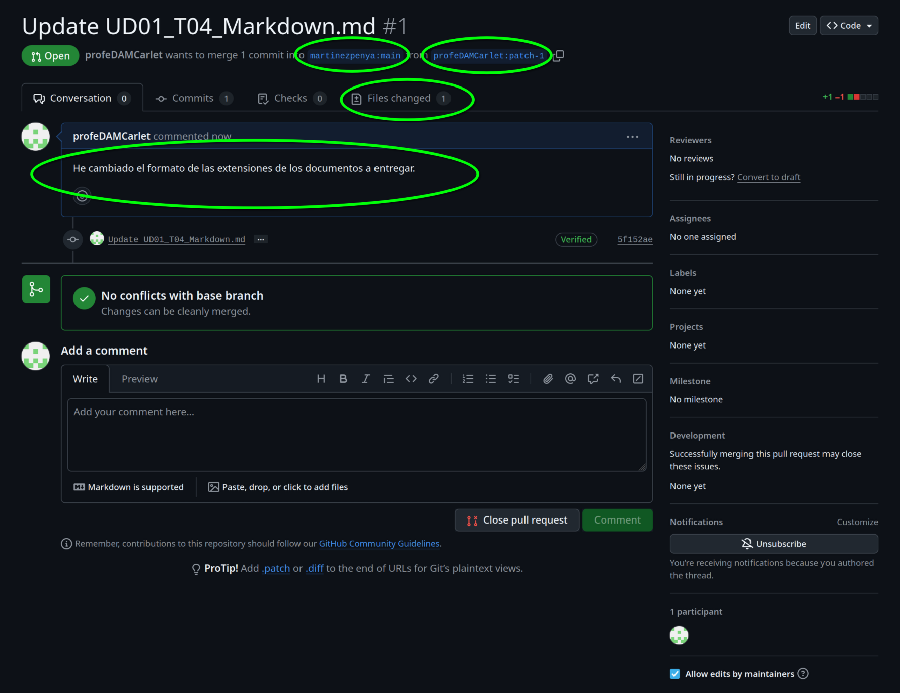
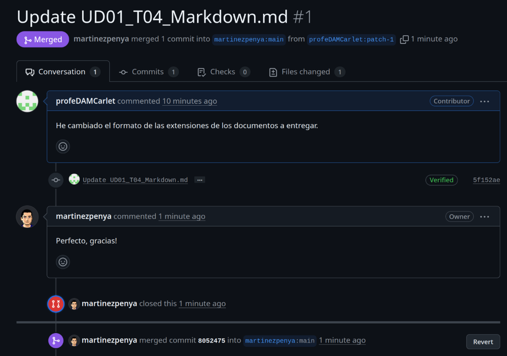

# UD02 · Taller 2 — Control de versiones con GitHub

!!! important "Entrega · hecho / no hecho"
    Se entrega en Moodle y se califica como **hecho / no hecho**: no lleva nota ni ítem en el
    libro de calificaciones, pero **es requisito**. En [`T04` Robocode](UD02_T04_Robocode_ES.md) entregarás el código
    de tu bot, y saber moverte en un repositorio es parte de las herramientas del oficio.

**Objetivo**: crear una cuenta en GitHub y completar un ciclo real de colaboración — *fork*, edición,
*commit* y *pull request* — proponiendo una mejora a un repositorio ajeno.

!!! note "Qué es GitHub"
    GitHub es una plataforma en la nube basada en Git que permite almacenar, gestionar y colaborar
    en proyectos de código. Es el portafolio técnico habitual de cualquier programador: muestra tus
    proyectos y tu evolución, permite colaborar en proyectos de código abierto y es la herramienta
    de control de versiones y trabajo en equipo más usada en el sector.

### Fase 1 — Crea tu cuenta

Accede a [github.com](https://github.com/), pulsa **Sign Up** y sigue las instrucciones. Entra
después en tu página de perfil (`github.com/tu-usuario`) y haz una captura.

### Fase 2 — Haz un fork del repositorio

Busca un repositorio con documentación que quieras mejorar (por ejemplo, unos apuntes en los que
hayas detectado un error) y pulsa el icono de edición:

Esto crea un **fork**: una copia del repositorio bajo tu cuenta, sobre la que puedes trabajar sin
tocar el original.

Pulsa **Fork this repository**. Verás el código fuente de la página, escrito en **Markdown** (lo
trabajarás a fondo en el Taller 1):

### Fase 3 — Edita y haz commit

Localiza el texto a modificar. En cuanto cambies algo se activa el botón **Commit changes...**:

Describe brevemente qué has cambiado y pulsa **Propose changes**:

### Fase 4 — Abre un pull request

Un *commit* en tu fork no cambia nada en el repositorio original: para proponer tu cambio al
propietario, pulsa **Create pull request**:

Puedes editar el mensaje o dejarlo tal cual; pulsa de nuevo **Create pull request**:

Deberías llegar a una página como esta. Haz una captura y explica los 4 campos señalados: qué
repositorio recibe el cambio, desde qué rama de tu fork, el estado de la comparación y el estado
del *pull request*.

### Fase 5 — Resultado

En este punto has completado el ciclo: fork → edición → commit → pull request. Ahora depende de la
persona propietaria del repositorio aceptar el cambio o no — **ambos resultados son válidos** para
esta actividad, lo que se evalúa es el proceso, no que te lo acepten. Si se acepta, verás algo así:

### Entrega del Taller 2

| Fase | Evidencia mínima |
|---|---|
| 1 | Captura de tu perfil de GitHub |
| 2-4 | Captura del *pull request* creado, con los 4 campos señalados y explicados |
| 5 | Estado final del *pull request* (aceptado o pendiente; ambos son válidos) |

!!! note "Soluciones"
    No aplica: este taller se evalúa por el proceso completado, no hay una única respuesta
    correcta que corregir en clase.

---
[Volver a la UD02](UD02_ES.md) · [Taller 1](UD02_T01_Preparar_entorno_ES.md) · [Taller 1](UD02_T03_Markdown_ES.md)
