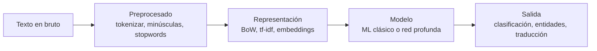
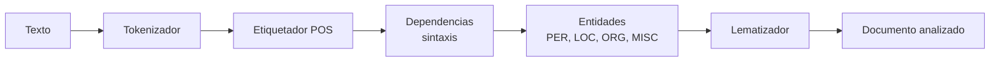
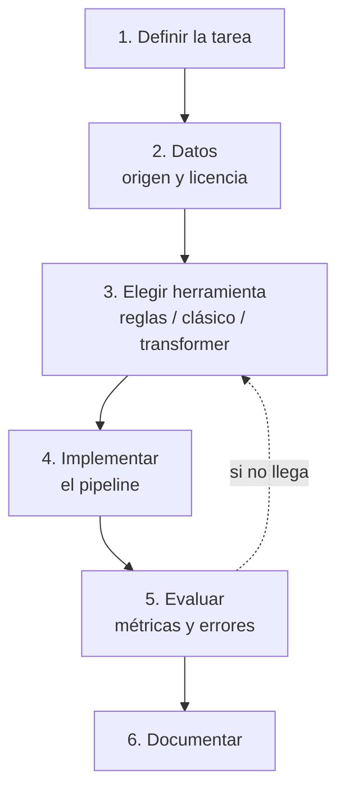

# UD03 — Procesamiento del Lenguaje Natural

!!! info "Unidad 3 · 12 h · semanas 16-19"
    Es el RA con **más criterios de evaluación** de todo el módulo: **siete**. Se evalúa con
    **cuatro entregables prácticos** y la prueba escrita del RA3.

## 1. Introducción

De todas las formas de inteligencia, el **lenguaje** es la que mejor nos permite comunicar ideas,
pedir ayuda, decidir y persuadir. Conseguir que las máquinas entiendan y generen lenguaje humano es
el objetivo del **procesamiento del lenguaje natural (PLN)**: el campo de la IA que está detrás de
los buscadores, los traductores, los asistentes de voz, los correctores y los chatbots.

Esta unidad tiene una particularidad que conviene saber desde el principio: de sus **siete
criterios**, tres no se demuestran escribiendo código. Hablan del **papel del lingüista**, del
**trabajo cooperativo** entre perfiles y de la **formación** que necesita quien investiga en PLN. No
son relleno: son la mitad del RA, y en esta unidad se evalúan con una parte escrita dentro de los
entregables.

El recorrido:

1. **Qué es el PLN** y qué tareas comprende, del análisis de una palabra a la generación de texto.
2. **Qué se consigue hoy** — el potencial, con cifras.
3. **La ambigüedad**: por qué es *el* problema del lenguaje, en sus seis formas.
4. **Desambiguación y etiquetado morfológico (POS)**: cómo se ataca ese problema.
5. **Las demás limitaciones**: falta de comprensión, sesgos, lenguas con pocos recursos, ironía.
6. **Cuándo es factible** aplicar PLN a un problema, con la lupa del AI Act.
7. **Quién participa**: el lingüista, la cooperación con informáticos y la formación necesaria.
8. **Las herramientas** en Python: `nltk`, spaCy, scikit-learn y *transformers*.
9. **Cómo construir un sistema** de PLN orientado a una tarea concreta.

!!! tip "Hilo conductor de la unidad"
    El lenguaje es la interfaz más natural entre personas y máquinas, y también la más ambigua.
    Primero vemos qué es el PLN y hasta dónde llega; luego por qué falla —la ambigüedad— y cómo se
    ataca; después quién hace falta en un proyecto y cuándo merece la pena; y por último construimos
    un sistema que resuelva una tarea concreta.

!!! note "De dónde sale el material de esta unidad"
    Los bloques de **ambigüedad, desambiguación y etiquetado morfológico**, con sus ejemplos en
    español, y el itinerario de formación provienen del material del profesor, adaptados aquí. Las
    prácticas usan `nltk`, spaCy, PyTorch y modelos de **Hugging Face**. La referencia teórica de
    fondo es *Speech and Language Processing* de **Jurafsky y Martin**, de acceso libre.

<!-- VIDEO: vídeo breve que muestre cómo una misma frase puede interpretarse de varias formas y cómo un sistema de PLN la procesa paso a paso -->

## 2. Resultado de aprendizaje y criterios de evaluación

**RA3** — Relaciona el procesamiento de lenguaje natural con sus aplicaciones determinando su
potencial e identificando sus limitaciones.

| CE | Criterio de evaluación | Bloque |
|---|---|---|
| RA3-a | Se ha caracterizado el procesamiento de lenguaje natural. | §4, §7 |
| RA3-b | Se ha justificado el papel del lingüista en un proyecto de inteligencia artificial. | §9 |
| RA3-c | Se ha determinado el potencial de las técnicas existentes de procesamiento de lenguaje, así como sus limitaciones. | §5-8 |
| RA3-d | Se ha considerado en qué casos es factible aplicar estas técnicas en la resolución de un problema. | §9 |
| RA3-e | Se ha evaluado el trabajo cooperativo entre lingüistas e informáticos en el campo del procesamiento del lenguaje natural. | §10 |
| RA3-f | Se ha descrito la formación teórica que precisa el investigador en procesamiento del lenguaje natural. | §10 |
| RA3-g | Se ha elaborado un sistema de procesamiento de lenguaje orientado a una tarea específica. | §11-12 |

!!! note "Bloque de contenidos oficial (RD 279/2021, anexo I)"
    El currículo llama a este bloque, textualmente, *«Procesamiento del Lenguaje Natural»*, y le
    asigna estos contenidos:

    - *Procesamiento del lenguaje natural: Potencial y limitaciones.*
    - *Aplicaciones del procesamiento del lenguaje natural.*

    Son **dos contenidos para siete criterios de evaluación**: el desajuste **más grande de todo el
    módulo**. Ni el papel del lingüista, ni el trabajo cooperativo, ni la formación del investigador
    —tres de los siete CE— tienen contenido propio en el anexo. Los desarrolla el centro
    (art. 3.3 del Decreto 95/2026), y es lo que hace esta unidad.

## 3. Objetivos de la unidad

| Objetivo | Al terminar la unidad serás capaz de… |
|---|---|
| O1 | **Explicar** qué es el PLN y situarlo entre la lingüística y la informática. |
| O2 | **Describir** las tareas del PLN y el *pipeline* típico de un sistema. |
| O3 | **Valorar** el potencial de las técnicas actuales con ejemplos y cifras. |
| O4 | **Distinguir** los seis tipos de ambigüedad y reconocerlos en frases reales. |
| O5 | **Explicar** cómo el etiquetado morfológico (POS) desambigua, y qué cuesta elegir el conjunto de etiquetas. |
| O6 | **Identificar** las demás limitaciones: falta de comprensión, sesgos, lenguas con pocos recursos, ironía. |
| O7 | **Determinar** cuándo es factible aplicar PLN, incluidas las restricciones del AI Act. |
| O8 | **Justificar** el papel del lingüista, **evaluar** la cooperación con informáticos y **describir** la formación necesaria. |
| O9 | **Usar** `nltk` y spaCy para tareas básicas de PLN en español. |
| O10 | **Construir y evaluar** un sistema de PLN orientado a una tarea específica. |

## 4. Qué es el PLN (RA3-a)

### 4.1 Definición

El **procesamiento del lenguaje natural** es el subcampo de la informática y de la IA que busca que
las máquinas **comprendan y se comuniquen con el lenguaje humano**. Combina tres disciplinas:

| Disciplina | Qué aporta |
|---|---|
| **Lingüística computacional** | Los modelos del lenguaje: morfología, sintaxis, semántica, pragmática |
| **Estadística y aprendizaje automático** | Aprender los patrones de los textos, en vez de programar todas las reglas a mano |
| **Aprendizaje profundo** | Redes que aprenden representaciones del lenguaje (*transformers*) |

!!! tip "No es magia, y la distinción importa"
    Un buscador o un traductor no «entienden» como una persona: **procesan estadísticamente** el
    texto. Esa diferencia no es filosófica, es operativa: explica por qué fallan donde fallan, y es
    el hilo de todo el §6.

### 4.2 Los niveles del lenguaje

El lenguaje se analiza por capas, y cada una tiene sus tareas:

| Nivel | Qué analiza | Tarea de PLN |
|---|---|---|
| **Fonética y fonología** | Los sonidos | Reconocimiento de voz (ASR), síntesis (TTS) |
| **Morfología** | La estructura de las palabras | *Stemming*, lematización, **etiquetado POS** |
| **Sintaxis** | La estructura de las oraciones | Análisis sintáctico, dependencias |
| **Semántica** | El significado de palabras y frases | Desambiguación (WSD), entidades (NER) |
| **Pragmática y discurso** | El significado según el contexto | Correferencia, actos de habla, sentimiento |

Esta tabla vale también como mapa de la ambigüedad: **hay ambigüedad en todos los niveles**, y el
§6 recorre uno a uno.

### 4.3 Las tareas del PLN

| Tarea | Qué hace | Ejemplo |
|---|---|---|
| **Tokenización** | Divide el texto en unidades | «Hola mundo» → [«Hola», «mundo»] |
| **Etiquetado POS** | Asigna categoría gramatical | «correr» → verbo |
| **Entidades (NER)** | Identifica nombres, lugares, fechas | «María vive en Madrid» → María: PER, Madrid: LOC |
| **Análisis de sentimiento** | Positivo, negativo o neutro | «¡Genial!» → positivo |
| **Traducción automática** | Traduce entre idiomas | ES ↔ EN |
| **Resumen** | Condensa documentos | Resumir un informe |
| **Generación** | Produce texto nuevo | Chatbots, redacción asistida |
| **Respuesta a preguntas** | Responde a partir de un texto | Asistentes, buscadores |



### 4.4 El *pipeline*, paso a paso

1. **Preprocesado**: tokenizar, pasar a minúsculas, quitar palabras vacías (*stopwords*), lematizar.
2. **Representación**: convertir el texto en números — bolsa de palabras, tf-idf, *embeddings*.
3. **Modelo**: aplicar un modelo clásico o una red neuronal.
4. **Salida**: la tarea concreta.

!!! example "Esto lo usas todos los días"
    El corrector del móvil usa morfología y un modelo de lenguaje. El buscador clasifica tu consulta
    y le extrae entidades. El asistente de voz primero **transcribe** (ASR), luego interpreta y
    responde. Los tres son *pipelines* de PLN, con los mismos cuatro pasos.

## 5. El potencial (RA3-c)

### 5.1 Qué se consigue hoy

| Aplicación | Estado actual |
|---|---|
| **Buscadores** | Entienden la consulta, extraen entidades y responden directamente |
| **Asistentes de voz** | Transcriben, interpretan y ejecutan órdenes |
| **Traducción automática** | Documentos y conversación en tiempo real, con calidad funcional |
| **Análisis de opinión** | Valorar miles de reseñas o publicaciones automáticamente |
| **Extracción de información** | Leer facturas, contratos e historiales y sacar los campos (OCR + NER) |
| **Chatbots** | Resolver consultas frecuentes sin horario |
| **Modelos generativos** | Redactar, resumir, traducir y generar contenido |

!!! note "Tres cifras para calibrar"
    - En **SQuAD 2.0** (respuesta a preguntas), los mejores sistemas **superan la precisión humana**:
      EM ~91 frente a ~87.
    - El análisis de sentimiento en reseñas de cine (IMDb) pasó de ~89 % en 2011 a **95-97 %** con
      *transformers*.
    - El ecosistema **Hugging Face** supera los **2 millones de modelos** y 500.000 *datasets*
      públicos. Es el «almacén» del que salen los modelos de esta unidad.

### 5.2 Los grandes modelos de lenguaje

El **AI Act** (Reglamento UE 2024/1689) define los *modelos de IA de uso general*: modelos con al
menos **mil millones de parámetros**, entrenados con autosupervisión a gran escala, que realizan con
competencia una amplia variedad de tareas. Los **LLM** son el ejemplo típico.

!!! warning "Modelos de gran impacto"
    El AI Act presume que un modelo de uso general tiene **capacidades de gran impacto** cuando el
    cómputo acumulado de su entrenamiento supera los **10²⁵ FLOPS** (art. 51.2), y entonces le exige
    documentación y evaluación adicionales. Se trata a fondo en la UD06.

## 6. La ambigüedad, el problema de fondo (RA3-c)

Si hay que quedarse con una sola limitación del PLN, es esta: **el lenguaje es ambiguo en todos sus
niveles**. Múltiples interpretaciones de una misma palabra pueden arruinar la capacidad de un
sistema para hacer su trabajo. Y no es un caso raro de laboratorio: aparece en frases que decimos
sin darnos cuenta.

### 6.1 Los seis tipos de ambigüedad

| Tipo | Cuándo aparece |
|---|---|
| **Sintáctica** | La oración admite **más de un análisis sintáctico**: más de una regla gramatical la representa |
| **Léxica y morfológica** | La léxica, cuando un término **aislado** admite varias interpretaciones; la morfológica, cuando una palabra puede tener **más de un rol o categoría** dentro de la frase |
| **Semántica** | Un elemento de la frase se puede **interpretar de varios modos** |
| **Pragmática** | El sentido **depende del contexto** y de quién habla, en ese momento |
| **Fonológica** | Una **cadena de sonidos** resulta confusa |
| **Funcional** | Un término se usa con **doble función gramatical** |

!!! example "Los seis, con frases reales"
    - **Sintáctica** — *«Los perros y los gatos enfermos son recogidos por el servicio
      municipal.»* ¿Se recogen todos los perros y solo los gatos enfermos, o solo los enfermos de
      las dos especies? Y *«Compro los libros baratos»*: ¿compro **los baratos** (adjetivo) o compro
      libros, **que además son baratos** (complemento predicativo)?
    - **Léxica y morfológica** — *«Usted aquí no pinta nada.»* ¿No tiene mando o no pinta paredes?
      Y *«Pedro y yo escribimos un cuento»*: ¿ya lo escribimos o lo estamos escribiendo? La forma
      conjugada vale para presente y para pretérito.
    - **Semántica** — *«Pedro quiere pelearse con un italiano.»* ¿Con cualquier italiano o con uno
      concreto?
    - **Pragmática** — *«Golpeó el armario con el bastón y lo rompió.»* ¿Se rompió el bastón o el
      armario?
    - **Fonológica** — *«es-conde»*: ¿el verbo *esconder* conjugado, o *es* + *conde*?
    - **Funcional** — *«He vuelto a oler.»* ¿He recuperado el olfato, o he regresado a un sitio para
      oler algo?

### 6.2 Un banco de frases para probar cualquier sistema

Estas frases son un buen test rápido: si un sistema las resuelve, es que usa el contexto de verdad.

- Vino de la Rioja.
- Compré unos zapatos de piel de señora.
- La policía observó al sospechoso con unos prismáticos.
- El pescado está listo para comer.
- El cura recibió una cura en su habitación.
- Juan vio a Pedro enfurecido.
- Antonio no nada nada.
- No puedo ir a la fiesta porque no traje traje.
- Estaré de vacaciones solo unos días.
- El Villarreal le ganó al Valencia en su campo.
- Me quedé esperándote en el banco.

!!! tip "Fíjate en el patrón"
    Casi todas se resuelven **con el contexto**, no con la frase. *«Vino de la Rioja»* es un
    sustantivo o un verbo según lo que venga antes; *«en su campo»* depende de quién sea «su». Esa es
    exactamente la información que un modelo estadístico intenta capturar — y la razón de que el
    tamaño del contexto sea tan determinante en los *transformers*.

### 6.3 Por qué la ambigüedad no se «arregla»

La ambigüedad no es un error del lenguaje que se pueda corregir: es una **propiedad** suya, y
además útil —permite ser breve, irónico o cortés—. Lo que hace un sistema de PLN es **elegir la
interpretación más probable** dado el contexto, y por eso siempre puede equivocarse.

!!! important "Forma frente a significado"
    Emily Bender y Alexander Koller argumentaron que un modelo entrenado **solo con la forma** del
    texto no tiene manera *a priori* de aprender el **significado**: aprende correlaciones
    estadísticas, no comprensión. De ahí que un modelo generativo pueda «sonar» impecable y estar
    equivocado. Es la limitación que hay que tener presente al leer las cifras del §5.

## 7. Desambiguación y etiquetado morfológico (RA3-a, RA3-c)

### 7.1 Qué es el POS *tagging*

El **etiquetado morfológico** —*POS tagging*, etiquetado léxico, desambiguación morfosintáctica— es
el proceso de asignar a **cada palabra de un texto su categoría gramatical**, sin entrar en las
relaciones sintácticas.

Y aquí está la clave: **una palabra aislada suele ser ambigua respecto a su categoría; dentro de un
contexto, casi siempre se puede desambiguar**.

!!! example "La misma palabra, tres categorías"
    - *«Mételo en ese **sobre**»* → **nombre**
    - *«Déjalo **sobre** la mesa»* → **preposición**
    - *«Dame lo que te **sobre**»* → **verbo**

    Tres frases, la misma forma, tres categorías. Ningún diccionario resuelve esto: hace falta el
    contexto. Etiquetar bien la categoría es el **primer paso** de casi todo lo demás — de ahí que
    aparezca tan pronto en el *pipeline* del §4.4.

### 7.2 Elegir el conjunto de etiquetas: un compromiso

El **conjunto de etiquetas** (*tagset*) que se elige cambia la dificultad del problema, y hay que
equilibrar dos cosas que tiran en direcciones opuestas:

- **Más información**: etiquetas específicas — distinguir tiempo, persona, número, género.
- **Menos trabajo de desambiguación**: etiquetas generales — solo «verbo», «nombre», «adjetivo».

Cuantas más etiquetas, más informativo el resultado **y más difícil acertar**.

| Conjunto de etiquetas | Número de etiquetas |
|---|---|
| **Penn Treebank** | 45 |
| **Brown Corpus** | 87 |
| **LexEsp (PAROLE)** | ~250 |
| **Susanne** | 350 |

Las **categorías principales** son las de siempre: nombres (comunes y propios), pronombres,
determinantes, adjetivos, verbos, adverbios, preposiciones y conjunciones. Se dividen en clases
**abiertas** —admiten palabras nuevas: nombres, verbos, adjetivos— y **cerradas** —no: preposiciones,
determinantes, conjunciones—.

!!! note "Por qué esto es asunto del lingüista"
    Decidir el *tagset*, escribir la guía de anotación y resolver los casos dudosos **no es una
    tarea de programación**: es lingüística aplicada, y condiciona todo lo que el modelo podrá
    aprender después. Es el ejemplo más concreto del **RA3-b**, y por eso este bloque va justo antes
    del §9.

### 7.3 Cómo se etiqueta en la práctica

| Enfoque | Cómo funciona | Dónde encaja |
|---|---|---|
| **Basado en reglas** | Reglas escritas a mano sobre el contexto | Dominios muy acotados; didáctico |
| **Modelos de Markov (HMM, TnT)** | Probabilidad de una secuencia de etiquetas dado el texto | El clásico; es lo que se practica con el corpus `cess_esp` de `nltk` |
| **Modelos neuronales** | La categoría sale del modelo del lenguaje, con el contexto completo | spaCy y *transformers*: lo que se usa hoy |

En la práctica de la unidad se hacen los tres: reglas y HMM con `nltk`, y el enfoque neuronal con
spaCy.

## 8. Las demás limitaciones (RA3-c)

### 8.1 Falta de comprensión real

Los modelos **generan respuestas plausibles sin comprender**: no verifican hechos, no razonan sobre
el mundo y pueden **alucinar** — inventar datos con total seguridad. En cualquier tarea con
consecuencias, la salida **se verifica**.

### 8.2 Sesgos

Los modelos aprenden de los textos que hay, y esos textos llevan **sesgos históricos y sociales**:

- Sesgo de **género** en los *embeddings*: «médico → hombre», «enfermera → mujer».
- Sesgos **raciales, étnicos y culturales** en los datos de entrenamiento.
- El AI Act advierte de que los sesgos pueden **perpetuarse y amplificarse** en bucles de
  retroalimentación.

!!! warning "Inferir emociones está prohibido en dos contextos"
    El AI Act **prohíbe** los sistemas que infieren el estado emocional **en el trabajo y en centros
    educativos**: la base científica es débil —la expresión de las emociones varía entre culturas— y
    su uso ahí es discriminatorio. Es un límite **legal**, no solo técnico, y afecta directamente a
    lo que se puede construir con análisis de sentimiento.

### 8.3 Lenguas con pocos recursos

Casi todos los modelos se entrenan con textos mayoritariamente en inglés. En lenguas con menos
datos, las técnicas **estadísticas clásicas** pueden aún superar a las neuronales, que solo dan
buenos resultados a partir de decenas de miles de *tokens*. No es un detalle menor: decide si un
proyecto en una lengua minoritaria es viable.

### 8.4 Ironía y sarcasmo

*«¡Qué buena idea, se me ha caído el móvil al agua!»* es literalmente positivo y pragmáticamente
negativo. Es ambigüedad **pragmática** pura, y los modelos fallan a menudo.

## 9. Cuándo es factible aplicar PLN (RA3-d)

### 9.1 Cinco criterios de decisión

| Criterio | Pregunta guía |
|---|---|
| **Tarea clara y acotada** | ¿Qué salida exacta quiero: clasificar, extraer, traducir, resumir? |
| **Datos disponibles** | ¿Hay textos suficientes y representativos? ¿Están anotados? |
| **Dominio con vocabulario conocido** | ¿El texto es de un ámbito concreto — médico, legal, atención al cliente? |
| **Calidad esperada realista** | ¿Acepto un 5-10 % de error? ¿Cuánto cuesta cada error? |
| **Regulación aplicable** | ¿Está el uso prohibido o restringido por el AI Act? |

### 9.2 Factible y no factible

| Factible hoy (bajo riesgo) | No factible o **prohibido** |
|---|---|
| Convertir datos no estructurados en estructurados | **Inferir emociones** en el trabajo o la educación |
| Clasificar documentos y detectar duplicados | Extracción no selectiva de rostros de internet |
| Mejorar el registro o el lenguaje de un documento | Manipulación subliminal del comportamiento |
| Traducción funcional de documentos | Comprensión profunda con inferencia abierta |
| Buscar y vincular datos en archivos | Respuesta fiable en dominios de alto riesgo **sin verificación** |
| Análisis de sentimiento en un dominio acotado | Detección de sarcasmo con alta precisión |

!!! note "El AI Act como herramienta de diseño"
    El **considerando 53** enumera tareas de PLN de **bajo riesgo** —procesamiento delimitado:
    transformar datos, clasificar, detectar duplicados, mejorar el lenguaje, traducción funcional— y
    el **artículo 5** prohíbe prácticas concretas. Leídos juntos, son una lista de comprobación
    excelente para decidir qué construir **antes** de empezar. Eso es el CE d.

## 10. Quién hace un proyecto de PLN (RA3-b, RA3-e, RA3-f)

Aquí están **tres de los siete criterios** de este RA, y son los que un material puramente técnico
suele resolver en un párrafo. No se demuestran con código, pero deciden si un proyecto de PLN sale
bien o sale caro.

### 10.1 Qué aporta el lingüista (RA3-b)

| Aportación | En qué consiste |
|---|---|
| **Anotación de datos** | Etiquetar entidades, sentimiento o categorías en los textos de entrenamiento |
| **Diseño del conjunto de etiquetas y de la guía** | Definir el *tagset* del §7.2 y las reglas para aplicarlo de forma coherente |
| **Recursos lingüísticos** | Construir corpus y árboles sintácticos (*treebanks*), un trabajo que puede llevar años |
| **Gramáticas y reglas** | Las reglas morfológicas y sintácticas de la rama simbólica del PLN |
| **Evaluación y análisis de errores** | Explicar **por qué** falla un modelo: ambigüedad, registro, dominio |

!!! important "Las anotaciones deciden las predicciones"
    La calidad del etiquetado condiciona directamente lo que el modelo puede aprender: con etiquetas
    malas o **inconsistentes entre anotadores**, el modelo aprende esa inconsistencia. Y esto no se
    arregla con más datos ni con un modelo mejor.

    Es la razón de fondo del CE b: **el lingüista no es un apoyo del proyecto, es parte de la
    tubería de datos**. Volviendo al §7.2: quien decide si el *tagset* tiene 45 etiquetas o 250 está
    decidiendo el techo de precisión del sistema.

### 10.2 El trabajo cooperativo (RA3-e)

El PLN es **interdisciplinar por definición**: lingüistas, informáticos y, según el proyecto,
psicólogos o expertos en lógica. Dos casos reales que muestran cómo se hace bien:

- **Meta NLLB** — traducción entre 200 idiomas. Trabajaron con **hablantes nativos** para anotar y
  evaluar, y consiguieron **+44 % de BLEU medio** además de controlar la toxicidad de las
  traducciones. Sin hablantes nativos no había forma de evaluar la mayoría de esos idiomas.
- **Masakhane** — PLN para lenguas africanas. Más de **1.000 participantes de 30 países**, y una
  regla explícita: los lingüistas locales **no son «solo anotadores», son investigadores**. Rechazan
  la investigación *paracaidista*: entrar, tomar los datos y marcharse sin dejar capacidad local.

| Lo que se gana cooperando | Lo que cuesta |
|---|---|
| Datos y evaluación de mucha más calidad | Vocabularios y métodos distintos: hay que traducirse |
| Cobertura de lenguas minoritarias | La anotación es **lenta y cara** |
| Mejor ciencia y sistemas más justos | Riesgo de **usar a las comunidades como proveedores de datos** |

!!! warning "El riesgo tiene nombre"
    La cooperación puede degenerar en extracción: una empresa del norte global obtiene datos
    anotados baratos y publica; la comunidad que los produjo no queda con capacidad ni con crédito.
    Es el mismo problema que en la UD06 aparece como **el trabajo invisible detrás de la IA**. Por
    eso el CE e dice **«evaluar»** el trabajo cooperativo, no solo describirlo: hay formas mejores y
    peores de hacerlo.

### 10.3 La formación del investigador (RA3-f)

El perfil combina tres patas, y **ninguna sobra**:

| Pata | Contenidos |
|---|---|
| **Lingüística** | Morfología, sintaxis, semántica, pragmática y discurso |
| **Estadística y aprendizaje automático** | Probabilidad, modelos, métricas y evaluación |
| **Informática y métodos formales** | Algoritmos, estructuras de datos, programación |

**El itinerario recomendado**, en este orden:

1. **Jurafsky y Martin**, *Speech and Language Processing* — la referencia clásica, de acceso libre.
   Da la base teórica y el vocabulario.
2. **El manual de NLTK** — el mismo camino, pero con las manos: cada paso del *pipeline*, a mano.
3. **spaCy**, en inglés y en español — el salto a herramientas de producción.
4. **Modelos neuronales y *transformers*** — Hugging Face, y de ahí a plataformas de inferencia si
   hace falta desplegar.

!!! note "Perfiles que no existían hace cinco años"
    Junto al lingüista computacional clásico han aparecido el **anotador o evaluador especializado**
    —con formación en derecho, medicina o ciencia, porque hay que entender el texto para etiquetarlo
    bien—, el perfil de **prompt engineer**, en evolución hacia LLMOps, y el **evaluador de sesgos y
    ética** de modelos. Los tres parten de la misma base: **lingüística más técnica**.

!!! tip "Cómo se evalúan estos tres criterios en esta unidad"
    No con un examen aparte: con la **parte escrita de los entregables `N09` y `N11`**. En cada uno
    se pide justificar qué decisiones tomaría un lingüista en ese problema concreto, qué aporta cada
    perfil y qué formación haría falta. Está en la rúbrica, y cuenta.

## 11. Las herramientas en Python (RA3-c, RA3-g)

!!! warning "Dos entornos, y conviene saber cuál toca"
    Esta unidad usa las librerías más pesadas del módulo. La regla:

    - **En el contenedor de la unidad** (`Dockerfile` y `docker-compose.yml` de la carpeta): `nltk`,
      spaCy, scikit-learn, `gensim`, `textblob`. Todo lo que no entrena redes grandes.
    - **En Colab**: todo lo que use **`transformers`**, entrenamiento de modelos o **audio**. Ahí hay
      GPU, y afinar un DistilBERT en CPU es cuestión de horas.

    Cada notebook lo indica en su primera celda.

### 11.1 NLTK, para entender

**NLTK** es una plataforma de enseñanza e investigación con más de 50 corpus y recursos léxicos,
como WordNet. Su virtud es que es **transparente**: cada paso del procesamiento se hace a mano, y por
eso es la herramienta con la que se **aprende**.

```bash
pip install nltk
python -c "import nltk; nltk.download(['punkt_tab','stopwords','wordnet','cess_esp'])"
```

```python
import nltk
from nltk.tokenize import word_tokenize
from nltk.corpus import stopwords
from nltk.stem.snowball import SnowballStemmer

texto = "La inteligencia artificial está transformando la atención al cliente."
tokens = word_tokenize(texto, language='spanish')
sin_vacias = [t for t in tokens if t.lower() not in stopwords.words('spanish')]
raiz = SnowballStemmer('spanish').stem

print("Tokens:", tokens)
print("Sin stopwords:", sin_vacias)
print("Stemming:", [raiz(t) for t in sin_vacias])
```

!!! note "El *pipeline* de NLTK, paso a paso"
    1. **Tokenizar**: `word_tokenize` separa palabras y signos.
    2. **Limpiar**: se descartan artículos, preposiciones y palabras sin contenido.
    3. **Normalizar**: el *stemming* recorta a una raíz aproximada («transformando» → «transform»);
       la **lematización** da el lema real («transformando» → «transformar»). El primero es rápido y
       tosco; la segunda necesita un diccionario.
    4. **Enriquecer**: etiquetar POS (`pos_tag`), detectar entidades (`ne_chunk`), contar frecuencias
       (`FreqDist`) o buscar concordancias (`concordance`).

### 11.2 spaCy, para producir

```bash
pip install spacy
python -m spacy download es_core_news_sm
```

```python
import spacy

nlp = spacy.load("es_core_news_sm")
doc = nlp("María trabaja en Madrid para una empresa de inteligencia artificial.")

for token in doc:
    print(f"{token.text:<12} {token.pos_:<8} {token.lemma_:<12}")

print("\nEntidades:")
for ent in doc.ents:
    print(f"  {ent.text:<12} → {ent.label_}")
```

El *pipeline* de spaCy ejecuta toda la cadena **de una pasada**:



En una frase corriente, el analizador sintáctico puede encontrar **miles de análisis posibles**, y
spaCy elige el más probable con su modelo estadístico. Es el §6 en acción: la ambigüedad no se
elimina, **se decide**.

!!! tip "NLTK o spaCy: no compiten"
    **NLTK** para **aprender** — cada paso a mano, todo visible. **spaCy** para **producir** — un
    objeto `nlp`, modelos preentrenados, mucho más rápida y con 25 idiomas. En los talleres se empieza
    con NLTK y se pasa a spaCy, en ese orden y por ese motivo.

!!! tip "Por qué las entidades dan dinero"
    La extracción de entidades es la base de leer facturas, contratos o historiales: el sistema
    encuentra fechas, importes, nombres y organizaciones **sin que nadie los marque a mano**. Es una
    de las aplicaciones más rentables del PLN, y de las menos vistosas.

### 11.3 Análisis de sentimiento

**Con scikit-learn**, que funciona en español y sin GPU:

```python
from sklearn.feature_extraction.text import TfidfVectorizer
from sklearn.linear_model import LogisticRegression
from sklearn.pipeline import make_pipeline
from nltk.corpus import stopwords

reseñas = ["me encantó la comida", "pésimo servicio", "todo perfecto", "no volveré"]
etiquetas = [1, 0, 1, 0]

pipe = make_pipeline(
    TfidfVectorizer(stop_words=stopwords.words('spanish')),
    LogisticRegression())
pipe.fit(reseñas, etiquetas)
print(pipe.predict(["la comida estaba buenísima"]))
```

!!! warning "El detalle que rompe el ejemplo en español"
    `TfidfVectorizer(stop_words=...)` **solo acepta la cadena `'english'`**. Para español hay que
    pasar una **lista** —`stopwords.words('spanish')`— o no pasar nada y usar `max_df`. Si se escribe
    `stop_words='spanish'`, el error es poco claro.

### 11.4 *Transformers* y Hugging Face

Los modelos **Transformer** se usan con la librería `transformers` y sus *pipelines*. Funcionan en
CPU, pero **entrenarlos o afinarlos, no**: eso va a Colab.

```python
from transformers import pipeline

clasificador = pipeline("sentiment-analysis",
                        model="pysentimiento/bertin-roberta-base-sentiment-analysis")
print(clasificador("El servicio fue excelente, volveré seguro."))
```

!!! tip "DistilBERT, y por qué se usa aquí"
    **DistilBERT** tiene un **40 % menos de parámetros** y es un **60 % más rápido** que BERT,
    conservando el **97 %** de su capacidad. Por eso es el modelo de los notebooks de la unidad:
    cabe en una sesión de clase. El entregable `N10` lo **afina** para reseñas de cine, que es
    *transfer learning* de manual.

## 12. Construir un sistema orientado a una tarea (RA3-g)

### 12.1 La metodología, en seis pasos

1. **Definir la tarea**: qué entra, qué sale y para quién.
2. **Conseguir o anotar los datos**: origen, formato, tamaño y **licencia**.
3. **Elegir la herramienta**: reglas, modelo clásico o *transformer*, según datos y recursos.
4. **Implementar** el *pipeline*: preprocesado → representación → modelo → salida.
5. **Evaluar** sobre datos **no vistos**, y **analizar los errores** — no solo mirar la métrica.
6. **Documentar**: origen de los datos, licencia, decisiones y limitaciones.



!!! important "El paso 5 es el que más se salta"
    Medir la exactitud es fácil; **mirar los errores** es lo que enseña. Casi siempre se agrupan: un
    registro que no estaba en el entrenamiento, un tipo de ambigüedad concreta, un vocabulario de
    dominio. Y eso apunta a qué hacer después — que es volver al paso 3, no al paso 4.

### 12.2 La progresión de los notebooks

Los notebooks de la unidad recorren esa metodología de menos a más, y conviene verlos como una
escalera, no como piezas suextas:

| Notebook | Qué construye | Representación |
|---|---|---|
| `N01` · introducción al PLN | Tokenizar, *stopwords*, BoW y tf-idf con `nltk` | Cuenta de palabras |
| `N02` · clasificación con PyTorch | Un clasificador de texto entrenado desde cero | De BoW a *word embeddings* |
| `N03` · modelos de lenguaje | **Afinar DistilBERT** para sentimiento | *Embeddings* contextuales |
| `N04` · spaCy | El *pipeline* completo: POS, dependencias, entidades | Modelo preentrenado |
| `N05` · `nltk` y Python | POS *tagging* con el corpus `cess_esp` y validación cruzada | Etiquetado estadístico |

Y los cuatro entregables aplican cada nivel a un problema propio:

| Entregable | Tarea | Qué demuestra |
|---|---|---|
| `N06` | Representación de texto: tokenizar, *stopwords*, BoW y tf-idf | Los fundamentos, **por dos caminos** (NLTK y TextBlob) |
| `N09` | **Clasificar preguntas** repitiendo el proceso de `N02` | Construir un clasificador propio |
| `N07` | **Etiquetado morfosintáctico** del corpus `cess_esp` con NLTK | Trabajar con anotación real en español |
| `N10` | **Afinar DistilBERT** para reseñas de cine | *Transfer learning* a una tarea nueva |
| `N11` | **Asistente virtual por voz** | Un sistema de punta a punta, con audio |

!!! example "Ejemplo guiado: un clasificador de reseñas en seis pasos"
    **1 · Tarea**: clasificar una reseña de restaurante como positiva o negativa. **2 · Datos**: 60
    reseñas anotadas a mano, 40 para entrenar y 20 para probar; licencia propia. **3 · Herramienta**:
    scikit-learn con tf-idf, porque con 60 ejemplos un *transformer* no aporta nada. **4 ·
    Implementar**: `TfidfVectorizer → LogisticRegression`. **5 · Evaluar**: exactitud en las 20 de
    prueba y **leer los dos errores** — casi siempre son ironía o una negación. **6 · Documentar**:
    origen, licencia y el límite obvio (60 ejemplos de un solo dominio).

    Fíjate en el paso 3: **la herramienta se elige por los datos que hay**, no por lo moderna que
    sea. Con 60 ejemplos, tf-idf gana.

## 13. Puntos clave de la unidad

- El **PLN** busca que las máquinas comprendan y se comuniquen con el lenguaje humano, combinando
  lingüística computacional, estadística y aprendizaje profundo.
- Sus tareas van de la **tokenización** al etiquetado POS, entidades, sentimiento, traducción,
  resumen y generación; el *pipeline* típico es **preprocesado → representación → modelo → salida**.
- El **potencial** es alto y medible: en respuesta a preguntas los sistemas **superan la precisión
  humana** (SQuAD 2.0), y el sentimiento en reseñas ronda el **95-97 %**.
- La **ambigüedad** es el problema de fondo, y tiene **seis formas**: sintáctica, léxica y
  morfológica, semántica, pragmática, fonológica y funcional. No se elimina: **se decide** con el
  contexto.
- El **etiquetado POS** es la herramienta central de desambiguación. Elegir el *tagset* es un
  compromiso: **más etiquetas = más información y más difícil acertar** (45 en Penn Treebank, 350 en
  Susanne).
- Las otras limitaciones: **forma ≠ significado** (Bender y Koller), alucinaciones, **sesgos**,
  lenguas con pocos recursos, ironía y sarcasmo.
- El **AI Act** sirve de herramienta de diseño: su considerando 53 lista PLN de bajo riesgo y su
  artículo 5 **prohíbe** prácticas concretas, como **inferir emociones en el trabajo o la
  educación**.
- El **lingüista** no es un apoyo: diseña el *tagset*, la guía de anotación y los recursos. **Las
  anotaciones deciden las predicciones**, y eso no se arregla con más datos.
- La **cooperación** entre perfiles se **evalúa**, no solo se describe: NLLB con hablantes nativos
  (+44 % BLEU) y Masakhane con 1.000 participantes son ejemplos de hacerlo bien; la investigación
  *paracaidista*, de hacerlo mal.
- La **formación** combina lingüística, estadística e informática, con un itinerario claro: Jurafsky
  → NLTK → spaCy → *transformers*.
- **NLTK para aprender, spaCy para producir**; scikit-learn cuando hay pocos datos y *transformers*
  cuando hay muchos y GPU. **La herramienta se elige por los datos que hay.**
- Construir un sistema son **seis pasos**, y el que más se salta es el quinto: **mirar los errores**,
  no solo la métrica.

## 14. Glosario

| Término | Definición |
|---|---|
| **PLN** | Procesamiento del lenguaje natural |
| **Token** | Unidad mínima en que se divide un texto: palabra, signo, subpalabra |
| **Tokenización** | Dividir el texto en *tokens* |
| ***Stopwords*** | Palabras vacías (artículos, preposiciones) que se descartan |
| ***Stemming*** | Recortar la palabra a una raíz aproximada |
| **Lematización** | Reducir la palabra a su lema real, con diccionario |
| **POS *tagging*** | Asignar a cada palabra su categoría gramatical |
| ***Tagset*** | El conjunto de etiquetas gramaticales que se usa |
| **Penn Treebank** | *Tagset* de referencia en inglés: 45 etiquetas |
| **PAROLE / LexEsp** | *Tagset* de referencia en español: ~250 etiquetas |
| **Categoría abierta / cerrada** | Admite palabras nuevas (nombres, verbos) o no (preposiciones) |
| **Ambigüedad sintáctica** | La oración admite más de un análisis sintáctico |
| **Ambigüedad léxica** | Un término aislado admite varias interpretaciones |
| **Ambigüedad morfológica** | Una palabra puede tener más de una categoría en la frase |
| **Ambigüedad semántica** | Un elemento se puede interpretar de varios modos |
| **Ambigüedad pragmática** | El sentido depende del contexto y del hablante |
| **Ambigüedad fonológica** | Una cadena de sonidos resulta confusa |
| **Ambigüedad funcional** | Un término con doble función gramatical |
| **Desambiguación** | Elegir la interpretación correcta según el contexto |
| **WSD** | Desambiguación del sentido de las palabras |
| **NER** | Reconocimiento de entidades nombradas |
| **Análisis de dependencias** | Determinar las relaciones sintácticas entre palabras |
| **Correferencia** | Saber a qué se refiere un pronombre |
| **Bolsa de palabras (BoW)** | Representar un texto por la cuenta de sus palabras, sin orden |
| **tf-idf** | Pesar cada palabra por su frecuencia relativa en el documento y en el corpus |
| ***Word embedding*** | Representar palabras como vectores densos con significado |
| ***Embedding* contextual** | El vector de una palabra cambia según su contexto (BERT) |
| **Transformer** | Arquitectura basada en atención, base de los modelos actuales |
| **BERT / DistilBERT** | Modelo de lenguaje bidireccional, y su versión reducida |
| ***Transfer learning*** | Adaptar un modelo ya entrenado a una tarea nueva |
| ***Fine-tuning*** | Afinar los pesos de un modelo preentrenado con datos propios |
| **LLM** | Modelo grande de lenguaje |
| **Modelo de uso general** | En el AI Act, modelo con ≥ mil millones de parámetros y autosupervisión a gran escala |
| **Alucinación** | Que el modelo genere información falsa con apariencia de certeza |
| **NLTK** | Biblioteca de PLN orientada a la enseñanza y la investigación |
| **spaCy** | Biblioteca de PLN orientada a producción |
| **WordNet** | Base de datos léxica de relaciones entre significados |
| **`cess_esp`** | Corpus del español anotado, incluido en NLTK |
| **HMM / TnT** | Modelos de Markov para etiquetado morfológico |
| **Hugging Face** | Repositorio de modelos y *datasets* de PLN |
| **SQuAD** | Conjunto de referencia para respuesta a preguntas |
| **BLEU** | Métrica de calidad de traducción automática |
| **Corpus** | Colección de textos usada para entrenar o evaluar |
| ***Treebank*** | Corpus anotado con árboles sintácticos |
| **Guía de anotación** | Documento que fija cómo etiquetar de forma coherente |
| **Lengua con pocos recursos** | Idioma con pocos datos disponibles para entrenar |

## 15. FAQ

??? question "¿El PLN «entiende» de verdad el lenguaje?"
    No. Procesa estadísticamente: aprende qué palabras y estructuras aparecen juntas. Bender y Koller
    lo argumentaron con precisión: un modelo entrenado **solo con la forma** del texto no tiene
    manera *a priori* de aprender el **significado**. Por eso puede escribir un párrafo impecable y
    equivocarse en el dato.

??? question "Si la ambigüedad no se puede eliminar, ¿cómo funciona nada?"
    Porque el sistema **no necesita acertar siempre**: necesita acertar lo suficiente para la tarea.
    Elige la interpretación más probable según el contexto, y en la mayoría de los casos es la buena.
    El problema aparece cuando el coste de equivocarse es alto — y ahí entra el §9.

??? question "¿Cuántas etiquetas POS conviene usar?"
    Las mínimas que resuelvan tu problema. Con 45 (Penn Treebank) se acierta más; con 250 (PAROLE) se
    sabe mucho más de cada palabra pero se falla más. Si solo necesitas distinguir nombres de verbos,
    usar 250 etiquetas es tirar precisión a la basura.

??? question "¿Para qué necesito un lingüista si tengo un modelo preentrenado?"
    Para tres cosas que el modelo no hace: **decidir qué etiquetar y cómo** (el *tagset* y la guía),
    **anotar de forma coherente** los datos de tu dominio, y **explicar por qué falla** cuando falla.
    Un modelo preentrenado te ahorra entrenar, no te ahorra entender tu problema.

??? question "¿NLTK o spaCy?"
    Las dos, en este orden. **NLTK** para aprender, porque cada paso es visible y se hace a mano.
    **spaCy** para trabajar, porque un solo objeto ejecuta todo el *pipeline* con modelos
    preentrenados y es mucho más rápida.

??? question "¿Puedo hacer análisis de sentimiento para detectar el ánimo de mis empleados?"
    **No.** El AI Act **prohíbe** los sistemas que inferen el estado emocional en el **trabajo** y en
    **centros educativos**: la base científica es débil y el uso es discriminatorio. Es un límite
    legal, y es exactamente el tipo de decisión que pide el CE d.

??? question "¿Hace falta GPU para esta unidad?"
    Para la mitad, no: `nltk`, spaCy, scikit-learn y las representaciones de texto van en el
    contenedor. Para **afinar DistilBERT** y para el notebook de audio, sí — y por eso esos van en
    **Colab**, que la da gratis.

??? question "¿Por qué mi modelo va peor en español que en inglés?"
    Porque casi todos se entrenan con textos mayoritariamente en inglés. En español hay recursos
    buenos, pero menos; en lenguas minoritarias, muy pocos. En esos casos, las técnicas estadísticas
    clásicas pueden **superar** a las neuronales, que necesitan decenas de miles de *tokens* para
    despegar.

??? question "¿Qué diferencia hay entre *stemming* y lematización?"
    El *stemming* recorta a una raíz aproximada sin diccionario: rápido y tosco («transformando» →
    «transform», que no es una palabra). La lematización devuelve el **lema real** usando un
    diccionario: más lento y correcto («transformando» → «transformar»). Para buscar, suele bastar el
    primero; para analizar, hace falta el segundo.

## 16. Sesiones

| Semana | Horas | Contenido | CE |
|---|---|---|---|
| 16 | 3 | Qué es el PLN, tareas y *pipeline*; el potencial con cifras. `N01` (`nltk`) y `N06` | RA3-a, RA3-c |
| 17 | 3 | **La ambigüedad en sus seis formas**; desambiguación y POS *tagging*. `N04` (spaCy) y `N05` (`cess_esp`); Notebook 8 | RA3-a, RA3-c |
| 18 | 3 | Las demás limitaciones; cuándo es factible con la lupa del AI Act. `N02` y `N09`; Notebook 12 | RA3-c, RA3-d, RA3-g |
| 19 | 3 | El lingüista, la cooperación y la formación; sistemas orientados a tarea. `N03`, `N10` y `N11`; evaluación | RA3-b, RA3-e, RA3-f, RA3-g |

!!! note "Sobre el reparto"
    Los tres CE «humanos» se tratan en la **semana 19**, cuando el alumnado ya ha peleado con los
    datos y con la anotación: así la discusión sobre el papel del lingüista deja de ser abstracta.
    Y el material de **ampliación** (el clasificador de géneros musicales) **no cuenta horas**.

## 17. Recursos

- [Diapositivas](UD03_Diapositivas.md)
- **Práctica** — se hace, no se entrega ni puntúa:
    - [Ejercicios de autoevaluación](UD03_Ejercicios.md)
    - [Notebooks guiados](UD03_ActividadesGuiadas.md) — 5 notebooks, más los `N06` y `N07`
- **Entregas** — [qué se entrega](UD03_Entregas.md):
    - [N08 · del texto al vector](notebooks/UD03_N08_del_texto_al_vector.ipynb) · [N12 · un sistema de PLN de punta a punta](notebooks/UD03_N12_sistema_pln.ipynb)
    - y los notebooks `N09`, `N10` y `N11`, cada uno con su rúbrica
- Los notebooks se abren desde **Práctica** y **Entregas**, con descarga y apertura en Colab.

??? note "Referencias de la unidad"
    - [*Speech and Language Processing*](https://web.stanford.edu/~jurafsky/slp3/) — Jurafsky y Martin (acceso libre)
    - [*Introduction to Natural Language Processing*](https://mitpress.mit.edu/9780262042840/) — Eisenstein
    - [NLTK Book](https://www.nltk.org/book/) · [spaCy · Usage](https://spacy.io/usage) · [Hugging Face](https://huggingface.co/)
    - [Bender y Koller (2020), *Climbing towards NLU*](https://aclanthology.org/2020.acl-main.463/)
    - [Meta NLLB](https://ai.meta.com/research/no-language-left-behind/) · [Masakhane](https://www.masakhane.io/)
    - [Reglamento (UE) 2024/1689 · AI Act](https://www.boe.es/doue/2024/1689/L00001-00144.pdf) — considerando 53 y art. 5
    - [SQuAD](https://rajpurkar.github.io/SQuAD-explorer/) · [Penn Treebank POS tags](https://www.ling.upenn.edu/courses/Fall_2003/ling001/penn_treebank_pos.html)

## 18. Evaluación

| Peso | Instrumento |
|---|---|
| **40 %** actividades | Los talleres **N08** y **N12** y los notebooks **`N09`**, **`N10`** y **`N11`**, cada uno con su rúbrica en la tarea de Moodle. **`N06`** y **`N07`** son práctica y no puntúan |
| **60 %** prueba escrita | Prueba del RA3 en Moodle: preguntas de test y de desarrollo sobre el contenido de la unidad |

- **La normativa exige alcanzar todos los RA** del módulo para superarlo (art. 5.1 de la Orden
  8/2025: la calificación del módulo está *«en función de la consecución de los RA»*; y las
  Instrucciones 26-27, que impiden calificar positivamente un módulo con RA no superados). El centro
  concreta ese mandato exigiendo **≥ 5 en cada RA**.
- **`N09` y `N11` llevan una parte escrita** que cubre los criterios b, e y f: el papel del
  lingüista, la cooperación entre perfiles y la formación necesaria. Está en su rúbrica y **cuenta**.

| CE | Dónde se trabaja | Con qué se evalúa |
|---|---|---|
| RA3-a | §4, §7 | Notebook 8, `N06`, prueba del RA3 |
| RA3-b | §10.1 | **Parte escrita de `N09` y `N11`**, prueba del RA3 |
| RA3-c | §5-8 | `N06`, `N10`, Talleres 1 y 2, prueba del RA3 |
| RA3-d | §9 | Notebook 12, prueba del RA3 |
| RA3-e | §10.2 | **Parte escrita de `N09` y `N11`**, prueba del RA3 |
| RA3-f | §10.3 | **Parte escrita de `N09` y `N11`**, prueba del RA3 |
| RA3-g | §11-12 | `N09`, `N10`, `N11`, Notebook 12 |

## 19. Recuperación

Actividades del programa de recuperación individual por RA (art. 14.4 de la Orden 8/2025): construir
un sistema de PLN orientado a una tarea distinta —otro dominio, otro tipo de salida— y las pruebas de
autoevaluación de la unidad.

---
