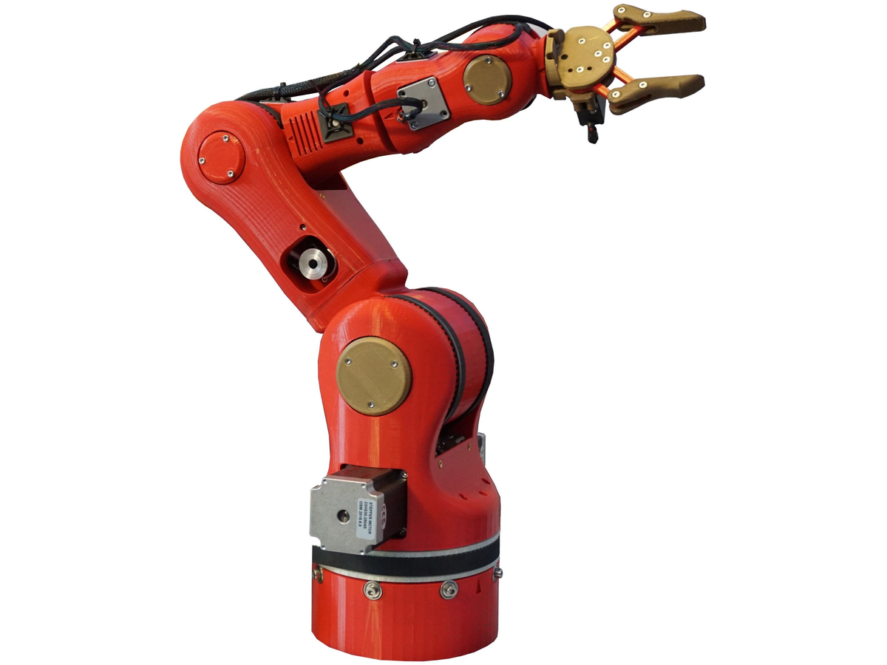
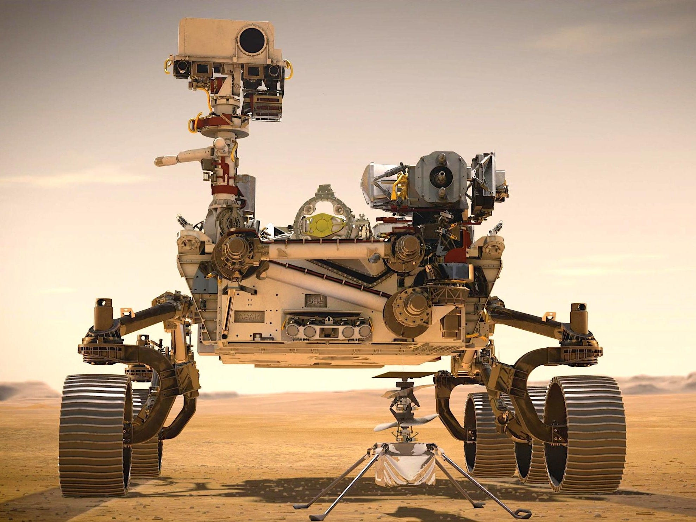
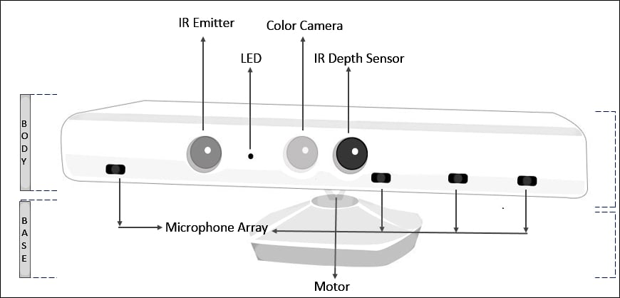
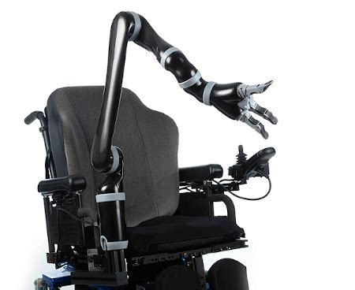
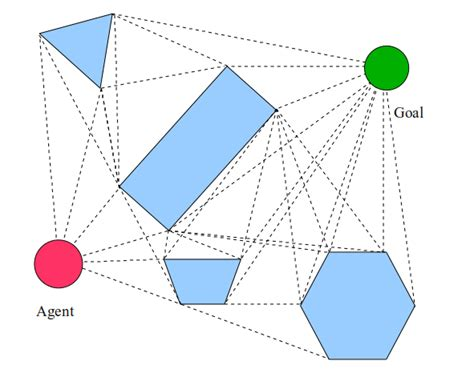
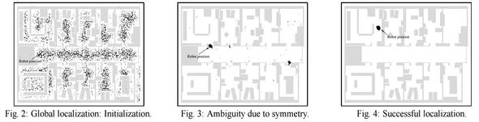

<!--
theme: gaia
size: 16:9
_class: lead
paginate: true
marp: false
backgroundColor: #000
backgroundImage: url('img/hero-backgroundIES.jpg')
-->
<style>
section::after {
  content: attr(data-marpit-pagination) '/' attr(data-marpit-pagination-total);}
img[alt~="center"] {
  display: block;
  margin: 0 auto;
}
table {
  margin-left: auto;
  margin-right: auto;
}
footer {
  font-size: 20px;
 }
header {
  font-size: 16px;
 }
</style>
<style scoped>
section {
  @extend .markdown-body;
  font-size: 28px;
  justify-content: top;
 }
</style>


# UD04: Análisis de sistemas robotizados
#### Modelos de Inteligencia Artificial
###### version: 2026-08-27

---
<!-- footer: d.martinezpena@edu.gva.es -->
<!-- header: Modelos de Inteligencia Artificial 26-27 (UD04_1)-->
<style scoped>section { font-size: 29px; }</style>

# ¿Qué veremos?

1. Métodos y aplicaciones de la robótica
2. Qué clase de problema resuelve
3. Modelado y control cinemático
4. Problemas y soluciones
5. Percepción robótica
6. Incertidumbre y aprendizaje
7. Técnicas de programación
8. Humanos y robots
9. Diseño e implementación

---
<style scoped>section { font-size: 26px; }</style>

## RA4 y sus criterios de evaluación

<!-- El bloque de contenidos del RD 279/2021 (anexo I) se llama textualmente «Análisis de sistemas robotizados»; agrupa métodos y aplicaciones, modelado y control, programación y diseño e implementación. Es la excepción del módulo: en el resto de RA los contenidos oficiales no casan uno a uno con los CE. (§2 de los apuntes) -->

> **RA4** — Analiza sistemas robotizados, evaluando opciones de diseño e implementación.

| CE | Criterio | Dónde |
|---|---|---|
| **a** | Recopilar los problemas del modelado y control cinemático en manipuladores | §1-3 |
| **b** | Buscar soluciones a los problemas de los robots | §4-6 |
| **c** | Valorar las técnicas de programación de robots y de sistemas robotizados | §7-8 |
| **d** | Evaluar opciones de diseño e implementación | §9 |

Cuatro contenidos oficiales para cuatro CE: en este RA **encajan casi uno a uno**, y es la excepción del módulo.

---
<style scoped>section { font-size: 24px; }</style>

## Al terminar la unidad serás capaz de…

- **Clasificar** robots por tipo y describir aplicaciones reales con datos.
- **Distinguir** los sensores por lo que miden y elegir el adecuado.
- **Resolver** la cinemática directa con parámetros DH y entender por qué la inversa es más difícil.
- **Identificar** singularidades, redundancia y límites, y sus soluciones.
- **Plantear** un problema de planificación en el espacio de configuración.
- **Explicar** cómo un robot se localiza y hace un mapa con sensores ruidosos.
- **Comparar** técnicas de programación resolviendo el **mismo** problema de cuatro formas.
- **Aplicar** criterios de diseño: payload, alcance, sensores, seguridad.

---
<!-- _class: lead -->

# 1. Métodos y aplicaciones

### de la robótica

###### RA4-a

---

## Un robot es un agente encarnado

<!-- El bloque de percepción, planificación de movimiento, aprendizaje por refuerzo e interacción humano-robot se basa en el capítulo 26 (Robotics) de Artificial Intelligence: A Modern Approach, 4.ª edición, de Stuart Russell y Peter Norvig. Las prácticas con el simulador AITK proceden del curso Models d'IA de Carles Gonzalez. -->

Es el único sistema de IA del curso que **cambia el estado del mundo físico**.

- Un clasificador que falla produce una etiqueta mala.
- Un robot que falla **rompe una pieza**. O algo peor.

Y su entorno es **parcialmente observable, estocástico y con más agentes dentro**: las cámaras no ven tras las esquinas, los engranajes patinan y las personas son impredecibles.

---

## Percibir, procesar, actuar
<!-- (§4.1 de los apuntes) -->

```text
 Sensores ──► Controlador ──► Actuadores ──► Entorno
     ▲                                          │
     └────────────── medición ◄─────────────────┘
```

Los **efectores** ejercen fuerza y pueden cambiar tres cosas:

- el estado del **robot**: el coche gira las ruedas y avanza,
- el del **entorno**: el brazo empuja una taza,
- el de las **personas**: alguien se aparta al verlo llegar.

---
<style scoped>section { font-size: 24px; }</style>

## Tipos de robot
<!-- (§4.2 de los apuntes) -->

| Tipo | Qué es |
|---|---|
| **Manipulador** | Un brazo; no necesita cuerpo, se atornilla a una mesa o al suelo |
| **Móvil con ruedas** | Aspiradora, AGV de almacén, coche autónomo, rover |
| **Con patas** | Terreno accidentado donde la rueda no llega |
| **Aéreo (UAV) y submarino (AUV)** | Cuadricópteros, exploración oceánica |
| **Cobot** | Comparte espacio con personas: potencia y fuerza limitadas |
| **Otros** | Prótesis, exoesqueletos, alas, **enjambres**, **entornos inteligentes** |

El robot antropomórfico de la ficción es el **menos** frecuente en la realidad.

---



## No es solo el tamaño

Un manipulador de **una tonelada** y un brazo montado en una silla de ruedas se diferencian en más que la escala:

- el primero mueve **mucha carga**,
- el segundo mueve poca pero es **seguro entre personas**.

**Payload y seguridad son criterios distintos**, y a menudo opuestos.

---

## Sensores: dos clasificaciones a la vez

**Por cómo obtienen la señal:**

- **Pasivos** — cámaras: captan lo que el entorno emite.
- **Activos** — sonar, lidar: emiten energía y miden lo que vuelve. Dan más información, pero consumen más y **se interfieren entre sí**.

**Por lo que miden**: el entorno · la ubicación del robot · su configuración interna.

---
<style scoped>section { font-size: 25px; }</style>

## Qué informa cada clase
<!-- (§4.3 de los apuntes) -->

| Clase | Sensores |
|---|---|
| **Del entorno** | Sonar, visión estéreo, luz estructurada (Kinect), tiempo de vuelo, **lidar**, radar, táctiles |
| **De la ubicación** | GPS/GLONASS, balizas de interior, señal wifi, balizas de sonar |
| **De la configuración interna** | Encoders, odometría de rueda, giroscopios, fuerza y par |



---
<style scoped>section { font-size: 24px; }</style>

## Las cifras que deciden
<!-- (§4.3 de los apuntes) -->

| Sensor | Alcance y precisión |
|---|---|
| **Lidar de barrido** | ~**1 cm a 100 m**. El de referencia en coche autónomo |
| **Cámara de tiempo de vuelo** | Rango a **60 fps**; peor que el lidar a plena luz |
| **Radar** | Hasta **kilómetros**, y **ve a través de la niebla** |
| **GPS** | **Unos metros**; con GPS diferencial, milimétrico en condiciones ideales. **No funciona en interiores ni bajo el agua** |
| **Fuerza y par** | 3 traslaciones + 3 rotaciones, **cientos de medidas por segundo** |

---

## Por qué la odometría no basta

Contar vueltas de rueda parece barato y exacto. Y lo es… **durante unos metros**.

- Las ruedas **derrapan y patinan**.
- El error **se acumula sin límite**: nada lo corrige.

Por eso se combina siempre con giroscopios y con **una referencia externa**. Es la razón de ser de la localización probabilística del bloque 5.

---

## El caso de la bombilla
<!-- (§4.3 de los apuntes) -->

Un manipulador de **una tonelada** tiene que enroscar una bombilla. Es facilísimo romperla.

- Los sensores de **fuerza** dicen con qué fuerza agarra.
- Los de **par**, con qué fuerza gira.
- Midiendo **cientos de veces por segundo**, corrige **antes** de romper el cristal.

Manipular con cuidado no viene de tener un brazo más suave: viene de **medir rápido**.

---
<style scoped>section { font-size: 26px; }</style>

## Actuadores
<!-- (§4.4 de los apuntes) -->

| Tipo | Dónde se usa |
|---|---|
| **Eléctrico** | El más común: articulaciones de brazos |
| **Hidráulico** | Mucha fuerza: maquinaria pesada |
| **Neumático** | Movimientos rápidos y simples, pinzas |

Mueven articulaciones de **revolución** (giran, ángulo θ) o **prismáticas** (deslizan, distancia d). Las dos, de un eje.

---

<style scoped>section { font-size: 27px; }</style>


## Pinzas: el compromiso

<!-- El nombre completo del robot citado es Shadow Dexterous Hand. (§4.4 de los apuntes) -->

- **Mordaza paralela** — dos dedos, un actuador. «Amada y odiada por su simplicidad».
- **Tres dedos** — algo más de flexibilidad sin complicarse.
- **Mano antropomórfica** — la Shadow Hand tiene **20 actuadores**: puede girar el móvil en la mano, y **es mucho más difícil de controlar**.

---

## Más grados de libertad no es mejor

Cada actuador multiplica lo que el robot **puede** hacer **y** lo que hay que **decidir** en cada instante.

Veinte actuadores es un espacio de acción enorme.

Casi toda la robótica industrial funciona con **dos dedos y un actuador**, porque la tarea no necesita más.

---
<style scoped>section { font-size: 25px; }</style>

## La robótica, con datos (IFR 2025)

<!-- IFR son las siglas de International Federation of Robotics, que publica cada año el informe World Robotics con las estadísticas oficiales del sector; es la fuente de estas cifras. (§4.5 de los apuntes) -->

| Dato | Valor (2024) |
|---|---|
| Robots industriales instalados | **542.000** (4.º año sobre 500.000) |
| Stock operativo mundial | **4,66 millones** (+9 %) |
| Líder en densidad | **Corea del Sur** (1.012-1.220 por 10.000 empleados) |
| Líder de mercado | **China** (295.000, el 54 %) |
| **España**, 3.er mercado europeo | **5.100 unidades**, por la automoción |
| Robótica médica | **+91 %**, con **da Vinci** como referencia |

<a href="https://www.youtube.com/watch?v=4yTPcDWopBo" target="_blank" rel="noopener"></a>

---
<style scoped>section { font-size: 24px; }</style>

## Cuatro casos reales
<!-- (§4.6 de los apuntes) -->

| Robot | Características | Uso |
|---|---|---|
| **KUKA KR AGILUS** | 6-11 kg, 726-1.101 mm | 60 sándwiches/min; 3.000 muestras de sangre/día |
| **FANUC** | Hasta **2,3 t**, alcance 4,7 m | Paletizado (M-410, 700 kg), soldadura |
| **UR e-Series** | 3-16 kg; repetibilidad **±0,03-0,05 mm** | Montaje asistido, inspección |
| **Amazon Robotics** | Más de **1 millón** de robots | Logística de almacén |

---

## Pensar en «robot + tarea»

No se elige el robot más caro. Se define **primero la tarea**:

- qué pieza, qué peso,
- qué ritmo, qué precisión,
- qué entorno.

Y **después** se busca el modelo que cumple payload, alcance, repetibilidad y seguridad.

Es el criterio del bloque 9 y del Taller 2.

---
<!-- _class: lead -->

# 2. Qué clase de problema

### resuelve la robótica

---

## Todas las dificultades a la vez

La robótica es **no determinista**, **parcialmente observable** y **multiagente**.

Y lo multiagente no es competir **o** cooperar: es **las dos cosas**. En un pasillo donde solo cabe uno, el robot y la persona **colaboran** —ninguno quiere chocar— y **compiten** por pasar primero.

Un robot demasiado educado **se queda atascado para siempre**.

---

## ¿De quién es la recompensa?

Si el robot lleva la comida a un paciente, la recompensa es **del paciente**, no suya.

Y ahí está el problema: **la recompensa verdadera está en la cabeza del usuario**. El robot tiene que deducirla, o conformarse con la aproximación que le programó un ingeniero.

Es el problema de alineación de la UD06, con un brazo de una tonelada.

---
<style scoped>section { font-size: 26px; }</style>

## La jerarquía de tres niveles
<!-- (§5.1 de los apuntes) -->

En crudo, un robot ve píxeles y envía corrientes a motores. Entre eso y «lleva la comida a la 12» hay un abismo. Se salva **partiendo el problema**:

```text
Planificación de tareas   →  submetas discretas: ir a la puerta, abrirla
        ↓
Planificación de movimiento →  un camino sin colisiones
        ↓
Control                    →  que los actuadores sigan ese camino
```

---

<style scoped>section { font-size: 25px; }</style>

## Lo que se pierde al partirlo

Dividir reduce la complejidad, pero **renuncia a que las partes se ayuden**:

- La **acción** puede mejorar la percepción: moverse para ver mejor.
- El movimiento **óptimo sobre el papel** puede ser el peor de seguir.
- Un plan de tareas puede ser **imposible de instanciar** en movimiento.

Por eso hoy se avanza en cada nivel **y en volver a integrarlos**.

---
<!-- _class: lead -->

# 3. Modelado y control

### cinemático

###### RA4-a

---
<style scoped>section { font-size: 25px; }</style>

## La cadena cinemática
<!-- (§6.1 de los apuntes) -->

| Concepto | Definición |
|---|---|
| **Grado de libertad (DoF)** | Movimiento independiente. Hacen falta **≥ 6** para pose libre en 3D |
| **Revolución (R)** | Gira: su variable es un ángulo θ |
| **Prismática (P)** | Desliza: su variable es una distancia d |
| **Espacio articular** | El vector `q` con la posición de cada articulación |
| **Espacio cartesiano** | La **pose**: posición más orientación del efector |

---
<style scoped>section { font-size: 27px; }</style>

## Cuatro configuraciones
<!-- (§6.1 de los apuntes) -->

| Configuración | Articulaciones | Uso típico |
|---|---|---|
| **Articulado** | ≥ 3R | El más común en industria (6 ejes) |
| **Cartesiano / pórtico** | 3P | Manipulación simple, gran alcance |
| **SCARA** | RRP | Montaje: rígido en Z, flexible en XY |
| **Delta / paralelo** | Paralelas | Empaquetado de alta velocidad |



---

## Cinemática directa
<!-- (§6.2 de los apuntes) -->

De los ángulos a la pose: `pose = f(q)`. Se multiplican **matrices homogéneas 4×4**.

$$^0T_n = {}^0T_1 \cdot {}^1T_2 \cdot \ldots \cdot {}^{n-1}T_n$$

Cada transformación se describe con los **parámetros de Denavit-Hartenberg**: cuatro valores por articulación — $\theta$, $d$, $a$, $\alpha$.

Se escribe la tabla DH del robot y la pose sale de encadenar las matrices.

---
<style scoped>section { font-size: 26px; }</style>

## Tabla DH del Puma 560 (fragmento)

<!-- El Puma 560 es un brazo industrial clásico, uno de los modelos de referencia junto al Panda de Franka que trae ya resueltos roboticstoolbox-python. (§6.2 de los apuntes) -->

| Articulación | θ | d | a | α |
|---|---|---|---|---|
| 1 | q₁ | 0,6718 | 0 | −90° |
| 2 | q₂ | 0 | 0,4318 | 0° |
| 3 | q₃ | 0,1500 | 0,0203 | 90° |
| 4 | q₄ | 0,4318 | 0 | −90° |

`fkine([0, 0.2, 0.3, 0.4, 0.5, 0.6])` devuelve una matriz 4×4 con la pose: del orden de `[0,25; −0,13; 1,15]`.

---
<style scoped>section { font-size: 26px; }</style>

## Un brazo plano 3R, a mano
<!-- (§6.2 de los apuntes) -->

$$x = l_1\cos\theta_1 + l_2\cos(\theta_1{+}\theta_2) + l_3\cos(\theta_1{+}\theta_2{+}\theta_3)$$
$$y = l_1\sin\theta_1 + l_2\sin(\theta_1{+}\theta_2) + l_3\sin(\theta_1{+}\theta_2{+}\theta_3)$$

Con `l₁ = l₂ = l₃ = 1` y los tres ángulos a 0 → el efector está en **(3, 0)**.

Poniendo `θ₁ = 90°` → pasa a **(0, 3)**.

La cinemática directa **siempre tiene una única solución**.

---
<style scoped>section { font-size: 24px; }</style>

## La inversa es otra historia
<!-- (§6.3 de los apuntes) -->

`q = f⁻¹(pose)`. Aquí están casi todos los problemas que pide recopilar el CE a:

| Problema | En qué consiste |
|---|---|
| **Múltiples soluciones** | Un 6R general: **hasta 16**. Con muñeca esférica, 8 |
| **Redundancia** | Más DoF de los necesarios → **infinitas** soluciones |
| **Sin solución** | El objetivo está fuera del alcance |
| **Singularidad** | El jacobiano pierde rango → velocidad articular a infinito |

Métodos **analíticos** (Pieper, desacoplamiento) o **numéricos** (Newton-Raphson, pseudoinversa, CCD, FABRIK).

---
<style scoped>section { font-size: 26px; }</style>

## Controlar el movimiento

<!-- PID son las siglas de proporcional-integral-derivativo, el controlador clásico de posición en robots industriales. (§6.4 de los apuntes) -->

| Estrategia | Cómo |
|---|---|
| **Posición** | PID por eje: medida del encoder, consigna el ángulo objetivo |
| **Velocidad** (*resolved-rate*) | $\dot{q} = J^{+} v$, con la pseudoinversa del jacobiano |
| **Fuerza / impedancia** | El robot se comporta como masa-muelle-amortiguador |

Servomotores **con encoder**, en lazo cerrado: sin realimentación no hay forma de saber si el eje llegó.

---

## De P a par calculado

- **P** — acción proporcional al error. Simple, pero **oscila**.
- **PD** — añade la derivada del error: **amortigua** la oscilación.
- **PID** — añade la integral: corrige el **error sistemático persistente**.
- **Par calculado** — usa la **dinámica inversa** para calcular el par necesario y deja al PID solo lo que el modelo no acierta.

Lo último es lo que usan los robots industriales de verdad.

---

## De dónde salen las trayectorias
<!-- (§6.4 de los apuntes) -->

No se salta de un punto a otro: **se interpola**.

- **`jtraj`** — en el espacio articular, polinomio de 5.º grado: aceleración y *jerk* continuos, movimiento suave.
- **`ctraj`** — **línea recta cartesiana**, que es lo que hace falta cuando el efector lleva una herramienta de corte.

El controlador va siguiendo esa trayectoria punto a punto.

---
<!-- _class: lead -->

# 4. Problemas y soluciones

###### RA4-b

---
<style scoped>section { font-size: 26px; }</style>

## Las cuatro singularidades
<!-- (§7.1 de los apuntes) -->

| Singularidad | Cuándo ocurre |
|---|---|
| **De muñeca** | Los ejes 4 y 6 se alinean (θ₅ = 0) |
| **De hombro** | El centro de la muñeca corta el eje de la base |
| **De codo** | El brazo, del todo estirado o plegado |
| **De límite** | El efector llega al borde del volumen de trabajo |

---

## Qué se ve de verdad en la célula

No es un problema abstracto de álgebra. Las velocidades articulares **tienden a infinito**, así que el servo pide una corriente que no puede dar:

- **sobrecorriente**,
- **vibraciones**,
- o una **parada de seguridad** a mitad del ciclo.

Se evitan al planificar, o se cruzan bajando la velocidad.

---
<style scoped>section { font-size: 25px; }</style>

## Las soluciones
<!-- (§7.2 de los apuntes) -->

| Problema | Solución |
|---|---|
| Singularidades | Planificar evitándolas; medir la **manipulabilidad** (Yoshikawa) |
| IK compleja | **Desacoplamiento**: la muñeca esférica separa posición de orientación |
| Múltiples soluciones | Criterios: evitar obstáculos, minimizar recorrido |
| Límites articulares | Modelarlos y restringir el *solver* |
| Precisión deficiente | **Calibrar** (hasta ×10 de mejora) y medir con la ISO 9283 |

---

## Precisión no es repetibilidad

<!-- Un ejemplo real de calibración con programación offline es un ABB IRB 1600 corregido con un láser tracker. (§7.2 de los apuntes) -->

Un robot puede ser **repetible** y a la vez **impreciso**: vuelve siempre al mismo punto, pero **ese punto no es el que se programó**.

- Con *teach pendant* basta la repetibilidad: el punto se enseñó ahí.
- Con programación **offline**, las coordenadas vienen de un CAD y la precisión es crítica → **hay que calibrar**.

Repetibilidad de los cobots UR e-Series: **±0,03-0,05 mm**.

---

## El espacio de configuración

Cambio de punto de vista: en vez del robot moviéndose por una habitación, **un punto moviéndose por el espacio de todas sus configuraciones posibles**.

- Brazo de 6 ejes → **6 dimensiones**.
- Robot móvil en un plano → 3 (x, y, orientación).

Los obstáculos se vuelven **regiones prohibidas**; lo que queda es el **espacio libre**. El problema deja de ser geométrico: es **buscar un camino**.

---
<style scoped>section { font-size: 25px; }</style>

## El problema de la mudanza del piano
<!-- (§7.3 de los apuntes) -->

Se llama así por el esfuerzo de una empresa de mudanzas para llevar un piano grande e irregular de una habitación a otra **sin golpear nada**.

Formalmente: un espacio `W`, obstáculos `O ⊂ W`, un robot con configuración `C`, una configuración inicial `q_s` y una objetivo `q_g`. Se busca un **camino continuo** por el espacio libre.

Se complica de tres formas: objetivo como **conjunto**, **coste** a minimizar, o **restricciones** — si lleva una taza de café, mantenerla vertical todo el trayecto.

---
<style scoped>section { font-size: 22px; }</style>

## Cuatro formas de planificar
<!-- (§7.4 de los apuntes) -->

| Método | Idea | Fuerte | Flojo |
|---|---|---|---|
| **Grafo de visibilidad** | Vértices de obstáculos + líneas de visión; después A\* | El camino **más corto** en 2D | Escala mal; **roza** las esquinas |
| **Voronoi** | Circular por los bordes entre regiones | Maximiza la distancia: **seguro** | Caminos más largos |
| **Descomposición celular** | Trocear el espacio libre y buscar en el grafo | Simple y completo | Las celdas **explotan** al subir de dimensión |
| **Muestreo (RRT, PRM)** | Lanzar configuraciones al azar y conectar | Lo único práctico con **muchas dimensiones** | No es óptimo; hay que suavizar |

---



## Corto o seguro

El **grafo de visibilidad** busca el camino más corto: pasa **pegado a las esquinas**.

**Voronoi** busca el más seguro: **se aleja de todo**, y por eso es más largo.

Cuál conviene depende de si el riesgo es **chocar** o es **tardar**.

---

## Plan y política no son lo mismo

- Un **plan** dice **qué camino** recorrer.
- Una **política** dice **qué acción tomar desde cualquier estado** al que llegues.

Las leyes de control del bloque 3 son **políticas**, no planes.

Y la robótica real hace una **componenda en dos pasos**.

---
<style scoped>section { font-size: 26px; }</style>

## La componenda, y su precio

<!-- El control óptimo usa técnicas de optimización de trayectoria como multiple shooting y colocación directa; LQR resuelve el caso ideal de coste cuadrático y dinámica lineal, e iLQR es la variante que se usa cuando esas condiciones no se cumplen, que es casi siempre. (§7.5 de los apuntes) -->

1. **Planificar** en un espacio simplificado — solo cinemática, sin dinámica. Sale la trayectoria de referencia.
2. **Convertirla en política**: un controlador que la sigue y **vuelve a ella** al desviarse.

Dos suboptimalidades:

- planificar **sin la dinámica**: el camino más corto en el papel puede ser el peor de seguir;
- suponer que **si te desvías lo mejor es volver al plan**, cuando a veces conviene replanificar.

El **control óptimo** (LQR, iLQR) ataca las dos a la vez.

---
<!-- _class: lead -->

# 5. Percepción robótica

###### RA4-b

---
<style scoped>section { font-size: 27px; }</style>

## Tres problemas, de menos a más

<!-- SLAM son las siglas de Simultaneous Localization And Mapping: localización y mapeo simultáneos. (§8.1 de los apuntes) -->

| Problema | Se sabe | Se busca |
|---|---|---|
| **Localización** | El mapa | Dónde está el robot |
| **Mapeo** | Dónde está el robot | El mapa |
| **SLAM** | Nada de las dos | **Las dos a la vez** |

SLAM es el caso realista, y parece imposible: para saber dónde estás necesitas el mapa, y para el mapa necesitas saber dónde estás.

---

## Se rompe con probabilidad

En vez de **una respuesta**, el robot mantiene una **distribución de probabilidad** sobre dónde puede estar —su *estado de creencia*— y la afina con cada medida.

Las herramientas son las de toda la IA con incertidumbre:

- **filtros de Kalman**,
- **modelos ocultos de Markov**,
- **redes bayesianas**.

---

<style scoped>section { font-size: 25px; }</style>



## Monte Carlo, en tres fotos

<!-- Esta técnica se llama formalmente localización de Monte Carlo o MCL (Monte Carlo Localization), y se implementa con un filtro de partículas. (§8.1 de los apuntes) -->

Una nube de «partículas», cada una una hipótesis:

1. Al arrancar, **repartidas por todo el plano**.
2. Llegan medidas y se **agrupan**: quedan **varios grupos**, porque los pasillos se parecen.
3. Con suficientes medidas, **colapsan en un solo sitio**.

---

## Lo interesante es el paso 2

El robot representa **explícitamente que hay varias respuestas posibles**, en vez de escoger una y equivocarse.

Y solo necesita dos modelos: el del **movimiento** y el del **sensor**.

---

## Pero no siempre hace falta la artillería

<!-- Es el mismo criterio que se aplica en la UD05 con el PID: empezar simple y añadir complejidad solo cuando se justifica. (§8.2 de los apuntes) -->

La tendencia va hacia representaciones con **semántica** —no «aquí hay algo», sino «esto es una puerta»— y las técnicas probabilísticas **ganan** en los problemas difíciles.

Aun así, a veces son **demasiado engorrosas** y una solución simple es igual de efectiva.

`EX2` y `EX3` navegan sobre los píxeles de una cámara **sin ningún filtro probabilístico**, y funcionan.

---

## Percepción que se readapta

Entras de la calle soleada a una habitación con fluorescentes.

No solo hay menos luz: el fluorescente tiene **más componente verde**, así que **todos los colores cambian**.

Y no nos parece que a la gente se le haya puesto la cara verde: nuestra percepción **se readapta en segundos**.

Un robot que no haga eso **creerá que ha cambiado de mundo**.

---
<!-- _class: lead -->

# 6. Incertidumbre y aprendizaje

###### RA4-b

---
<style scoped>section { font-size: 26px; }</style>

## El atajo que usan los robots reales

La mayoría usa **algoritmos deterministas**, con dos atajos:

1. **Discretizar** el espacio continuo (visibilidad, celdas).
2. Ante la duda, **quedarse con el estado más probable**.

Es más rápido y escala mejor. El precio: **el robot actúa como si estuviera seguro cuando no lo está**.

---

## Cuándo se rompe el atajo

Funciona mientras la distribución tenga **un solo pico claro**.

Falla justo en el paso 2 de Monte Carlo: cuando hay **varias hipótesis igual de buenas** —tres pasillos que se parecen—, quedarse con la más probable es **tirar una moneda**…

…y el robot actúa con plena confianza sobre una respuesta que tiene un **33 %** de ser cierta.

---
<style scoped>section { font-size: 26px; }</style>

## Por qué el refuerzo falla en un robot real
<!-- (§9.2 de los apuntes) -->

| | En simulación | En el robot real |
|---|---|---|
| Velocidad | Millones de pruebas en horas | Las mismas tardarían **años** |
| Riesgo | Ninguno | **No puede arriesgarse** a la prueba que lo dañaría — y por tanto **no puede aprender de ella** |

**El mundo real se niega a ir más rápido que el tiempo real.**

---

## De ahí el problema *sim-to-real*

<!-- En ese recorrido, EX4 genera los datos conduciendo el robot, EX5 entrena la red con esos datos y EX6 evoluciona la solución con NEAT sin ejemplos etiquetados. (§9.2 de los apuntes) -->

Transferir a un robot real lo aprendido en simulación es un **área de investigación activa**.

Y por eso los sistemas prácticos incorporan **conocimiento previo** del robot, del entorno y de la tarea: es la única forma de aprender rápido **y** comportarse con seguridad mientras aprende.

`EX4`, `EX5` y `EX6` hacen este recorrido en pequeño **y en simulación**, que es donde se puede.

---
<!-- _class: lead -->

# 7. Técnicas de programación

### de robots

###### RA4-c

---
<style scoped>section { font-size: 21px; }</style>

## Las cinco formas de programar un robot
<!-- ROS son las siglas de Robot Operating System, aunque no es un sistema operativo en sentido estricto: es el middleware de nodos, topics y servicios más usado en investigación y robótica móvil. (§10.1 de los apuntes) -->

| Técnica | Ventaja | Desventaja | Cuándo |
|---|---|---|---|
| **Teach pendant** | Curva mínima, puesta a punto rápida | **Para la producción** mientras programas | Paletizado, soldadura por puntos |
| **Guiado manual** | Intuitivo, sin código | Solo en cobots seguros | Montaje asistido |
| **Textual** (RAPID, KRL, URScript) | Determinista, integra con PLC | Propietario, **no portable** | Células estables de alta cadencia |
| **Offline (OLP)** | **Cero impacto en producción** | Licencias; exige modelos precisos y **robot calibrado** | Geometrías complejas |
| **ROS 2** | Abierto, acceso a algoritmos de IA | Curva alta | Investigación, multi-robot |

---


## URScript se parece a Python
<!-- RTDE son las siglas de Real-Time Data Exchange, el protocolo propio de Universal Robots para intercambiar datos con el robot en tiempo real desde un cliente externo. (§10.1 de los apuntes) -->

Los robots de **Universal Robots** se programan en **URScript**, un lenguaje muy parecido a Python.

Y se puede enviar al robot desde un cliente Python por **FTP, SSH o RTDE**.

Es la puerta de entrada natural a la programación de cobots desde este módulo.

---

## «Colaborativo» no es del hardware

La **ISO 10218:2025** prohíbe llamar «robot colaborativo» a un brazo aislado.

Lo que puede ser colaborativa es la **aplicación completa**: robot + herramienta + entorno + tarea.

**Un cobot con un cuchillo en la pinza no es una aplicación colaborativa.**

Es un matiz legal, y es el que decide si hace falta vallado.

---
<style scoped>section { font-size: 26px; }</style>

## Comparar de verdad: el mismo problema, cuatro veces
<!-- (§10.3 de los apuntes) -->

Un robot con cámara tiene que **seguir una línea** en el suelo. Y el problema se resuelve cuatro veces.

```text
EX2 reglas  →  EX3 difusa  →  EX4 datos  →  EX5 red neuronal  →  EX6 NEAT
```

Eso es lo que pide el CE c: **valorar características diferenciadoras**.

---
<style scoped>section { font-size: 23px; }</style>

## Qué cambia en cada salto
<!-- (§10.3 de los apuntes) -->

| Entregable | Técnica | Qué escribes tú | Qué sale del programa |
|---|---|---|---|
| `EX2` | **Reglas** | Todas las condiciones, a mano | Nada: el comportamiento es el que programaste |
| `EX3` | **Lógica difusa** | Variables lingüísticas y reglas | La transición **suave** entre ellas |
| `EX5` | **Red neuronal** | Arquitectura y entrenamiento | El comportamiento, aprendido de **tus** ejemplos |
| `EX6` | **NEAT** | Solo la función de aptitud | La red **y su topología**, sin ejemplos |

---
<style scoped>section { font-size: 25px; }</style>

## Lo que hay que observar

No es cuál «funciona mejor». Es **qué se gana y qué se pierde**:

- cuánto código escribes,
- cuánto tienes que entender del problema,
- cuántos datos necesitas,
- y, lo más importante, **si puedes explicar por qué el robot hizo lo que hizo**.

Las reglas de `EX2` **se leen**. Los pesos de la red de `EX5`, **no**.

Es la tensión entre interpretabilidad y potencia de la UD05 — y en la UD06 se vuelve un problema legal.

---
<!-- _class: lead -->

# 8. Humanos y robots

###### RA4-c · RA4-d

---

## Una persona no es un obstáculo móvil

Cuando el robot comparte espacio con personas aparece un problema que no es de mecánica ni de control.

La forma habitual de plantearlo es como un **juego**: eso supone explícitamente que las personas son **agentes con objetivos**.

Pero suponerlo **no** significa que sean **perfectamente racionales**.

---
<style scoped>section { font-size: 26px; }</style>

## El «¿qué crees que creo que crees?»

El juego es difícil para el robot… **y para nosotros**.

Obliga a pensar en lo que hará el robot en respuesta a lo que hace la persona, que depende de lo que el robot cree que hará la persona, que depende de…

Las personas **no gestionamos eso**, así que nos comportamos de forma **subóptima** de maneras bastante predecibles.

**Un robot que asuma racionalidad perfecta predecirá mal.**

---

## La solución práctica

Se descompone en dos:

1. **Predicción** — usar lo que la persona está haciendo ahora para estimar qué hará después.
2. **Acción** — usar esa predicción para calcular el movimiento del robot.

---

## Aprender lo que la persona quiere

<!-- Es el mismo problema que la UD06 llama specification gaming o problema del rey Midas, y también aplica a un vehículo de dos toneladas, no solo a un brazo fijo. (§11.2 de los apuntes) -->

El usuario **no sabría escribir** la función objetivo perfecta. El robot tiene que **inferirla observando**: qué corrige, qué acepta, qué repite.

Y esto no es un detalle técnico: un robot que optimiza una **aproximación mala** del objetivo hace **exactamente lo que se le pidió** y no lo que se quería.

Con un brazo de una tonelada, **especificar mal el objetivo es un modo de fallo**, igual que una singularidad.

---
<!-- _class: lead -->

# 9. Diseño e implementación

###### RA4-d

---
<style scoped>section { font-size: 24px; }</style>

## Los cinco criterios de selección
<!-- (§12.1 de los apuntes) -->

| Criterio | Pregunta guía | Dato típico |
|---|---|---|
| **Payload** | ¿Qué masa mueve, contando la herramienta? | UR3e 3 kg … FANUC 2,3 t |
| **Alcance** | ¿Qué distancia máxima? | KUKA 726-1.101 mm; FANUC 4,7 m |
| **Repetibilidad** | ¿Cuánta dispersión al volver? | UR e-Series ±0,03-0,05 mm |
| **Precisión** | ¿Coincide con lo programado? | Mejora al calibrar |
| **Entorno** | ¿Polvo, humedad, atmósfera explosiva? | Versiones IP / ATEX |

---

## El payload no es el peso de la pieza

<!-- La herramienta del extremo del brazo se llama EOAT: end of arm tooling. (§12.1 de los apuntes) -->

Es la pieza **más** la herramienta, la brida, los cables y los sensores acoplados.

Y además hay que comprobar los **momentos de inercia** de la herramienta contra los límites de las reductoras de la muñeca.

Un robot puede aguantar **10 kg pegados a la brida** y **no aguantar 6 kg** en el extremo de una herramienta larga.

---
<style scoped>section { font-size: 25px; }</style>

## Ejemplo guiado: pieza de 1,5 kg a 700 mm
<!-- (§12.3 de los apuntes) -->

1. **Payload** — pieza 1,5 + pinza 0,5 + cables ≈ **2,2 kg**. Hace falta ≥ 2,5 kg y ≥ 700 mm: un **UR5e** (5 kg / 850 mm) cumple.
2. **Repetibilidad** — la tarea tolera ±0,1 mm; el UR5e da ±0,05. Y **no hace falta calibrar**, porque los puntos se enseñan.
3. **Singularidades** — se simula y se comprueba que la trayectoria no pasa por codo estirado ni muñeca alineada.
4. **Seguridad** — ¿comparte espacio? → aplicación colaborativa. ¿No? → vallado con enclavamientos.

---

## Si hay que cruzar una singularidad…

…**se cambia el layout, no el controlador**.

Es más barato mover el transportador que pelearse con el robot.

Y el orden importa: **primero la tarea, después el robot**. Nunca al revés.

---
<style scoped>section { font-size: 26px; }</style>

## La célula y la Industria 4.0

<!-- PLC son las siglas de programmable logic controller, el autómata industrial que coordina la célula por buses deterministas (PROFINET, EtherCAT o EtherNet/IP, que es otro protocolo industrial habitual). OPC UA y MQTT son los protocolos con los que esa telemetría se publica hacia el resto de la fábrica: IIoT es industrial internet of things, y MES (manufacturing execution system) es el software que lleva el seguimiento de la producción en planta. (§12.5 de los apuntes) -->

```text
PLC de seguridad ◄──PROFINET/EtherCAT──► Robot ──► Sensores + herramienta
                                            │
                                     OPC UA / MQTT
                                            ▼
                                  Plataforma IIoT / MES
                                            ▼
                                     Gemelo digital
```

El bus del PLC es **determinista**; la telemetría va por OPC UA o MQTT. Con esos datos, el gemelo digital anticipa fallos —fatiga de reductoras— **antes** de que paren la línea.

---
<style scoped>section { font-size: 25px; }</style>

## Seguridad y normativa
<!-- (§12.6 de los apuntes) -->

| Norma | Qué regula |
|---|---|
| **ISO 12100** | Evaluación de riesgos de máquinas: la base |
| **ISO 10218-1/-2** | Robots industriales: requisitos de seguridad |
| **ISO/TS 15066** | Cobots: límites biomecánicos |
| **ISO 10218:2025** | **Vigente**: absorbe la 15066 y obliga a evaluar la aplicación completa |
| **ISO 9283** | Cómo se mide repetibilidad y precisión |

---

## Lo que cambió en 2025

La **ISO 10218:2025** hace dos cosas:

1. Absorbe los límites biomecánicos de la ISO/TS 15066 y los vuelve **obligatorios**.
2. Añade **auditorías de ciberseguridad industrial** de la célula.

Un robot conectado a la red de planta es una **superficie de ataque**: es el *security by design* de la UD06, aplicado a una máquina que se mueve.

---
<style scoped>section { font-size: 26px; }</style>

## Dos simuladores, dos trabajos

<!-- roboticstoolbox-python está desarrollado por Peter Corke. (§13.1 y §13.2 de los apuntes) -->

**`roboticstoolbox-python`** — para la cinemática de manipuladores: más de 50 robots reales con su cinemática resuelta.

```python
robot = rtb.models.Panda()
pose = robot.fkine([0, -0.8, 0.8, 0, 0.8, 0, 0])
q = robot.ikine_LM(pose)
```

**`aitk.robots`** — para el robot móvil con cámara, dentro del propio notebook.

```python
world = bots.World(220, 180, ground_image_filename="pista.png")
robot = bots.Scribbler(x=100, y=90, a=90)
robot.add_device(bots.Camera(64, 32))
```

---
<!-- _class: lead -->

# Cierre

---
<style scoped>section { font-size: 21px; }</style>

## Puntos clave (I)

- Un robot es un **agente encarnado**, en un entorno parcialmente observable, estocástico y multiagente.
- Los sensores se clasifican por **cómo** miden y por **qué** miden. La **odometría se degrada sin límite**: hay que corregirla.
- **Más grados de libertad no es mejor**: 20 actuadores pueden más y son mucho más difíciles de controlar.
- La robótica parte el problema en **tarea → movimiento → control**, y con ello renuncia a que los niveles se ayuden.
- La **cinemática directa** tiene solución única; la **inversa**, hasta **16**, más redundancia y singularidades.
- **Precisión no es repetibilidad**: se puede volver siempre al mismo punto equivocado.

---
<style scoped>section { font-size: 21px; }</style>

## Puntos clave (II)

- Planificar es buscar camino en el **espacio de configuración**: visibilidad da el **más corto**, Voronoi el **más seguro**, el muestreo es el único viable en muchas dimensiones.
- Un **plan** dice qué camino; una **política**, qué hacer desde cualquier estado. La robótica real planifica y luego convierte el plan en política, pagando dos suboptimalidades.
- **SLAM** mantiene una **distribución de probabilidad**, no una respuesta.
- El **refuerzo** falla en el robot real: el mundo no va más rápido que el tiempo real y no puede arriesgar la prueba que lo dañaría.
- **«Colaborativo» es de la aplicación**, no del hardware (ISO 10218:2025).
- Diseñar es **emparejar la tarea con el modelo** y verificarlo en simulación **antes** de comprar.

---
<style scoped>section { font-size: 25px; }</style>

## Las cuatro sesiones
<!-- (§17 de los apuntes) -->

| Semana | Contenido | CE |
|---|---|---|
| 15 | Métodos y aplicaciones; hardware; qué problema resuelve la robótica | a |
| 16 | Cinemática directa e inversa, singularidades; Taller 1 | a, b |
| 17 | Espacio de configuración y planificación; percepción y SLAM; OpenCV, `EX1`-`EX3` | b, c |
| 18 | Técnicas comparadas (`EX4`-`EX6`); célula, seguridad y normativa; Taller 2 | c, d |

---
<style scoped>section { font-size: 25px; }</style>

## Cómo se evalúa

<!-- La exigencia de superar todos los RA viene del art. 5.1 de la Orden 8/2025 y de las Instrucciones 26-27, que impiden calificar positivamente un módulo con algún RA no superado. (§19 de los apuntes) -->

| Peso | Instrumento |
|---|---|
| **40 %** | Media de los **seis entregables** (`EX1`-`EX6`), cada uno con su rúbrica sobre 10 |
| **60 %** | Prueba del RA4: test y desarrollo sobre el contenido de la unidad |

Los entregables son una **secuencia**: `EX4` genera los datos de `EX5`. No conviene dejarlos para el final ni saltarse el orden.

La **normativa exige alcanzar todos los RA**; el centro lo concreta en **≥ 5 en cada uno**.

---
<!-- _class: lead -->

## ¿Y ahora?

Un robot percibe, razona y **actúa sobre el mundo físico**. Es donde la IA deja de equivocarse en una etiqueta y empieza a equivocarse en una pieza.

### A seguir una línea con una cámara.
