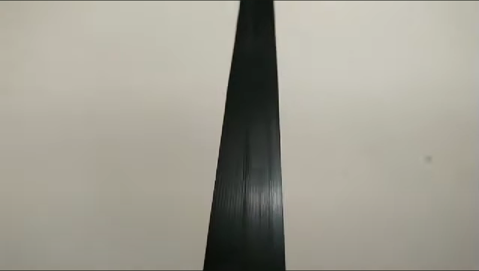
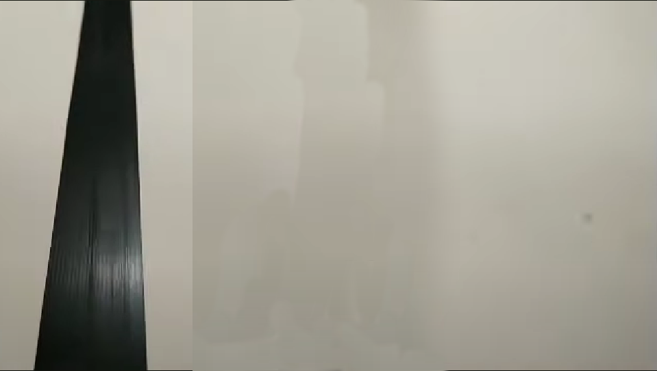
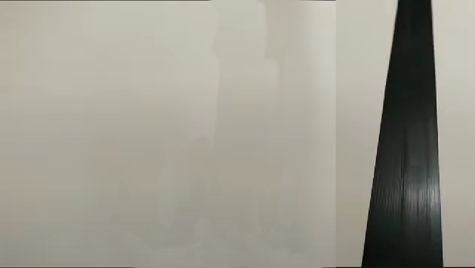

# UD04 · Notebooks guiados

<!-- AUTO:notebooks inicio -->
!!! info "Práctica: se hace, no se entrega"
    3 actividades que se trabajan **en clase**, con el profesor. **No se
    entregas ni puntúas**: preparas las [entregas de la unidad](UD04_Entregas.md) y la prueba escrita del RA4.

| Actividad | Qué es | Descargar | Abrir en Colab |
|---|---|---|---|
| [`N01` · Introducción a OpenCV](notebooks/UD04_N01_introduccion_opencv.ipynb) | Introducción a OpenCV | {:target="_blank"} | {:target="_blank"} |
| [`N02` · Vehículos de Braitenberg](notebooks/UD04_N02_vehiculos_braitenberg.ipynb) | Vehículos de Braitenberg · comportamiento sin planificación | {:target="_blank"} | {:target="_blank"} |
| [`N03` · Ejemplos de robots en AITK](notebooks/UD04_N03_ejemplos_robots.ipynb) | Ejemplos de robots en AITK | {:target="_blank"} | {:target="_blank"} |

## `N01` · Introducción a OpenCV

Visión por computador aplicada: cargar una imagen, detectar **bordes**, detectar **movimiento** comparando fotogramas consecutivos y calcular el **flujo óptico**. Es la base de `N05` y de todo lo que viene después, porque la cámara es el único sensor del robot en esta unidad.

| Recurso | Enlace |
|---|---|
| Vídeo de apoyo | [`1.-motionvideo.mp4`](notebooks/1.-motionvideo.mp4) |

**Las tres imágenes de apoyo.** Pulsa la miniatura para verla a tamaño completo.

<figure markdown="span">
  [{ width="200" }](notebooks/1.-line.png)
  <figcaption>Línea centrada · <a href="https://raw.githubusercontent.com/martinezpenya/ModelosIA/main/docs/UD04/notebooks/1.-line.png" download>descargar</a></figcaption>
</figure>
<figure markdown="span">
  [{ width="200" }](notebooks/1.-line_left.png)
  <figcaption>Línea a la izquierda · <a href="https://raw.githubusercontent.com/martinezpenya/ModelosIA/main/docs/UD04/notebooks/1.-line_left.png" download>descargar</a></figcaption>
</figure>
<figure markdown="span">
  [{ width="200" }](notebooks/1.-line_right.png)
  <figcaption>Línea a la derecha · <a href="https://raw.githubusercontent.com/martinezpenya/ModelosIA/main/docs/UD04/notebooks/1.-line_right.png" download>descargar</a></figcaption>
</figure>

## `N02` · Vehículos de Braitenberg

El control más simple que existe: conectar un sensor directamente a un motor, sin representación interna ni planificación. Con dos sensores y dos motores aparecen comportamientos que **parecen** intencionados —perseguir la luz, huir de ella— sin que haya ninguna intención programada. Es el punto de partida del §10.3: la técnica de programación más barata, contra la que comparar todas las demás.

## `N03` · Ejemplos de robots en AITK

Recorrido por los robots del simulador: qué sensores puede llevar cada uno, cómo se define un mundo con obstáculos y cómo se le pasa una función de control. Es el notebook que hay que tener a mano mientras se hacen `N06` a `N10`.
<!-- AUTO:notebooks fin -->

---
[Volver a la UD04](UD04_ES.md) · [Entregas](UD04_Entregas.md)
