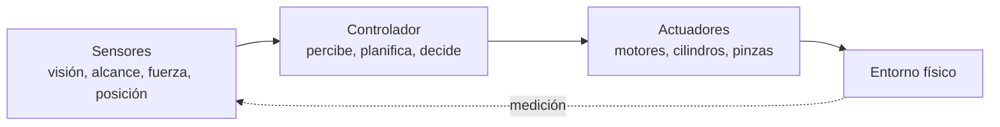
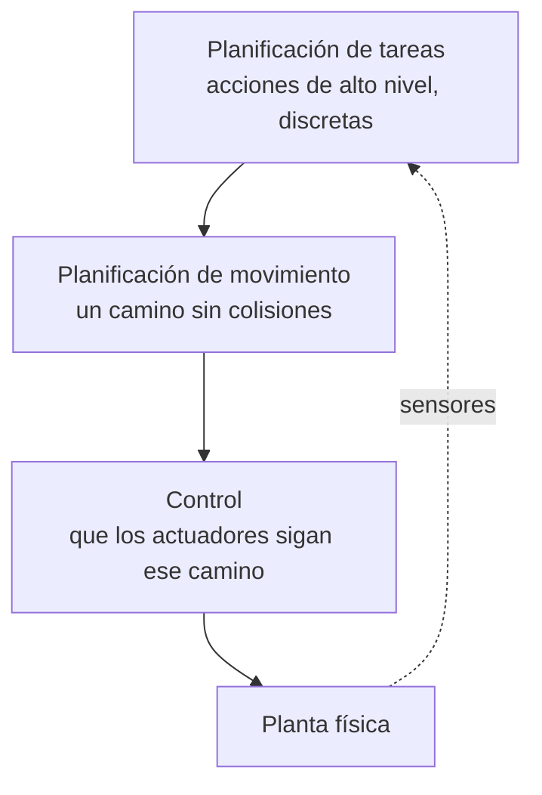
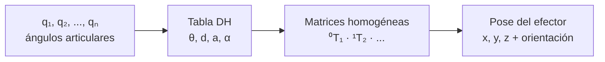
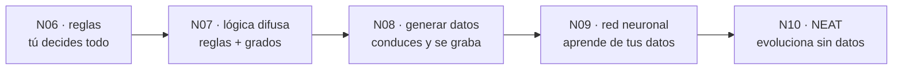
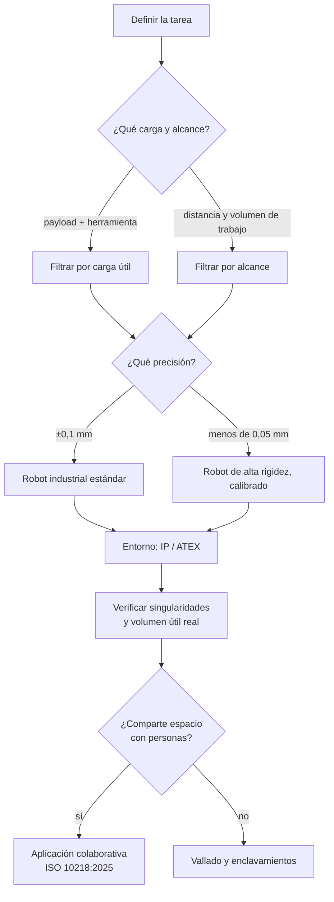
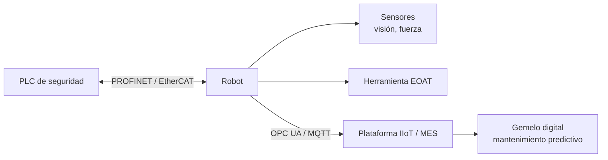

# UD04 — Análisis de sistemas robotizados

!!! info "Unidad 4 · 12 h · semanas 15-18"
    Cierra el bloque de aplicaciones de la IA. Se evalúa con **seis entregables prácticos** y la
    prueba escrita del RA4.

## 1. Introducción

Los robots ya no son una promesa de futuro: en 2024 se instalaron **más de 540.000 robots
industriales** en el mundo y España fue el **tercer mercado europeo**, impulsado por la automoción.
Entender cómo funciona un robot, cómo se modela su movimiento y cómo se diseña un sistema
robotizado es competencia directa de un especialista en IA, porque un robot es un **agente
encarnado**: el único sistema de IA de este curso que puede cambiar el estado del mundo físico.

Eso lo hace distinto de todo lo anterior. Un clasificador que se equivoca produce una etiqueta
errónea; un robot que se equivoca rompe una pieza, o algo peor. Y su entorno es **parcialmente
observable, estocástico y con más agentes dentro**: las cámaras no ven tras las esquinas, los
engranajes patinan y las personas que comparten el espacio son impredecibles.

El recorrido de la unidad:

1. **Métodos y aplicaciones de la robótica**: qué es un robot, su hardware (sensores, actuadores,
   pinzas) y dónde se usa, con datos del sector.
2. **Qué clase de problema resuelve la robótica** y la jerarquía tarea → movimiento → control.
3. **Modelado y control cinemático** de manipuladores: grados de libertad, parámetros DH,
   cinemática directa e inversa.
4. **Los problemas típicos** (singularidades, redundancia) y sus **soluciones**: espacio de
   configuración, planificación de movimiento y seguimiento de trayectoria.
5. **Percepción robótica**: localización, mapeo y SLAM.
6. **Planificación con incertidumbre y aprendizaje** en robótica.
7. **Las técnicas de programación** de robots, del *teach pendant* al ROS 2 — y comparadas en la
   práctica sobre un mismo problema.
8. **Humanos y robots**: coordinación y aprender lo que la persona quiere.
9. **El diseño e implementación** de un sistema robotizado: selección, célula, seguridad y
   normativa.

!!! tip "Hilo conductor de la unidad"
    Un robot percibe, razona y actúa sobre el mundo físico. Primero vemos con qué lo hace
    (hardware); luego cómo se describe y controla su movimiento (cinemática); después cómo decide
    por dónde ir (planificación) y cómo sabe dónde está (percepción); y por último cómo se programa
    y cómo se integra en un sistema seguro.

!!! note "De dónde sale el material de esta unidad"
    La parte de **percepción, planificación de movimiento, aprendizaje por refuerzo e interacción
    humano-robot** está construida a partir del capítulo 26 (*Robotics*) de
    [*Artificial Intelligence: A Modern Approach*](https://aima.cs.berkeley.edu/), 4.ª edición, de
    **Stuart Russell y Peter Norvig**, adaptada al nivel y a los criterios de evaluación de este
    módulo. Las prácticas con el simulador **AITK** provienen del curso
    [Models d'IA](https://lawer.github.io/mia/) de **Carles Gonzalez**, con licencia CC BY-NC-SA 4.0.

<!-- VIDEO: vídeo breve que muestre un brazo robótico industrial realizando una tarea (soldadura, paletizado) y el movimiento coordinado de sus articulaciones -->

## 2. Resultado de aprendizaje y criterios de evaluación

**RA4** — Analiza sistemas robotizados, evaluando opciones de diseño e implementación.

| CE | Criterio de evaluación | Bloque |
|---|---|---|
| RA4-a | Se han recopilado los problemas del modelado y control cinemático en robots manipuladores. | §4-6 |
| RA4-b | Se han buscado soluciones a los problemas de los robots. | §7-9 |
| RA4-c | Se han valorado las características diferenciadoras de las técnicas de programación de robots y de sistemas robotizados. | §10-11 |
| RA4-d | Se han evaluado diferentes opciones en el diseño e implementación de sistemas robotizados. | §12 |

!!! note "Bloque de contenidos oficial (RD 279/2021, anexo I)"
    El currículo llama a este bloque, textualmente, *«Análisis de sistemas robotizados»*, y le
    asigna estos contenidos:

    - *Métodos y aplicaciones de la robótica.*
    - *Modelado y control de robots.*
    - *Programación de robots y aplicaciones.*
    - *Sistemas robotizados. Diseño e implementación.*

    Son **cuatro contenidos para cuatro criterios de evaluación** y, a diferencia del resto de los
    RA de este módulo, aquí **encajan casi uno a uno**: es la excepción. El único matiz es que
    *«modelado y control»* alimenta a la vez RA4-a (los problemas) y RA4-b (las soluciones).

## 3. Objetivos de la unidad

| Objetivo | Al terminar la unidad serás capaz de… |
|---|---|
| O1 | **Clasificar** los robots por tipo y describir sus aplicaciones reales con datos del sector. |
| O2 | **Distinguir** los sensores por lo que miden (entorno, ubicación, configuración interna) y elegir el adecuado para una tarea. |
| O3 | **Explicar** grados de libertad, articulaciones y espacio articular frente a cartesiano. |
| O4 | **Resolver** la cinemática directa de un manipulador con parámetros DH y entender por qué la inversa es más difícil. |
| O5 | **Identificar** los problemas típicos (singularidades, redundancia, límites) y sus soluciones. |
| O6 | **Plantear** un problema de planificación de movimiento en el espacio de configuración y elegir un método. |
| O7 | **Explicar** cómo un robot se localiza y construye un mapa (SLAM) a partir de sensores con ruido. |
| O8 | **Comparar** las técnicas de programación de robots resolviendo un mismo problema por reglas, lógica difusa, red neuronal y neuroevolución. |
| O9 | **Aplicar** criterios de selección y diseño de un sistema robotizado (payload, alcance, sensores, seguridad). |
| O10 | **Valorar** la normativa de seguridad (ISO 10218:2025) y la integración en la Industria 4.0. |

## 4. Métodos y aplicaciones de la robótica (RA4-a)

### 4.1 ¿Qué es un robot?

Un **robot** es una máquina programable que **percibe su entorno**, **procesa información** y
**actúa físicamente** sobre él. Tiene tres partes que se realimentan:



Los **efectores** son las piezas que ejercen fuerza sobre el entorno: ruedas, patas,
articulaciones, pinzas. Cuando actúan, pueden cambiar tres cosas: el **estado del robot** (un coche
gira las ruedas y avanza), el **estado del entorno** (un brazo empuja una taza) e incluso el
**estado de las personas** alrededor (un exoesqueleto mueve una pierna; un robot se acerca al
ascensor y alguien se aparta).

### 4.2 Tipos de robot, desde el hardware

La imagen popular del robot con cabeza y dos brazos —el **antropomórfico** de la ficción— es la
menos frecuente en la realidad:

| Tipo | Qué es | Ejemplo |
|---|---|---|
| **Manipulador** | Un brazo, no necesariamente unido a un cuerpo: se atornilla a una mesa o al suelo | Brazos de una línea de montaje; brazos montados en sillas de ruedas para asistencia |
| **Robot móvil con ruedas** | Se desplaza sobre ruedas, dentro o fuera | Aspiradora, AGV/AMR de almacén, coche autónomo, rover de Marte |
| **Robot con patas** | Atraviesa terreno accidentado donde la rueda no llega | Cuadrúpedos de inspección |
| **Aéreo (UAV) y submarino (AUV)** | Rotores o propulsión sumergida | Cuadricópteros, vehículos de exploración oceánica |
| **Cobot** | Manipulador que comparte espacio con personas, con potencia y fuerza limitadas | Montaje asistido, inspección |
| **Otros** | Prótesis, exoesqueletos, robots con alas, **enjambres** y **entornos inteligentes**, donde el robot es la habitación entera | Rehabilitación, agricultura de precisión |

La diferencia entre un manipulador de una tonelada que ensambla coches y un brazo de asistencia no
es solo el tamaño: el primero mueve mucha carga, el segundo mueve poca pero es **seguro entre
personas**. Payload y seguridad son criterios distintos, y a menudo opuestos.

### 4.3 Sensores: qué se mide y con qué

Los sensores son la interfaz perceptiva del robot. Se clasifican de dos formas a la vez.

**Por cómo obtienen la señal**: los **pasivos** (cámaras) captan lo que el entorno emite; los
**activos** (sonar, lidar) emiten energía y miden lo que vuelve. Los activos dan más información,
pero consumen más y **se interfieren entre sí** cuando hay varios trabajando a la vez.

**Por lo que miden**:

| Clase | Qué informa | Sensores típicos |
|---|---|---|
| **Del entorno** | Distancia y forma de lo que hay alrededor | Sonar, visión estéreo, luz estructurada (Kinect), cámara de tiempo de vuelo, **lidar**, radar, táctiles |
| **De la ubicación** | Dónde está el robot | GPS/GLONASS, balizas de interior, análisis de señal wifi, balizas de sonar bajo el agua |
| **De la configuración interna** (propioceptivos) | Cómo está el propio robot | Encoders de eje, odometría de rueda, giroscopios, sensores de fuerza y par |

Las cifras ayudan a elegir:

| Sensor | Alcance y precisión | Dónde encaja |
|---|---|---|
| **Lidar de barrido** | Precisión de **~1 cm a 100 m** | El sensor de referencia en coches autónomos |
| **Cámara de tiempo de vuelo** | Imágenes de rango a **hasta 60 fps** | Interiores y distancias cortas; peor que el lidar a plena luz del día |
| **Radar** | Hasta **kilómetros**, y **ve a través de la niebla** | Vehículos aéreos y automoción |
| **GPS** | **Unos metros**; con GPS diferencial, precisión milimétrica en condiciones ideales | Exteriores. **No funciona en interiores ni bajo el agua** |
| **Sensores de fuerza y par** | Fuerzas en 3 traslaciones y 3 rotaciones, **cientos de medidas por segundo** | Manipular objetos frágiles o de forma desconocida |

!!! important "Por qué la odometría no basta"
    Contar vueltas de rueda parece una forma barata y exacta de saber cuánto has avanzado, y lo es
    — durante unos metros. Las ruedas **derrapan y patinan**, y el error se **acumula sin límite**:
    no hay nada que lo corrija. Por eso la odometría se combina siempre con sensores inerciales
    (giroscopios) y con alguna referencia externa. Es la razón de ser de la localización
    probabilística del §8.

!!! example "El caso de la bombilla"
    Imagina un manipulador de **una tonelada** enroscando una bombilla. Es facilísimo aplicar
    demasiada fuerza y romperla. Los **sensores de fuerza** le dicen con qué fuerza agarra y los
    **de par**, con qué fuerza gira; midiendo cientos de veces por segundo, el robot detecta una
    fuerza inesperada y corrige **antes** de romper el cristal. La capacidad de manipular con
    cuidado no viene de tener un brazo más suave, sino de **medir rápido**.

### 4.4 Actuadores y pinzas

El mecanismo que produce el movimiento es el **actuador**:

| Tipo | Cómo funciona | Dónde se usa |
|---|---|---|
| **Eléctrico** | Corriente que hace girar un motor | El más común; articulaciones de brazos robóticos |
| **Hidráulico** | Fluido a presión (aceite, agua) | Mucha fuerza: maquinaria pesada |
| **Neumático** | Aire comprimido | Movimientos rápidos y simples, pinzas |

Los actuadores mueven **articulaciones** entre eslabones rígidos: de **revolución** (un eslabón
gira respecto al otro) o **prismáticas** (uno se desliza sobre el otro). Las dos son de un solo
eje; las esféricas, cilíndricas y planas son multieje.

Para agarrar, el robot usa **pinzas**, y aquí hay un compromiso claro:

- La **pinza de mordaza paralela** —dos dedos, un actuador— es «amada y odiada por su simplicidad»:
  hace poco, pero nunca falla y se programa en un minuto.
- Las de **tres dedos** ganan algo de flexibilidad sin complicarse.
- En el otro extremo, una **mano antropomórfica** como la Shadow Dexterous Hand tiene **20
  actuadores**. Permite manipulación en la mano (coger el móvil y girarlo para orientarlo), pero
  **aprender a controlarla es mucho más difícil**.

!!! tip "Más grados de libertad no es mejor"
    Cada actuador que añades multiplica lo que el robot **puede** hacer y también lo que hay que
    **decidir** en cada instante. Veinte actuadores es un espacio de acción enorme. Casi toda la
    robótica industrial funciona con dos dedos y un actuador, porque la tarea no necesita más.

### 4.5 Aplicaciones, con datos (IFR *World Robotics* 2025)

| Dato | Valor (2024) |
|---|---|
| Robots industriales instalados en el año | **542.000** (cuarto año por encima de 500.000) |
| Stock operativo mundial | **4,66 millones** (+9 %) |
| Densidad robótica media | ~132-151 robots por 10.000 empleados |
| País líder en densidad | **Corea del Sur** (1.012-1.220) |
| Líder de mercado | **China** (295.000 unidades, 54 % de las instalaciones) |
| España, 3.er mercado europeo | **5.100 unidades**, impulsado por la automoción |
| Robótica médica | **+91 %** (~16.700 unidades), con el sistema **da Vinci** (cirugía por telemanipulación) como referencia del sector |
| Robots de servicio profesional | ~200.000 unidades (+9 %) |

!!! note "¿Por qué estos datos?"
    La **IFR (International Federation of Robotics)** publica cada año el informe *World Robotics*
    con las estadísticas oficiales del sector. Es la referencia para argumentar la importancia
    económica de la robótica con cifras y no con impresiones.

### 4.6 Cuatro casos reales

| Fabricante o robot | Características | Uso real |
|---|---|---|
| **KUKA KR AGILUS** | 6-11 kg de carga, 726-1.101 mm de alcance | Envasa 60 sándwiches por minuto; procesa 3.000 muestras de sangre al día |
| **FANUC (familia)** | Más de 100 modelos; cargas de hasta **2,3 t**, alcance de 4,7 m | Paletizado (M-410, 700 kg), soldadura, manipulación pesada |
| **Universal Robots e-Series** | UR3e (3 kg / 500 mm) … UR16e (16 kg / 900 mm); repetibilidad **±0,03-0,05 mm** | Montaje asistido, inspección, carga y descarga de máquinas |
| **Amazon Robotics** | Más de **1 millón** de robots de almacén | Logística: la flota reduce el tiempo de desplazamiento de los operarios |

!!! tip "Pensar en «robot + tarea», no en «robot»"
    No se elige el robot más caro: se define primero **la tarea** —qué pieza, qué peso, qué ritmo,
    qué precisión, qué entorno— y después se busca el modelo que cumple payload, alcance,
    repetibilidad y seguridad. Es el enfoque del §12 y del Notebook 11.

## 5. Qué clase de problema resuelve la robótica

Antes de elegir algoritmos conviene ver **qué tipo de problema** es. La robótica reúne casi todas
las dificultades del curso a la vez: es **no determinista**, **parcialmente observable** y
**multiagente**.

Y lo multiagente no es solo competitivo o solo cooperativo, sino los dos: en un pasillo estrecho
por el que solo cabe uno, el robot y la persona **colaboran** —ninguno quiere chocar— y a la vez
**compiten** un poco por pasar primero. Un robot demasiado educado, que siempre cede, se queda
atascado para siempre en un sitio concurrido y nunca llega.

!!! important "¿De quién es la recompensa?"
    En casi toda la robótica, el robot actúa **al servicio de una persona**: si lleva la comida a un
    paciente, la recompensa es del paciente, no suya. Y ahí está el problema: **la función de
    recompensa verdadera está en la cabeza del usuario**. El robot tiene que deducir lo que la
    persona quiere, o conformarse con la aproximación que le programó un ingeniero. Es el mismo
    problema de alineación que se trata en la UD06, aquí con un brazo de una tonelada.

### 5.1 La jerarquía de tres niveles

En crudo, las observaciones de un robot son señales de sensores (píxeles, impactos de láser) y sus
acciones son corrientes eléctricas enviadas a los motores. Entre eso y un plan como «lleva la
comida a la habitación 12» hay un abismo. La robótica lo salva **partiendo el problema**:



- **Planificación de tareas**: decide las submetas —ir a la puerta, abrirla, ir al ascensor, pulsar
  el botón—. Trabaja con estados y acciones **discretos**.
- **Planificación de movimiento**: encuentra un camino que lleva al robot de un punto a otro
  cumpliendo cada submeta (§7).
- **Control**: consigue que los actuadores ejecuten ese movimiento (§6.4).

!!! warning "Lo que se pierde al partir el problema"
    Dividir reduce la complejidad, pero **renuncia a que las partes se ayuden**. La acción puede
    mejorar la percepción (moverse para ver mejor) y decidir qué percepción hace falta. Un
    movimiento óptimo sobre el papel puede ser malo de seguir para el controlador. Y un plan de
    tareas puede ser **imposible de instanciar** a nivel de movimiento. Por eso la robótica actual
    avanza en cada nivel y, al mismo tiempo, en **volver a integrarlos**: planificar movimiento y
    control juntos, tareas y movimiento juntos, y cerrar el lazo con la percepción.

## 6. Modelado y control cinemático (RA4-a)

### 6.1 Conceptos básicos

Un manipulador se modela como una **cadena cinemática**: eslabones rígidos unidos por
articulaciones.

| Concepto | Definición |
|---|---|
| **Grado de libertad (DoF)** | Número de movimientos independientes. Hacen falta **≥ 6** para colocar el efector en cualquier posición **y** orientación en 3D |
| **Articulación de revolución (R)** | Gira: su variable es un ángulo θ |
| **Articulación prismática (P)** | Se desliza: su variable es una distancia d |
| **Eslabón** | Pieza rígida entre dos articulaciones |
| **Espacio articular** | El vector `q` con la posición de cada articulación |
| **Espacio cartesiano** | La **pose** del efector: posición más orientación |

| Configuración | Articulaciones | Uso típico |
|---|---|---|
| **Articulado / antropomórfico** | ≥ 3R | El más común en industria (6 ejes) |
| **Cartesiano / pórtico** | 3P | Manipulación simple, gran alcance |
| **SCARA** | RRP | Montaje de componentes: rígido en Z, flexible en XY |
| **Delta / paralelo** | Paralelas | Empaquetado de alta velocidad |

### 6.2 Cinemática directa (FK)

La **cinemática directa** calcula la pose del efector a partir de los valores articulares:
`pose = f(q)`. Se resuelve multiplicando **matrices de transformación homogénea** de 4×4, que
combinan rotación y traslación:

$$^0T_n = {}^0T_1 \cdot {}^1T_2 \cdot \ldots \cdot {}^{n-1}T_n$$

Cada transformación se describe con los **parámetros de Denavit-Hartenberg (DH)**: cuatro valores
por articulación ($\theta$, $d$, $a$, $\alpha$). Se escribe la tabla DH del robot y la pose sale de
encadenar las matrices.



!!! example "Tabla DH del Puma 560 (fragmento)"
    El Puma 560, brazo industrial clásico, se describe con una tabla como esta (metros y grados):

    | Articulación | θ (variable) | d | a | α |
    |---|---|---|---|---|
    | 1 | q₁ | 0,6718 | 0 | −90° |
    | 2 | q₂ | 0 | 0,4318 | 0° |
    | 3 | q₃ | 0,1500 | 0,0203 | 90° |
    | 4 | q₄ | 0,4318 | 0 | −90° |

    Con esos valores, `fkine([0, 0.2, 0.3, 0.4, 0.5, 0.6])` devuelve una matriz 4×4 con la pose del
    efector: una posición concreta del TCP, del orden de `[0,25; −0,13; 1,15]`. Se comprueba en el
    notebook de la unidad.

!!! example "Cinemática directa de un brazo plano 3R, a mano"
    Para un brazo en el plano con eslabones `l₁`, `l₂`, `l₃`:

    $$x = l_1\cos\theta_1 + l_2\cos(\theta_1{+}\theta_2) + l_3\cos(\theta_1{+}\theta_2{+}\theta_3)$$
    $$y = l_1\sin\theta_1 + l_2\sin(\theta_1{+}\theta_2) + l_3\sin(\theta_1{+}\theta_2{+}\theta_3)$$
    $$\varphi = \theta_1 + \theta_2 + \theta_3$$

    Con `l₁ = l₂ = l₃ = 1` y los tres ángulos a 0, el efector está en **(3, 0)** con orientación 0.
    Poniendo `θ₁ = 90°`, pasa a **(0, 3)**. El modelo geométrico predice exactamente dónde está la
    punta del brazo: eso es la cinemática directa, y **siempre tiene una única solución**.

### 6.3 Cinemática inversa (IK)

La **cinemática inversa** va al revés: dada una pose deseada, calcula los ángulos articulares que la
consiguen, `q = f⁻¹(pose)`. Es **mucho más difícil**, y ahí están casi todos los problemas que pide
recopilar el criterio RA4-a:

| Problema | En qué consiste | Cómo se aborda |
|---|---|---|
| **Múltiples soluciones** | Un 6R general puede tener **hasta 16 soluciones**; con muñeca esférica, 8 | Elegir por criterio: evitar obstáculos, minimizar el recorrido, codo arriba o abajo |
| **Redundancia** | Más DoF de los necesarios → **infinitas** soluciones | Optimizar en el **espacio nulo** del jacobiano |
| **Sin solución** | El objetivo está fuera del alcance | Detectarlo y avisar, no iterar sin fin |
| **Singularidad** | El jacobiano pierde rango → la velocidad articular tiende a infinito | Evitarla al planificar, o cruzarla bajando la velocidad cartesiana |

Los métodos se dividen en **analíticos** —desacoplamiento cinemático en muñecas esféricas, teorema
de Pieper— y **numéricos** —Newton-Raphson, pseudoinversa del jacobiano, CCD, FABRIK—.

### 6.4 Control

| Estrategia | Qué controla | Cómo |
|---|---|---|
| **Control de posición** | El ángulo de cada articulación | PID por eje: la medida es el encoder, la consigna el ángulo objetivo |
| **Control de velocidad** | La velocidad del efector (*resolved-rate*) | $\dot{q} = J^{+} v$, con la pseudoinversa de Moore-Penrose del jacobiano |
| **Control de fuerza / impedancia** | La interacción con el entorno | El robot se comporta como un sistema masa-muelle-amortiguador: ensamblaje, pulido |

Los controladores de seguimiento van de menos a más:

- **P** — aplica una acción proporcional al error de posición. Simple, pero oscila.
- **PD** — añade un término proporcional a la derivada del error, que **amortigua** la oscilación.
- **PID** — añade la integral del error, que corrige los **errores sistemáticos persistentes**.
- **Par calculado** — usa la **dinámica inversa** del robot para calcular el par que hace falta, y
  deja al PID solo la corrección de lo que el modelo no acierta. Es lo que usan los robots
  industriales de verdad.

Los robots industriales trabajan con **servomotores con encoder** en lazo cerrado, no con motores
paso a paso en lazo abierto: sin realimentación no hay forma de saber si el eje llegó.

!!! tip "De dónde salen las trayectorias"
    No se salta de un punto a otro: se **interpola**. `jtraj` genera la trayectoria en el espacio
    articular con un polinomio de 5.º grado (aceleración y *jerk* continuos, movimiento suave);
    `ctraj` genera una **línea recta cartesiana**, que es lo que hace falta cuando el efector lleva
    una herramienta de corte. El controlador va siguiendo esa trayectoria punto a punto.

## 7. Los problemas y sus soluciones (RA4-b)

### 7.1 Singularidades cinemáticas

Una **singularidad** es una configuración en la que el jacobiano pierde rango: el robot **pierde
capacidad de movimiento** en alguna dirección y los cálculos de velocidad se van a infinito.

| Singularidad | Cuándo ocurre |
|---|---|
| **De muñeca** | Los ejes 4 y 6 se alinean (θ₅ = 0): las dos articulaciones deberían girar a velocidad infinita |
| **De hombro** | El centro de la muñeca corta el eje de la base |
| **De codo** | El brazo queda completamente estirado o plegado |
| **De límite** | El efector llega al borde de su volumen de trabajo |

!!! important "Qué pasa de verdad si el robot entra en una singularidad"
    No es un problema abstracto de álgebra. Las velocidades articulares necesarias **tienden a
    infinito**, así que lo que se ve en la célula es **sobrecorriente en los servos, vibraciones o
    una parada de seguridad** en medio del ciclo. Por eso la planificación de trayectorias evita
    esas configuraciones, o las cruza reduciendo la velocidad cartesiana.

### 7.2 Soluciones

| Problema | Solución |
|---|---|
| Singularidades | Planificar evitándolas; medir la **manipulabilidad** (índice de Yoshikawa) para saber cuánto margen queda |
| IK compleja | **Desacoplamiento cinemático**: una muñeca esférica separa el problema de posición del de orientación |
| Múltiples soluciones | Criterios de optimización: evitar obstáculos, minimizar recorrido |
| Límites articulares | Modelarlos y restringir el *solver* |
| Precisión deficiente | **Calibrar** el robot, que puede mejorar la precisión hasta ×10, y medir la repetibilidad con la ISO 9283 |

!!! note "Precisión no es repetibilidad"
    Un robot puede ser **repetible** y a la vez **impreciso**: vuelve siempre al mismo punto, pero
    ese punto no es el que se programó. Para trabajar con *teach pendant* basta la repetibilidad —
    el punto se enseñó ahí—, pero en **programación offline**, donde las coordenadas vienen de un
    CAD, la precisión es crítica y hay que calibrar (por ejemplo, un ABB IRB 1600 con láser
    *tracker*). La repetibilidad de los cobots UR e-Series es de **±0,03-0,05 mm**.

### 7.3 El espacio de configuración

Para planificar el movimiento hay que cambiar de punto de vista. En vez de pensar en el robot
moviéndose por una habitación, se piensa en un **punto moviéndose por el espacio de
configuración**: el espacio abstracto de **todas las configuraciones posibles** del robot.

Para un brazo de 6 ejes, ese espacio tiene 6 dimensiones —una por articulación—; para un robot móvil
en un plano, 3 (x, y, orientación). Los obstáculos del mundo real se convierten en **regiones
prohibidas** de ese espacio, y lo que queda es el **espacio libre**. El problema deja de ser
geométrico y se vuelve una búsqueda de camino.

!!! example "El problema de la mudanza del piano"
    La planificación de movimiento se llama a veces así, por el esfuerzo de una empresa de mudanzas
    para llevar un piano grande y de forma irregular de una habitación a otra sin golpear nada.
    Formalmente hacen falta: un espacio de trabajo `W`, una región de obstáculos `O ⊂ W`, un robot
    con su espacio de configuración `C`, una configuración inicial `q_s` y una objetivo `q_g`. Y lo
    que se busca es un **camino continuo** por el espacio libre entre las dos.

    El problema se complica de tres formas típicas: que el objetivo sea un **conjunto** de
    configuraciones válidas en vez de una sola; que haya que **minimizar un coste** (longitud del
    camino, energía); o que haya **restricciones** — si el robot lleva una taza de café, tiene que
    mantenerla vertical todo el trayecto.

### 7.4 Cómo se planifica el movimiento

| Método | Idea | Fuerte en | Flojo en |
|---|---|---|---|
| **Grafo de visibilidad** | Nodos en los vértices de los obstáculos, aristas donde hay línea de visión clara; después A\* o Dijkstra | Da el camino **más corto** en 2D con obstáculos poligonales | Escala mal con muchos obstáculos; el camino **roza** las esquinas |
| **Diagrama de Voronoi** | Divide el espacio en regiones por cercanía a cada obstáculo; el robot circula por los **bordes** entre regiones | Maximiza la distancia a los obstáculos: caminos **seguros** | Caminos más largos de lo necesario |
| **Descomposición celular** | Trocea el espacio libre en celdas y busca sobre el grafo de adyacencia | Sencillo y completo en su resolución | El número de celdas explota al subir de dimensión |
| **Muestreo (RRT, PRM)** | Va lanzando configuraciones al azar y conectando las válidas hasta unir inicio y meta | Es lo único práctico con **muchas dimensiones** (brazos de 6-7 ejes) | No garantiza el camino óptimo; el resultado es irregular y hay que suavizarlo |

Los dos primeros ilustran bien un compromiso que reaparece siempre: el grafo de visibilidad busca
el camino **más corto**, que pasa pegado a las esquinas; el diagrama de Voronoi busca el **más
seguro**, que se aleja de todo y por eso es más largo. Cuál conviene depende de si el riesgo es
chocar o es tardar.

Cualquiera de los cuatro devuelve un camino que suele necesitar un último paso de **suavizado** o de
**replanificación** cuando el entorno cambia.

### 7.5 Seguimiento de trayectoria: del plan a la política

Aquí hay una distinción que conviene tener clara, porque explica cómo está montada la robótica de
verdad.

Un **plan** dice qué camino recorrer. Una **política** dice qué acción tomar **desde cualquier
estado** en el que el robot se encuentre. Las leyes de control del §6.4 son políticas, no planes.

Lo que se hace en la práctica es una **componenda en dos pasos**:

1. Se **planifica** en un espacio simplificado — solo el estado cinemático, suponiendo que se puede
   pasar de una configuración a la vecina sin preocuparse de la dinámica. Sale la **trayectoria de
   referencia**.
2. Se **convierte en política**: un controlador que intenta seguir ese plan y **vuelve a él** cuando
   se desvía.

!!! warning "Esa componenda introduce dos suboptimalidades"
    La primera, **planificar sin tener en cuenta la dinámica**: el camino más corto en el papel
    puede ser el que peor sigue el robot real. La segunda, **suponer que si te desvías lo mejor es
    volver al plan original**, cuando a veces lo óptimo es replanificar desde donde estás. El
    **control óptimo** ataca las dos a la vez: optimiza directamente sobre las acciones teniendo en
    cuenta la dinámica, con técnicas de optimización de trayectoria (*multiple shooting*,
    colocación directa) y, cuando el coste es cuadrático y la dinámica lineal, con el **LQR** —y su
    variante **iLQR**, que es lo que se usa cuando no se cumplen esas condiciones ideales, que es
    casi siempre.

## 8. Percepción robótica (RA4-b)

**Percepción** es convertir medidas de sensores en una representación interna del entorno. Y el
problema de fondo es el del §4.3: **todos los sensores tienen ruido y ninguno lo ve todo**.

### 8.1 Localización y mapeo

Hay tres problemas, de menos a más difícil:

| Problema | Lo que se sabe | Lo que se busca |
|---|---|---|
| **Localización** | El mapa | Dónde está el robot |
| **Mapeo** | Dónde está el robot | El mapa |
| **SLAM** | Nada de las dos | **Las dos a la vez** |

*SLAM* (*Simultaneous Localization And Mapping*) es el caso realista y parece un imposible —para
saber dónde estás necesitas el mapa, y para hacer el mapa necesitas saber dónde estás—, pero se
resuelve **probabilísticamente**: en vez de una respuesta, el robot mantiene una **distribución de
probabilidad** sobre dónde puede estar (su *estado de creencia*) y la va afinando con cada medida.

Las herramientas son las mismas que aparecen en toda la IA con incertidumbre: **filtros de Kalman**,
**modelos ocultos de Markov** y **redes bayesianas**, que modelan la transición de estado y el
sensor.

!!! example "Localización de Monte Carlo, en tres fotos"
    La localización con **filtro de partículas** (MCL) representa la creencia con una nube de
    «partículas», cada una una hipótesis de dónde está el robot:

    1. Al arrancar, las partículas están **repartidas por todo el plano**: incertidumbre total.
    2. Llega el primer conjunto de medidas y las partículas se **agrupan** en las zonas
       compatibles. Suelen quedar **varios grupos**: los pasillos de un edificio de oficinas se
       parecen entre sí, y el robot todavía no puede distinguirlos.
    3. Con suficientes medidas, todas las partículas **colapsan en un solo sitio**.

    Lo interesante es el paso 2: el robot representa explícitamente que hay **varias respuestas
    posibles** en vez de escoger una y equivocarse. Solo hacen falta dos modelos: el del movimiento
    y el del sensor.

### 8.2 Qué representación conviene

La tendencia en robótica es hacia representaciones con **semántica bien definida** — no solo
«aquí hay algo», sino «esto es una puerta». Y las técnicas probabilísticas **ganan** a las
alternativas en los problemas difíciles de percepción, como el propio SLAM.

!!! tip "Pero no siempre hace falta la artillería"
    Las técnicas estadísticas son a veces **demasiado engorrosas** para lo que se necesita, y una
    solución más simple es igual de efectiva en la práctica. Es el mismo criterio de la UD05 con el
    PID: empezar simple y añadir complejidad solo cuando se justifica. Los `N06` y `N07` de esta
    unidad navegan con reglas y con lógica difusa sobre los píxeles de una cámara, sin ningún filtro
    probabilístico, y funcionan.

### 8.3 Percepción que se adapta

Hay un tipo de aprendizaje que resuelve un problema muy concreto: que las medidas de los sensores
cambian **de golpe** cuando cambia el entorno.

Piensa en entrar desde un exterior soleado a una habitación con fluorescentes. No solo hay menos
luz: el fluorescente tiene **más componente verde** que el sol, así que todos los colores cambian.
Y sin embargo no nos parece que a la gente se le haya puesto la cara verde. Nuestra percepción se
**readapta** en segundos y el cerebro ignora la diferencia. Un robot que no haga eso creerá que ha
cambiado de mundo.

## 9. Incertidumbre y aprendizaje (RA4-b)

### 9.1 Planificar cuando no se sabe el estado exacto

La incertidumbre viene de tres sitios: el entorno es **parcialmente observable**, los efectos de las
acciones son **estocásticos** (o simplemente no están modelados) y los propios algoritmos de
estimación son **aproximados** — un filtro de partículas no da el estado de creencia exacto ni con
un modelo perfecto.

La mayoría de los robots en producción usan, aun así, **algoritmos deterministas**, y se apañan con
dos atajos:

1. **Discretizar** el espacio de estados continuo (grafo de visibilidad, descomposición celular).
2. Ante la duda sobre el estado actual, **quedarse con el más probable** de la distribución.

Es más rápido y escala mejor. El precio es que el robot actúa como si estuviera seguro cuando no lo
está.

!!! important "Cuándo ese atajo se rompe"
    Quedarse con el estado más probable funciona mientras la distribución tenga **un solo pico
    claro**. Falla justo en los casos del §8.1, paso 2: cuando hay **varias hipótesis igual de
    buenas** —tres pasillos que se parecen—, elegir la más probable es tirar una moneda, y el robot
    actúa con plena confianza sobre una respuesta que tiene un 33 % de ser cierta.

### 9.2 Aprendizaje por refuerzo en robótica

El aprendizaje por refuerzo funciona muy bien en simulación y muy mal en un robot real, y la razón
es sencilla: **el mundo real se niega a ir más rápido que el tiempo real**.

| | En simulación | En un robot real |
|---|---|---|
| Velocidad | Millones de pruebas en unas horas | Las mismas pruebas tardarían **años** |
| Riesgo | Ninguno | El robot **no puede arriesgarse** a una prueba que lo dañe — y por tanto **no puede aprender de ella** |

De ahí que el problema central sea la **transferencia de la simulación a la realidad**
(*sim-to-real*), que es un área de investigación activa. Y de ahí también que los sistemas robóticos
prácticos incorporen **conocimiento previo** sobre el robot, el entorno y la tarea: es la única
forma de aprender rápido y de comportarse con seguridad mientras aprende.

!!! tip "Esto conecta con toda la unidad"
    `N08`, `N09` y `N10` hacen exactamente este recorrido en pequeño y **en simulación**, que es
    donde se puede: generar datos conduciendo el robot, entrenar una red con ellos, y después
    dejar que la solución **evolucione** sin datos etiquetados.

## 10. Técnicas de programación de robots (RA4-c)

### 10.1 Las cinco formas de programar un robot industrial

| Técnica | Cómo funciona | Ventajas | Desventajas | Cuándo |
|---|---|---|---|---|
| **Teach pendant** | Guías el brazo con la consola por los puntos de paso y los grabas | Curva de aprendizaje mínima, puesta a punto rápida | **Para la producción** mientras se programa; poca flexibilidad | Trayectorias básicas, paletizado, soldadura por puntos |
| **Guiado manual** | Mueves el efector con la mano y registras posiciones | Muy intuitivo, sin escribir código | Solo en cobots seguros | Cobots, montaje asistido |
| **Programación textual** | Código nativo del fabricante: RAPID, KRL, URScript | Determinista, se integra con PLC y seguridad | Sintaxis propietaria, **no portable** | Células industriales estables de alta cadencia |
| **Programación offline (OLP)** | Se programa en simulación sobre modelos CAD | **Cero impacto en producción**; permite probar hipótesis | Coste de licencias; **exige modelos precisos y robot calibrado** | Geometrías complejas, células multimarca |
| **ROS 2 y frameworks** | Middleware de nodos, *topics* y servicios | Estándar abierto, acceso directo a algoritmos de IA | Curva de aprendizaje alta | Investigación, robots móviles, multi-robot |

!!! tip "URScript se parece a Python"
    Los robots de **Universal Robots** se programan en **URScript**, un lenguaje muy parecido a
    Python que además puede enviarse al robot desde un cliente Python por FTP, SSH o RTDE. Es la
    puerta de entrada natural a la programación de cobots desde este módulo.

### 10.2 Robots colaborativos

Los **cobots** comparten espacio con las personas sin vallado gracias a la **limitación de potencia
y fuerza**. Ejemplos: Universal Robots (UR3e a UR16e, de 3 a 16 kg), Franka Emika (orientada a la
academia) y KUKA LBR.

!!! important "«Colaborativo» no es una propiedad del hardware"
    La **ISO 10218:2025** prohíbe llamar «robot colaborativo» a un brazo aislado. Lo que puede ser
    colaborativa es la **aplicación completa**: robot + herramienta + entorno + tarea. Un cobot con
    un cuchillo en la pinza no es una aplicación colaborativa. Es un matiz legal, y es el que
    decide si hace falta vallado.

### 10.3 Comparar técnicas de verdad: el mismo problema, cuatro veces

La tabla del §10.1 compara técnicas **industriales**. Pero el criterio RA4-c pide valorar
características diferenciadoras, y eso se aprende mejor resolviendo **un mismo problema de varias
maneras** y viendo qué cambia.

Los entregables de esta unidad hacen precisamente eso: un robot con una cámara tiene que **seguir
una línea** en el suelo, y el problema se resuelve cuatro veces.

| Entregable | Técnica | Qué escribes tú | Qué sale del programa |
|---|---|---|---|
| `N06` | **Reglas** sobre los píxeles | Todas las condiciones, a mano | Nada: el comportamiento es el que programaste |
| `N07` | **Lógica difusa** | Las variables lingüísticas y las reglas | La transición suave entre ellas |
| `N09` | **Red neuronal supervisada** | La arquitectura y el entrenamiento; los datos salen de `N08` | El comportamiento, aprendido de tus propios ejemplos |
| `N10` | **Neuroevolución (NEAT)** | La función de aptitud | La red **y su topología**, evolucionadas sin ejemplos |



!!! note "Lo que hay que observar al compararlas"
    No es cuál «funciona mejor», sino **qué se gana y qué se pierde** en cada salto: cuánto código
    escribes, cuánto tienes que entender del problema, cuántos datos necesitas, cuánto tarda en
    estar listo y —lo más importante— **si puedes explicar por qué el robot hizo lo que hizo**. Las
    reglas de `N06` se leen; los pesos de la red de `N09`, no. Es la misma tensión entre
    interpretabilidad y potencia que viste en la UD05 con los sistemas expertos, y que la UD06
    convierte en un problema legal.

## 11. Humanos y robots (RA4-c, RA4-d)

Cuando el robot comparte espacio con personas aparece un problema que no es de mecánica ni de
control: hay que **coordinarse con un agente que tiene sus propios objetivos** y no se deja modelar
como un obstáculo móvil.

### 11.1 Coordinación

La forma habitual de plantearlo es como un **juego** entre el robot y la persona. Eso supone
explícitamente que las personas son **agentes con objetivos**, no obstáculos que se mueven.

Y ahí está la trampa: suponerlo no significa que la persona sea **perfectamente racional**. El
juego es difícil de resolver para el robot, pero también **para nosotros**: obliga a pensar en lo
que hará el robot en respuesta a lo que hace la persona, que depende de lo que el robot cree que
hará la persona, que depende de… y se entra en un «¿qué crees que creo que crees?» sin fondo. Las
personas no gestionamos eso, así que nos comportamos de forma **subóptima** de maneras bastante
predecibles. Un robot que asuma racionalidad perfecta predecirá mal.

La solución práctica se descompone en dos:

1. **Predicción**: usar lo que la persona está haciendo ahora para estimar qué hará después.
2. **Acción**: usar esa predicción para calcular el movimiento del robot.

### 11.2 Aprender lo que la persona quiere

Vuelve el problema del §5: la recompensa verdadera está en el usuario. Un robot que ayuda no puede
esperar a que alguien le escriba la función objetivo perfecta, porque **el propio usuario no sabría
escribirla**. Tiene que inferirla observando: qué corrige la persona, qué acepta, qué repite.

!!! warning "Y esto no es un detalle técnico"
    Un robot que optimiza una aproximación mala del objetivo real hace **exactamente lo que se le
    pidió** y no lo que se quería. Con un brazo de una tonelada o un vehículo de dos toneladas, eso
    deja de ser una curiosidad y se convierte en el problema de seguridad que se trata a fondo en la
    **UD06** (*specification gaming*, el problema del rey Midas). Aquí basta con retenerlo:
    **especificar mal el objetivo es un modo de fallo, igual que una singularidad.**

## 12. Diseño e implementación de sistemas robotizados (RA4-d)

### 12.1 Criterios de selección

| Criterio | Pregunta guía | Dato típico |
|---|---|---|
| **Carga útil (payload)** | ¿Qué masa mueve el efector, contando la herramienta? | UR3e 3 kg … UR16e 16 kg; FANUC hasta 2,3 t |
| **Alcance** | ¿Qué distancia máxima hay que alcanzar? | KUKA KR AGILUS 726-1.101 mm; FANUC 4,7 m |
| **Repetibilidad** | ¿Cuánta dispersión al volver al mismo punto? | UR e-Series ±0,03-0,05 mm |
| **Precisión** | ¿El punto alcanzado coincide con el programado? | Mejora al calibrar |
| **Entorno** | ¿Temperatura, polvo, humedad, atmósfera explosiva? | Versiones IP / ATEX |

!!! important "El payload no es el peso de la pieza"
    Es el peso de la pieza **más** la herramienta (EOAT), la brida, los cables y los sensores
    acoplados. Y además hay que comprobar que los **momentos de inercia** de la herramienta no
    superan los límites de las reductoras de la muñeca: un robot puede aguantar 10 kg pegados a la
    brida y no aguantar 6 kg en el extremo de una herramienta larga.



### 12.2 Sensores de la célula

- **Propioceptivos**: encoders, corriente, temperatura de articulación.
- **Exteroceptivos**: visión 2D/3D, fuerza/par, proximidad, láser.

Los de **fuerza/par** son imprescindibles en tareas de contacto con control de impedancia. La
**visión** es lo que permite el *pick and place* sin posiciones fijas —piezas en cualquier
orientación— y es la puerta de entrada de la IA a la célula: es justo lo que se practica en el
notebook de OpenCV y en `N05`.

### 12.3 Ejemplo guiado: elegir el robot y evitar la singularidad

Recorremos el razonamiento que repetirás en el Notebook 11.

**Problema**: una línea de ensamblaje tiene que coger una pieza de 1,5 kg de un transportador y
colocarla en una estación a 700 mm, con repetibilidad de ±0,1 mm.

**Paso 1 · Payload.** Pieza (1,5 kg) + pinza (0,5 kg) + cables ≈ **2,2 kg**. Hace falta payload
≥ 2,5 kg y alcance ≥ 700 mm. Un **UR5e** (5 kg, 850 mm) o un KUKA KR AGILUS de 6 kg cumplen.

**Paso 2 · Repetibilidad.** La tarea tolera ±0,1 mm y los dos modelos van sobrados (UR e-Series
±0,05 mm). No hace falta calibración de precisión porque los puntos se enseñarán, no vendrán de un
CAD.

**Paso 3 · Volumen de trabajo y singularidades.** Se simula la célula y se comprueba que la
trayectoria no pasa por codo estirado ni muñeca alineada. Si el *layout* obligara a cruzar una
singularidad, **se cambia el layout**, no el controlador: es más barato mover el transportador que
pelearse con el robot.

**Paso 4 · Seguridad.** Si el brazo comparte espacio con personas → **aplicación colaborativa**
(ISO 10218:2025), con limitación de fuerza y evaluación biomecánica de la tarea completa. Si es una
célula aislada de alta cadencia → vallado con puertas enclavadas.

!!! note "Conclusión del ejemplo guiado"
    Elegir un robot es **emparejar la tarea con el modelo** —payload, alcance, repetibilidad,
    entorno, seguridad— y **verificarlo en simulación** antes de comprar nada. Ese es el criterio
    RA4-d, y el orden importa: primero la tarea, después el robot.

### 12.4 El ciclo de vida

1. **Requisitos**: qué tarea, qué cadencia, qué entorno.
2. **Selección** del robot y las herramientas.
3. **Simulación y diseño de la célula**: *layout*, obstáculos, trayectorias.
4. **Integración**: robot + PLC + sensores + comunicaciones.
5. **Puesta en marcha**: programación, pruebas de ciclo, validación de seguridad.
6. **Mantenimiento**: predictivo, con gemelos digitales y telemetría.

### 12.5 La célula y la Industria 4.0



- El **PLC** coordina la célula con buses deterministas (PROFINET, EtherCAT, EtherNet/IP).
- La telemetría se publica con **OPC UA** o **MQTT** para supervisión remota.
- Con esos datos, el **gemelo digital** y el mantenimiento predictivo anticipan fallos —fatiga de
  reductoras, por ejemplo— antes de que paren la línea.

### 12.6 Seguridad y normativa

| Norma | Qué regula |
|---|---|
| **ISO 12100** | Evaluación de riesgos de máquinas: la base de todo |
| **ISO 10218-1 / -2** | Robots y sistemas robóticos industriales: requisitos de seguridad |
| **ISO/TS 15066** | Cobots: límites biomecánicos de fuerza y velocidad |
| **ISO 10218:2025** | **Versión vigente**: absorbe la ISO/TS 15066 y obliga a evaluar la aplicación colaborativa completa |
| **ISO 9283** | Cómo se mide la repetibilidad y la precisión de un robot |

!!! warning "Lo que cambió en 2025"
    La **ISO 10218:2025** absorbe los límites biomecánicos de la ISO/TS 15066 y los vuelve
    **obligatorios**, y añade **auditorías de ciberseguridad industrial** de la célula. Un robot
    conectado a la red de planta es una superficie de ataque: aquí la seguridad se diseña desde el
    principio, que es el *security by design* de la UD06 aplicado a una máquina que se mueve.

## 13. Practicar sin robot: los dos simuladores de la unidad

### 13.1 `roboticstoolbox-python`, para la cinemática

Para el modelado de manipuladores (§6) usamos **roboticstoolbox-python**, de Peter Corke, que trae
más de 50 modelos de robots reales (Panda, UR, Puma 560) con su cinemática resuelta.

```bash
pip install roboticstoolbox-python spatialmath-python
```

```python
import roboticstoolbox as rtb

robot = rtb.models.Panda()
print(robot)

# Cinematica directa: de los angulos a la pose
pose = robot.fkine([0, -0.8, 0.8, 0, 0.8, 0, 0])
print(pose)

# Cinematica inversa por Levenberg-Marquardt
q = robot.ikine_LM(pose)
print(q)
```

### 13.2 AITK, para el robot móvil

Las prácticas de navegación (§10.3) usan **AITK** (`aitk.robots`), un simulador ligero de robots
móviles con cámara que funciona dentro del propio notebook: se define un mundo con una imagen de
fondo, se coloca un robot con sus sensores y se le pasa una función de control.

```bash
pip install aitk aitk.robots
```

```python
import aitk.robots as bots

world = bots.World(220, 180, boundary_wall_color="yellow",
                   ground_image_filename="EX2_pista_6.png")
robot = bots.Scribbler(x=100, y=90, a=90)
robot.add_device(bots.Camera(64, 32))
world.add_robot(robot)

world.reset()
world.seconds(30, [mi_controlador], real_time=True)
```

!!! note "Alternativas de simulación 3D"
    - **Webots**: entorno 3D completo, gratuito, ideal para aula sin hardware.
    - **CoppeliaSim Edu**: gratuito para centros educativos, muy usado en investigación.

    En este módulo trabajamos **en Python** —rápido y sin instalar simuladores 3D—; si el aula
    dispone de Webots o CoppeliaSim, se decide con el profesor.

## 14. Puntos clave de la unidad

- Un robot es un **agente encarnado**: el único sistema de IA del curso que cambia el estado del
  mundo físico, en un entorno **parcialmente observable, estocástico y multiagente**.
- En 2024 se instalaron **542.000 robots industriales** y España fue el **3.er mercado europeo**
  (IFR *World Robotics* 2025).
- Los sensores se clasifican por **cómo miden** (pasivos frente a activos) y por **qué miden**
  (entorno, ubicación, configuración interna). La **odometría se degrada sin límite** porque las
  ruedas patinan: hay que corregirla con referencias externas.
- Más grados de libertad no es mejor: una mano de **20 actuadores** puede más, pero **es mucho más
  difícil de controlar** que una pinza de dos dedos.
- La robótica parte el problema en **tarea → movimiento → control**. Reduce la complejidad, pero
  renuncia a que los niveles se ayuden entre sí.
- El movimiento de un manipulador se modela como **cadena cinemática**: articulaciones R o P,
  eslabones y **grados de libertad** (≥ 6 para pose libre en 3D).
- La **cinemática directa** (parámetros **DH**) tiene solución única; la **inversa** tiene hasta
  **16 soluciones**, redundancia y **singularidades** en las que la velocidad articular tiende a
  infinito.
- **Precisión no es repetibilidad**: un robot puede volver siempre al mismo punto equivocado. Con
  *teach pendant* basta la repetibilidad; con programación **offline**, hay que calibrar.
- Planificar el movimiento es buscar un camino en el **espacio de configuración**. El grafo de
  visibilidad da el camino **más corto**; Voronoi, el **más seguro**; el **muestreo (RRT, PRM)** es
  lo único viable con muchas dimensiones.
- Un **plan** dice qué camino seguir; una **política** dice qué hacer desde cualquier estado. La
  robótica real planifica en cinemática y luego **convierte el plan en política**, aceptando dos
  suboptimalidades; el **control óptimo** (LQR, iLQR) ataca las dos a la vez.
- **SLAM** resuelve localización y mapeo simultáneos manteniendo una **distribución de
  probabilidad** sobre dónde está el robot, no una respuesta única.
- El **aprendizaje por refuerzo** funciona en simulación y falla en el robot real: el mundo no va
  más rápido que el tiempo real y el robot **no puede arriesgarse a la prueba que lo dañaría**. De
  ahí el problema *sim-to-real*.
- Hay **cinco formas** de programar un robot industrial (*teach pendant*, guiado manual, textual,
  offline y ROS 2), y la unidad las compara en la práctica resolviendo **un mismo problema** con
  reglas, lógica difusa, red neuronal y neuroevolución.
- **«Colaborativo» no es una propiedad del hardware**: lo es de la aplicación completa (ISO
  10218:2025).
- Diseñar un sistema robotizado es **emparejar la tarea con el modelo** —payload con herramienta,
  alcance, repetibilidad, entorno, seguridad— y **verificarlo en simulación** antes de comprar.

## 15. Glosario

| Término | Definición |
|---|---|
| **Robot** | Máquina programable que percibe, procesa y actúa físicamente sobre el entorno |
| **Efector** | Pieza que ejerce fuerza sobre el entorno: rueda, pata, articulación, pinza |
| **Manipulador** | Brazo robótico, unido o no a un cuerpo |
| **Cobot** | Robot que comparte espacio con personas limitando potencia y fuerza |
| **Sensor pasivo / activo** | El pasivo capta lo que el entorno emite; el activo emite energía y mide el retorno |
| **Sensor propioceptivo** | Informa del estado del propio robot: encoder, giroscopio, fuerza/par |
| **Odometría** | Medida de la distancia recorrida contando revoluciones de rueda |
| **Lidar** | Telémetro óptico activo de barrido; ~1 cm de precisión a 100 m |
| **Cámara de tiempo de vuelo** | Cámara que mide distancia por el tiempo que tarda la luz en volver |
| **Actuador** | Mecanismo que produce el movimiento: eléctrico, hidráulico o neumático |
| **EOAT** | *End of arm tooling*: la herramienta del extremo del brazo |
| **Grado de libertad (DoF)** | Movimiento independiente de una articulación |
| **Articulación de revolución / prismática** | Gira (ángulo θ) / se desliza (distancia d) |
| **Eslabón** | Pieza rígida entre dos articulaciones |
| **Espacio articular** | Vector con la posición de cada articulación |
| **Espacio cartesiano** | Pose del efector: posición más orientación |
| **Pose** | Posición y orientación de un cuerpo en el espacio |
| **Cinemática directa (FK)** | De los ángulos articulares a la pose del efector |
| **Cinemática inversa (IK)** | De la pose deseada a los ángulos articulares |
| **Parámetros DH** | Denavit-Hartenberg: θ, d, a, α que describen cada transformación |
| **Transformación homogénea** | Matriz 4×4 que combina rotación y traslación |
| **Jacobiano** | Matriz que relaciona velocidades articulares y cartesianas |
| **Singularidad** | Configuración en la que el jacobiano pierde rango |
| **Redundancia** | Más grados de libertad de los necesarios: infinitas soluciones de IK |
| **Manipulabilidad** | Medida (Yoshikawa) de cuánto margen de movimiento queda en una configuración |
| **Desacoplamiento cinemático** | Separar la IK en posición y orientación con una muñeca esférica |
| **Espacio de configuración** | Espacio de todas las configuraciones posibles del robot |
| **Espacio libre** | La parte del espacio de configuración sin colisión |
| **Grafo de visibilidad** | Grafo de vértices de obstáculos unidos por líneas de visión libres |
| **Diagrama de Voronoi** | División del espacio por cercanía; sus bordes son caminos seguros |
| **RRT / PRM** | Planificadores por muestreo aleatorio, para muchas dimensiones |
| **Plan / política** | Un camino concreto / qué hacer desde cualquier estado |
| **PID** | Controlador proporcional-integral-derivativo |
| **Par calculado** | Control que usa la dinámica inversa y deja al PID solo el error residual |
| **Resolved-rate** | Control de velocidad del efector con la pseudoinversa del jacobiano |
| **Control de impedancia** | El robot se comporta como masa-muelle-amortiguador ante el contacto |
| **LQR / iLQR** | Regulador cuadrático lineal y su variante iterativa: control óptimo |
| **SLAM** | Localización y mapeo simultáneos |
| **Filtro de partículas (MCL)** | Localización que representa la creencia como una nube de hipótesis |
| **Estado de creencia** | Distribución de probabilidad sobre el estado real |
| **Sim-to-real** | Transferir a un robot real lo aprendido en simulación |
| **Teach pendant** | Consola manual para programar guiando el brazo por los puntos |
| **OLP** | Programación offline, en simulación sobre modelos CAD |
| **URScript / RAPID / KRL** | Lenguajes nativos de Universal Robots, ABB y KUKA |
| **ROS 2** | Middleware de robótica con nodos, *topics* y servicios |
| **NEAT** | Neuroevolución que evoluciona pesos **y topología** de la red |
| **Payload** | Carga útil máxima, contando herramienta, brida, cables y sensores |
| **Repetibilidad** | Dispersión al volver al mismo punto (ISO 9283) |
| **Precisión** | Diferencia entre el punto programado y el alcanzado |
| **Célula robotizada** | Unidad de producción completa: robot, herramientas, PLC y sensores |
| **Gemelo digital** | Réplica virtual de la máquina alimentada con datos reales |
| **ISO 10218:2025** | Norma vigente de seguridad de robots; absorbe la ISO/TS 15066 |
| **ISO/TS 15066** | Límites biomecánicos de los cobots |

## 16. FAQ

??? question "¿Un robot necesita inteligencia artificial?"
    No siempre. Muchísimos robots industriales ejecutan programas fijos y funcionan perfectamente.
    La IA aparece cuando el robot debe **percibir, adaptarse o aprender**: visión para localizar
    piezas sin posición fija, planificación en entornos que cambian, aprendizaje de una tarea. Si la
    pieza siempre llega en el mismo sitio, un programa fijo es la respuesta correcta.

??? question "¿Qué pasa exactamente si el robot entra en una singularidad?"
    Las velocidades articulares necesarias tienden a infinito, así que el servo pide una corriente
    que no puede dar: vibraciones, error de seguimiento o parada de seguridad. No «se rompe» sin
    más, pero el ciclo se cae. Por eso se evita al planificar o se cruza reduciendo la velocidad
    cartesiana.

??? question "¿Por qué un robot de 6 ejes puede llegar al mismo punto de varias formas?"
    Porque la cinemática inversa tiene **múltiples soluciones**: hasta 16 en un 6R general, 8 con
    muñeca esférica. Codo arriba o codo abajo llegan al mismo sitio. El controlador elige por
    criterio: evitar obstáculos, minimizar recorrido, no cambiar de configuración a mitad de
    trayectoria.

??? question "Si la cinemática directa es fácil, ¿por qué no resolver la inversa probando ángulos?"
    Porque el espacio a probar es continuo y de 6 dimensiones. Los métodos numéricos hacen algo más
    inteligente que probar: usan el jacobiano para saber **en qué dirección** mover cada
    articulación y converger. Pero pueden quedarse en un mínimo local, o no converger cerca de una
    singularidad.

??? question "¿Qué diferencia hay entre planificar y controlar?"
    Planificar es decidir **el camino** —una vez, antes de moverse—. Controlar es conseguir que el
    robot **siga ese camino** pese al roce, la inercia y las perturbaciones, corrigiendo miles de
    veces por segundo. El plan es un dibujo; el control es lo que lo convierte en movimiento.

??? question "¿Por qué el robot no aprende directamente en el mundo real?"
    Porque el mundo real no va más rápido que el tiempo real: los millones de pruebas que en
    simulación son unas horas, en la realidad son años. Y porque **no puede permitirse la prueba
    que lo dañaría**, que es justo la que más enseñaría. De ahí el problema *sim-to-real*.

??? question "¿Qué lenguaje usan los robots industriales?"
    Cada fabricante tiene el suyo: **RAPID** en ABB, **KRL** en KUKA, **URScript** en Universal
    Robots. URScript se parece mucho a Python y se puede enviar al robot desde un cliente Python
    por FTP, SSH o RTDE. ROS 2 usa C++ y Python.

??? question "¿Es peligroso trabajar con robots?"
    Un robot industrial es una máquina de gran fuerza y velocidad, y trabaja tras vallado con
    enclavamientos (ISO 10218). Los **cobots** limitan potencia y fuerza para compartir espacio,
    pero **la seguridad es de la aplicación completa**, no del hardware: el mismo cobot con una
    herramienta cortante deja de ser una aplicación colaborativa.

??? question "¿Necesito un robot físico para esta unidad?"
    No. La cinemática se practica con **roboticstoolbox-python** y la navegación con **AITK**, los
    dos dentro del notebook. Si el aula tiene Webots o CoppeliaSim, se decide con el profesor.

## 17. Sesiones

| Semana | Horas | Contenido | CE |
|---|---|---|---|
| 15 | 3 | Métodos y aplicaciones; hardware, sensores y actuadores; qué problema resuelve la robótica | RA4-a |
| 16 | 3 | Cinemática directa e inversa, singularidades; Notebook 4 y notebook de cinemática | RA4-a, RA4-b |
| 17 | 3 | Espacio de configuración y planificación; percepción y SLAM; OpenCV y `N05`; `N06` y `N07` | RA4-b, RA4-c |
| 18 | 3 | Técnicas de programación comparadas (`N08`-`N10`); diseño de la célula, seguridad y normativa; Notebook 11; evaluación | RA4-c, RA4-d |

## 18. Recursos

- [Diapositivas](UD04_Diapositivas.md)
- **Práctica** — se hace, no se entrega ni puntúa:
    - [Ejercicios de autoevaluación](UD04_Ejercicios.md)
    - [Notebooks guiados](UD04_ActividadesGuiadas.md) — `N01` a `N03`
- **Entregas** — [qué se entrega](UD04_Entregas.md):
    - con rúbrica: [N04 · cinemática de un manipulador](notebooks/UD04_N04_cinematica_manipulador.ipynb) y los notebooks `N05`, `N06`, `N07` y `N09`
    - de **apto / no apto**: [N11 · diseño de un sistema robotizado](notebooks/UD04_N11_diseno_sistema_robotizado.ipynb), `N08` y `N10`
- Los notebooks se abren desde **Práctica** y **Entregas**, con descarga y apertura en Colab.

??? note "Referencias de la unidad"
    - [*Artificial Intelligence: A Modern Approach*, 4.ª ed.](https://aima.cs.berkeley.edu/), cap. 26 — Stuart Russell y Peter Norvig
    - [Models d'IA](https://lawer.github.io/mia/) — Carles Gonzalez (CC BY-NC-SA 4.0)
    - [IFR World Robotics](https://ifr.org/)
    - [roboticstoolbox-python](https://github.com/petercorke/robotics-toolbox-python) · [spatialmath-python](https://github.com/petercorke/spatialmath-python)
    - [AITK](https://github.com/ArtificialIntelligenceToolkit/aitk) · [OpenCV](https://docs.opencv.org/) · [NEAT-Python](https://neat-python.readthedocs.io/)
    - [Wikipedia · Parámetros de Denavit-Hartenberg](https://en.wikipedia.org/wiki/Denavit%E2%80%93Hartenberg_parameters) · [Wikipedia · SLAM](https://es.wikipedia.org/wiki/SLAM) · [Wikipedia · Localización de Monte Carlo](https://en.wikipedia.org/wiki/Monte_Carlo_localization)
    - [Universal Robots](https://www.universal-robots.com/) · [Webots](https://cyberbotics.com/) · [CoppeliaSim](https://www.coppeliarobotics.com/)

## 19. Evaluación

| Peso | Instrumento |
|---|---|
| **40 %** actividades | Con rúbrica en la tarea de Moodle: el taller **N04** y los notebooks **`N05`**, **`N06`**, **`N07`** y **`N09`**. De **apto / no apto**: el taller **N11** y los notebooks **`N08`** y **`N10`** |
| **60 %** prueba escrita | Prueba del RA4 en Moodle: preguntas de test y de desarrollo sobre el contenido de la unidad |

- **La normativa exige alcanzar todos los RA** del módulo para superarlo (art. 5.1 de la Orden
  8/2025: la calificación del módulo está *«en función de la consecución de los RA»*; y las
  Instrucciones 26-27, que impiden calificar positivamente un módulo con RA no superados). El centro
  concreta ese mandato exigiendo **≥ 5 en cada RA**.
- Los entregables forman una **secuencia**: `N08` genera los datos que necesita `N09`. Conviene no
  dejarlos para el final ni saltarse el orden.

| CE | Dónde se trabaja | Con qué se evalúa |
|---|---|---|
| RA4-a | §4-6 | Notebook 4, notebook de cinemática, prueba del RA4 |
| RA4-b | §7-9 | `N05`, `N06`, `N07`, prueba del RA4 |
| RA4-c | §10-11 | `N06` a `N10` comparados, prueba del RA4 |
| RA4-d | §12 | Notebook 11, `N09`, `N10`, prueba del RA4 |

## 20. Recuperación

Actividades del programa de recuperación individual por RA (art. 14.4 de la Orden 8/2025): repetir
el análisis de un sistema robotizado con un caso distinto —otra tarea, otro payload, otro entorno— y
las pruebas de autoevaluación de la unidad.

---
