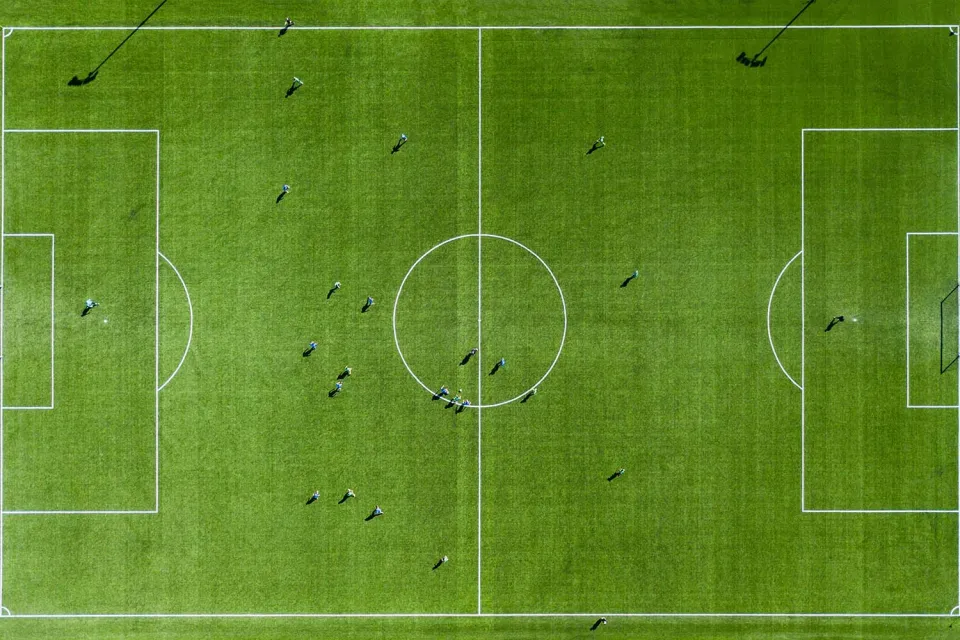
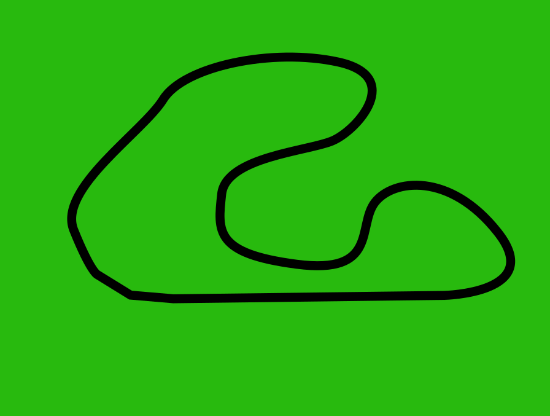
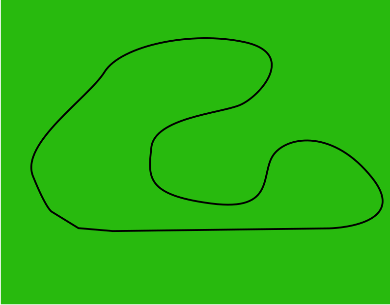
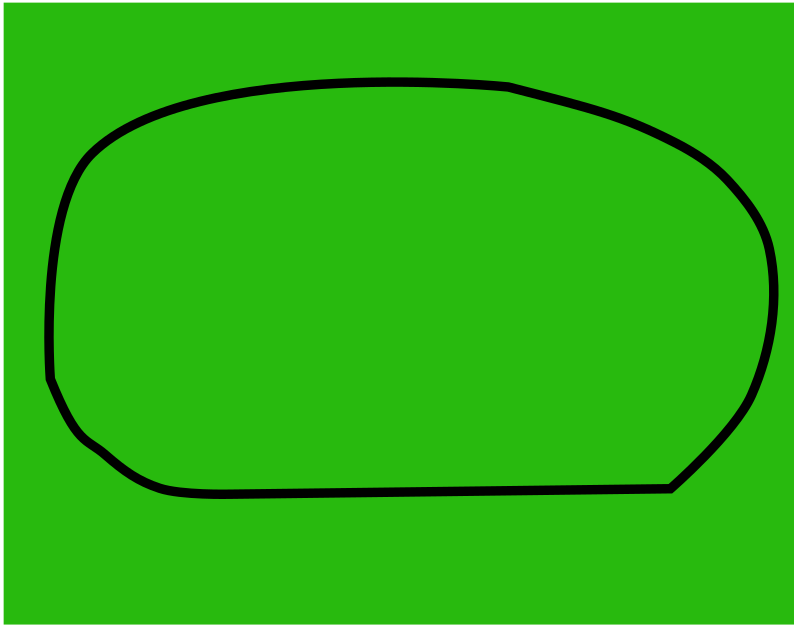
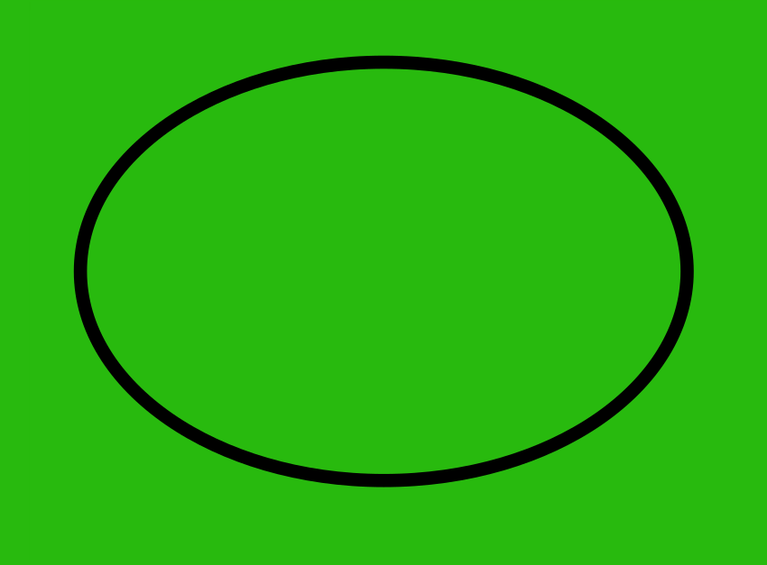
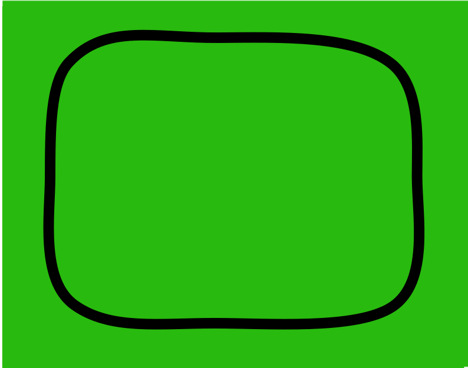
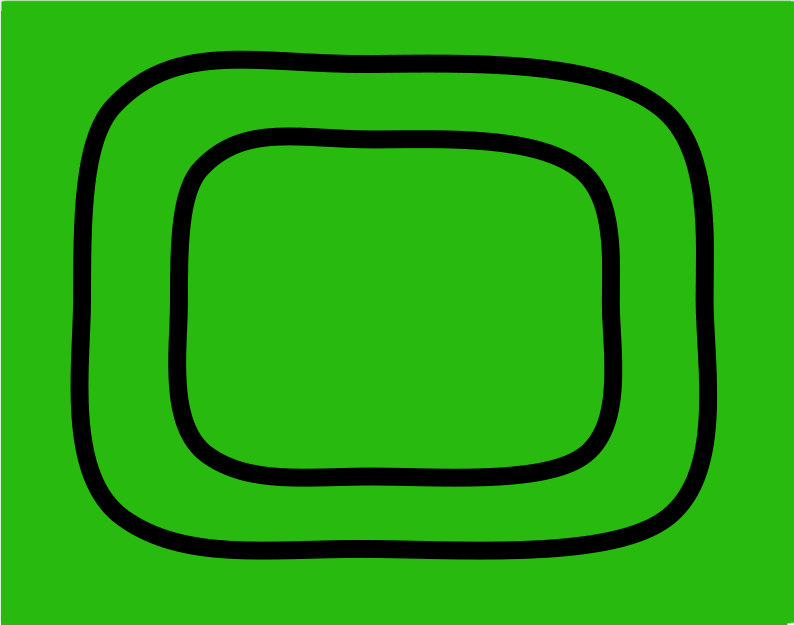

# UD04 · Entregas

<!-- AUTO:notebooks inicio -->
!!! important "8 entregas en el RA4"
    Cada una se corrige con **su rúbrica**, que puedes leer antes de empezar en la propia
    tarea de Moodle. El **peso** de cada entrega está en el libro de calificaciones de
    Moodle, no aquí. La [práctica de la unidad](UD04_ActividadesGuiadas.md) no se
    entrega ni puntúa.

    Tres de las ocho son de **apto / no apto** —`N08`, `N10` y `N11`—: se entregan, pero no se corrigen
    con rúbrica y pesan poco.

| Actividad | Qué es | Descargar | Abrir en Colab |
|---|---|---|---|
| [`N04` · Cinemática de un manipulador](notebooks/UD04_N04_cinematica_manipulador.ipynb) | Cinemática directa e inversa de un robot real (Panda, Puma 560) | {:target="_blank"} | {:target="_blank"} |
| [`N05` · Ejercicios de OpenCV](notebooks/UD04_N05_ejercicios_opencv.ipynb) | Visión · ejercicios de OpenCV sobre imagen y vídeo | {:target="_blank"} | {:target="_blank"} |
| [`N06` · Navegar con cámara](notebooks/UD04_N06_navegar_camara.ipynb) | Navegación por reglas con la cámara | {:target="_blank"} | {:target="_blank"} |
| [`N07` · Navegar con cámara difusa](notebooks/UD04_N07_navegar_camara_difusa.ipynb) | La misma navegación, con lógica difusa | {:target="_blank"} | {:target="_blank"} |
| [`N09` · Controlar el robot con una red neuronal](notebooks/UD04_N09_red_neuronal.ipynb) | Navegación con una red neuronal entrenada | {:target="_blank"} | {:target="_blank"} |
| [`N08` · Generar datos de entrenamiento](notebooks/UD04_N08_generar_datos_entrenamiento.ipynb) | Insumo de `N09` · genera el conjunto de entrenamiento | {:target="_blank"} | {:target="_blank"} |
| [`N10` · Aprendizaje por refuerzo con NEAT](notebooks/UD04_N10_neat.ipynb) | Aprendizaje por refuerzo · evolucionar la red con NEAT | {:target="_blank"} | {:target="_blank"} |
| [`N11` · Diseño de un sistema robotizado](notebooks/UD04_N11_diseno_sistema_robotizado.ipynb) | Diseño · evaluar alternativas para un problema real (CE d) | {:target="_blank"} | {:target="_blank"} |

## `N04` · Cinemática de un manipulador

Cargar un robot real —el Panda de Franka o el Puma 560—, calcular su cinemática directa e inversa, generar una trayectoria y detectar singularidades.

**Se entrega**: el notebook con los cálculos, la trayectoria generada y las singularidades encontradas.

## `N05` · Ejercicios de OpenCV

Tres ejercicios de visión sobre imagen y vídeo: detectar **bordes** y enmarcarlos, detectar **movimiento** entre fotogramas consecutivos y calcular el **flujo óptico**.

| Recurso | Enlace |
|---|---|
| Vídeo | [`EX1.-vtest.mp4`](notebooks/EX1.-vtest.mp4) |

**La imagen de partida.** Pulsa la miniatura para verla a tamaño completo.

<figure markdown="span">
  [{ width="200" }](notebooks/EX1.-camp.png)
  <figcaption>El campo · <a href="https://raw.githubusercontent.com/martinezpenya/ModelosIA/main/docs/UD04/notebooks/EX1.-camp.png" download>descargar</a></figcaption>
</figure>

**Se entrega**: el notebook con los tres ejercicios resueltos y sus salidas.

## `N06` · Navegar con cámara

El robot tiene que **seguir una línea** en el suelo usando solo lo que ve su cámara. Aquí escribes tú todas las condiciones: dónde está la línea en la imagen, y qué hacer en cada caso. Dos escenarios: **línea simple** y **línea doble**.

**Las seis pistas.** Pulsa la miniatura para verla a tamaño completo.

<figure markdown="span">
  [{ width="200" }](notebooks/EX2_pista_1.png)
  <figcaption>Pista 1 · <a href="https://raw.githubusercontent.com/martinezpenya/ModelosIA/main/docs/UD04/notebooks/EX2_pista_1.png" download>descargar</a></figcaption>
</figure>
<figure markdown="span">
  [{ width="200" }](notebooks/EX2_pista_2.png)
  <figcaption>Pista 2 · <a href="https://raw.githubusercontent.com/martinezpenya/ModelosIA/main/docs/UD04/notebooks/EX2_pista_2.png" download>descargar</a></figcaption>
</figure>
<figure markdown="span">
  [{ width="200" }](notebooks/EX2_pista_3.png)
  <figcaption>Pista 3 · <a href="https://raw.githubusercontent.com/martinezpenya/ModelosIA/main/docs/UD04/notebooks/EX2_pista_3.png" download>descargar</a></figcaption>
</figure>
<figure markdown="span">
  [{ width="200" }](notebooks/EX2_pista_4.png)
  <figcaption>Pista 4 · <a href="https://raw.githubusercontent.com/martinezpenya/ModelosIA/main/docs/UD04/notebooks/EX2_pista_4.png" download>descargar</a></figcaption>
</figure>
<figure markdown="span">
  [{ width="200" }](notebooks/EX2_pista_5.png)
  <figcaption>Pista 5 · <a href="https://raw.githubusercontent.com/martinezpenya/ModelosIA/main/docs/UD04/notebooks/EX2_pista_5.png" download>descargar</a></figcaption>
</figure>
<figure markdown="span">
  [{ width="200" }](notebooks/EX2_pista_6.png)
  <figcaption>Pista 6 · <a href="https://raw.githubusercontent.com/martinezpenya/ModelosIA/main/docs/UD04/notebooks/EX2_pista_6.png" download>descargar</a></figcaption>
</figure>

**Se entrega**: el notebook con el controlador funcionando en los dos escenarios.

## `N07` · Navegar con cámara difusa

El **mismo problema** que `N06`, resuelto con lógica difusa: variables lingüísticas, funciones de pertenencia, reglas y desfuzzificación. Enlaza directamente con la UD05.

| Recurso | Enlace |
|---|---|
| Pistas | Las mismas seis de `N06` |

**Se entrega**: el notebook con el sistema difuso completo y el robot navegando en los dos escenarios.

## `N09` · Controlar el robot con una red neuronal

Lees el `training_data.txt` de `N08`, **construyes y entrenas** una red neuronal con esos ejemplos y la usas para conducir el robot. Tres celdas están vacías a propósito: la arquitectura de la red, el entrenamiento y la función de control.

**Se entrega**: el notebook **y el fichero `.keras` con tu nombre**, con la red ya entrenada. Con ese fichero, la celda de carga permite **probar cómo se comporta tu red sin repetir el entrenamiento** —que es largo—, y es así como se corrige.

## `N08` · Generar datos de entrenamiento

Aquí no se entrena nada todavía: **conduces tú el robot** y el notebook graba lo que ve la cámara junto con lo que tú decidiste hacer. El resultado es un conjunto de ejemplos etiquetados.

**Se entrega**: el notebook **y el fichero `training_data.txt` con tu nombre**. Guárdatelo: es la entrada de `N09`.

## `N10` · Aprendizaje por refuerzo con NEAT

El mismo control, sin ejemplos. **NEAT** evoluciona a la vez los pesos **y la topología** de la red: tú solo defines qué entra, qué sale y cómo se mide si lo está haciendo bien.

**Se entrega**: el notebook y una **memoria en PDF** con tus pruebas variando `fitness_threshold` y `pop_size`, la justificación de `num_inputs` y `num_outputs`, y una reflexión sobre el aprendizaje por refuerzo. Es de **apto / no apto**: sin la memoria no cuenta como entregado.

## `N11` · Diseño de un sistema robotizado

Aplicar los criterios de diseño e implementación (CE d) para proponer un sistema robotizado que resuelva un caso real, justificando la selección y la seguridad.

**Se entrega**: el notebook con las alternativas evaluadas y la propuesta justificada. Es de **apto / no apto**.
<!-- AUTO:notebooks fin -->

---
[Volver a la UD04](UD04_ES.md) · [Notebooks guiados](UD04_ActividadesGuiadas.md) · [Notebook 4](notebooks/UD04_N04_cinematica_manipulador.ipynb) · [Notebook 11](notebooks/UD04_N11_diseno_sistema_robotizado.ipynb)
