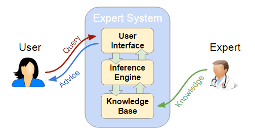
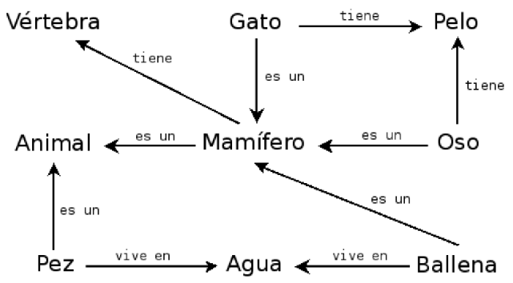

<!--
theme: gaia
size: 16:9
_class: lead
paginate: true
marp: false
backgroundColor: #000
backgroundImage: url('img/hero-backgroundIES.jpg')
-->
<style>
section::after {
  content: attr(data-marpit-pagination) '/' attr(data-marpit-pagination-total);}
img[alt~="center"] {
  display: block;
  margin: 0 auto;
}
table {
  margin-left: auto;
  margin-right: auto;
}
footer {
  font-size: 20px;
 }
header {
  font-size: 16px;
 }
</style>
<style scoped>
section {
  @extend .markdown-body;
  font-size: 28px;
  justify-content: top;
 }
</style>


# UD05: Sistemas expertos y controladores inteligentes
#### Modelos de Inteligencia Artificial
###### version: 2026-08-27

---
<!-- footer: d.martinezpena@edu.gva.es -->
<!-- header: Modelos de Inteligencia Artificial 26-27 (UD05_1)-->
<style scoped>section { font-size: 30px; }</style>

# ¿Qué veremos?

<!-- Cada bloque de este índice se corresponde con un CE de RA5: el 1 con RA5-a, el 2 con RA5-a y RA5-b, los bloques 3 y 4 con RA5-b, el 5 con RA5-b y RA5-d, el 6 con RA5-c, el 7 con RA5-d y el 8 con RA5-e; el bloque 9, aplicaciones y tendencias, no tiene CE propio y se reparte entre todos. -->

1. Arquitectura y dinámica de un sistema experto
2. Estructuras de representación del conocimiento
3. Representar y simular con `experta`
4. Sistemas híbridos reglas/datos
5. Razonamiento impreciso: lógica difusa
6. Variación de características y dinámica
7. Estrategias de control
8. Controladores inteligentes
9. Aplicaciones y tendencias

---
<style scoped>section { font-size: 26px; }</style>

## RA5 y sus criterios de evaluación

<!-- Estos cinco CE proceden del anexo I del RD 279/2021, que fija el currículo del ciclo; el Decreto 95/2026 de la Comunitat Valenciana lo concreta para el centro. El currículo oficial detalla en cambio seis contenidos para este bloque: dos de ellos, aplicaciones y tendencias, no tienen CE propio, y RA5-c, la variación de características, no tiene contenido explícito y lo desarrolla el centro. (§2 de los apuntes) -->

> **RA5** — Aplica sistemas expertos evaluando la influencia de los controladores inteligentes en el comportamiento del sistema.

| CE | Criterio | Dónde |
|---|---|---|
| **a** | Dinámica y estructuras elementales | §1-2 |
| **b** | Representar y simular comportamientos de ámbitos diversos | §3-5 |
| **c** | Cómo influye la variación de características en la dinámica | §6 |
| **d** | Estrategias de control: objetivos y especificaciones | §7 |
| **e** | Relacionar controladores inteligentes con el comportamiento | §8 |

---
<style scoped>section { font-size: 25px; }</style>

## Al terminar la unidad serás capaz de…

- **Situar** el conocimiento en la jerarquía DIKW y **describir** la arquitectura de un sistema experto.
- **Diferenciar** los modos de representación: reglas, marcos, lógica, ontologías, redes semánticas.
- **Representar y simular** un comportamiento con `experta`, en un dominio real.
- **Combinar** reglas con datos cuando el conocimiento experto no basta.
- **Aplicar** lógica difusa a un problema con incertidumbre.
- **Explicar** cómo influye variar reglas, hechos y umbrales (sensibilidad / robustez).
- **Desarrollar** estrategias de control con sus especificaciones.
- **Relacionar** los controladores inteligentes con el comportamiento, frente a un PID.

---
<!-- _class: lead -->

# 1. Arquitectura y dinámica

### del sistema experto

###### RA5-a

---

## Del dato al conocimiento

- Antes de representarlo hay que **distinguirlo de sus vecinos**.
- La jerarquía **DIKW** los ordena: *Data, Information, Knowledge, Wisdom*.
- No es filosofía: marca **qué guarda** un sistema experto.


---
<style scoped>section { font-size: 26px; }</style>

## La jerarquía DIKW
<!-- (§4.1 de los apuntes) -->

| Nivel | Qué es | Ejemplo |
|---|---|---|
| **Datos** | Hechos registrados, independientes de quien los lee | «Un reloj registra la temperatura corporal» |
| **Información** | Los datos interpretados por un agente; subjetiva | «La temperatura es 37 ºC» |
| **Conocimiento** | Información integrada en un modelo del mundo | «Si supera 37 ºC, tiene fiebre» |
| **Sabiduría** | Meta-conocimiento: cuándo y cómo aplicarlo | «Si tiene fiebre, debe tomar paracetamol» |

---

## Por qué importa la distinción

- Un sistema experto **no almacena datos ni información**: almacena **conocimiento** (reglas).
- Los más avanzados guardan algo de **sabiduría**: metarreglas que deciden cuándo aplicar otras reglas (el *control de meta* del §7).
- **El error más común al empezar**: acumular datos en vez de codificar reglas.

---

## ¿Qué es un sistema experto?

- Programa que **emula el razonamiento de un experto humano** en un dominio concreto.
- Codifica su conocimiento en una **base de conocimiento** y lo aplica con un **motor de inferencia**.
- Nacen en los **años 70**; se consideran los primeros sistemas de IA con utilidad práctica real.
- Imprescindible: disponer del conocimiento de un **especialista** del campo.

---

## Los componentes



---
<style scoped>section { font-size: 23px; }</style>

## Qué hace cada componente
<!-- (§4.3 de los apuntes) -->

| Componente | Función |
|---|---|
| **Interfaz de usuario** | Pregunta datos, muestra resultados, alerta de errores; incluye comunicaciones con otros sistemas |
| **Base de conocimiento** | Reglas y hechos del dominio, formalizados por el **ingeniero de conocimiento** con el experto |
| **Memoria de trabajo** | Hechos actuales: los del usuario o los sensores, más los deducidos al razonar |
| **Motor de inferencia** | Evalúa qué reglas se cumplen, resuelve conflictos y ejecuta las acciones |
| **Subsistema de explicación** | Justifica el «por qué» y el «cómo»; sirve para **depurar** y **verificar** la base |
| **Adquisición de conocimiento** | Incorporar conocimiento nuevo sin perfil técnico (el *bottleneck* del experto) |

---

## La explicación marca la diferencia

- Poder **explicar** su razonamiento distingue a un sistema experto de un modelo de ML.
- En dominios regulados —medicina, finanzas— la justificación es **obligatoria**.
- **MYCIN** fue el pionero: mostraba las reglas de inferencia empleadas.
- Su límite: en consultas complejas, enumerar todas las reglas resulta **tedioso** para el usuario.

---
<style scoped>section { font-size: 27px; }</style>

## La dinámica: el ciclo reconocer-actuar
<!-- (§4.4 de los apuntes) -->

1. **Reconocer (*match*)**: se comparan los hechos de la memoria de trabajo con las condiciones de las reglas; las activas van a la **agenda**.
2. **Resolver (*resolve*)**: si hay varias activas, se elige una según la estrategia de control (§7).
3. **Actuar (*act*)**: se ejecuta el consecuente, que declara, modifica o retira hechos — y el ciclo se repite.

Objetivo de fondo: que la lógica sea **explícita**, para que el experto del dominio pueda revisarla sin ser informático.

---

<style scoped>section { font-size: 26px; }</style>

## Mecanismos de razonamiento

- **Hacia delante** (*forward*, dirigido por datos): parte de los hechos y deduce conclusiones. Monitorización, control en tiempo real, planificación.
- **Hacia atrás** (*backward*, dirigido por metas): parte de una meta y busca qué hechos la sustentan, preguntando solo lo necesario. Diagnóstico (MYCIN, Prolog).
- **Mixto**: combina los dos.
- **Búsqueda heurística** (recorre un árbol) y **herencia** (un hijo hereda del padre).

---
<style scoped>section { font-size: 27px; }</style>

## Las dos reglas de inferencia clásicas

- **Modus Ponens**: si *P* implica *Q*, y *P* es verdad, entonces *Q* es verdad.
- **Modus Tollens**: si *P* implica *Q*, y *Q* no es cierto, entonces *P* no es cierto.

El encadenamiento **hacia delante** aplica Modus Ponens repetidamente; el encadenamiento **hacia atrás** busca qué *P* sustentaría un *Q* dado.


---

<style scoped>section { font-size: 26px; }</style>

## Incertidumbre: factores de certeza

<!-- La comparación entre los factores de certeza y las redes bayesianas como alternativa se formalizó en Heckerman y Shortliffe (1992). (§4.6 de los apuntes) -->

- **MYCIN** introdujo los **factores de certeza (CF)**: cada regla lleva el suyo y se combinan al encadenar.
- «SI fiebre alta ENTONCES meningitis **CF = 0,6**» + «SI rigidez de nuca ENTONCES meningitis **CF = 0,4**» → confianza conjunta **mayor** que cada una por separado.
- Si hay evidencia en contra, los CF se **descuentan**: es la **acumulación de evidencia**.
- Alternativas modernas: **lógica difusa** (§5), Dempster-Shafer, redes bayesianas.

---
<!-- _class: lead -->

# 2. Estructuras de representación

### del conocimiento

###### RA5-a / RA5-b

---

## Un continuo, no una lista cerrada

Representar el conocimiento hay que hacerlo **entendible** para la máquina, **útil** para resolver y **eficiente** de procesar.

- A la izquierda, lo **simple** (algoritmos): eficiente, poco flexible.
- A la derecha, lo **flexible** (texto natural): expresivo, no utilizable directamente.
- En medio viven las representaciones de esta unidad.

---


---
<style scoped>section { font-size: 22px; }</style>

## Las representaciones (I)
<!-- (§5.2 de los apuntes) -->

| Representación | Estructura | Ventajas | Límites |
|---|---|---|---|
| **Pares atributo-valor** | Lista de nodos y aristas: «el perro es un animal, tiene cuatro patas…» | Muy simple de construir | Poco expresiva para relaciones complejas |
| **Reglas de producción** | `SI … ENTONCES …` | Modular, legible, explicable | Difícil con jerarquías; lenta con bases grandes |
| **Jerárquicas** | Árbol: Animales → Vertebrados → Mamíferos → Perros | Natural para taxonomías | Rígida si un concepto está en varias ramas |

---
<style scoped>section { font-size: 22px; }</style>

## Las representaciones (II)

<!-- OWL son las siglas de Web Ontology Language, el estándar para construir ontologías; sus razonadores típicos son Pellet o HermiT. (§5.2 de los apuntes) -->

| Representación | Estructura | Ventajas | Límites |
|---|---|---|---|
| **Marcos (*frames*)** | Registros con ranuras y valores por defecto | Conocimiento estructurado | Conflicto con herencia múltiple |
| **Lógica formal** | Predicados de primer orden (Aristóteles, hace 2.000 años) | Rigor matemático | Explosión combinatoria; solo un subconjunto es usable (Prolog) |
| **Redes semánticas** | Grafos dirigidos etiquetados | Intuitiva para relaciones | Semántica ambigua |
| **Ontologías** | Clases, propiedades, axiomas (OWL) | Interoperabilidad, reutilización | Curva de aprendizaje alta |

---
<style scoped>section { font-size: 26px; }</style>

## Lo mismo, en cuatro formas
<!-- (§5.2 de los apuntes) -->

«Si la temperatura supera 37 ºC, la persona tiene fiebre» se escribe como…

- **Regla de producción**: `SI temperatura > 37 ENTONCES fiebre`
- **Lógica proposicional**: $p \rightarrow q$
- **Jerarquía**: Síntomas → Fiebre → Paracetamol
- **Par atributo-valor**: `persona.temperatura = 38.2`, evaluado por una regla externa

Elegir la representación es elegir **qué será fácil de hacer** con ese conocimiento después.

---

## Qué usaremos en esta unidad

- Sobre todo **reglas de producción**, con `experta`.
- Y **lógica difusa**, con `scikit-fuzzy`.
- Las **ontologías** y las **redes semánticas** se mencionan como alternativas.
- Los **marcos** y la **lógica formal**, a nivel conceptual.



---
<!-- _class: lead -->

# 3. Representar y simular

### con `experta`

###### RA5-b

---
<style scoped>section { font-size: 26px; }</style>

## El parche obligatorio

<!-- Existe un fork de la librería, om-experta, que resuelve el mismo problema de otra forma, pero está archivado desde 2023; en esta unidad se usa siempre el parche manual para no tener dos soluciones al mismo problema. (§6 de los apuntes) -->

`experta` es de 2019 y `collections.Mapping` desapareció en Python 3.10. **Siempre antes de importar**:

```python
import collections, collections.abc
if not hasattr(collections, 'Mapping'):
    collections.Mapping = collections.abc.Mapping
    collections.Iterable = collections.abc.Iterable
    collections.MutableMapping = collections.abc.MutableMapping

from experta import *
```

---
<style scoped>section { font-size: 24px; }</style>

## Un diagnóstico, paso a paso (I)
<!-- (§6 de los apuntes) -->

```python
class DiagnosticoPc(KnowledgeEngine):
    @DefFacts()
    def inicio(self):
        yield Fact(accion="diagnosticar")

    @Rule(Fact(accion="diagnosticar"), salience=10)
    def arrancar(self):
        print("Diagnóstico del PC...")
        self.declare(Fact(luz_encendida=True))
        self.declare(Fact(sonido="pitidos_cortos"))
```

- `@DefFacts()` — los hechos iniciales, que carga `reset()`.
- `@Rule(...)` — el antecedente; `salience` fija la prioridad.

---
<style scoped>section { font-size: 24px; }</style>

## Un diagnóstico, paso a paso (II)
<!-- (§6 de los apuntes) -->

```python
    @Rule(Fact(luz_encendida=True), Fact(sonido="pitidos_cortos"))
    def ram(self):
        self.declare(Fact(causa="problema_ram"))

    @Rule(Fact(causa="problema_ram"))
    def resultado(self):
        print("DIAGNÓSTICO: Fallo de memoria RAM.")

engine = DiagnosticoPc()
engine.reset()   # sin reset() no se cargan los DefFacts
engine.run()
```

```text
Diagnóstico del PC...
DIAGNÓSTICO: Fallo de memoria RAM.
```

---
<style scoped>section { font-size: 23px; }</style>

## Otro ámbito, el mismo motor
<!-- (§6 de los apuntes) -->

```python
class Animales(KnowledgeEngine):
    @DefFacts()
    def inicio(self):
        yield Fact(analizar=True)

    @Rule(Fact(analizar=True), salience=10)
    def datos(self):
        self.declare(Fact(pelo=True), Fact(carnivoro=True), Fact(color="leonado"))
        self.declare(Fact(manchas="oscuras"))

    @Rule(Fact(pelo=True))
    def mamifero(self):
        self.declare(Fact(mamifero=True))

    @Rule(Fact(mamifero=True), Fact(carnivoro=True), Fact(color="leonado"),
          Fact(manchas="oscuras"))
    def guepardo(self):
        print("IDENTIFICADO: guepardo")
```

---
<style scoped>section { font-size: 24px; }</style>

## «Muy diversos ámbitos»: los notebooks

<!-- Los notebooks N01 a N06 son actividades guiadas que se trabajan en clase y no son evaluables por sí solos: preparan los cinco entregables EX0 a EX4, que sí cuentan en el 40 % de la nota de la unidad. (§6.1 de los apuntes) -->

| Notebook | Dominio | Qué simula |
|---|---|---|
| `UD05_N01_experta_primeros_pasos` | Introducción | Hechos, reglas, `DefFacts` |
| `UD05_N02_piedra_papel_tijera` | Juego | Piedra, papel o tijera por reglas |
| `UD05_N03_clasificacion_animales` | Zoología | El ejemplo anterior, ejecutado |
| **`EX1` · rodilla** | Medicina | Diagnóstico de una lesión por síntomas |
| `UD05_N04_reglas_desde_datos_titanic` | Datos históricos | Reglas **extraídas** de datos (§4) |
| **`EX2` · valor de mercado** | Deporte | Híbrido reglas + aprendizaje (§4) |
| **`EX3` · `EX4`** | Deporte · industria | Lógica difusa y control real (§5, §8) |

---

## Por qué importa la diversidad

- Un sistema experto **no es una técnica de un solo dominio**.
- La **misma arquitectura** —base de conocimiento + motor de inferencia— sirve para diagnosticar una rodilla, valorar a un futbolista o regular un quemador de gas.
- Lo que cambia es **el conocimiento que se codifica**, no el motor que lo aplica.

---
<!-- _class: lead -->

# 4. Sistemas híbridos

### reglas / datos

###### RA5-b

---

<style scoped>section { font-size: 25px; }</style>

## Cuando nadie ha escrito las reglas

Un sistema experto puro necesita que **alguien las escriba a mano**. Dos salidas:

- **Deducirlas de los datos**: un algoritmo las genera del entrenamiento. Sigue siendo `SI … ENTONCES …`, no una caja negra.
- **Integrarlas con aprendizaje automático**: el experto pone las de partida y el ML las **mejora**.


---
<style scoped>section { font-size: 25px; }</style>

## Las bibliotecas
<!-- (§7.1 de los apuntes) -->

| Biblioteca | Qué hace |
|---|---|
| **Human-Learn** | Definir y **dibujar** tus reglas como un clasificador de scikit-learn, y combinarlas con ML |
| **skope-rules** | Analiza los datos y **deduce** reglas de clasificación, auditables |
| **FIGS** (`imodels`) | Reglas fáciles de interpretar combinando varios árboles pequeños |
| **spaCy** | Reglas para **extraer información de texto**, sin datos etiquetados suficientes |

---

## Titanic: reglas que salen de los datos
<!-- (§7.1 de los apuntes) -->

- Nadie escribe a mano «si viajas en primera clase y eres mujer, sobrevives».
- **FIGS** analiza los datos históricos y **genera esa regla por sí solo**, junto con otras.
- El resultado sigue siendo legible —un árbol de reglas pequeño— pero **nadie lo escribió**.
- Es el primero de los dos enfoques.

---

## `EX2`: los dos enfoques sobre los mismos datos
<!-- (§7.1 de los apuntes) -->

- Datos de **FIFA 22**, dos caminos a la vez:
    - una `FunctionClassifier` de **Human-Learn** con reglas que **tú** defines,
    - y un `FIGSClassifier` que **deduce** las suyas del entrenamiento.
- Comparar los dos resultados sobre el mismo problema es la mejor forma de **sentir la diferencia** entre los enfoques híbridos.

---

## No es una técnica aislada: es una tendencia

- Los híbridos reglas/datos son la puerta de entrada a los **sistemas neuro-simbólicos** y a las **reglas como guardarraíl del ML** (§9).
- No son un tema aparte de los sistemas expertos: son su **evolución natural** cuando el conocimiento no cabe entero en la cabeza de un experto.

---
<!-- _class: lead -->

# 5. Razonamiento impreciso

### la lógica difusa

###### RA5-b / RA5-d

---


## Ni frío ni calor: cuestión de grado

---
<style scoped>section { font-size: 27px; }</style>

## De lo binario a lo continuo

La lógica clásica es **binaria**. Pero «hace frío» no es verdadero o falso de forma tajante.

- Los valores de verdad son **reales en $[0, 1]$**: 0 falso, 1 cierto, 0,5 cierto al 50 %.
- La pertenencia la da una **función de pertenencia**, $\mu_A(x)$: grado de pertenencia de $x$ a $A$.
- *Húmedo* o *frío* no se definen con precisión, pero **sí** con funciones de pertenencia.

---


---

## Sistema de razonamiento impreciso

Un sistema basado en reglas que usa lógica difusa:

- Trabaja con valores **continuos**.
- Modela mejor el **conocimiento humano** — nosotros no razonamos en binario.
- Muy apropiado para **sistemas de control**: enlaza directo con §7 y §8.
- Da una **buena** solución, aunque no sea la **mejor**.

---
<style scoped>section { font-size: 24px; }</style>

## Conceptos básicos
<!-- (§8.2 de los apuntes) -->

| Concepto | Qué es | Ejemplo |
|---|---|---|
| **Variable lingüística** | Variable que toma valores lingüísticos | *Temperatura* |
| **Valores lingüísticos** | Los valores que puede tomar | *Frío*, *Calor* |
| **Función de pertenencia** | Asigna a cada valor un grado de pertenencia | $27\,°C \rightarrow Calor = 0{,}8$ |
| **Regla difusa** | Regla que usa valores difusos | «Si es **fría**, calefacción **alta**» |
| **Función de agregación** | Combina los difusos de varias reglas | $Calor=0{,}8,\ H=0{,}7 \rightarrow 0{,}8$ |

---
<style scoped>section { font-size: 26px; }</style>

## El funcionamiento, en tres pasos
<!-- (§8.3 de los apuntes) -->

1. **Fuzzificación** — convierte las entradas precisas en valores difusos, con las funciones de pertenencia: $27\,°C \rightarrow Calor=0{,}8$.
2. **Evaluación de las reglas** — se aplican combinando las entradas: «si la temperatura es **alta** y la humedad **baja**, el ventilador **alto**».
3. **Desfuzzificación** — devuelve un valor preciso, con **centro de gravedad** o **máximo**.

---

## Las formas de las funciones

- **Trapezoidales** y **triangulares**: las más usadas.
- **Sinusoidales**: para representar periodos.
- **Sigmoidales**: para probabilidades.


---

## Ejemplo: la propina del restaurante

<!-- Este es el ejemplo canónico de la documentación oficial de scikit-fuzzy, el mismo que resolverás paso a paso con código en el Taller 2. (§8.4 de los apuntes) -->

Las **entradas**, con funciones triangulares:

- **Servicio**: baja $[0,5]$ · media $[0,10]$ · alta $[5,10]$
- **Comida**: mala $[0,5]$ · media $[0,10]$ · buena $[5,10]$


---

## La salida
<!-- (§8.4 de los apuntes) -->

**Propina**: baja $[0,13]$ · media $[0,25]$ · alta $[13,25]$

El universo se discretiza — y esa resolución **cambia el resultado**, como veremos.


---

## Las reglas
<!-- (§8.4 de los apuntes) -->

- SI (servicio **bajo** O comida **mala**) → propina **baja**
- SI (servicio **medio**) → propina **media**
- SI (servicio **alto** O comida **buena**) → propina **alta**


---

## La inferencia
<!-- (§8.4 de los apuntes) -->

Con servicio **9,8** y comida **6,5**, el sistema desfuzzifica **19,24 €**: banda alta, coherente con un servicio casi perfecto.

Al ejecutarlo con `np.arange(0, 26, 1)` sale **19,85 €**: la diferencia es la **discretización del universo**, no un error.


---

## De la propina al quemador de gas

- La estructura es **idéntica** en el Taller 3 y en el entregable `EX4`: entradas difusas, reglas lingüísticas, una salida desfuzzificada.
- La diferencia: ahí la salida no es una propina, es la **potencia de un actuador real**.
- Ese es el salto de este bloque al de controladores.

---
<!-- _class: lead -->

# 6. Variación y dinámica

### sensibilidad y robustez

###### RA5-c

---

## Sensibilidad frente a robustez

- **Sensibilidad**: cuánto cambian las conclusiones ante pequeñas desviaciones de parámetros o entradas. Muy sensible = detecta pronto las anomalías, pero da **falsas alarmas** con ruido.
- **Robustez**: mantener conclusiones estables y seguras ante perturbaciones, ruido o fallos parciales.
- Todo el diseño consiste en **elegir dónde ponerse** entre las dos.

---
<style scoped>section { font-size: 25px; }</style>

## Tres mecanismos de variación
<!-- (§9.2 de los apuntes) -->

| Qué varía | Efecto en la dinámica |
|---|---|
| **Las reglas** (estructura lógica) | Añadir condiciones → más inercia, la regla se dispara menos. Simplificar → **sobreactivación** ante transitorios sin riesgo |
| **Los hechos** (perturbaciones) | Ruido en un sensor —CO oscilando junto al umbral— → el sistema **conmuta actuadores sin parar** |
| **Los umbrales de certeza** | Subirlo → menos falsos positivos, pero puede **ignorar alertas tempranas** |

---

## El problema de la histéresis
<!-- (§9.2 de los apuntes) -->

- Un sensor de CO en un túnel oscila entre **28 y 32 ppm**, con el umbral en **30**.
- Sin histéresis, los extractores se **encienden y apagan en cada ciclo**.
- Dos soluciones:
    - **Histéresis temporal**: la alerta debe mantenerse 30 s antes de actuar.
    - **Controlador difuso**: suaviza la transición en vez de cortarla en seco.

---
<!-- _class: lead -->

# 7. Estrategias de control

### del sistema experto

###### RA5-d

---
<style scoped>section { font-size: 25px; }</style>

## Control de la agenda
<!-- (§10.1 de los apuntes) -->

Cuando varias reglas están activas a la vez, hay que **elegir**:

| Estrategia | Qué hace |
|---|---|
| **Salience** | Prioridad numérica explícita: las de emergencia, primero |
| **Recency** | Prefiere las reglas con hechos más recientes |
| **Specificity** | Prefiere la regla con más condiciones en el antecedente |
| **Control de meta** | Reglas de nivel superior que cambian prioridades o activan grupos según el modo (arranque, operación, parada) |

El control de meta es la **sabiduría** del DIKW, aplicada al propio motor.

---
<style scoped>section { font-size: 26px; }</style>

## Especificaciones de la respuesta
<!-- (§10.2 de los apuntes) -->

| Especificación | Qué mide |
|---|---|
| **Precisión** | Error en régimen permanente: variable − setpoint al estabilizarse |
| **Tiempo de respuesta** | Tiempo de subida (tr) y de asentamiento (ts) |
| **Estabilidad** | Ausencia de oscilaciones; sobreimpulso máximo aceptable |
| **Alcance** | Rango de operación de la planta |

En este módulo se trabajan de forma **conceptual**: definir el objetivo y saber interpretar si la respuesta lo cumple.

---
<style scoped>section { font-size: 26px; }</style>

## Ejemplo guiado: climatizar una sala a 21 ºC
<!-- (§10.3 de los apuntes) -->

1. **Setpoint y precisión** — estabilizarse en 21 ºC con error de **±0,5 ºC** máximo.
2. **Tiempo de respuesta** — entrar en la banda 20,5-21,5 ºC en menos de **15 min**.
3. **Estabilidad** — sobreimpulso máximo de **1 ºC**, sin oscilaciones que dañen el equipo.

Las especificaciones se escriben **antes** de elegir el controlador.

---
<style scoped>section { font-size: 26px; }</style>

## Ejemplo guiado (II): elegir y comprobar
<!-- (§10.3 de los apuntes) -->

4. **Elegir el controlador** — un PID bien sintonizado cumpliría en un sistema lineal, pero la sala tiene **inercia térmica y perturbaciones** (puertas, sol). Un controlador experto o difuso, con reglas del operador, logra **menos sobreimpulso y más robustez**.
5. **Comprobar y ajustar** — simular, medir ts y sobreimpulso, y si no cumple, ajustar reglas o ganancias.

---

## Controlar no es «conectar un motor»

Es **definir el objetivo** (precisión), **acotar el tiempo**, **limitar el sobreimpulso** y **elegir el controlador** que lo cumpla, verificándolo con una simulación.

Ese es el sentido de los criterios **d** y **e** — y exactamente lo que se pide en `EX4`, con un quemador de gas real en vez de una sala.

---
<!-- _class: lead -->

# 8. Controladores inteligentes

### frente al PID clásico

###### RA5-e

---
<style scoped>section { font-size: 26px; }</style>

## El lazo de control clásico
<!-- (§11.1 de los apuntes) -->

Compara el **setpoint** (SP) con la variable medida (PV), calcula el error y aplica una acción (MV).

```text
 SP ──►(+/−)──► Controlador ──► Actuador ──► Planta ──┬──► PV
         ▲          PID / inteligente                 │
         └──────────── realimentación ────────────────┘
```

$$u = K_p\,e + K_i\!\int\! e + K_d\,\frac{de}{dt}$$

La parte **proporcional** responde al error, la **integral** elimina el residual, la **derivada** reduce el sobreimpulso.

---

## Dónde falla el PID
<!-- (§11.1 de los apuntes) -->

- **No predice el futuro**: solo reacciona al error presente y pasado.
- Se degrada con **retrasos** y **no linealidades**.
- Sus ganancias son **fijas**: hay que **re-sintonizarlo** cuando la planta envejece.
- Sufre con perturbaciones **multivariable**.

Es eficaz en sistemas lineales bien modelados — y ahí sigue siendo la opción correcta.

---
<style scoped>section { font-size: 24px; }</style>

## Cuatro controladores inteligentes

<!-- Mamdani y Sugeno son los dos métodos clásicos de inferencia difusa y difieren en cómo definen la salida: Mamdani usa conjuntos difusos, como el ejemplo de la propina; Sugeno usa funciones matemáticas. MPC son las siglas de Model Predictive Control, control predictivo basado en un modelo de la planta. (§11.1 de los apuntes) -->

| Controlador | Cómo funciona | Ventaja frente al PID |
|---|---|---|
| **Difuso** | Reglas lingüísticas + funciones de pertenencia (Mamdani, Sugeno) | Robusto ante ruido y no linealidad; **no necesita modelo** |
| **Por reglas (experto)** | Motor de inferencia con reglas del operador | Captura heurísticas humanas; fácil de entender |
| **Redes neuronales** | Aprenden la dinámica inversa de la planta | Se adapta a sistemas no lineales |
| **Predictivo (MPC)** | Predice la trayectoria futura y optimiza | **Anticipa** restricciones; proactivo |

---
<style scoped>section { font-size: 26px; }</style>

## Y funciona, con datos

<!-- DeepMind también reportó una reducción adicional del 15 % en el PUE, la eficiencia energética global del centro de datos, además del 40 % en refrigeración. (§11.2 de los apuntes) -->

| Caso | Mejora frente al PID |
|---|---|
| **Control térmico difuso** | Asentamiento −76 % (416 s → 100 s); sobreimpulso 5,64 % → **0 %** |
| **Horno de fundición (ANN)** | MSE 132,75 frente a 134,13 (mejora ligera) |
| **Mitsubishi, aire acondicionado** | 5× más rápido, **−24 %** de consumo |
| **DeepMind, centros de datos** | **−40 %** en energía de refrigeración |

---

## ¿Gana siempre el inteligente?

**No.**

- El PID es **simple, barato y fiable** en sistemas bien modelados.
- El controlador inteligente aporta cuando hay **no linealidad, retraso o ruido fuerte**.
- La regla: **empezar simple** y añadir inteligencia solo si se justifica.
- Es lo que comprobarás en `EX4`, que pide **dos enfoques distintos** para el mismo quemador.

---
<style scoped>section { font-size: 25px; }</style>

## El sistema experto como controlador
<!-- (§11.3 de los apuntes) -->

Patrón del **control experto** (Åström, Anton y Årzén, 1986): un motor de inferencia **dentro** del lazo.

- Evalúa el error **y su variación**, decide por reglas y **explica** la decisión.
- Dos formas de actuar:
    - **directa** — «si el error es negativo grande y aumenta → máxima potencia»,
    - **supervisando un PID** — ajusta sus ganancias cuando la respuesta se degrada.
- Base de sistemas industriales como **Gensym G2** (refinerías, energía, farmacia) desde los 80.

---
<style scoped>section { font-size: 27px; }</style>

## Una regla de verdad
<!-- (§11.3 de los apuntes) -->

```text
SI error de temperatura es NEGATIVO_GRANDE
Y variación del error es POSITIVA_PEQUENA
ENTONCES potencia del quemador es MEDIA_ALTA
```

Captura la heurística de un operador humano y es **fácil de auditar** — algo que un PID o una red neuronal no ofrecen de forma directa.

---
<!-- _class: lead -->

# 9. Aplicaciones y tendencias

###### contenidos del RA5

---

## Por sector
<!-- (§12.1 de los apuntes) -->

| Sector | Uso |
|---|---|
| **Industria** | Control de procesos, diagnóstico de máquinas, mantenimiento |
| **Salud** | Diagnóstico asistido (MYCIN, GARVAN-ES1), dosificación |
| **Finanzas** | Asesoramiento, detección de fraude por reglas |
| **Telecomunicaciones** | Gestión de redes, diagnóstico de averías |

---
<style scoped>section { font-size: 24px; }</style>

## Los clásicos, con cifras
<!-- (§12.1 de los apuntes) -->

- **DENDRAL** (1965): el primer sistema experto; acotaba millones de isómeros moleculares a un conjunto manejable.
- **MYCIN** (Stanford, 1972): 500-600 reglas de diagnóstico clínico, precisión **69-70 %**, equiparable a especialistas. Pionero de la explicación y los factores de certeza.
- **XCON/R1** (CMU/DEC, 1978): configuraba ordenadores VAX; de 250 a más de **6.200 reglas** en 1986, precisión 95-98 % y ~**25 M$/año** de ahorro.
- **SID** (DEC): generó el **93 %** de las puertas lógicas del VAX 9000.
- **Cyc** (1984): enciclopediar el sentido común, millones de hechos y reglas.

---
<style scoped>section { font-size: 23px; }</style>

## Tendencias

<!-- RETE era el algoritmo clásico de coincidencia de patrones de los primeros motores de reglas; los BRMS modernos, como Drools, evolucionaron a PHREAK, que escala mejor con miles de reglas. SHAP y LIME son las siglas de dos técnicas de explicabilidad del aprendizaje automático. (§12.2 de los apuntes) -->

- **BRMS** — motores de reglas de negocio como **Drools** (Apache KIE), con DMN/JSR-94: miles de reglas separadas del código, con motores que escalan linealmente.
- **Neuro-simbólico** (3.ª ola de la IA) — redes neuronales para aprender + reglas para razonar; reduce alucinaciones y aporta explicabilidad. Amazon lo usa en sus motores de compra.
- **IA explicable (XAI)** — de MYCIN a SHAP/LIME, con el **derecho a explicación** del RGPD detrás (enlaza con la UD06).
- **Agentes con razonamiento declarativo** — planifican con reglas y guardas lógicas de seguridad.
- **Reglas como guardarraíl del ML** — validar y acotar las salidas de los modelos, incluidos los generativos.

---

## Del pasado al presente
<!-- (§12.2 de los apuntes) -->

- MYCIN y XCON demostraron que el **conocimiento declarativo** y la **explicación** importan.
- Esa idea **no ha muerto**: vive en los BRMS, en el neuro-simbólico y en los guardarraíles del ML.
- Saber construir y **auditar** sistemas basados en reglas —puras, híbridas o difusas— sigue siendo una competencia valiosa.

---
<!-- _class: lead -->

# Cierre

---
<style scoped>section { font-size: 22px; }</style>

## Puntos clave (I)

- El **DIKW** distingue dato, información, conocimiento y sabiduría: un sistema experto guarda **conocimiento** (reglas) y, como mucho, **metarreglas**.
- Un sistema experto = **base de conocimiento** + **motor de inferencia**, con el ciclo reconocer-actuar y encadenamiento hacia delante o hacia atrás.
- La **explicación** es su gran ventaja frente al ML, y es obligatoria en dominios regulados.
- La representación del conocimiento es un **continuo**: atributo-valor, reglas, jerarquías, marcos, lógica, redes semánticas, ontologías.
- Con `experta` se simulan comportamientos de ámbitos **muy diversos**: medicina, zoología, deporte, industria.

---
<style scoped>section { font-size: 22px; }</style>

## Puntos clave (II)

- Los **híbridos reglas/datos** (Human-Learn, FIGS, skope-rules) combinan lo que sabe el experto con lo que dicen los datos.
- La **lógica difusa** extiende la lógica a $[0,1]$: fuzzificación, evaluación de reglas y desfuzzificación.
- **Sensibilidad frente a robustez**: variar reglas, hechos o umbrales cambia la dinámica; la histéresis y el control difuso la estabilizan.
- Las **estrategias de control** y las **especificaciones** definen la calidad de la respuesta.
- Los **controladores inteligentes** superan al PID en sistemas no lineales: −76 % de asentamiento, 0 % de sobreimpulso.

---
<style scoped>section { font-size: 26px; }</style>

## Las cinco sesiones
<!-- (§16 de los apuntes) -->

| Semana | Contenido | CE |
|---|---|---|
| 11 | DIKW, arquitectura y dinámica; representación | a |
| 12 | Taller 1 (`experta`), `EX1`; híbridos y `EX2` | b |
| 13 | Lógica difusa: Taller 2; variación y dinámica | b, c |
| 14 | Estrategias de control; controladores; Taller 3 | d |
| 15 | `EX3`, `EX4`; aplicaciones y tendencias; evaluación | d, e |

---
<style scoped>section { font-size: 26px; }</style>

## Cómo se evalúa

<!-- La base legal concreta de esa exigencia es el artículo 5.1 de la Orden 8/2025, que liga la calificación del módulo a la consecución de los RA, junto con las Instrucciones 26-27, que impiden calificar positivamente un módulo con algún RA no superado. De los cinco entregables, EX0 es de libre elección del alumno y premia la originalidad, mientras que EX1 a EX4 tienen un dominio fijo. (§18 de los apuntes) -->

| Peso | Instrumento |
|---|---|
| **40 %** | Media de los **cinco entregables** (`EX0`-`EX4`), cada uno con su rúbrica sobre 10 |
| **60 %** | Prueba del RA5: test y desarrollo sobre el contenido de la unidad |

La **normativa exige alcanzar todos los RA** del módulo para superarlo; el centro lo concreta en **≥ 5 en cada RA**.

---
<!-- _class: lead -->

## ¿Y ahora?

Un sistema experto convierte lo que sabe una persona en reglas que **diagnostican, asesoran y controlan** — y sabe explicar por qué.

### A construirlo.
