# UD05 — Sistemas expertos y controladores inteligentes

!!! info "Unidad 5 · 12 h · semanas 11-15 (7 de diciembre al 14 de enero)"
    Continúa las reglas y la lógica difusa de RA2, justo antes de que la fragmentación de Navidad
    parta el curso. Se evalúa con **cinco entregables prácticos** y la prueba escrita del RA5.

## 1. Introducción

Todo el curso ha sido **cómo construir** sistemas de IA. Esta unidad da un paso más: los
**sistemas expertos**, que codifican el conocimiento de un experto humano en reglas y lo utilizan
para **diagnosticar, asesorar y controlar**. Y lo conectamos con el **control**, porque un sistema
experto puede actuar como **controlador inteligente** de un proceso físico, compitiendo con los
controladores clásicos (PID).

Antes de construir nada hay que situar **qué es el conocimiento** y **cómo se representa** para
que una máquina pueda usarlo — esa es la primera pregunta de la inteligencia artificial simbólica,
y la respondemos con la jerarquía DIKW y el continuo de representaciones del §5.

El recorrido de la unidad:

1. **Arquitectura y dinámica** de los sistemas expertos (base de conocimiento, motor de
   inferencia, ciclo reconocer-actuar).
2. **Estructuras elementales** de representación del conocimiento (reglas, marcos, lógica,
   ontologías, redes semánticas).
3. **Representar y simular comportamientos** con la librería `experta`, en dominios muy diversos:
   diagnóstico médico, clasificación, control de procesos.
4. **Sistemas híbridos reglas/datos**: cuando las reglas se combinan o se extraen del aprendizaje
   automático.
5. **Sistemas de razonamiento impreciso**: la lógica difusa, para trabajar con lo que no es blanco
   o negro.
6. **Cómo influye la variación de las características** en la dinámica del sistema (sensibilidad y
   robustez).
7. **Estrategias de control** de un sistema experto.
8. **Controladores inteligentes** (difuso, por reglas, redes neuronales, MPC) y su influencia en el
   comportamiento del sistema.
9. **Aplicaciones y tendencias** (MYCIN, XCON, BRMS, neuro-simbólico, IA explicable).

!!! tip "Hilo conductor de la unidad"
    Un sistema experto convierte el conocimiento de un experto en reglas que pueden diagnosticar,
    asesorar y controlar. Primero situamos qué es ese conocimiento y cómo se representa; después lo
    construimos y simulamos, con reglas puras, híbridas o difusas; luego estudiamos por qué a veces
    falla; y por último lo usamos como controlador, comparándolo con el PID clásico.

<!-- VIDEO: vídeo breve que muestre un sistema experto clásico (p. ej. MYCIN) preguntando al usuario y deduciendo una conclusión paso a paso -->

## 2. Resultado de aprendizaje y criterios de evaluación

**RA5** — Aplica sistemas expertos evaluando la influencia de los controladores inteligentes en el
comportamiento del sistema.

| CE | Criterio de evaluación | Bloque |
|---|---|---|
| RA5-a | Se ha descrito la dinámica y las estructuras elementales de los sistemas expertos. | §4-5 |
| RA5-b | Se han determinado las destrezas necesarias para representar y simular comportamientos básicos de sistemas de muy diversos ámbitos. | §6-8 |
| RA5-c | Se ha razonado cómo influye la variación de las características de los sistemas en su dinámica de actuación. | §9 |
| RA5-d | Se han desarrollado estrategias de control definiendo los objetivos y las especificaciones de la respuesta del sistema. | §10 |
| RA5-e | Se han relacionado los controladores inteligentes con el comportamiento del sistema. | §11 |

!!! note "Bloque de contenidos oficial (RD 279/2021, anexo I)"
    El currículo llama a este bloque, textualmente, *«Sistemas Expertos»*, y le asigna estos
    contenidos:

    - *Dinámica de los sistemas expertos.*
    - *Estructuras elementales de los sistemas expertos.*
    - *Representar y simular comportamientos básicos.*
    - *Estrategias de control de un sistema experto.*
    - *Aplicaciones de sistemas expertos.*
    - *Tendencias en sistemas expertos.*

    Son **seis contenidos para cinco criterios de evaluación**, y no encajan uno a uno: los dos
    últimos (aplicaciones y tendencias) no tienen CE propio y se reparten entre todos, mientras que
    RA5-c (variación de las características) **no tiene contenido explícito** en el anexo y lo
    desarrolla el centro (art. 3.3 del Decreto 95/2026).

## 3. Objetivos de la unidad

| Objetivo | Al terminar la unidad serás capaz de… |
|---|---|
| O1 | **Situar** el conocimiento en la jerarquía DIKW y **describir** la arquitectura de un sistema experto. |
| O2 | **Diferenciar** los modos de representación del conocimiento (reglas, frames, lógica, ontologías, redes semánticas). |
| O3 | **Representar y simular** un comportamiento básico con `experta`, en un dominio real. |
| O4 | **Combinar** reglas con datos cuando el conocimiento experto no basta por sí solo. |
| O5 | **Aplicar** lógica difusa a un problema con incertidumbre. |
| O6 | **Explicar** cómo influye la variación de reglas, hechos y umbrales en la dinámica (sensibilidad/robustez). |
| O7 | **Desarrollar** estrategias de control (salience, control de meta) con sus especificaciones. |
| O8 | **Relacionar** los controladores inteligentes (difuso, por reglas, ANN, MPC) con el comportamiento del sistema y compararlos con un PID. |
| O9 | Conocer aplicaciones reales y tendencias de los sistemas expertos. |

## 4. Arquitectura y dinámica de los sistemas expertos (RA5-a)

### 4.1 Del dato al conocimiento: la jerarquía DIKW

Antes de representar el conocimiento hay que distinguirlo de sus vecinos. La **jerarquía DIKW**
(*Data, Information, Knowledge, Wisdom*) los ordena:

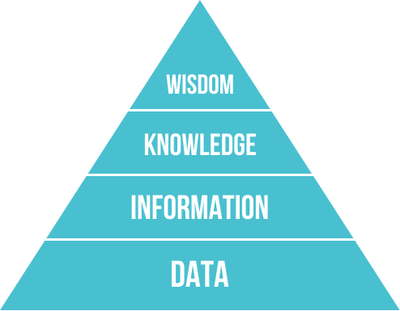

| Nivel | Qué es | Ejemplo |
|---|---|---|
| **Datos** | Hechos o valores registrados, independientes de quien los lee | «Un reloj inteligente registra la temperatura corporal» |
| **Información** | Los datos interpretados por un agente; subjetiva | «La temperatura corporal es 37 ºC» |
| **Conocimiento** | Información integrada en un modelo del mundo | «Si la temperatura supera 37 ºC, la persona tiene fiebre» |
| **Sabiduría** | Meta-conocimiento: cuándo y cómo aplicar el conocimiento | «Si tiene fiebre, debe tomar paracetamol» |

!!! important "Por qué importa esta distinción"
    Un sistema experto no almacena datos ni información: almacena **conocimiento** (reglas) y, en
    los más avanzados, un poco de **sabiduría** (metarreglas que deciden cuándo aplicar otras
    reglas — el «control de meta» del §10.1). Confundir los niveles es el error más común al
    empezar a diseñar uno: se acumulan datos en vez de codificar reglas.

### 4.2 ¿Qué es un sistema experto?

Un **sistema experto** es un programa de IA que **emula el razonamiento de un experto humano** en
un dominio concreto: codifica su conocimiento en una **base de conocimiento** y utiliza un
**motor de inferencia** para aplicar ese conocimiento a los hechos del problema. Comenzaron su
desarrollo en los años 70 y fueron muy populares esa década y la siguiente: se consideran los
primeros sistemas de IA capaces de obtener resultados con utilidad práctica real.

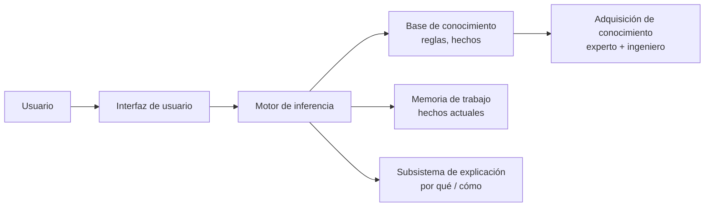

### 4.3 Componentes

| Componente | Función |
|---|---|
| **Interfaz de usuario** | Vía de las consultas: pregunta datos, muestra resultados y alerta de datos erróneos. Incluye un **módulo de comunicaciones** (con otros sistemas, útil en automatización industrial) |
| **Base de conocimiento (KB)** | Reglas y hechos del dominio, formalizados por el **ingeniero de conocimiento** junto al experto. Puede organizarse como listas, objetos relacionados, cálculo de predicados o redes semánticas |
| **Memoria de trabajo (base de hechos)** | Hechos actuales: los que aporta el usuario o los sensores, más los deducidos durante el razonamiento. Guarda el histórico de estados de la consulta |
| **Motor de inferencia** | Evalúa qué reglas se cumplen, resuelve conflictos y ejecuta las acciones. Determina el orden de las acciones y la interacción entre las partes del sistema |
| **Subsistema de explicación** | Justifica el razonamiento («por qué» y «cómo» llegó a esa conclusión), mostrando las reglas usadas. Ayuda también al ingeniero de conocimiento a **depurar** el motor y al experto a **verificar** la coherencia de la base |
| **Adquisición de conocimiento** | Herramientas para incorporar nuevo conocimiento sin perfil técnico (el famoso *bottleneck*: conseguir que el experto vuelque lo que sabe es la parte más lenta de construir el sistema) |

!!! important "La explicación marca la diferencia"
    La capacidad de **explicar** su razonamiento es lo que distingue a un sistema experto de un
    modelo de ML: en dominios regulados (medicina, finanzas) la justificación es obligatoria. MYCIN
    fue el pionero de esta *explicabilidad*, mostrando las reglas de inferencia que empleó — aunque,
    para consultas complejas, enumerar todas las reglas puede resultar tedioso para el usuario.

### 4.4 El ciclo de ejecución (dinámica)

El motor de inferencia opera en un **bucle reconocer-actuar**:

1. **Reconocer (match)**: se comparan los hechos de la memoria de trabajo con las condiciones
   (LHS) de las reglas; las reglas activas van a la **agenda**.
2. **Resolver (resolve)**: si hay varias reglas activas, se elige una según la estrategia de
   control (salience, recency, especificidad — ver §10.1).
3. **Actuar (act)**: se ejecuta el consecuente (RHS), que declara/modifica/retira hechos, y el
   ciclo se repite hasta agotar la agenda.

El objetivo de fondo es hacer que la lógica sea **explícita** en vez de estar enterrada en código
que solo revisa un informático: con reglas legibles, el propio experto del dominio puede revisar y
mantener el sistema.

### 4.5 Encadenamiento

- **Hacia delante (forward, data-driven)**: parte de los hechos y deduce conclusiones. Ideal para
  monitorización, control de procesos en tiempo real y planificación.
- **Hacia atrás (backward, goal-driven)**: parte de una **meta** y busca qué hechos la sustentan,
  preguntando al usuario solo lo necesario. Ideal para diagnóstico (MYCIN, Prolog).
- **Encadenamiento mixto**: combina los dos anteriores.
- Otros mecanismos de razonamiento: **búsqueda heurística** (el proceso de inferencia recorre un
  árbol) y **herencia** (en entornos orientados a objetos, un objeto hijo hereda propiedades del
  padre).

!!! tip "Las dos reglas de inferencia clásicas"
    Antes de forward/backward chaining está la lógica que los sustenta: **Modus Ponens** («si *P*
    implica *Q*, y *P* es verdad, entonces *Q* es verdad») y **Modus Tollens** («si *P* implica
    *Q*, y *Q* no es cierto, entonces *P* no es cierto»). El encadenamiento hacia delante aplica
    Modus Ponens repetidamente; el encadenamiento hacia atrás busca qué *P* sustentaría un *Q*
    dado.

### 4.6 Incertidumbre: factores de certeza

MYCIN introdujo los **factores de certeza (CF)** para manejar la incertidumbre: cada regla tiene un
CF y se combinan al encadenar. Alternativas modernas: lógica difusa (§8), teoría de
Dempster-Shafer o redes bayesianas (Heckerman & Shortliffe, 1992).

!!! example "Combinar factores de certeza"
    Una regla dice «SI hay fiebre alta ENTONCES sospecha de meningitis **con CF = 0,6**». Otra
    regla independiente aporta «SI rigidez de nuca ENTONCES sospecha de meningitis **con CF = 0,4**».
    MYCIN combina ambos apoyos para dar una confianza conjunta mayor que cada una por separado
    (combinación de evidencia). Si en cambio hubiera evidencia en contra, los CF se descuentan. De
    ahí nace el concepto de **acumulación de evidencia**, que luego se formalizó con redes
    bayesianas.

Esta gestión explícita de la **incertidumbre** es una diferencia clave frente a un sistema de
reglas «duro» (todo verdadero o falso): permite razonar con conocimiento parcial y explicar el
nivel de confianza de una conclusión. La lógica difusa del §8 resuelve el mismo problema de otra
forma: en vez de un factor de certeza sobre una regla booleana, deja que el propio hecho sea
**parcialmente verdadero**.

## 5. Estructuras elementales de representación (RA5-a/b)

### 5.1 Un continuo, no una lista cerrada

Representar el conocimiento es uno de los problemas fundamentales de la IA: hay que hacerlo de
forma **entendible** para las máquinas, **útil** para resolver problemas y **eficiente** de
procesar. Las representaciones forman un **continuo**:

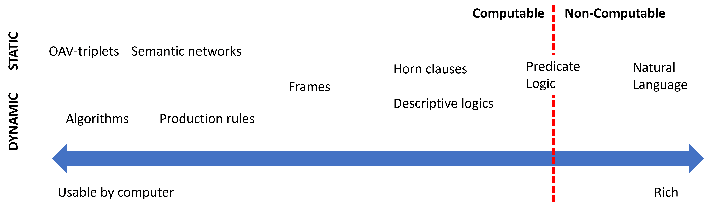

En un extremo están las representaciones **simples** (algoritmos): eficientes para el ordenador
pero poco flexibles. En el otro, las **flexibles** (texto natural): muy expresivas pero no
directamente utilizables por una máquina. Entre medias viven las que usamos en esta unidad.

### 5.2 Las representaciones, con sus ventajas y límites

| Representación | Estructura | Inferencia | Ventajas | Limitaciones |
|---|---|---|---|---|
| **Pares atributo-valor** (tripletes objeto-atributo-valor) | Lista de nodos y aristas de un grafo: «el perro es un animal, tiene cuatro patas…» | Recorrido y coincidencia de atributos | Muy simple de construir a partir de descripciones | Poco expresiva para relaciones complejas |
| **Reglas de producción** | `SI ... ENTONCES ...` | Forward/backward + resolución de conflictos | Modular, legible, explicable | Difícil modelar jerarquías; lenta con bases grandes |
| **Representaciones jerárquicas** | Árbol: nodos = conceptos, aristas = relaciones (Animales → Vertebrados → Mamíferos → Perros) | Recorrido del árbol, herencia | Natural para taxonomías | Rígida si un concepto pertenece a varias ramas |
| **Marcos (frames)** | Registros con ranuras (slots) y valores por defecto | Herencia de clases, disparadores | Taxonomías y conocimiento estructurado | Conflicto con herencia múltiple |
| **Lógica formal** | Predicados de primer orden (propuesta por Aristóteles hace más de 2000 años) | Resolución, unificación, deducción | Rigor matemático | Explosión combinatoria; poco utilizable directamente por máquinas (salvo un subconjunto, como en Prolog) |
| **Redes semánticas** | Grafos dirigidos con etiquetas | Búsqueda en grafos, propagación | Intuitiva para relaciones | Semántica ambigua |
| **Ontologías** | Clases, propiedades, axiomas (OWL) | Razonadores (Pellet, HermiT) | Interoperabilidad, reutilización | Curva de aprendizaje alta |

!!! example "Lo mismo en cuatro formas distintas"
    El hecho «si la temperatura supera 37 ºC, la persona tiene fiebre» se puede escribir como
    **regla de producción** (`SI temperatura > 37 ENTONCES fiebre`), como **lógica proposicional**
    ($p \rightarrow q$, con $p$: «tiene fiebre», $q$: «debe tomar paracetamol»), como
    **jerarquía** (Síntomas → Fiebre → Paracetamol) o como **par atributo-valor**
    (`persona.temperatura = 38.2`, evaluado por una regla externa). Elegir la representación es
    elegir **qué es fácil de hacer** con ese conocimiento después.

!!! tip "Regla práctica de esta unidad"
    Usaremos sobre todo **reglas de producción** (con `experta`) y, en el §8, **lógica difusa**
    (con `scikit-fuzzy`). Las ontologías y las redes semánticas se mencionan como alternativas; los
    **frames** y la **lógica formal** se tratan a nivel conceptual.

## 6. Representar y simular comportamientos con `experta` (RA5-b)

Para **simular un comportamiento** se escribe la base de conocimiento en `experta` y se ejecuta el
ciclo de inferencia. Recordamos el parche obligatorio para Python 3.10+ (la librería es de 2019 y
`collections.Mapping` desapareció en esa versión):

```python
import collections, collections.abc
if not hasattr(collections, 'Mapping'):
    collections.Mapping = collections.abc.Mapping
    collections.Iterable = collections.abc.Iterable
    collections.MutableMapping = collections.abc.MutableMapping

from experta import *

class DiagnosticoPc(KnowledgeEngine):
    @DefFacts()
    def inicio(self):
        yield Fact(accion="diagnosticar")

    @Rule(Fact(accion="diagnosticar"), salience=10)
    def arrancar(self):
        print("Diagnóstico del PC...")
        self.declare(Fact(luz_encendida=True))
        self.declare(Fact(sonido="pitidos_cortos"))

    @Rule(Fact(luz_encendida=True), Fact(sonido="pitidos_cortos"))
    def ram(self):
        self.declare(Fact(causa="problema_ram"))

    @Rule(Fact(causa="problema_ram"))
    def resultado(self):
        print("DIAGNÓSTICO: Fallo de memoria RAM.")

engine = DiagnosticoPc()
engine.reset()
engine.run()
```

**Salida esperada:**

```text
Diagnóstico del PC...
DIAGNÓSTICO: Fallo de memoria RAM.
```

!!! example "Otro ámbito: clasificación de animales (sistema de producción clásico)"
    El mismo motor `experta` simula un sistema de clasificación con reglas de un zoólogo:

    ```python
    class Animales(KnowledgeEngine):
        @DefFacts()
        def inicio(self):
            yield Fact(analizar=True)

        @Rule(Fact(analizar=True), salience=10)
        def datos(self):
            self.declare(Fact(pelo=True), Fact(carnivoro=True), Fact(color="leonado"))
            self.declare(Fact(manchas="oscuras"))

        @Rule(Fact(pelo=True))
        def mamifero(self):
            self.declare(Fact(mamifero=True))

        @Rule(Fact(mamifero=True), Fact(carnivoro=True), Fact(color="leonado"),
              Fact(manchas="oscuras"))
        def guepardo(self):
            print("IDENTIFICADO: guepardo")
    ```

    Así se comprueba que un sistema experto **representa y simula el comportamiento** de un
    dominio sin programar la lógica imperativamente: el motor aplica las reglas hasta llegar a la
    conclusión.

### 6.1 «Muy diversos ámbitos»: los notebooks de la unidad

El CE b exige simular comportamientos en **dominios distintos**, no repetir el mismo ejemplo. Esta
unidad trae varios notebooks ejecutados de verdad, en dominios reales (la lista completa está en
las [notebooks guiados](UD05_ActividadesGuiadas.md) y las [entregas](UD05_Entregas.md)):

| Notebook | Dominio | Qué simula |
|---|---|---|
| `UD05_N01_experta_primeros_pasos.ipynb` | Introducción | Primeros pasos con `experta`: hechos, reglas, `DefFacts` |
| `UD05_N02_piedra_papel_tijera.ipynb` | Juego | Piedra, papel o tijera decidido por reglas |
| `UD05_N03_clasificacion_animales.ipynb` | Zoología | El ejemplo de arriba, completo y ejecutado |
| **`N11` · lesión de rodilla** | Medicina | Diagnóstico de una lesión a partir de síntomas, con `experta` |
| `UD05_N04_reglas_desde_datos_titanic.ipynb` | Datos históricos | Reglas **extraídas** de datos, no escritas a mano (§7) |
| **`N12` · valor de mercado** | Deporte | Estimación híbrida reglas + aprendizaje automático (§7) |
| **`N13` · centrocampistas** · **`N14` · quemador de gas** | Deporte · industria | Lógica difusa (§8) y control de un proceso real (§10-11) |

!!! important "Por qué importa la diversidad"
    Un sistema experto no es una técnica de un solo dominio: la **misma arquitectura**
    (base de conocimiento + motor de inferencia) sirve para diagnosticar una rodilla, valorar a un
    futbolista o regular un quemador de gas. Lo que cambia es el conocimiento que se codifica, no
    el motor que lo aplica.

## 7. Sistemas híbridos reglas/datos (RA5-b)

Un sistema experto puro necesita que **alguien escriba las reglas a mano**. Pero a veces el
conocimiento del dominio ya está en los datos, o conviene mezclar las dos fuentes. Hay dos
enfoques:

- **Deducir reglas a partir de datos**: un algoritmo genera reglas legibles a partir de un
  conjunto de entrenamiento, en vez de que las escriba una persona. Facilita la
  **interpretación** del razonamiento, porque el resultado sigue siendo `SI ... ENTONCES ...`
  en vez de una caja negra.
- **Integrar reglas definidas por el usuario con aprendizaje automático**: el experto pone las
  reglas de partida y el aprendizaje automático las **mejora** con datos.


### 7.1 Bibliotecas del segundo enfoque

| Biblioteca | Qué hace |
|---|---|
| **[Human-Learn](https://koaning.github.io/human-learn/index.html)** | Permite **definir y dibujar** reglas propias como si fueran un clasificador de scikit-learn (`FunctionClassifier`), y combinarlas con aprendizaje automático |
| **[skope-rules](https://github.com/scikit-learn-contrib/skope-rules)** | Analiza los datos y **deduce** reglas de clasificación; permite auditarlas e interpretarlas |
| **[FIGS](https://github.com/csinva/imodels)** (`imodels`) | Genera **reglas fáciles de interpretar** combinando varios árboles pequeños («sumas de árboles»), en vez de un único árbol grande difícil de leer |
| **[spaCy](https://spacy.io/usage/rule-based-matching)** | Reglas para **extraer información de texto**: útil cuando no hay suficientes datos etiquetados o para casos muy específicos |

!!! example "`UD05_N04_reglas_desde_datos_titanic.ipynb`: reglas que salen de los datos, no de un experto"
    En vez de que alguien escriba a mano «si viajas en primera clase y eres mujer, sobrevives»,
    **FIGS** analiza los datos históricos del Titanic y **genera esa regla por sí solo**, junto con
    otras. El resultado sigue siendo legible —un árbol de reglas pequeño—, pero nadie lo escribió a
    mano: se dedujo de los datos. Es el primer enfoque de la tabla de arriba.

!!! example "`N12`: valor de mercado de futbolistas con Human-Learn + FIGS"
    El entregable **N12** combina las dos ideas sobre los mismos datos (FIFA 22): una
    `FunctionClassifier` de Human-Learn (reglas que **tú** defines sobre atributos del jugador) y un
    `FIGSClassifier` que **deduce** sus propias reglas del conjunto de entrenamiento. Comparar los
    dos resultados sobre el mismo problema es la mejor forma de sentir la diferencia entre los dos
    enfoques híbridos.

!!! tip "Esto no es una técnica aislada: es una tendencia"
    Los sistemas híbridos reglas/datos son la puerta de entrada a los **sistemas neuro-simbólicos**
    y a las **reglas como guardarraíl del ML** que se tratan en el §12.2. No son un tema aparte de
    los sistemas expertos: son su evolución natural cuando el conocimiento no cabe entero en la
    cabeza de un experto.

## 8. Sistemas de razonamiento impreciso: lógica difusa (RA5-b/d)

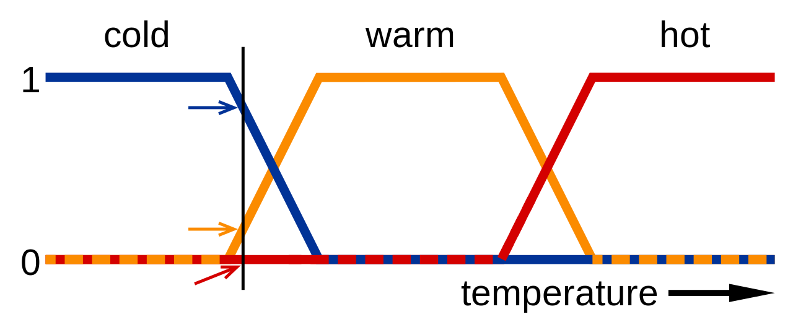

### 8.1 De lo binario a lo continuo

La lógica proposicional clásica es **binaria**: un enunciado es cierto o falso. Pero los humanos no
razonamos así — «hace frío» no es verdadero o falso de forma tajante, es una cuestión de grado. La
**lógica difusa** (o borrosa) extiende la lógica proposicional para trabajar con esa incertidumbre:

- Los valores de verdad son **números reales en el intervalo $[0, 1]$**: 0 es falso, 1 es cierto,
  0,5 es «cierto al 50 %».
- La pertenencia de un elemento a un conjunto viene dada por una **función de pertenencia**,
  $\mu_A(x)$: el grado de pertenencia de $x$ al conjunto $A$.
- Conceptos como *húmedo* o *frío* son difíciles de definir con precisión, pero la lógica difusa
  los define con funciones de pertenencia — lo que facilita crear dispositivos como termostatos:
  *«si la temperatura es fría, entonces enciende la calefacción»*.

Un **sistema de razonamiento impreciso** es un sistema basado en reglas que usa lógica difusa.
Permite trabajar con valores **continuos**, modela mejor el conocimiento humano y es muy apropiado
para **sistemas de control** — por eso enlaza directamente con el §10 y el §11.

### 8.2 Conceptos básicos

| Concepto | Qué es | Ejemplo |
|---|---|---|
| **Variable lingüística** | Variable que toma valores lingüísticos | *Temperatura* |
| **Valores lingüísticos** | Los valores que puede tomar esa variable | *Frío*, *Calor* |
| **Función de pertenencia** | Asigna a cada valor un grado de pertenencia a un valor lingüístico | $27\,°C \rightarrow Calor = 0{,}8$ |
| **Regla difusa** | Regla que usa valores difusos | «Si la temperatura es **fría**, entonces **calefacción alta**» |
| **Función de agregación** | Combina los valores difusos de varias reglas en una conclusión | $Calor=0{,}8,\ H\acute{u}medo=0{,}7 \rightarrow Sensaci\acute{o}n\ desagradable=0{,}8$ |

### 8.3 El funcionamiento en tres pasos

1. **Fuzzificación**: convierte los datos de entrada precisos en valores difusos, usando las
   funciones de pertenencia. $27\,°C \rightarrow Calor=0{,}8,\ MuchoCalor=0{,}2$.
2. **Evaluación de las reglas**: se aplican las reglas del sistema, combinando las funciones de
   pertenencia de las variables de entrada para deducir la relevancia de la salida. Por ejemplo:
   «si la temperatura es **alta** y la humedad es **baja**, la velocidad del ventilador debe ser
   **alta**».
3. **Desfuzzificación**: convierte la conclusión difusa de vuelta en un valor preciso, con una
   función de agregación (normalmente **centro de gravedad** o **máximo**).

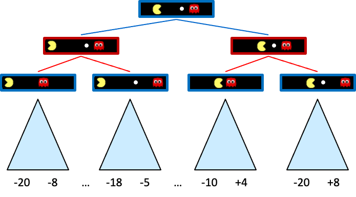

Las funciones de pertenencia más usadas son **trapezoidales** y **triangulares**; las sinusoidales
sirven para representar periodos, y las sigmoidales, probabilidades.

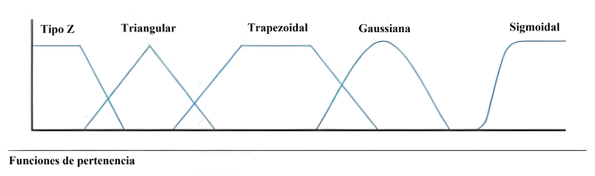

### 8.4 Ejemplo trabajado: la propina del restaurante

Es el ejemplo canónico de `scikit-fuzzy`, y el que verás resuelto paso a paso en el
[Notebook 5](notebooks/UD05_N05_logica_difusa_propinas.ipynb).

**Variables de entrada** (funciones triangulares):

- **Calidad del servicio**: baja $[0,5]$ · media $[0,10]$ · alta $[5,10]$
- **Calidad de la comida**: mala $[0,5]$ · media $[0,10]$ · buena $[5,10]$

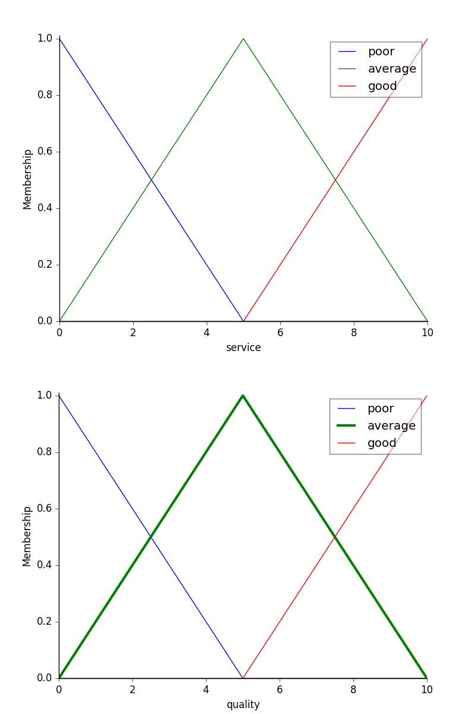

**Variable de salida**: propina — baja $[0,13]$ · media $[0,25]$ · alta $[13,25]$

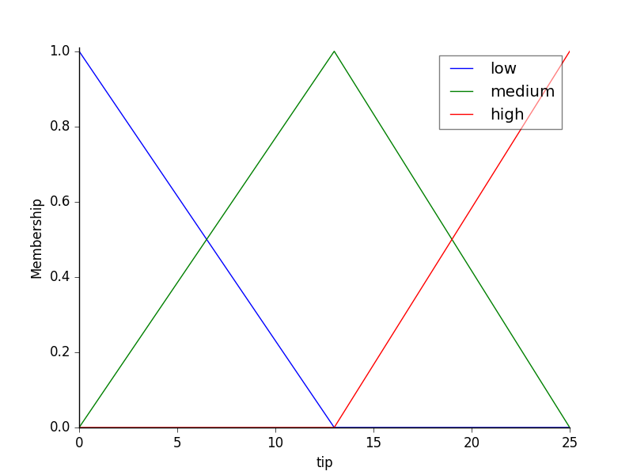

**Reglas**:

- SI (servicio es **baja** O comida es **mala**) ENTONCES propina es **baja**
- SI (servicio es **media**) ENTONCES propina es **media**
- SI (servicio es **alta** O comida es **buena**) ENTONCES propina es **alta**

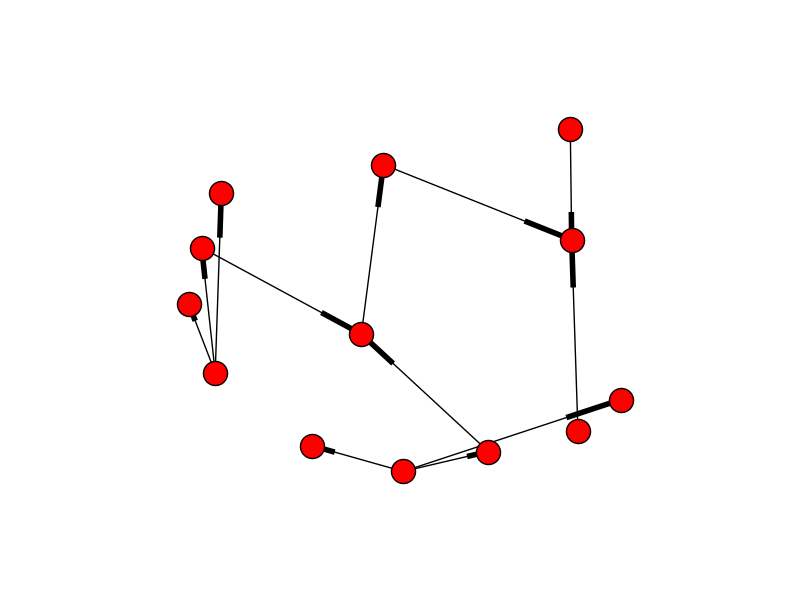

**Inferencia**: con un servicio de **9,8** y una comida de **6,5**, el sistema desfuzzifica una
propina de **19,24 €** — en la banda alta, coherente con un servicio casi perfecto y una comida
notable.

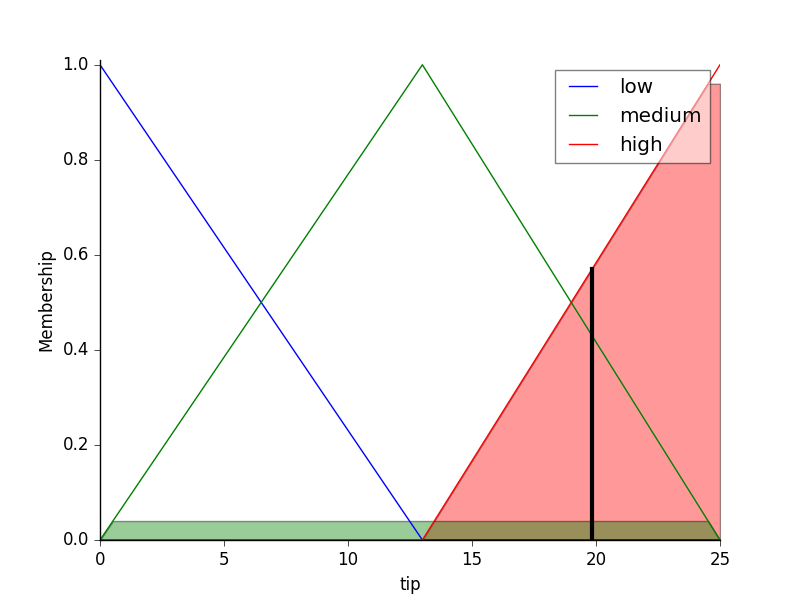

!!! tip "De la propina al quemador de gas"
    Este ejemplo es idéntico en estructura al **Notebook 8** (control de un quemador de gas) y al
    entregable **N14**: variables de entrada difusas, reglas lingüísticas, una salida
    desfuzzificada. La diferencia es que ahí la salida no es una propina, es la **potencia de un
    actuador real** — es el paso del §8 al §11.

## 9. Variación de características y dinámica (RA5-c)

### 9.1 Sensibilidad y robustez

- **Sensibilidad**: cómo cambian las conclusiones ante pequeñas desviaciones en los parámetros o
  datos de entrada. Un sistema muy sensible detecta pronto anomalías, pero **falsas alarmas** ante
  ruido.
- **Robustez**: capacidad de mantener conclusiones estables y seguras ante perturbaciones, ruido o
  fallos parciales.

### 9.2 Tres mecanismos de variación

| Qué varía | Efecto en la dinámica |
|---|---|
| **Las reglas (estructura lógica)** | Añadir condiciones al antecedente → más inercia (la regla se dispara menos); simplificar → sobreactivación (reglas se disparan ante transitorios sin riesgo) |
| **Los hechos (perturbaciones)** | Ruido en un sensor (p. ej. CO en un túnel oscilando alrededor del umbral) → el sistema conmuta actuadores sin parar |
| **Los umbrales de certeza** | Subir el umbral de un diagnóstico → menos falsos positivos pero puede **ignorar alertas tempranas** |

!!! example "El problema de la histéresis"
    Un sensor de CO en un túnel oscila entre 28 y 32 ppm con umbral en 30. Sin histéresis, los
    extractores se encienden y apagan en cada ciclo. Soluciones: una **regla de histéresis
    temporal** (la alerta debe mantenerse 30 s) o un **controlador difuso** que suavice la
    transición (enlaza con el §8).

## 10. Estrategias de control de un sistema experto (RA5-d)

### 10.1 Control de la agenda (resolución de conflictos)

| Estrategia | Qué hace |
|---|---|
| **Salience** | Prioridad numérica explícita de cada regla (las de emergencia van antes) |
| **Recency** | Prefiere las reglas con hechos más recientes (time-tags) |
| **Specificity** | Prefiere la regla con más condiciones en el antecedente |
| **Control de meta (metarrazonamiento)** | Reglas de nivel superior que modifican prioridades, activan grupos de reglas según el modo (arranque, operación, parada) o cambian la estrategia. Es la **sabiduría** de la jerarquía DIKW del §4.1, aplicada al propio motor |

### 10.2 Especificaciones de respuesta

Para controlar un proceso, el sistema experto debe cumplir **especificaciones** sobre la respuesta
de la variable controlada:

| Especificación | Qué mide |
|---|---|
| **Precisión** | Error en régimen permanente (diferencia entre la variable y el setpoint al estabilizarse) |
| **Tiempo de respuesta** | Tiempo de subida (tr) y de asentamiento (ts) |
| **Estabilidad** | Ausencia de oscilaciones; sobreimpulso (overshoot) máximo aceptable |
| **Alcance** | Rango de operación de la planta |

!!! note "Nivel FP"
    En este módulo se trabajan estas especificaciones de forma **conceptual** (qué miden y por qué
    importan), sin las fórmulas de la teoría de control de ingeniería. El foco está en *definir el
    objetivo y saber interpretar si la respuesta lo cumple*.

### 10.3 Ejemplo guiado: definir las especificaciones de un controlador de climatización

Recorremos juntos el razonamiento que repetirás en el Notebook 8, antes de aplicarlo al quemador de
gas real de `N14`.

**Problema**: queremos controlar la temperatura de una sala para que llegue a 21 ºC.

**Paso 1 · Setpoint y precisión.** La variable controlada (temperatura) debe estabilizarse en
21 ºC con un **error en régimen permanente** de ±0,5 ºC como máximo.

**Paso 2 · Tiempo de respuesta.** La sala debe alcanzar la banda aceptable (20,5-21,5 ºC) en menos
de **15 minutos** desde el arranque (tiempo de asentamiento).

**Paso 3 · Estabilidad y sobreimpulso.** Se tolera un sobreimpulso máximo de **1 ºC** por encima
del setpoint (sin oscilaciones que dañen el equipo).

**Paso 4 · Elegir el controlador.** Con un PID bien sintonizado se cumple en un sistema lineal,
pero la sala tiene inercia térmica y perturbaciones (puertas, sol). Un **controlador experto o
difuso** con reglas del operador («si la diferencia es grande → máxima potencia, y al acercarse →
reducir para no sobrepasar») consigue la respuesta con **menos sobreimpulso y más robustez** ante
las perturbaciones.

**Paso 5 · Comprobar y ajustar.** Se simula la respuesta y se mide ts y el sobreimpulso; si no se
cumple la especificación, se ajustan reglas o ganancias (análisis de sensibilidad, §9).

!!! note "Conclusión del ejemplo guiado"
    Controlar no es «conectar un motor»: es **definir el objetivo** (precisión), **acotar el
    tiempo**, **limitar el sobreimpulso** y **elegir el controlador** que lo cumpla, verificándolo
    con una simulación. Ese es el sentido del CE d y del CE e — y exactamente lo que se te pide en
    `N14`, con un quemador de gas real en vez de una sala.

## 11. Controladores inteligentes (RA5-e)

### 11.1 Del control clásico al control inteligente

Un **lazo de control** clásico compara el setpoint (SP) con la variable medida (PV), calcula el
error y aplica una acción (MV) con un **controlador PID** (proporcional-integral-derivativo). El
PID es eficaz en sistemas lineales, pero sufre con **retrasos, no linealidades y perturbaciones
multivariable**.

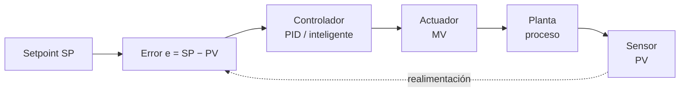

La acción del PID es `u = Kp·e + Ki·∫e + Kd·de/dt`: la parte proporcional responde al error, la
integral elimina el error residual y la derivada reduce el sobreimpulso. Sus límites: no predice
el futuro, se degrada con retrasos y no linealidades, y hay que **re-sintonizarlo** cuando la
planta envejece (ganancias fijas).

Los **controladores inteligentes** sustituyen o complementan al PID usando técnicas de IA:

| Controlador | Cómo funciona | Ventaja frente al PID |
|---|---|---|
| **Control difuso** | Reglas lingüísticas + funciones de pertenencia (Mamdani/Sugeno) — el §8 aplicado al control | Robusto ante ruido y no linealidad; no necesita modelo |
| **Control por reglas (experto)** | Motor de inferencia con reglas del operador experto | Captura heurísticas de operadores; fácil de entender |
| **Redes neuronales** | Aprenden la dinámica inversa de la planta | Adaptación a sistemas no lineales |
| **Control predictivo (MPC)** | Predice la trayectoria futura y optimiza la acción | Anticipa restricciones; proactivo |

### 11.2 Ejemplos con datos

| Caso | Mejora frente a PID |
|---|---|
| **Control térmico difuso** | Tiempo de asentamiento −76 % (416 s → 100 s); sobreimpulso 5,64 % → 0 % |
| **Horno de fundición (ANN)** | MSE 132,75 frente a 134,13 del PID (ligera mejora) |
| **Mitsubishi (aire acondicionado)** | Calienta/enfría 5× más rápido, −24 % consumo |
| **DeepMind centros de datos** | −40 % en energía de refrigeración (−15 % PUE overhead) |

!!! tip "¿Controlador inteligente siempre gana?"
    No siempre. El PID es simple, barato y fiable en sistemas bien modelados. El controlador
    inteligente aporta cuando hay **no linealidad, retraso o ruido fuerte**. La decisión es
    *empezar simple* y añadir inteligencia solo si se justifica — es lo que comprobarás tú mismo en
    `N14`, que pide **dos enfoques distintos** para el mismo quemador.

### 11.3 El sistema experto como controlador

El patrón del **control experto** (Åström, Anton y Årzén, 1986) usa un motor de inferencia dentro
del lazo: el sistema evalúa el error y su variación, decide la acción por reglas (supervisando y
ajustando incluso un PID) y explica la decisión. Es la base de sistemas industriales como
**Gensym G2** (refinerías, energía, farmacia) desde los años 80.

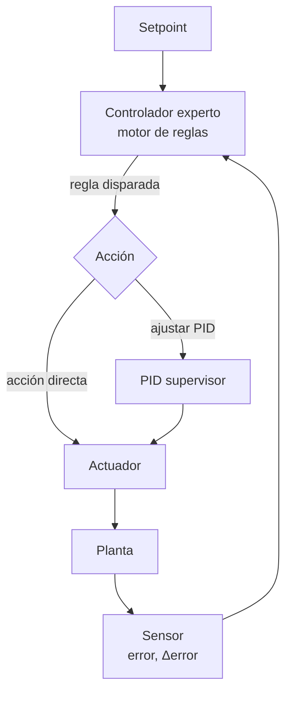

El controlador experto puede actuar de dos formas: **directamente** (decide la acción por reglas,
por ejemplo «si el error es negativo grande y aumenta → máxima potencia») o **supervisando** un
PID (ajusta sus ganancias cuando detecta que la respuesta se degrada). En ambos casos, la decisión
es **explicable**: se puede consultar qué regla se disparó y por qué.

!!! example "Regla de un controlador experto de climatización"
    ```
    SI error de temperatura es NEGATIVO_GRANDE
    Y variación del error es POSITIVA_PEQUENA
    ENTONCES potencia del quemador es MEDIA_ALTA
    ```
    Estas reglas capturan la heurística de un operador humano y son fáciles de auditar, algo que
    un PID o una red neuronal no ofrecen de forma directa.

## 12. Aplicaciones y tendencias (contenidos del RA5)

### 12.1 Aplicaciones por sector

| Sector | Uso |
|---|---|
| Industria | Control de procesos, diagnóstico de máquinas, mantenimiento |
| Salud | Diagnóstico asistido (MYCIN, GARVAN-ES1), dosificación |
| Finanzas | Asesoramiento, detección de fraude por reglas |
| Telecomunicaciones | Gestión de redes, diagnóstico de averías |

!!! note "Ejemplos clásicos con datos"
    - **MYCIN** (Stanford, 1972): ~500-600 reglas de diagnóstico clínico; precisión 69-70 %
      (equiparable a especialistas). Pionero de la explicación y los factores de certeza (§4.6).
    - **XCON/R1** (CMU/DEC, 1978): configuración de ordenadores VAX; pasó de 250 a más de 6.200
      reglas en 1986; precisión 95-98 % y ahorro de ~25 M$/año para DEC.
    - **DENDRAL** (1965): primer sistema experto; acotaba millones de isómeros moleculares a un
      conjunto manejable.
    - **SID** (DEC): generó el 93 % de las puertas lógicas del VAX 9000.
    - **Cyc** (1984): proyecto de enciclopediar el sentido común (millones de hechos y reglas).

### 12.2 Tendencias

- **BRMS** (*Business Rule Management Systems*): motores de reglas empresariales como **Drools**
  (Apache KIE) con estándares DMN/JSR-94. Permiten a las empresas gestionar miles de reglas de
  negocio separadas del código, con motores optimizados (PHREAK) que escalan linealmente.
- **Sistemas neuro-simbólicos** (3.ª ola de la IA): combinan redes neuronales (aprendizaje) con
  reglas y razonamiento simbólico (lógica), reduciendo alucinaciones y aportando explicabilidad —
  es la generalización de los **sistemas híbridos reglas/datos** del §7. Ejemplo: Amazon utiliza
  arquitecturas neuro-simbólicas en sus motores de compra para contrastar las salidas generativas
  con hechos y reglas.
- **IA explicable (XAI)**: MYCIN fue el origen de la explicación; hoy se usan SHAP/LIME para
  explicar modelos y la normativa exige el **derecho a explicación** del RGPD (enlaza UD06).
- **Agentes y razonamiento declarativo**: agentes que planifican con reglas y guardas lógicas de
  seguridad, garantizando que las decisiones distribuidas cumplen restricciones.
- **Reglas como guardarraíl del ML**: usar reglas para validar y acotar las salidas de los modelos
  (p. ej. un LLM no puede emitir una orden fuera de los rangos seguros definidos por reglas). Es la
  misma idea del §7, llevada a los modelos generativos.

!!! tip "Del pasado al presente"
    Los sistemas expertos «clásicos» (MYCIN, XCON) demostraron que el conocimiento declarativo y la
    explicación importan. Hoy esa idea **no ha muerto**: vive en los BRMS, en los sistemas
    neuro-simbólicos y en los guardarraíles que aseguran las salidas del ML. Saber construir y
    auditar sistemas basados en reglas —puras, híbridas o difusas— sigue siendo una competencia
    valiosa.

## 13. Puntos clave de la unidad

- La jerarquía **DIKW** distingue dato, información, conocimiento y sabiduría: un sistema experto
  almacena conocimiento (reglas) y, en su forma más avanzada, sabiduría (metarreglas).
- Un **sistema experto** codifica el conocimiento de un experto en una **base de conocimiento** y
  lo aplica con un **motor de inferencia** (ciclo reconocer-actuar, forward/backward).
- La **explicación** del razonamiento es su gran ventaja frente al ML (obligatoria en dominios
  regulados).
- La **representación del conocimiento** forma un continuo: pares atributo-valor, reglas,
  jerarquías, frames, lógica, redes semánticas u ontologías.
- Con `experta` (parche Py3.10+) se **simulan comportamientos** de ámbitos muy diversos: medicina,
  zoología, deporte, industria.
- Los **sistemas híbridos reglas/datos** (Human-Learn, FIGS, skope-rules) combinan el conocimiento
  experto con lo que aprenden los datos, cuando las reglas escritas a mano no bastan.
- La **lógica difusa** extiende la lógica a valores continuos $[0,1]$, con fuzzificación,
  evaluación de reglas y desfuzzificación — clave para el control de procesos reales.
- **Sensibilidad vs robustez**: variar reglas, hechos o umbrales cambia la dinámica (inanición,
  sobreactivación, falsas alarmas); la **histéresis** o el control difuso la estabilizan.
- Las **estrategias de control** (salience, control de meta) y las **especificaciones** (precisión,
  tiempo, estabilidad) definen la calidad de la respuesta.
- Los **controladores inteligentes** (difuso, por reglas, ANN, MPC) superan al PID en sistemas no
  lineales, con datos como −76 % de asentamiento o 0 % de sobreimpulso.
- **Tendencias**: BRMS/Drools, neuro-simbólico, XAI, reglas como guardarraíl del ML.

## 14. Glosario

| Término | Definición |
|---|---|
| **Dato** | Hecho o valor registrado, independiente de quien lo interpreta |
| **Información** | Un dato interpretado por un agente |
| **Conocimiento** | Información integrada en un modelo del mundo |
| **Sabiduría** | Meta-conocimiento: cuándo y cómo aplicar el conocimiento |
| **Sistema experto** | Programa de IA que emula el razonamiento de un experto en un dominio |
| **Base de conocimiento** | Reglas y hechos del dominio |
| **Memoria de trabajo** | Hechos actuales del problema |
| **Motor de inferencia** | Ejecuta el ciclo reconocer-actuar |
| **Ingeniero de conocimiento** | Profesional que formaliza el conocimiento del experto |
| **Adquisición de conocimiento** | Proceso de capturar el conocimiento (bottleneck) |
| **Subsistema de explicación** | Justifica el razonamiento del sistema |
| **Forward chaining** | Encadenamiento hacia delante (data-driven) |
| **Backward chaining** | Encadenamiento hacia atrás (goal-driven) |
| **Modus Ponens** | Si *P* implica *Q* y *P* es verdad, *Q* es verdad |
| **Modus Tollens** | Si *P* implica *Q* y *Q* es falso, *P* es falso |
| **Factor de certeza** | Medida de confianza de una conclusión (MYCIN) |
| **Frame** | Estructura con ranuras y valores por defecto |
| **Red semántica** | Grafo de conceptos y relaciones |
| **Ontología** | Esquema formal de clases y propiedades (OWL) |
| **Sistema híbrido reglas/datos** | Combina reglas escritas o deducidas con aprendizaje automático |
| **FIGS** | Algoritmo que genera reglas interpretables como suma de árboles pequeños |
| **Lógica difusa** | Extensión de la lógica a valores continuos en $[0,1]$ |
| **Variable lingüística** | Variable que toma valores lingüísticos (p. ej. «temperatura») |
| **Función de pertenencia** | Grado de pertenencia de un valor a un conjunto difuso |
| **Fuzzificación** | Conversión de un valor preciso a valores difusos |
| **Desfuzzificación** | Conversión de una conclusión difusa a un valor preciso |
| **Salience** | Prioridad numérica de una regla |
| **Control de meta** | Metarreglas que gestionan la propia inferencia |
| **Sensibilidad** | Variación de las conclusiones ante perturbaciones pequeñas |
| **Robustez** | Estabilidad de las conclusiones ante ruido o fallos |
| **Histéresis** | Retardo en el cambio de estado para evitar conmutaciones |
| **PID** | Controlador proporcional-integral-derivativo |
| **Lazo de control** | SP → error → controlador → planta → PV |
| **Error en régimen permanente** | Diferencia residual entre variable y setpoint |
| **Sobreimpulso (overshoot)** | Exceso máximo sobre el setpoint durante el transitorio |
| **Tiempo de asentamiento** | Tiempo hasta que la respuesta entra en la banda aceptable |
| **Control difuso** | Controlador basado en reglas lingüísticas y pertenencia |
| **Control predictivo (MPC)** | Optimiza la acción prediciendo la trayectoria futura |
| **BRMS** | Sistema de gestión de reglas de negocio (Drools) |
| **Neuro-simbólico** | Combinación de redes neuronales y razonamiento simbólico |
| **XAI** | IA explicable |

## 15. FAQ

??? question "¿Un sistema experto puede aprender de los datos?"
    No por sí mismo: las reglas las escribe un experto. Por eso es totalmente **explicable**, pero
    requiere que el conocimiento esté disponible y formalizado (el famoso *bottleneck*). Los
    **sistemas híbridos** del §7 son justo la respuesta a esta limitación: dejan que el aprendizaje
    automático deduzca o mejore las reglas.

??? question "¿Los sistemas expertos están anticuados?"
    No: los motores de reglas siguen en **BRMS empresariales** (Drools, SAP) y resurgen en los
    **sistemas neuro-simbólicos** y como **guardarraíl** del ML. MYCIN/XCON fueron los pioneros,
    pero la tecnología evolucionó (RETE → PHREAK, estándares DMN).

??? question "¿Por qué un sistema experto puede dar falsas alarmas?"
    Por **sensibilidad excesiva**: si un sensor tiene ruido y el umbral de la regla es muy justo,
    el sistema conmuta sin parar. Se corrige con **histéresis**, suavizado o un controlador
    difuso.

??? question "¿Qué es mejor, un PID o un controlador inteligente?"
    Depende del sistema. El PID es simple y fiable en sistemas lineales; el controlador inteligente
    (difuso, ANN, MPC) gana en no linealidades, retrasos o ruido. Se empieza simple y se añade
    inteligencia si hace falta — es lo que comprobarás con las dos versiones que pide `N14`.

??? question "¿`experta` funciona en Python moderno?"
    La librería (2019) falla en Python 3.10+ por `frozendict`. Con el parche
    `collections.Mapping = collections.abc.Mapping` funciona igual de bien. Existe también un fork
    (`om-experta`) que lo resuelve de otra forma, pero está archivado desde 2023: en este módulo
    usamos siempre el parche, para no tener dos soluciones al mismo problema.

??? question "¿Cuándo uso reglas puras y cuándo un sistema híbrido?"
    Si el experto puede formalizar el conocimiento completo, con reglas puras basta y son más
    explicables. Si el conocimiento es parcial, cambia con el tiempo, o hay muchos datos
    disponibles, un sistema híbrido (§7) aprovecha lo mejor de las dos fuentes.

??? question "¿Los sistemas expertos pueden explicar sus decisiones?"
    Sí, y es su gran ventaja: el subsistema de **explicación** puede responder «¿por qué?» y «¿cómo?»
    mostrando las reglas usadas. MYCIN fue el primero. Hoy esto se llama **IA explicable (XAI)** y
    es obligatorio en algunos dominios (derecho a explicación del RGPD).

## 16. Sesiones

| Semana | Horas | Contenido | CE |
|---|---|---|---|
| 11 | 3 | DIKW, arquitectura y dinámica; estructuras de representación | RA5-a |
| 12 | 3 | Notebook 10 (`experta`) + guiadas; `N11`; sistemas híbridos reglas/datos (`N12`) | RA5-b |
| 13 | 3 | Lógica difusa: Notebook 5 (propinas); variación y dinámica | RA5-b, RA5-c |
| 14 | 3 | Estrategias de control; controladores inteligentes; Notebook 8 | RA5-d |
| 15 | 3 | `N13`, `N14`; aplicaciones y tendencias; evaluación | RA5-d, RA5-e |

## 17. Recursos

- [Diapositivas](UD05_Diapositivas.md)
- **Práctica** — se hace, no se entrega ni puntúa:
    - [Ejercicios de autoevaluación](UD05_Ejercicios.md)
    - [Notebooks guiados](UD05_ActividadesGuiadas.md) — **ocho** notebooks, de menor a mayor
      dificultad: `N01`-`N04` reglas, `N05`-`N07` lógica difusa y `N08` control
- **Entregas** — seis, cada una con su rúbrica; [qué se entrega](UD05_Entregas.md):
    - [N10 · simular un sistema experto](notebooks/UD05_N10_simular_sistema_experto.ipynb)
    - y los cinco sistemas `N15` a `N14`, en dominios distintos a propósito
- Los notebooks se abren desde **Práctica** y **Entregas**, con descarga y apertura en Colab.

??? note "Referencias de la unidad"
    - [Wikipedia · Expert system](https://en.wikipedia.org/wiki/Expert_system)
    - [Wikipedia · MYCIN](https://en.wikipedia.org/wiki/MYCIN)
    - [Wikipedia · XCON](https://en.wikipedia.org/wiki/XCON)
    - [experta · readthedocs](https://experta.readthedocs.io/)
    - [CLIPS · clipsrules.net](https://www.clipsrules.net/)
    - [Drools / Apache KIE](https://www.drools.org/)
    - [Human-Learn](https://koaning.github.io/human-learn/index.html)
    - [imodels (FIGS)](https://github.com/csinva/imodels)
    - [skope-rules](https://github.com/scikit-learn-contrib/skope-rules)
    - [Wikipedia · Lógica difusa](https://es.wikipedia.org/wiki/L%C3%B3gica_difusa)
    - [Wikipedia · Fuzzy control system](https://en.wikipedia.org/wiki/Fuzzy_control_system)
    - [Wikipedia · PID controller](https://en.wikipedia.org/wiki/PID_controller)
    - [Modus Ponens](https://es.wikipedia.org/wiki/Modus_ponendo_ponens) · [Modus Tollens](https://es.wikipedia.org/wiki/Modus_tollendo_tollens)

## 18. Evaluación

| Peso | Instrumento |
|---|---|
| **40 %** actividades | El taller **N10** y los cinco sistemas **`N15`**-**`N14`**, cada uno con su rúbrica en la tarea de Moodle. Los ocho notebooks guiados son práctica y no puntúan |
| **60 %** prueba escrita | Prueba del RA5 en Moodle: preguntas de test y de desarrollo sobre el contenido de la unidad |

- **La normativa exige alcanzar todos los RA** del módulo para superarlo (art. 5.1 de la Orden
  8/2025: la calificación del módulo está *«en función de la consecución de los RA»*; y las
  Instrucciones 26-27, que impiden calificar positivamente un módulo con RA no superados). El
  centro concreta ese mandato exigiendo **≥ 5 en cada RA**.
- Los entregables `N11`-`N14` cubren un dominio fijo cada uno (medicina, deporte × 2, industria);
  `N15` es de libre elección y premia la originalidad.

## 19. Recuperación

Actividades del programa de recuperación individual por RA (art. 14.4 Orden 8/2025): repetir la
construcción de un sistema experto con un problema distinto y las pruebas de autoevaluación de la
unidad.

---
