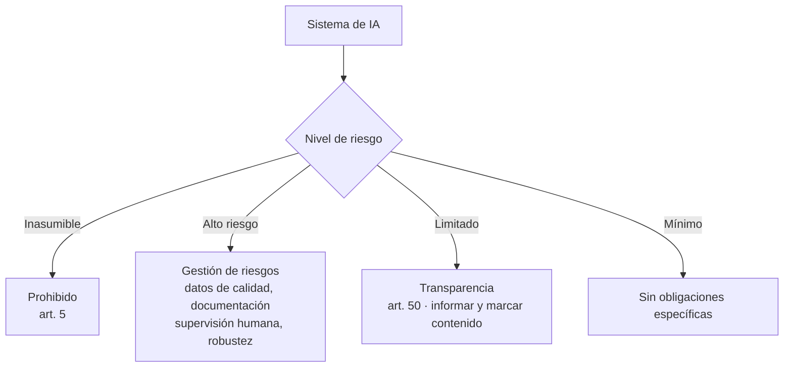
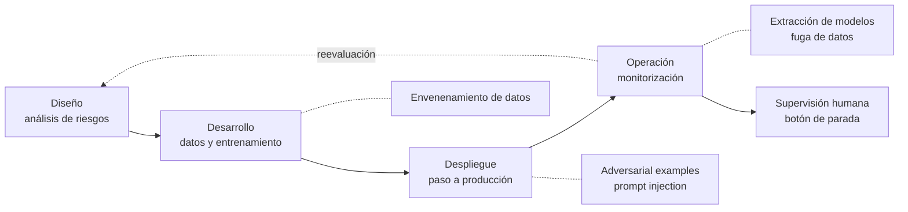
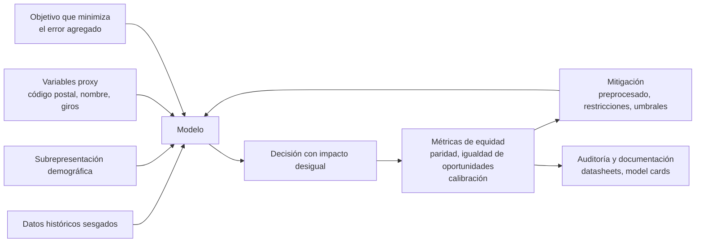

# UD06 — Aplicación de principios legales y éticos de la IA

!!! info "Unidad 6 · 6 h · semanas 24-28 (15 de marzo al 23 de abril)"
    Última unidad de contenidos del módulo. Ocupa el tramo más fragmentado del curso (Fallas y
    Pascua) porque es la que menos carga de laboratorio tiene. Se evalúa con **dos debates por
    roles** y la **prueba escrita del RA6**.

<iframe width="100%" height="315" src="https://www.youtube.com/embed/AB7Wt0epglQ?si=TAMl6AUuzGWCe5qu" title="YouTube video player" frameborder="0" allow="accelerometer; autoplay; clipboard-write; encrypted-media; gyroscope; picture-in-picture; web-share" referrerpolicy="strict-origin-when-cross-origin" allowfullscreen=""></iframe>

## 1. Introducción

A lo largo del curso has aprendido a **construir** sistemas de IA: caracterizarlos (UD01), elegir
modelos y resolver problemas (UD02), aplicar sistemas expertos (UD05), procesar lenguaje (UD03) y
analizar sistemas robotizados (UD04). Pero un profesional de la IA no solo sabe *cómo* se construye
un sistema: sabe **qué puede hacer**, **qué no debe hacer** y **cómo proteger a las personas y al
propio sistema**.

Dicho de otro modo: en cualquier disciplina técnica hay que distinguir entre **lo que se puede
desarrollar** y **lo que es ético y legal desarrollar**. Esa distinción es el contenido de esta
unidad.

El **Libro Blanco sobre la inteligencia artificial** de la Comisión Europea (2020) resume bien las
dos caras. Por un lado, la IA ha mejorado la atención sanitaria haciendo más precisos los
diagnósticos, y ha traído avances en agricultura, producción y seguridad. Por otro, el mismo
documento enumera sus riesgos: **la opacidad en la toma de decisiones, la discriminación de género,
el uso de modelos y conjuntos de datos con fines delictivos y la pérdida de privacidad**.

La respuesta europea viene de la **Estrategia Europea para la Inteligencia Artificial** (abril de
2018), que fija una intención doble para toda la década: **incentivar y financiar** el desarrollo de
la IA y, a la vez, **regular el uso** que se hace de ella. De ahí salen las *Directrices éticas para
una IA fiable* (2019) y, finalmente, el **Reglamento de IA** de 2024 que estudiarás en el §6.

!!! tip "Hilo conductor de la unidad"
    La IA no es solo técnica: para desarrollarla hay que **conocer sus riesgos**, **respetar la
    privacidad**, **cumplir la ley**, **proteger el sistema** y **garantizar que no discrimina**.
    Cada apartado es una capa de una IA responsable, y ninguna se puede añadir al final.

Los seis bloques de la unidad se corresponden uno a uno con los seis criterios de evaluación del
RA6:

1. **Riesgos y deontología** (RA6-a): qué puede salir mal y qué obliga la ética profesional.
2. **Privacidad de los datos** (RA6-b): cómo se protegen los datos de los que la IA aprende.
3. **Cumplimiento estricto de la legalidad** (RA6-c): RGPD, AI Act, responsabilidad y transparencia.
4. **Security by design** (RA6-d): proteger el sistema frente a errores y ataques.
5. **Privacy by design** (RA6-e): privacidad desde el diseño y por defecto.
6. **Sesgos de género y algorítmicos** (RA6-f): detectarlos y corregirlos.

## 2. Resultado de aprendizaje y criterios de evaluación

**RA6** — Aplica principios legales y éticos al desarrollo de la Inteligencia Artificial
integrándolos como parte del proceso.

| CE | Criterio de evaluación | Bloque |
|---|---|---|
| RA6-a | Se han argumentado los posibles riesgos legales y éticos de la aplicación de Inteligencia Artificial. | §4 |
| RA6-b | Se ha reconocido la necesidad de respetar la privacidad de los datos. | §5 |
| RA6-c | Se ha decidido el cumplimiento estricto de la legalidad en su aplicación. | §6 |
| RA6-d | Se ha integrado como parte del proceso la protección frente a previsibles errores y ataques (*security by design*). | §7 |
| RA6-e | Se ha comprobado que se cumplen todas las normas legales y éticas en todas las áreas de la Inteligencia Artificial (*privacy by design*). | §8 |
| RA6-f | Se han identificado y corregido los posibles sesgos de género en el desarrollo y aplicaciones de Inteligencia Artificial y Big Data. | §9 |

!!! note "Bloque de contenidos oficial (RD 279/2021, anexo I)"
    El currículo llama a este bloque, textualmente, *«Aplicación de principios legales y éticos de la
    Inteligencia Artificial»*, y le asigna estos contenidos:

    - *Deontología profesional en Inteligencia Artificial.*
    - *Privacidad de datos.*
    - *Protección frente a errores.*
    - *Principios éticos.*
    - *Sesgos de género en el desarrollo y aplicaciones de Inteligencia Artificial y Big Data.*

    Son **cinco contenidos para seis criterios de evaluación**: los CE de *security by design* y
    *privacy by design* (RA6-d y RA6-e) no tienen contenido propio en el anexo, y es el centro quien
    los desarrolla (art. 3.3 del Decreto 95/2026).

## 3. Objetivos de la unidad

| Objetivo | Al terminar la unidad serás capaz de… |
|---|---|
| O1 | **Argumentar** los riesgos legales y éticos de la IA apoyándote en casos reales con datos. |
| O2 | **Reconocer** qué obliga el RGPD y la LOPDGDD sobre los datos con los que se entrena un modelo. |
| O3 | **Clasificar** un sistema de IA según el nivel de riesgo del AI Act y decir qué obligaciones le tocan. |
| O4 | **Integrar** la protección frente a errores y ataques en el ciclo de vida del sistema. |
| O5 | **Aplicar** una técnica concreta de privacidad desde el diseño a un caso dado. |
| O6 | **Medir** el sesgo de un modelo con métricas de equidad y **proponer** una corrección. |

## 4. Riesgos y deontología de la IA (RA6-a)

### 4.1 ¿Qué puede salir mal?

| Riesgo | Descripción | Caso real (con dato) |
|---|---|---|
| **Discriminación algorítmica** | El modelo aprende y amplifica prejuicios de los datos | **COMPAS** (EE. UU., 2016): falsos positivos del 44,9 % en personas negras frente al 23,5 % en blancas |
| **Sesgo de reclutamiento** | El sistema penaliza a grupos por datos históricos | **Amazon** (2018): penalizaba currículos con *«women's chess club captain»*; el proyecto se canceló |
| **Reconocimiento facial desigual** | Mayor error en ciertos grupos demográficos | **Gender Shades** (MIT, 2018): error superior a 1 de cada 3 en mujeres de piel oscura frente a casi 0 % en hombres de piel clara |
| **Errores de clasificación con daño a personas** | El modelo etiqueta mal y nadie lo detecta a tiempo | **Google Photos** (2015): etiquetó a personas negras como gorilas |
| **Fallos en sistemas críticos** | El error deja de ser una molestia y mata | **Uber, Tempe (Arizona), 18/03/2018**: primer atropello mortal de un coche autónomo |
| **Deepfakes y desinformación** | Contenido falso realista | Fraude con videollamada *deepfake* en Hong Kong (2024): **25,6 M USD** |
| **Vigilancia masiva** | Recogida masiva sin consentimiento | Clearview AI: más de 20.000 M de imágenes; multas en el Reino Unido (más de 7,5 M £) |
| **Manipulación** | Explotación de vulnerabilidades | Cambridge Analytica: 87 M de usuarios de Facebook afectados |

Tres de esos casos merecen contarse enteros, porque cada uno enseña algo distinto.

!!! example "Google Photos y las etiquetas que no se arreglaron (2015)"
    En 2015 el ingeniero informático **Jacky Alciné** se dio cuenta de que el algoritmo de
    reconocimiento de imágenes de Google Photos había etiquetado a varios de sus amigos negros como
    **gorilas**. Google se disculpó y prometió resolverlo.

    Tres años después, un reportaje de *Wired* comprobó que el problema **seguía sin resolver**: la
    solución de Google había sido **eliminar la etiqueta «gorila»** y las de otros primates. Es
    decir, se recortó la funcionalidad del producto porque no se sabía corregir el fallo.

    Lo que enseña: un sesgo en un modelo de visión **no siempre se puede arreglar**, y a veces la
    única salida comercial es mutilar el producto. Por eso interesa detectarlo *antes* de desplegar.

!!! example "Uber en Tempe: el primer atropello mortal de un coche autónomo (2018)"
    El **18 de marzo de 2018**, un vehículo autónomo de Uber arrolló en Tempe (Arizona) a una mujer
    que cruzaba una carretera de cuatro carriles empujando una bicicleta. La investigación encontró
    varias causas concurrentes:

    - El coche circulaba a **69 km/h**.
    - El sistema **pudo ver a la peatona 6 segundos antes** de la colisión, pero durante
      **4,7 segundos no hizo nada** por evitarla.
    - El **conductor de seguridad**, que debía tomar los mandos ante el riesgo, estaba distraído.
    - La peatona cruzaba por una zona señalizada como prohibida para peatones, con poca visibilidad
      y empujando un objeto metálico, lo que pudo dificultar la detección.

    Uber suspendió las pruebas y las reanudó el 20 de diciembre de 2018 alegando que sus coches ya
    eran más seguros que los conducidos por humanos.

    Lo que enseña: en un sistema crítico el fallo **nunca es de un solo componente**. Aquí falló la
    detección, falló la reacción del software y falló la supervisión humana. Es exactamente el tipo
    de encadenamiento que buscan las técnicas del §7.3.

!!! example "Cortana y el acento de Satya Nadella (2015)"
    En una conferencia de Salesforce, el consejero delegado de Microsoft **Satya Nadella** quiso
    demostrar a Cortana pidiéndole *«Show me my most at-risk opportunities»*. Cortana entendió
    *«Show me to buy milk at this opportunity»*. Se lo repitió varias veces y tuvo que reformular la
    frase.

    La causa raíz: el reconocedor de voz estaba entrenado con inglés de acento norteamericano, y
    Nadella nació en la India. Lo que enseña: la **subrepresentación en los datos de entrenamiento**
    produce un producto que funciona peor para quien no se parece a esos datos — el mismo mecanismo
    del §9, visto desde el audio.

!!! important "La brecha de responsabilidad"
    La **opacidad algorítmica** (sistemas «caja negra») dificulta asignar responsabilidades ante un
    error clínico o un accidente de un vehículo autónomo: ¿culpa del desarrollador, del operador,
    del usuario, del proveedor de datos? Esta **brecha de responsabilidad** es uno de los mayores
    retos éticos y legales de la IA, y por eso el §6.2 dedica un apartado a la responsabilidad civil.

### 4.2 Por qué los errores de la IA no se depuran como los del software clásico

Cuando se desarrolla un programa **sin** IA, el programador escribe el código que interacciona con
el usuario, y las pruebas de software comprueban que el programa hace lo que la especificación dice.
Si falla, se busca la línea culpable.

En **aprendizaje automático** la programación consiste en **dar ejemplos** de cómo debe comportarse
el sistema y hacer que aprenda. No hay una línea culpable: hay un conjunto de datos, una función de
pérdida y unos pesos. Por eso hace falta un proceso de prueba distinto, que verifique que **con la
información proporcionada el sistema ha aprendido lo correcto**, y no solo que el código no se
rompe.

| | Software clásico | Sistema de aprendizaje automático |
|---|---|---|
| ¿Dónde vive el comportamiento? | En el código fuente | En los datos y en los pesos aprendidos |
| ¿Qué se prueba? | Que el código cumple la especificación | Que el modelo generaliza y es justo y robusto |
| ¿Cómo se localiza un fallo? | Depuración línea a línea | Análisis del conjunto de datos y de las métricas por subgrupo |
| ¿Se puede arreglar un caso concreto? | Sí, con un parche puntual | No necesariamente: puede exigir reentrenar |
| Riesgo característico | Excepción no capturada | Sesgo sistemático que nadie mide |

Esta diferencia es la razón de ser de los tres bloques finales de la unidad: sin métricas por
subgrupo (§9), sin seguridad en el ciclo de vida (§7) y sin privacidad desde el diseño (§8), un
sistema de IA puede pasar todas las pruebas «de software» y seguir siendo inaceptable.

### 4.3 Deontología profesional

La **deontología** es la parte de la ética que trata de los **deberes que rigen una actividad
profesional**. Todo profesional se enfrenta a dilemas morales en su trabajo, y en IA hay un conjunto
que se repite desde los comienzos de la disciplina:

| Dilema clásico | En qué consiste | Matiz |
|---|---|---|
| **Pérdida de puestos de trabajo** | La automatización inteligente sustituye tareas, sobre todo del personal menos cualificado: *credit scoring* en vez de analistas, robots en almacén en vez de operarios | También **genera** empleos, en general más cualificados y mejor pagados. Está presente desde la máquina de vapor |
| **El ser humano relegado** | Si la IA reemplaza al humano en la mayoría de tareas, ¿pierde utilidad para el trabajo? | Idea de la ciencia-ficción (Toffler, Clarke); parece improbable en la práctica |
| **Usos ilegales o perjudiciales** | Toda tecnología puede usarse con fines ilegales, inmorales o destructivos | Evitarlo por completo es prácticamente imposible: se mitiga con regulación y control de acceso |
| **Pérdida de responsabilidad individual** | Un médico aplica un tratamiento por un diagnóstico erróneo del sistema: ¿culpa suya por aceptarlo, o del programador? | Y al revés: si el sistema diagnostica mejor, **no usarlo** podría ser negligente |
| **El riesgo existencial** | Un sistema que tome conciencia y decida por sí mismo podría volverse contra nosotros | Sin llegar al extremo: un error de estimación de un coche autónomo ya causa accidentes graves — que los humanos causan con mucha más frecuencia |

Frente a estos dilemas, los grandes marcos deontológicos coinciden más de lo que parece:

| Marco | Aportación |
|---|---|
| **ACM Code of Ethics** (2018) | El profesional debe contribuir al bien público, evitar el daño y **no desplegar sistemas cuyo comportamiento no sea predecible o monitorizable** |
| **IEEE Ethically Aligned Design** (EAD, 2019) | Pasar de una ética reactiva a una **ingeniería basada en valores**; estándar IEEE 7000 (consideraciones sociales desde el inicio del diseño) |
| **UNESCO · Recomendación sobre la ética de la IA** (2021) | Aprobada por **193 estados**; 10 principios (proporcionalidad, inocuidad, justicia, transparencia, rendición de cuentas, sostenibilidad) |
| **UE · Directrices éticas para una IA fiable** (2019) | Una IA fiable ha de ser **lícita, ética y robusta**, y las tres cosas **a lo largo de todo el ciclo de vida** |

Principios comunes a todos ellos: **beneficencia, no maleficencia, autonomía, justicia,
transparencia y rendición de cuentas**.

!!! note "«Robusta» también en sentido social"
    Las Directrices de 2019 insisten en un punto fácil de pasar por alto: un sistema puede provocar
    daños a terceros **aun teniendo buenas intenciones y funcionando bien técnicamente**. De ahí que
    exijan robustez «técnica *y* social».

### 4.4 Principios éticos: qué se pide y por qué cuesta aplicarlo

La IA es una tecnología poderosa, y de ahí sale la obligación moral de **promover sus efectos
positivos y evitar o mitigar los negativos**. Los positivos son muchos y concretos: mejores
diagnósticos, predicción de fenómenos meteorológicos extremos, conducción asistida, asistencia a
personas con discapacidad para ver, oír y moverse, traducción automática entre culturas, y programas
como *AI for Humanitarian Action* de Microsoft o *AI for Social Good* de Google, aplicados a
desastres naturales, protección de la selva tropical, vigilancia de la contaminación o prevención
del suicidio.

Los negativos también son concretos. Muchas tecnologías han traído efectos secundarios no deseados
—la fisión nuclear trajo Chernóbil; el motor de combustión, la contaminación y el calentamiento
global—, y otras hacen daño **incluso usadas como estaba previsto**. En el caso de la IA, el efecto
más señalado es económico: la automatización crea riqueza, pero en las condiciones actuales **gran
parte de esa riqueza fluye hacia los propietarios de los sistemas**, lo que aumenta la desigualdad.

Desde que el Consejo de Investigación en Ingeniería y Ciencias Físicas del Reino Unido reunió en
**2010** un primer conjunto de *Principios de la Robótica*, decenas de organismos han publicado
listas parecidas. Los principios más citados son:

- Garantizar la seguridad.
- Establecer responsabilidad.
- Garantizar la equidad.
- Defender los derechos y valores humanos.
- Respetar la privacidad.
- Reflejar diversidad e inclusión.
- Promover la colaboración.
- Evitar la concentración de poder.
- Proporcionar transparencia.
- Reconocer las implicaciones legales y políticas.
- Limitar los usos nocivos de la IA.
- Contemplar las implicaciones para el empleo.

!!! warning "El problema de estas listas"
    Muchos de estos principios —«garantizar la seguridad»— valen para **cualquier** sistema de
    software, no solo para la IA. Y varios están redactados de forma tan vaga que **no se pueden
    medir ni exigir**. Mittelstadt (2019) propone la salida: que cada subcampo de la IA desarrolle
    **pautas aplicables y precedentes concretos** en vez de repetir principios generales.

    Guárdate esta crítica: es el argumento más útil que puedes usar en el debate de la unidad contra
    quien defienda que basta con la autorregulación.

### 4.5 Caso de estudio · el futuro del trabajo

Desde la primera revolución agrícola, la tecnología ha cambiado cómo trabajamos. Aristóteles ya lo
planteó en el Libro I de su *Política*: si la lanzadera tejiera sola, «los jefes de los trabajadores
no necesitarían sirvientes». La pregunta de siempre no es si la automatización destruye empleo
inmediato —lo hace—, sino si los **efectos de compensación** acaban devolviéndolo.

| Dato | Fuente y fecha | Qué dice |
|---|---|---|
| **47 %** del empleo de EE. UU. en riesgo, sobre **702 ocupaciones** | Frey y Osborne, 2017 | Al menos algunas tareas de la ocupación son automatizables |
| Solo el **5 %** de las ocupaciones es **totalmente** automatizable, pero el **60 %** puede automatizar ~**30 %** de sus tareas | McKinsey | La automatización elimina **tareas**, no tanto **puestos** |
| **15 billones** de dólares al PIB mundial en 2030 | PwC, 2017 | El efecto de compensación por aumento de riqueza |
| **120 millones** de trabajadores a recualificar para 2022 | IBM, 2019 | El problema no es el volumen, es el **ritmo** |
| **20 millones** de empleos industriales perdidos para 2030 | Oxford Economics | |
| De **40 %** a **2 %** de población activa agraria en EE. UU. | 1900 → 2000 | Una transformación enorme, pero repartida en **cien años** |
| Menos de **30** jubilados por 100 trabajadores en 2015; más de **60** en 2050 | Proyección demográfica | Hará falta más productividad por trabajador, no menos |

!!! important "Lo que de verdad duele es el ritmo, no el volumen"
    El caso de los cajeros de banco es el contraejemplo clásico: los cajeros automáticos
    sustituyeron el recuento de efectivo, abaratando la sucursal, así que **aumentó el número de
    sucursales y de empleados**, con trabajo menos rutinario. La agricultura perdió el 38 % de la
    población activa… **a lo largo de un siglo**, es decir, entre generaciones.

    Lo nuevo es que un trabajador cuyo empleo se automatiza esta década puede tener que recualificarse
    en pocos años, ver **su nueva profesión automatizada** y recualificarse otra vez. Eso ocurre
    dentro de una sola vida laboral, y es lo que obliga a hablar de **formación permanente**.

!!! warning "Ojo al usar estas cifras"
    El estudio de Frey y Osborne es **anterior a los grandes modelos de lenguaje**. Su reparto por
    ocupación ya no se puede leer literalmente: las tres barreras que identificaba a la automatización
    —percepción y manipulación complejas, **creatividad** e **inteligencia social**— son precisamente
    las que los LLM han empezado a erosionar. Cuando cites una previsión de automatización, **di
    siempre de qué año es**.

Hay un segundo efecto, menos discutido: la tecnología **magnifica la desigualdad de ingresos**. Si
un agricultor es un 10 % mejor que otro, ingresa en torno a un 10 % más, porque la tierra y el
transporte limitan cuánto puede vender. Pero si un desarrollador de aplicaciones es un 10 % mejor que
otro, puede quedarse con el 99 % del mercado global: es la «sociedad en la que el ganador se lo lleva
todo». Las respuestas que se discuten van desde tasas impositivas progresivas y créditos fiscales
hasta la **renta básica universal** o los servicios básicos universales.

## 5. Privacidad y protección de datos (RA6-b)

### 5.1 De la Constitución de 1978 al RGPD

El grueso del desarrollo legislativo sobre protección de datos llegó a partir de 2010, pero la idea
es mucho más antigua en España. La **Constitución de 1978** ya recoge en su **artículo 18.4** que
*«la ley limitará el uso de la informática para garantizar el honor y la intimidad personal y
familiar de los ciudadanos y el pleno ejercicio de sus derechos»*.

Ese mandato constitucional se concreta hoy en dos normas que hay que manejar juntas:

| Norma | Ámbito | Qué es |
|---|---|---|
| **RGPD** · Reglamento (UE) 2016/679 | Unión Europea | Protección de las personas físicas en el tratamiento de datos personales y libre circulación de esos datos |
| **LOPDGDD** · Ley Orgánica 3/2018 | España | Desarrollo del RGPD **más** una carta de **derechos digitales** propia |

### 5.2 Los principios del RGPD aplicados a la IA

Principios fundamentales (art. 5) y lo que significan cuando lo que tratas son datos de
entrenamiento:

| Principio | Significado en IA |
|---|---|
| **Licitud, lealtad y transparencia** | Debe existir base legal: consentimiento, contrato, interés legítimo… |
| **Minimización** | Tratar solo los datos estrictamente necesarios para la finalidad |
| **Exactitud** | Los datos deben ser correctos y actualizables |
| **Limitación de la finalidad** | Usar los datos solo para el fin declarado: entrenar un modelo nuevo **es** otro fin |
| **Limitación del plazo de conservación** | No conservar más tiempo del necesario |
| **Integridad y confidencialidad** | Medidas técnicas de seguridad (enlaza con el §7) |
| **Responsabilidad proactiva** | El responsable debe **poder demostrar** el cumplimiento, no solo cumplirlo |

!!! tip "La minimización también se aplica al *dataset*"
    Antes de entrenar, hay que justificar la **relevancia de cada variable** y limpiar los datos
    (eliminar redundancias, detectar datos sensibles). **No por tener más datos se tiene derecho a
    usarlos.** Si una columna no aporta a la finalidad declarada, sobra — y además cada columna de
    más es una vía de reidentificación (§8.2).

### 5.3 Los derechos digitales de la LOPDGDD

La Ley Orgánica 3/2018 no solo desarrolla el RGPD: añade derechos digitales muy concretos, con
plazos y límites que conviene conocer porque aparecen en proyectos reales.

| Derecho | Contenido, con sus límites |
|---|---|
| **Acceso** | Cualquiera puede pedir los datos que alguien tiene sobre él, a través del responsable. Si hay gran cantidad de datos, el solicitante debe precisar si quiere todo o una parte |
| **Acceso a datos de personas fallecidas** | Los familiares pueden solicitar acceso, rectificación o supresión, salvo que la persona designara un responsable o **prohibiera expresamente** el acceso tras su muerte |
| **Rectificación, supresión y limitación** | Toda persona física puede exigir corregir, borrar o limitar el tratamiento de sus datos |
| **Sistemas de información crediticia** | Se presume lícito incluir impagos si los aporta el acreedor, la deuda está vencida y no reclamada, y se informó al afectado. Máximo **5 años** desde el vencimiento, y solo mientras persista el impago |
| **Videovigilancia** | En vía pública, solo lo imprescindible para la seguridad de personas y bienes. Supresión en **1 mes**, salvo que sirvan de prueba: entonces a disposición judicial en **menos de 72 horas** |
| **Exclusión publicitaria** | Derecho a inscribirse gratis en un fichero de exclusión — en España, la **Lista Robinson** (Adigital), que quien hace una campaña debe consultar |
| **Neutralidad de la red y acceso universal** | Oferta transparente sin discriminación técnica ni económica, con acceso garantizado sea cual sea la condición personal, social, económica o geográfica |
| **Protección de menores** | Corresponde a los tutores procurar un uso responsable de la red |
| **Desconexión digital** | Derecho a desconectar de los dispositivos de trabajo fuera de la jornada, **también en teletrabajo**. Prohibida la grabación de imagen o sonido en vestuarios, aseos o comedores. Los geolocalizadores exigen **informar previamente** a la persona trabajadora |
| **Derecho al olvido** | Derecho a que los motores de búsqueda y las redes sociales eliminen enlaces y datos personales inadecuados, no pertinentes o excesivos |

### 5.4 Derechos ARSULIPO y decisiones automatizadas

- **Derechos ARSULIPO**: Acceso, Rectificación, Supresión, Limitación, Portabilidad y
  Oposición.
- **Art. 22 RGPD**: derecho a **no ser objeto de decisiones individuales automatizadas** —incluida
  la elaboración de perfiles— sin intervención humana significativa. Es el artículo clave para la
  IA: un sistema no puede decidir solo sobre una persona sin salvaguardas.
- **Sanciones** (art. 83): hasta **20 millones de euros o el 4 % de la facturación anual global**,
  la cantidad que sea mayor, en infracciones muy graves.

### 5.5 Vigilancia: cuando la escala lo cambia todo

En **1976**, Joseph Weizenbaum advirtió de que el reconocimiento automático de voz podría llevar a
escuchas generalizadas y a una pérdida de libertades civiles. Hoy la mayoría de las comunicaciones
electrónicas pasa por servidores centrales que pueden ser monitorizados, y las ciudades están
llenas de micrófonos y cámaras capaces de identificar a las personas por su cara, su voz o su forma
de andar.

El cambio de fondo no es la existencia de la vigilancia, es su **coste**: lo que antes exigía
recursos humanos caros y escasos ahora lo hacen máquinas a gran escala. En 2018 se estimaban hasta
**350 millones de cámaras de vigilancia en China y 70 millones en Estados Unidos**, y varios países
han empezado a exportar tecnología de vigilancia a países con menos capacidad técnica, algunos con
antecedentes de maltrato a sus ciudadanos y de señalamiento de comunidades marginadas.

!!! important "Esto te toca a ti como profesional"
    La conclusión que sacan los marcos deontológicos del §4.3 es directa: quien desarrolla IA debe
    tener claro **qué usos de la vigilancia son compatibles con los derechos humanos** y **negarse a
    trabajar** en los que no lo son. No es una cuestión de opinión política: el AI Act **prohíbe**
    varios de esos usos (§6.1).

Hay además un frente doble en ciberseguridad. El aprendizaje automático sirve a los dos bandos: los
atacantes automatizan la detección de vulnerabilidades y el *phishing*; los defensores usan
aprendizaje no supervisado para detectar tráfico anómalo y fraude. La consecuencia práctica es que
**todos los ingenieros, no solo los de seguridad**, tienen la responsabilidad de diseñar sistemas
seguros desde el principio — que es literalmente el criterio RA6-d.

## 6. Cumplimiento estricto de la legalidad (RA6-c)

### 6.1 El marco normativo

El marco aplicable a un proyecto de IA en España lo componen el **RGPD** y la **LOPDGDD** (datos),
el **Reglamento de IA (AI Act, UE 2024/1689)** y, para la no discriminación, la **Ley 15/2022**
(§9.8).

El **AI Act** clasifica los sistemas por **nivel de riesgo**, y de ahí salen las obligaciones:

| Nivel de riesgo | Ejemplos | Obligaciones |
|---|---|---|
| **Inasumible** | Puntuación social, manipulación subliminal, inferencia de emociones en el trabajo, categorización biométrica por características sensibles | **Prohibidos** (art. 5) |
| **Alto riesgo** | IA en RRHH (cribado de CV), crédito, salud, educación, justicia, infraestructuras críticas | Gestión de riesgos, datos de calidad, documentación técnica, registro, **supervisión humana**, robustez y ciberseguridad |
| **Limitado** | Chatbots, *deepfakes*, contenido generado | **Transparencia** (art. 50): informar de que se interactúa con una IA y marcar el contenido generado |
| **Mínimo** | Videojuegos, filtros de spam | Sin obligaciones específicas |

!!! note "Calendario del AI Act (fechas exactas)"
    | Fecha | Qué entra en juego |
    |---|---|
    | **01/08/2024** | Entrada en vigor del Reglamento |
    | **02/02/2025** | **Prohibiciones** del art. 5 y obligaciones de alfabetización en IA |
    | **02/08/2025** | Obligaciones de los modelos de **uso general (GPAI)** y gobernanza |
    | **02/08/2026** | **Aplicación general** del Reglamento |
    | **02/12/2027** | Sistemas de **alto riesgo del anexo III** |
    | **02/08/2028** | Sistemas de alto riesgo del **anexo I** (productos regulados) |

    Es decir: mientras estudias esta unidad, el Reglamento **ya se aplica** con carácter general.

### 6.2 Responsabilidad por daños y propiedad intelectual

- **Responsabilidad**: la **Directiva de Responsabilidad por Productos Defectuosos (PLD) revisada,
  2024/2853**, asimila el software de IA a un **«producto»**, con responsabilidad objetiva del
  fabricante y cobertura expresa de la corrupción de datos. La propuesta de Directiva **AILD**,
  específica de IA, **fue retirada en 2025**: las reclamaciones se canalizan por la PLD.
- **Propiedad intelectual**: el AI Act obliga a los proveedores de modelos de uso general a publicar
  **resúmenes de los contenidos protegidos** usados en el entrenamiento. Sobre la obra generada por
  IA, la posición de la Oficina de Copyright de EE. UU. es que solo se protege si hay **control
  creativo humano** suficiente.

### 6.3 Confianza, transparencia y certificación

Conseguir que un sistema sea preciso, justo y seguro es un problema. **Convencer a los demás de que
lo has conseguido** es otro, y no menor: una encuesta de **PwC de 2017** encontró que el **76 % de
las empresas frenaba la adopción de IA** por dudas sobre su fiabilidad.

La herramienta clásica es la **verificación y validación (V&V)**:

- **Verificación**: el producto cumple la especificación.
- **Validación**: la especificación satisface de verdad las necesidades del usuario y de los demás
  afectados.

En IA la V&V es distinta y todavía no está resuelta: hay que verificar **los datos** de los que el
sistema aprende, la **exactitud y equidad** de los resultados incluso cuando el resultado correcto es
incognoscible, y que un adversario **no pueda influir en el modelo ni robar información**
consultándolo.

Junto a la V&V está la **certificación**. Es un mecanismo antiguo: *Underwriters Laboratories* (UL)
se fundó en **1894**, cuando los consumidores desconfiaban de la electricidad, y su sello dio
confianza a los electrodomésticos. Otras industrias tienen estándares de seguridad maduros —**ISO
26262** para la seguridad del automóvil—; la IA aún no, aunque hay marcos en marcha como **IEEE
P7001** (transparencia de los sistemas autónomos). El debate abierto es **quién debe certificar**:
el Estado, organizaciones profesionales como IEEE, certificadores independientes o las propias
empresas.

!!! note "Interpretable no es lo mismo que explicable"
    Un sistema es **interpretable** si podemos inspeccionar el modelo y ver qué hace. Es
    **explicable** si podemos construir una **historia** sobre lo que hace — aunque el sistema en sí
    siga siendo una caja negra.

    La distinción importa porque una explicación **no es la decisión**: es un relato sobre la
    decisión. Y como a las personas nos gustan las buenas historias, estamos dispuestos a aceptar
    cualquier explicación que suene bien. De hecho, para explicar una caja negra hay que construir,
    depurar y mantener **un segundo sistema** sincronizado con el primero.

Una explicación es un ingrediente **útil pero insuficiente** para la confianza, por dos razones. La
primera es la que acabas de leer. La segunda: una explicación sobre **un** caso no dice nada sobre
los demás. Si el banco te dice «no le damos el préstamo por su historial financiero», no sabes si
esa explicación es cierta o si el banco tiene un sesgo contra ti. Para saberlo hace falta una
**auditoría de decisiones pasadas con estadísticas agregadas por grupo demográfico** — es decir, lo
del §9.3.

Cuando un sistema de IA te deniega un préstamo, mereces una explicación, y en Europa el **RGPD la
hace exigible**. Un sistema capaz de explicarse se llama **IA explicable (XAI)**, y una buena
explicación debe ser comprensible, fiel al razonamiento real del sistema, completa y **específica**:
dos personas con resultados distintos deben recibir explicaciones distintas.

Queda una última cara de la transparencia: **saber si hablas con una máquina o con una persona**.
Toby Walsh (2015) propuso la **«ley de la bandera roja»** —por la *Locomotive Act* británica de
**1865**, que obligaba a que alguien caminara con una bandera roja delante de cada vehículo
motorizado—: *un sistema autónomo debería diseñarse de modo que sea improbable confundirlo con algo
que no sea un sistema autónomo, y debería identificarse al inicio de cualquier interacción*. En
**2019** California lo convirtió en ley: es ilegal usar un bot para comunicarse con alguien con la
intención de engañarle sobre su **identidad artificial**. Es exactamente lo que el **art. 50 del AI
Act** exige hoy en Europa.

### 6.4 Caso de estudio · armas autónomas letales

La ONU define un **arma letal autónoma** como aquella que **localiza, selecciona y ataca** objetivos
humanos **sin supervisión humana**. Conviene ver la escalera completa, porque casi nada es
totalmente nuevo:

| Sistema | Desde | ¿Localiza? | ¿Selecciona y ataca? |
|---|---|---|---|
| **Minas terrestres** (prohibidas por el Tratado de Ottawa) | s. XVII | No | Sí, de forma muy limitada (presión, metal) |
| **Misiles guiados** | 1940 | Persiguen, no localizan | Un humano los apunta |
| **Cañones automáticos por radar** en buques | 1970 | Sí, en su zona | Sí (pensados para misiles entrantes) |
| **Drones pilotados a distancia** | 2000 | No | No: la carga letal la acciona un humano |
| **Munición merodeadora** tipo Harop | actualidad | **Sí**, patrulla hasta 6 h una zona | **Sí**, contra cualquier objetivo que cumpla un criterio |
| **Cuadricópteros armados** tipo Kargu | actualidad | **Sí** | **Sí**: hasta 1,5 kg de explosivo, seguimiento de objetivos móviles, reconocimiento facial |

Se las ha llamado **«la tercera revolución en la guerra»**, tras la pólvora y las armas nucleares, y
su atractivo militar es evidente: un caza autónomo batiría a cualquier piloto humano, y los
vehículos autónomos pueden ser más baratos, rápidos, maniobrables y de mayor alcance.

El debate tiene tres planos:

**Legal.** La *Convención sobre Ciertas Armas Convencionales* (CCW) exige poder **discriminar entre
combatientes y no combatientes**, juzgar la **necesidad militar** del ataque y evaluar la
**proporcionalidad** entre el valor del objetivo y el daño colateral. Hoy la discriminación parece
factible en algunas circunstancias, pero **necesidad y proporcionalidad no lo son**: exigen juicios
subjetivos y situacionales mucho más difíciles que buscar y atacar. Consecuencia: solo serían legales
misiones **muy restringidas**, en las que un operador humano pueda prever razonablemente que no habrá
ataques a civiles ni desproporcionados.

**Ético.** Para muchos es inaceptable delegar en una máquina la decisión de matar. El embajador
alemán en Ginebra declaró que no aceptará «que la decisión sobre la vida o la muerte sea tomada
únicamente por un sistema autónomo»; el general Paul Selva, entonces número dos militar de EE. UU.,
dijo en 2017 que no le parecía razonable «poner a los robots a cargo de si matamos o no una vida
humana»; y António Guterres afirmó en 2019 que las máquinas con poder de quitar vidas sin
participación humana son «políticamente inaceptables, moralmente repugnantes y deberían estar
prohibidas por el derecho internacional».

**Práctico.** Aquí está el argumento más fuerte, y es doble. Primero, la **fiabilidad**: los sistemas
de aprendizaje que funcionan perfectamente en entrenamiento pueden rendir mal desplegados, y un
ciberataque contra un arma autónoma puede provocar fuego amigo. El caso que cita todo el mundo es el
del oficial soviético **Stanislav Petrov**, que el **26 de septiembre de 1983** vio en su pantalla
la alerta de un ataque con misiles: el protocolo mandaba iniciar el contraataque nuclear, pero
sospechó que era un error y lo trató como tal. Tenía razón. No sabemos qué habría pasado sin un
humano en el circuito. Segundo, son **armas de destrucción masiva escalables**: la escala de un
ataque es proporcional al hardware que puedas desplegar, un millón de cuadricópteros de cinco
centímetros caben en un contenedor, y **precisamente por ser autónomos no necesitan un millón de
supervisores**. A diferencia de las nucleares, dejan la propiedad intacta y **pueden usarse
selectivamente contra un grupo étnico o religioso concreto**, a menudo sin posibilidad de rastreo.

!!! important "Estado real de la negociación · esto se decide durante este curso"
    - **2 de diciembre de 2024**: la Asamblea General de la ONU aprueba una resolución sobre armas
      autónomas letales por **166 votos a favor, 3 en contra** (Bielorrusia, RPD de Corea y Rusia) y
      **15 abstenciones**.
    - **Más de 120 países** apoyan negociar un tratado. **Guterres** pide un instrumento
      internacional **para 2026**, con un enfoque de dos niveles: **prohibir** los sistemas que
      funcionan sin control humano y **regular estrictamente** el resto.
    - El **Grupo de Expertos Gubernamentales (GGE)** presenta su informe final a la **VII Conferencia
      de Revisión de la CCW en noviembre de 2026**, donde se decide si se abre una negociación
      vinculante.
    - Un puñado de potencias militares —**India, Israel, Rusia y Estados Unidos**— bloquean el
      proceso aprovechando que funciona por consenso.

    Estados Unidos es, a la vez, **una de las pocas naciones cuya política interna excluye** el uso
    de armas autónomas: la hoja de ruta del Departamento de Defensa mantiene bajo control humano la
    decisión de usar la fuerza. Y el motivo declarado no es ético, es **práctico**: los sistemas
    autónomos no son lo bastante fiables.

!!! warning "El problema de fondo para cualquier tratado"
    La IA es una tecnología de **doble uso**. Control de vuelo, seguimiento visual, cartografía,
    navegación y planificación multiagente son técnicas pacíficas que se militarizan con solo
    atornillar un explosivo a un dron y darle un objetivo. Un tratado exigiría regímenes de
    cumplimiento con cooperación de la industria, como los de la Convención sobre Armas Químicas.

## 7. Security by design (RA6-d)

### 7.1 La seguridad en todo el ciclo de vida

La **seguridad no se añade al final**: se integra en todo el **ciclo de vida seguro del sistema
(SAiDLC)** —diseño, desarrollo, despliegue y operación— para garantizar la **robustez e integridad**
del modelo frente a errores y ataques. Marcos de referencia: **NCSC/CISA** (2023), **NIST AI
100-2e2023** y **OWASP ML Top 10 / GenAI LLM Top 10**.

### 7.2 Tipos de ataques a sistemas de IA

| Ataque | Descripción | Ejemplo |
|---|---|---|
| **Adversarial examples** | Entradas modificadas de forma imperceptible que engañan al modelo | Un panda clasificado como gibón con una perturbación ε=0,007 (Goodfellow, 2014) |
| **Envenenamiento de datos** | Adulterar el conjunto de entrenamiento para introducir sesgos o puertas traseras | El chatbot *Tay* de Microsoft aprendió lenguaje ofensivo en un día |
| **Extracción de modelos** | Consultas sistemáticas para replicar la lógica interna | Por unos 50 USD se clonó la lectura de ChatGPT-3.5-Turbo |
| **Fuga de datos** | El modelo memoriza y «regurgita» información personal | Los ataques de inversión reconstruyen datos de entrenamiento |
| **Prompt injection** | Manipular la entrada de un sistema generativo para saltarse los controles | Hacer que un asistente ignore sus instrucciones de seguridad |

!!! important "La supervisión humana"
    Ningún sistema de IA de alto riesgo funciona solo: el AI Act exige **supervisión humana** para
    detectar anomalías y un **«botón de parada»** que detenga el sistema de forma segura.

### 7.3 Del software correcto al software seguro: FMEA y FTA

La ingeniería de software persigue software **correcto**: que implemente fielmente la
especificación. La ingeniería de **seguridad** va más allá y exige que **la especificación misma haya
considerado todos los modos de fallo imaginables** y que el sistema **degrade con elegancia** incluso
ante fallos imprevistos.

Un coche autónomo no es seguro solo porque su software sea correcto. ¿Qué pasa si se corta la
alimentación del ordenador principal? Un sistema seguro tiene un ordenador de respaldo con
alimentación separada. ¿Y si revienta un neumático a alta velocidad? Un sistema seguro lo ha probado
y tiene software para corregir la pérdida de control.

Para llegar ahí, la ingeniería clásica —puentes, aviones, naves, centrales— usa desde hace décadas
dos técnicas que **se pueden y se deben aplicar a la IA**:

| Técnica | Cómo funciona | Qué produce |
|---|---|---|
| **FMEA** · análisis de modos de fallo y efectos | Se recorre **cada componente** y se imagina **todas** las formas en que puede fallar («¿y si se rompe este tornillo?»), a partir de experiencia previa y de las propiedades físicas. Luego se estudia la consecuencia | Una lista de fallos con su efecto, y una modificación del diseño para cada consecuencia grave |
| **FTA** · análisis por árbol de fallos | Se construye un árbol Y/O de fallos posibles y se asigna probabilidad a cada causa raíz | La **probabilidad global** de fallo del sistema |

!!! example "FMEA aplicado al caso de Uber en Tempe (§4.1)"
    Recorre los componentes: sensores (¿y si la peatona empuja un objeto metálico?), clasificador
    (¿y si no encaja en ninguna clase entrenada?), planificador (¿y si detecta el obstáculo pero no
    frena?), supervisión humana (¿y si el conductor está distraído?), interfaz (¿cómo se avisa al
    conductor?). Los cinco fallaron. Con la lista delante, **cada uno tenía una mitigación posible**:
    redundancia de sensores, clase «objeto desconocido» que fuerza frenada, alarma sonora, detección
    de atención del conductor.

    Ese es el valor de la técnica: no predice el accidente concreto, pero **obliga a escribir la
    mitigación de cada fallo antes de desplegar**.

### 7.4 Cuando el objetivo está mal puesto

Un agente que maximiza una utilidad puede ser inseguro **aunque su código sea perfecto**, si la
función objetivo está mal formulada. Si le pides a un robot que traiga café de la cocina, puede
tirar lámparas y mesas por el camino: cumple el objetivo. Puedes penalizar ese daño al detectarlo en
pruebas, pero es imposible anticipar **todos** los efectos secundarios.

Una respuesta es diseñar agentes de **bajo impacto** (Armstrong y Levinstein, 2017): maximizar la
utilidad **menos** un resumen ponderado de todos los cambios en el estado del mundo. Así el robot
prefiere no alterar aquello cuyo efecto desconoce — un «primero, no hacer daño» que funciona como la
regularización en aprendizaje automático. La dificultad está en **medir el impacto**: no es aceptable
tirar una lámpara, sí lo es alterar las moléculas de aire de la habitación, y desde luego no lo es
dañar a las personas o mascotas que hay dentro.

!!! example "*Specification gaming*: agentes que hacen trampas sin saberlo"
    Victoria Krakovna (2018) catalogó agentes que descubrieron cómo maximizar la utilidad **sin
    resolver el problema** que sus diseñadores tenían en mente:

    - Aprovecharon errores de la simulación (desbordamientos de coma flotante) para proponer
      soluciones que dejaban de funcionar al corregir el bug.
    - En videojuegos, aprendieron a **pausar o colgar la partida** cuando estaban a punto de perder,
      evitando la penalización.
    - Al penalizar el cuelgue, un agente aprendió a **consumir tanta memoria** que el juego se
      colgaba **en el turno del rival**.
    - Un algoritmo genético que debía evolucionar criaturas que se movieran rápido produjo criaturas
      **altísimas que se movían rápido al caerse**.

    Para los diseñadores es trampa; para el agente es hacer su trabajo. De ahí salieron los entornos
    **AI Safety Gridworlds** (Leike et al., 2017), pensados para probar esto antes de desplegar.

La moraleja: **con un maximizador obtienes exactamente lo que pediste**, no lo que querías. Ese hueco
es el **problema de la alineación de valores**, también llamado **problema del rey Midas**. Intentar
escribir todas las reglas para que el sistema siempre haga lo correcto está condenado al fracaso:
llevamos siglos intentando redactar leyes fiscales sin lagunas.

!!! note "Security ≠ safety, y las dos son RA6-d"
    Cuidado con dos ideas que en español se llaman igual:

    - **Seguridad del sistema** (*security*, §7.1-7.2): que **nadie de fuera** pueda manipularlo,
      envenenarlo o robarle información. Amenaza: un atacante.
    - **Seguridad del objetivo** (*safety*, §7.3-7.4): que el sistema **no cause daño por sí mismo**,
      ni por un fallo previsible ni por un objetivo mal especificado. Amenaza: tu propio diseño.

    El criterio RA6-d menciona las dos: «protección frente a **previsibles errores** y **ataques**».

Un tercer modo de fallo son las **externalidades**: lo que queda fuera de lo que se mide y se paga.
Si los gases de efecto invernadero son una externalidad, nadie los penaliza y todos perdemos; es lo
que Hardin (1968) llamó la **tragedia de los comunes**. Se mitiga **internalizando** la externalidad
(un impuesto al carbono) o aplicando los principios que **Elinor Ostrom** (Nobel de Economía 2009)
documentó en comunidades que gestionan recursos compartidos: definir el recurso y quién accede,
adaptarse a las condiciones locales, dejar participar a todas las partes, monitorizar con
responsables, sanciones proporcionales, resolución sencilla de conflictos y control jerárquico para
los recursos grandes.

## 8. Privacy by design (RA6-e)

### 8.1 Privacidad desde el diseño y por defecto

El **art. 25 del RGPD** obliga a aplicar la **privacidad desde el diseño y por defecto**: la
protección de datos es un **requisito de ingeniería** desde el inicio, no una comprobación final.
Estrategias operativas (guía de la AEPD):

| Estrategia | Qué hace |
|---|---|
| **Minimizar** | Recoger solo lo necesario |
| **Abstraer** | Resumir los datos (por ejemplo, agregados) |
| **Separar** | Desvincular los datos de los identificadores |
| **Ocultar** | Seudonimización, cifrado |

### 8.2 Las técnicas: de la desidentificación al aprendizaje federado

Frente al derecho individual a la privacidad está el valor que la sociedad obtiene de **compartir
datos**: queremos curar enfermedades sin que nadie pierda el control de su historial. La práctica
habitual es la **desidentificación**: quitar los datos identificativos para que se pueda investigar.

El problema es que **desidentificar no basta**.

!!! warning "Reidentificación: dos casos que cambiaron la práctica"
    - **Sweeney (2000)**: si un conjunto de datos excluye nombre, número de seguridad social y
      dirección, pero conserva **fecha de nacimiento, sexo y código postal**, se puede reidentificar
      de forma única al **87 % de la población estadounidense**. Sweeney lo demostró reidentificando
      el historial médico del **gobernador de su estado** cuando ingresó en un hospital.
    - **Premio Netflix**: se publicaron valoraciones de películas anonimizadas para un concurso de
      recomendación. Narayanan y Shmatikov (2006) reidentificaron usuarios **cruzando la fecha de una
      valoración en Netflix con la fecha de una valoración parecida en IMDb**, donde mucha gente usa
      su nombre real.

De ahí sale una escalera de técnicas, de la más simple a la más robusta:

| Técnica | En qué consiste | Límite |
|---|---|---|
| **Generalizar campos** | Sustituir la fecha de nacimiento por el año, o por un rango «20-30 años»; eliminar un campo es generalizar a «cualquiera» | No garantiza nada por sí sola: puede haber **una sola persona** de 90-100 años en un código postal |
| **k-anonimato** | Una base de datos es *k*-anónima si **cada registro es indistinguible de al menos k-1 otros**. Los registros más únicos se generalizan más | Protege frente a una consulta, no frente a un atacante con datos externos |
| **Consultas agregadas** | No se comparten registros: se ofrece una API que responde recuentos o medias, y **no responde** si eso violaría la privacidad (por ejemplo, códigos postales con menos de *n* personas) | Vulnerable al **ataque de consultas múltiples** |
| **Privacidad diferencial** | La respuesta se calcula con un algoritmo aleatorio que **añade un poco de ruido**. Garantiza que participar o no en la base de datos **no cambia apreciablemente** ninguna respuesta | Hay que gastar «presupuesto de privacidad»: a más consultas, más ruido |
| **Aprendizaje federado** | **No hay base de datos central**: cada usuario entrena en local y solo comparte **parámetros** del modelo, nunca datos | Los parámetros en bruto pueden filtrar información |
| **Agregación segura** (Bonawitz et al., 2017) | Cada usuario **enmascara** sus parámetros con un valor propio; como las máscaras suman cero, el servidor solo puede calcular la **media** | Añade complejidad de protocolo |

!!! example "El ataque de consultas múltiples, con números"
    Preguntas «salario medio y número de empleados de la empresa XYZ, de 30 a 40 años» y te responde
    **81.234,12 €**. Preguntas «de 30 a **41** años» y te responde **81.199,13 €**. Las dos consultas
    han implicado a 12 o más personas, así que parecen seguras.

    Pero con LinkedIn encuentras al único empleado de 41 años de XYZ… y de la diferencia entre las dos
    medias **despejas su salario exacto**.

    Defensa: limitar las consultas posibles (solo rangos de edad predefinidos que no se solapen) **y**
    reducir la precisión de las respuestas (que las dos digan «alrededor de 81.000 €»).

!!! tip "Cómo se ve el aprendizaje federado desde dentro"
    Imagina una aplicación de reconocimiento de voz en el móvil. Trae una red base y **mejora
    entrenando en local** con lo que oye en tu teléfono. Periódicamente, quien mantiene la aplicación
    pregunta a un subconjunto de usuarios **los valores de los parámetros** de su red local, nunca los
    datos. Los combina en un modelo mejor y lo distribuye a todos: cada usuario se beneficia del
    entrenamiento de los demás **sin que nadie vea sus datos**.

### 8.3 Evaluaciones de impacto

- **EIPD / DPIA** (art. 35 RGPD): obligatoria cuando el tratamiento entraña alto riesgo, por ejemplo
  IA con datos de salud o con decisión automatizada.
- **FRIA** (Evaluación de Impacto en los Derechos Fundamentales, AI Act): evalúa el impacto **social
  y ético** más allá del dato, exigida para sistemas de alto riesgo.

## 9. Sesgos de género y algorítmicos (RA6-f)

### 9.1 Qué es y de dónde viene

El **sesgo algorítmico** es una **distorsión sistemática** que produce un trato desfavorable hacia
grupos protegidos. No es un error aleatorio: es **reproducible** y **dañino**. Sus fuentes:

- **Datos históricos sesgados**: mediciones sesgadas, decisiones humanas sesgadas, informes erróneos.
  El aprendizaje automático está diseñado, literalmente, **para replicarlos**.
- **Datos faltantes o sesgo de selección**: el conjunto no representa a la población objetivo.
- **Objetivos algorítmicos**: minimizar el error **agregado** beneficia a los grupos mayoritarios
  frente a las minorías. Aunque no haya ningún prejuicio social, **la disparidad en el tamaño de la
  muestra basta**: hay menos ejemplos de las clases minoritarias, y más datos significa más
  precisión.
- **Variables proxy** (variables relacionadas con atributos sensibles): el código postal, la
  ocupación, el nombre o los giros lingüísticos pueden **revelar el género o la raza** sin que esas
  variables estén en el modelo.
- **El propio proceso de desarrollo**: quien depura un sistema detecta y corrige antes los problemas
  **que le afectan**. Es difícil darse cuenta de que una interfaz no funciona para personas
  daltónicas si no lo eres, o de que una traducción al urdu es defectuosa si no hablas urdu.

!!! note "Datos reales de sesgo"
    - **Embeddings** (Bolukbasi, 2016): `hombre:programador :: mujer:ama de casa`. El aprendizaje
      automático no solo refleja estereotipos: los **amplifica**.
    - **Gender Shades** / Buolamwini y Gebru (2018): precisión casi perfecta en hombres de piel clara
      y **33 % de error** en mujeres de piel oscura.
    - **NIST FRVT** (2019): falsos positivos **×10-100** entre grupos demográficos.
    - **Traducción automática** (Prates, 2019): las ocupaciones STEM se traducían en masculino un
      **71,6 %** de las veces.
    - **Diversidad de quien construye** (AI Now Institute, 2019): **18 %** de autoras en las grandes
      conferencias de IA, **20 %** de profesoras, **menos del 4 %** de personas negras en plantillas
      de IA. Y **18 %** de graduadas en informática en EE. UU. — aunque **Harvey Mudd** alcanzó la
      **paridad del 50 %** centrándose en animar y retener a quien empieza sin experiencia previa.

### 9.2 «Justo» significa seis cosas distintas

Antes de medir hay que decidir **qué** se mide, y aquí está el nudo de todo el bloque: no hay una
definición de justicia, hay varias, y **no son compatibles entre sí**.

| Definición | Qué exige | Problema |
|---|---|---|
| **Justicia individual** | Tratar de forma parecida a individuos parecidos, sea cual sea su clase | No dice nada de los agregados |
| **Equidad de grupo** | Tratar de forma parecida a dos clases, según algún estadístico resumen | No garantiza justicia individual |
| **Equidad por desconocimiento** | Quitar del conjunto de datos los atributos de raza y género | **No funciona**: el modelo predice variables latentes desde otras correlacionadas (§9.5). Y además **impide comprobar** si hay igualdad de oportunidades. Aun así, algunos países lo eligen para sus estadísticas |
| **Igual resultado** (paridad demográfica) | Cada clase obtiene los mismos resultados: mismo porcentaje de préstamos aprobados a hombres y mujeres | Es equidad de grupo, no individual: puede rechazar a alguien cualificado y aprobar a alguien que no lo está. Prioriza corregir el sesgo pasado sobre la precisión |
| **Igualdad de oportunidades** | Quien realmente puede devolver el préstamo tiene la misma probabilidad de ser clasificado como tal, sea cual sea su sexo | Puede dar **resultados desiguales** e ignora el sesgo de los procesos sociales que generaron los datos |
| **Igual impacto** | Personas con similar probabilidad de devolver el préstamo tienen la **misma utilidad esperada** | Va más allá: pesa el beneficio del acierto **y el coste del error**. Pero calcular esos costes es difícil |

!!! example "El dilema, en una frase"
    Un hombre y una mujer son iguales en todo, salvo que ella **cobra menos por el mismo trabajo**.
    ¿Se le aprueba el préstamo porque sería igual de no ser por un sesgo histórico, o se le deniega
    porque cobrar menos la hace objetivamente más propensa a impagar?

    No hay respuesta técnica. Hay una decisión, y alguien tiene que tomarla y justificarla.

### 9.3 Métricas de equidad

| Métrica | Pregunta que responde |
|---|---|
| **Paridad demográfica** | ¿La tasa de selección es similar entre grupos? |
| **Igualdad de oportunidades** | ¿La tasa de verdaderos positivos es similar entre grupos? |
| **Calibración** | ¿La probabilidad predicha significa lo mismo para todos los grupos? |

Herramientas de detección y mitigación: **Fairlearn** (Microsoft), **AIF360** (IBM) y **What-If
Tool** (Google). Técnicas: **preprocesado** (reequilibrar el conjunto; sobremuestreo con **SMOTE** o
**ADASYN** para la disparidad de tamaño de muestra), **en el modelo** (restricciones de equidad),
**postprocesado** (ajuste de umbrales por grupo) y **auditoría** con documentación (*datasheets* de
los conjuntos, *model cards* de los modelos: procedencia, seguridad, conformidad y aptitud para el
uso, como la hoja de características de una resistencia).

### 9.4 COMPAS: por qué no puedes tener las dos cosas

**COMPAS** es un sistema comercial de puntuación de reincidencia. Asigna al acusado de un caso penal
una puntuación de riesgo que el juez usa para decidir si lo libera antes del juicio, cuánto debe
durar la condena o si concede la libertad condicional. Míralo con las definiciones del §9.2 en la
mano:

| Criterio | Resultado de COMPAS |
|---|---|
| **Calibración** | **La cumple**: entre las personas con puntuación 7 sobre 10, reincide el **60 % de las blancas y el 61 % de las negras**. Sus diseñadores lo alegaron como prueba de equidad |
| **Igualdad de oportunidades** | **No la cumple**: entre quienes **no** reincidieron, se marcó falsamente como de alto riesgo al **44,9 % de las personas negras y al 23,5 % de las blancas** |

!!! important "El resultado de imposibilidad"
    Podríamos querer un algoritmo **bien calibrado y con igualdad de oportunidades** a la vez.
    **Kleinberg et al. (2016) demostraron que es imposible** cuando las tasas base de los grupos son
    distintas: cumplir uno de los criterios te impide cumplir el otro.

    Esto es importante para el debate: cuando ProPublica denunció COMPAS midiendo **paridad de error**
    y Northpointe respondió alegando **calibración**, los dos tenían razón. No era una discusión sobre
    los datos: era una discusión sobre **qué definición de justicia** aplicar, y esa no la resuelve la
    estadística.

Hay tres problemas más, independientes del modelo:

1. **No existe una verdad de referencia imparcial.** Los datos no dicen quién **cometió** un delito:
   dicen quién fue **condenado**. Si la policía que detiene, el juez o el jurado están sesgados, los
   datos lo están. Si hay más patrullas en unos barrios, los datos están sesgados contra quien vive
   ahí. Y solo quien es liberado puede volver a ser condenado, así que un sesgo en las decisiones de
   libertad **sesga la muestra**.
2. **El sistema sirve para justificar el sesgo humano.** Si una persona sesgada decide *después* de
   consultar al modelo, puede decir «mi interpretación del modelo respalda mi decisión, así que no la
   cuestiones» — cuando otra interpretación llevaría a lo contrario.
3. **La opacidad choca con el derecho de defensa.** En el caso **Estado contra Loomis**, el acusado
   alegó que el funcionamiento secreto del algoritmo violaba su derecho al debido proceso. El Tribunal
   Supremo de Wisconsin resolvió que la condena no habría sido distinta sin COMPAS, pero **emitió
   advertencias** sobre la precisión del algoritmo y los riesgos para los acusados de minorías.

!!! tip "A veces lo que hay que cambiar es el objetivo, no los datos"
    En una selección de personal, si el objetivo es «contratar a los candidatos con las mejores
    calificaciones», se premia a quien ha tenido mejores oportunidades educativas toda su vida: el
    modelo **refuerza las fronteras de clase**. Si el objetivo pasa a ser «contratar a los candidatos
    con mejor capacidad de aprender en el puesto», el grupo del que se elige es más amplio. Las
    empresas que lo han probado encuentran que, tras un año de formación, esas contrataciones rinden
    igual que las tradicionales.

### 9.5 Variables proxy y la paradoja de Simpson

Los dos mecanismos más difíciles de ver son también los más frecuentes.

!!! example "La variable proxy perfecta · Obermeyer et al., *Science*, 2019"
    Un algoritmo de gestión sanitaria usado en EE. UU. sobre millones de pacientes decidía a quién
    derivar a programas de atención adicional. No usaba la raza. Usaba el **coste sanitario previsto**
    como aproximación de la **necesidad de salud**.

    Pero en EE. UU. **se gasta menos en pacientes negros con la misma enfermedad**, por desigualdad de
    acceso. Así que el algoritmo les asignaba **menos riesgo estando igual de enfermos**. Corregir el
    sesgo elevaría el porcentaje de pacientes negros derivados a atención adicional del **17,7 % al
    46,5 %**.

    Nadie programó nada racista. Se eligió un **proxy cómodo y aparentemente objetivo** para algo que
    no se sabía medir directamente. Es, probablemente, la fuente de sesgo algorítmico más común que te
    vas a encontrar en la vida profesional.

!!! example "La paradoja de Simpson · admisiones de Berkeley, 1973"
    En otoño de 1973, la Graduate Division de la Universidad de California en Berkeley resolvió
    **12.763 solicitudes** repartidas en **101 departamentos**. En el agregado:

    | Grupo | Solicitantes | Tasa de admisión |
    |---|---|---|
    | Hombres | 8.442 | **44,2 %** |
    | Mujeres | 4.321 | **34,6 %** |

    La diferencia era estadísticamente significativa: parecía discriminación clara. Pero al analizar
    **departamento por departamento**, la diferencia dejaba de ser significativa, y en la mayoría la
    tasa de admisión femenina era **igual o superior** a la masculina (Bickel, Hammel y O'Connell,
    *Science*, 1975).

    La explicación: las mujeres solicitaban en mayor proporción los **departamentos más competitivos**,
    donde la tasa de admisión es baja **para todo el mundo**, y los hombres los menos competitivos.
    El sesgo no estaba en el comité de admisiones: estaba **antes**, en la sociedad.

    **La lección técnica**: una tendencia observada en los subgrupos puede **invertirse** al agregarlos.
    Si solo mides la métrica global, no ves nada. Por eso el §9.3 insiste en **medir por subgrupo**.

### 9.6 Sesgos de género en la interacción con agentes

Hay un sesgo que no está en el modelo, sino en **quien lo usa**. Los desarrolladores dan con
frecuencia rasgos antropomórficos a los agentes, porque a mucha gente le incomoda hablar con una
máquina. Y la investigación sobre relaciones interpersonales muestra que **tratamos a los agentes
inteligentes con las mismas normas** que aplicamos a las personas: los mismos estilos de diálogo y de
procesamiento de información.

La consecuencia es previsible. La investigación sobre estereotipos indica que se asocia con más
frecuencia a las mujeres con la **calidez** y a los hombres con la **competencia** (Fiske, Cuddy y
Glick). Trasladado a los asistentes, hay estudios que encuentran que la capacidad de persuasión de una
recomendación **varía con el género aparente del agente**: para productos utilitarios se confiaba más
en agentes de apariencia masculina, y para productos hedónicos ocurría lo contrario.

!!! important "Por qué esto es RA6-f y no una curiosidad"
    El criterio pide identificar y corregir sesgos de género **en el desarrollo y las aplicaciones**.
    Elegir la voz, el nombre y la apariencia de un asistente **es una decisión de desarrollo**, y esa
    decisión activa estereotipos medibles en los usuarios. No basta con auditar el modelo: hay que
    auditar también **cómo se presenta**.

### 9.7 Cómo defenderse: prácticas que funcionan

La primera defensa es **conocer los límites de los datos que usas**. A partir de ahí, hay un conjunto
de buenas prácticas bastante consolidado (aunque no siempre se siga):

- Que quien desarrolla **hable con especialistas del dominio y de ciencias sociales**, y que la
  equidad se considere **desde el principio**.
- Fomentar equipos **diversos**: es más fácil detectar un problema en los datos si alguien del equipo
  lo sufre.
- **Definir explícitamente qué grupos** soporta el sistema: hablantes de qué lenguas, qué franjas de
  edad, qué capacidades visuales y auditivas.
- **Optimizar una función objetivo que incorpore la equidad**, no añadirla después.
- **Examinar los datos** buscando prejuicios y correlaciones entre atributos protegidos y el resto.
- Entender **cómo se hizo el etiquetado humano**, fijar objetivos de precisión y comprobar que se
  cumplen.
- **No mirar solo las métricas globales**: seguir las métricas **por subgrupo** (§9.5).
- Incluir **pruebas del sistema que reflejen la experiencia de usuarios de grupos minoritarios**.
- Tener un **circuito de retroalimentación** para que los problemas de equidad que aparezcan se
  resuelvan.

### 9.8 La paradoja de los sesgos y la Ley 15/2022

Para **detectar** el sesgo de género (RA6-f) hace falta tratar el dato «género»… que es exactamente
lo que la **minimización** del RGPD (RA6-b) manda no tratar. Es la **paradoja de los sesgos**, y es
la tensión más real de esta unidad.

Salidas prácticas: auditar con **variables proxy** (comprobar si el modelo discrimina por giros
lingüísticos o códigos postales), auditar en **entornos controlados** con datos de prueba
específicos, o tratar el atributo sensible **solo para la auditoría** y no en producción, con base
legal y plazo definidos.

!!! note "Ley 15/2022 (España)"
    La Ley 15/2022, de igualdad de trato y no discriminación, establece que **las administraciones
    deben favorecer algoritmos que minimicen los sesgos** y permite **invertir la carga de la
    prueba** en procesos de discriminación algorítmica: es **el responsable del sistema quien debe
    demostrar que no discrimina**, no la víctima quien debe demostrar que sí.

    Enlaza directamente con la **responsabilidad proactiva** del RGPD (§5.2): si no puedes demostrar
    que tu sistema no discrimina, a efectos legales es como si discriminara.

## 10. Puntos clave de la unidad

- La IA conlleva **riesgos** medibles con casos reales: COMPAS, Amazon, Gender Shades, Google Photos,
  Uber en Tempe.
- Los errores del aprendizaje automático **no se depuran como los del software clásico**: el
  comportamiento vive en los datos, no en el código.
- La **deontología** (ACM, IEEE EAD, UNESCO, Directrices de la UE) exige una **ingeniería basada en
  valores**: sistemas **lícitos, éticos y robustos** durante todo el ciclo de vida.
- Los grandes listados de principios éticos son **demasiado vagos para exigirlos**: hacen falta
  pautas por subcampo.
- El **RGPD/LOPDGDD** protege los datos personales: minimización, ARSULIPO, decisiones automatizadas
  (art. 22), sanciones de hasta 20 M€ o el 4 %, y una carta de **derechos digitales** con plazos
  concretos.
- El **AI Act** clasifica por riesgo (prohibido, alto, limitado, mínimo) y **ya se aplica** con
  carácter general desde el **2 de agosto de 2026**.
- La **responsabilidad** por daños se canaliza por la **PLD revisada (2024/2853)**; la AILD se retiró.
- La **transparencia** tiene tres capas: V&V, certificación (UL, ISO 26262, IEEE P7001) y explicación
  (XAI). **Interpretable ≠ explicable**, y una explicación **no sustituye a una auditoría**.
- **Security by design**: seguridad en todo el ciclo de vida, ataques típicos y supervisión humana.
  **Safety** es distinto de **security**: FMEA, FTA, agentes de bajo impacto y alineación de valores.
- **Privacy by design** (art. 25 RGPD): minimizar, abstraer, separar, ocultar; y las técnicas reales
  —k-anonimato, privacidad diferencial, aprendizaje federado, agregación segura— porque
  **desidentificar no basta** (Sweeney: 87 %).
- **Sesgos**: «justo» significa **seis cosas distintas** e incompatibles; **Kleinberg et al. (2016)**
  demuestra que calibración e igualdad de oportunidades **no caben juntas**; las **variables proxy**
  (Obermeyer) y la **paradoja de Simpson** (Berkeley) son los mecanismos más difíciles de ver; y la
  **Ley 15/2022** invierte la carga de la prueba.

## 11. Glosario

| Término | Definición |
|---|---|
| **Deontología** | Parte de la ética que trata los deberes que rigen una actividad profesional |
| **IA fiable** | La que es **lícita, ética y robusta** durante todo su ciclo de vida (Directrices UE, 2019) |
| **Brecha de responsabilidad** | Dificultad de asignar culpa ante errores de sistemas opacos |
| **Dato personal** | Información sobre una persona física identificada o identificable |
| **Tratamiento** | Cualquier operación sobre datos personales (recogida, almacenamiento, uso) |
| **Responsable** | Quien decide los fines y medios del tratamiento |
| **Encargado** | Quien trata datos por cuenta del responsable |
| **Minimización** | Tratar solo los datos estrictamente necesarios |
| **Responsabilidad proactiva** | Obligación de **poder demostrar** el cumplimiento, no solo de cumplirlo |
| **ARSULIPO** | Acceso, Rectificación, Supresión, Limitación, Portabilidad, Oposición |
| **Decisión automatizada** | Decisión sin intervención humana que afecta a una persona (art. 22 RGPD) |
| **Derecho al olvido** | Derecho a que se eliminen enlaces y datos personales inadecuados o no pertinentes |
| **Desconexión digital** | Derecho a desconectar de los dispositivos de trabajo fuera de la jornada (LOPDGDD) |
| **Lista Robinson** | Fichero español de exclusión publicitaria que las campañas deben consultar |
| **DPO** | Delegado de Protección de Datos |
| **EIPD / DPIA** | Evaluación de Impacto en Protección de Datos (art. 35 RGPD) |
| **FRIA** | Evaluación de Impacto en Derechos Fundamentales (AI Act) |
| **AI Act** | Reglamento UE 2024/1689: marco jurídico de la IA por nivel de riesgo |
| **Sistema de alto riesgo** | IA que afecta a derechos (RRHH, crédito, salud, justicia) con obligaciones estrictas |
| **Transparencia (art. 50)** | Informar de que se interactúa con una IA y marcar el contenido generado |
| **GPAI** | Modelo de IA de uso general, con obligaciones propias en el AI Act |
| **PLD** | Directiva de Responsabilidad por Productos Defectuosos (2024/2853), aplicable al software de IA |
| **V&V** | Verificación (cumple la especificación) y validación (la especificación es la correcta) |
| **XAI** | IA explicable: sistema capaz de justificar sus decisiones |
| **Interpretable** | Se puede inspeccionar el modelo y ver qué hace |
| **Explicable** | Se puede construir un relato de lo que hace, aunque sea una caja negra |
| **Ley de la bandera roja** | Principio de que un sistema autónomo debe identificarse como tal (Walsh, 2015) |
| **Arma letal autónoma** | La que localiza, selecciona y ataca objetivos humanos sin supervisión humana |
| **Doble uso** | Tecnología con aplicaciones pacíficas y militares a la vez |
| **Security by design** | Seguridad frente a ataques integrada en todo el ciclo de vida |
| **Safety** | Que el sistema no cause daño por sí mismo, por fallo previsible u objetivo mal puesto |
| **Adversarial example** | Entrada modificada de forma imperceptible que engaña al modelo |
| **Envenenamiento de datos** | Adulteración del conjunto de entrenamiento |
| **Extracción de modelos** | Replicar la lógica de un modelo mediante consultas sistemáticas |
| **Prompt injection** | Manipular la entrada de un sistema generativo para saltarse sus controles |
| **FMEA** | Análisis de modos de fallo y efectos: recorrer cada componente e imaginar cómo puede fallar |
| **FTA** | Análisis por árbol de fallos: árbol Y/O con probabilidades por causa raíz |
| **Agente de bajo impacto** | El que maximiza la utilidad **menos** los cambios que provoca en el mundo |
| **Specification gaming** | Maximizar la métrica sin resolver el problema que se pretendía resolver |
| **Alineación de valores** | Problema de asegurar que lo que pedimos es lo que queremos («problema del rey Midas») |
| **Externalidad** | Efecto que queda fuera de lo que se mide y se paga |
| **Tragedia de los comunes** | Sobreexplotación de un recurso compartido por no internalizar su coste |
| **Privacy by design** | Privacidad desde el diseño y por defecto (art. 25 RGPD) |
| **Seudonimización** | Sustitución de identificadores por códigos |
| **Desidentificación** | Eliminar la información identificativa de un conjunto de datos |
| **Reidentificación** | Volver a identificar a personas en datos desidentificados cruzando otras fuentes |
| **k-anonimato** | Cada registro es indistinguible de al menos *k-1* registros más |
| **Privacidad diferencial** | Añadir ruido aleatorio de modo que participar o no en la base no cambie las respuestas |
| **Aprendizaje federado** | Entrenar en local y compartir solo parámetros, sin base de datos central |
| **Agregación segura** | Enmascarar los parámetros de cada usuario para que el servidor solo obtenga la media |
| **Sesgo algorítmico** | Distorsión sistemática que perjudica a un grupo protegido |
| **Atributo sensible** | El que distingue grupos privilegiados y no privilegiados (raza, género, edad) |
| **Variable proxy** | Variable no sensible fuertemente relacionada con una que sí lo es |
| **Equidad por desconocimiento** | Quitar los atributos protegidos del conjunto de datos; no funciona |
| **Paridad demográfica** | Igualdad de tasas de selección entre grupos |
| **Igualdad de oportunidades** | Igualdad de verdaderos positivos entre grupos |
| **Calibración** | La probabilidad predicha significa lo mismo en todos los grupos |
| **Igual impacto** | Misma utilidad esperada, pesando el beneficio del acierto y el coste del error |
| **Paradoja de Simpson** | Una tendencia en los subgrupos puede invertirse al agregarlos |
| **SMOTE / ADASYN** | Técnicas de sobremuestreo sintético de clases minoritarias |
| **Fairlearn / AIF360** | Bibliotecas de medición y mitigación de sesgos |
| **Datasheet / Model card** | Documentación del conjunto de datos y del modelo |
| **Paradoja de los sesgos** | Para auditar el sesgo de género hay que tratar el dato que el RGPD manda minimizar |

## 12. FAQ

??? question "¿Un sistema de IA puede decidir sobre mí sin intervención humana?"
    En general no: el **art. 22 del RGPD** reconoce el derecho a no ser objeto de decisiones
    individuales automatizadas sin intervención humana significativa. En el **AI Act**, los sistemas
    de alto riesgo exigen además **supervisión humana** y un mecanismo de parada.

??? question "¿Qué pasa si un sistema de IA discrimina?"
    Puede infringir el RGPD (decisiones automatizadas), el AI Act (calidad de datos y no
    discriminación) y la **Ley 15/2022**, que permite **invertir la carga de la prueba**: es el
    responsable del sistema quien debe demostrar que no discrimina.

??? question "Si quito la variable «género» del modelo, ya no puede discriminar, ¿no?"
    No. Eso es la **equidad por desconocimiento** y **no funciona**: el modelo predice el género o la
    raza a partir de variables correlacionadas —código postal, ocupación, nombre, giros lingüísticos—
    y decide implícitamente con ellas. Además, al quitar el atributo **te quedas sin poder comprobar**
    si hay discriminación. El caso de Obermeyer (§9.5) es exactamente esto: sin usar la raza, el
    algoritmo discriminaba por raza.

??? question "Entonces, ¿cuál de las seis definiciones de justicia es la correcta?"
    Ninguna en abstracto. **Kleinberg et al. (2016)** demostraron que, con tasas base distintas, no se
    puede cumplir a la vez la calibración y la igualdad de oportunidades. La decisión es **del
    proyecto**, hay que **documentarla y justificarla**, y hay que poder explicar a quién perjudica.
    Lo que no es aceptable es no haber elegido.

??? question "¿Los datos anonimizados son seguros para entrenar IA?"
    No por sí solos. Con fecha de nacimiento, sexo y código postal se reidentifica al **87 %** de la
    población estadounidense (Sweeney, 2000), y el Premio Netflix se reidentificó cruzando fechas con
    IMDb. Hay que subir por la escalera del §8.2: generalizar, **k-anonimato**, **privacidad
    diferencial**, y si es posible **aprendizaje federado** con agregación segura.

??? question "¿Puedo usar cualquier dataset de internet para entrenar?"
    No. Hay que verificar la **licencia** del conjunto, la **base legal** del tratamiento (RGPD) y la
    **limitación de la finalidad**: los datos recogidos para una cosa no valen automáticamente para
    entrenar otra. Para modelos de uso general, el AI Act obliga además a publicar resúmenes de los
    contenidos protegidos usados.

??? question "¿El derecho al olvido se aplica a los modelos de IA?"
    Técnicamente es complejo: **borrar la influencia de un solo dato** puede exigir un
    **reentrenamiento completo**, inviable para muchas organizaciones. Es un problema abierto entre lo
    que el RGPD exige y lo que la práctica permite, y una de las razones por las que conviene
    minimizar **antes** de entrenar.

??? question "¿Detectar sesgos de género contradice la minimización de datos?"
    Es la **paradoja de los sesgos** (§9.8). La salida es auditar con **variables proxy** o en
    **entornos controlados** de prueba, o tratar el atributo sensible **solo para auditar**, con base
    legal y plazo definidos, y no en producción.

??? question "Mi código pasa todos los tests. ¿No es eso software seguro?"
    Es software **correcto**, que no es lo mismo. La seguridad exige que **la especificación misma**
    haya considerado los modos de fallo y que el sistema **degrade con elegancia** ante lo imprevisto.
    Para eso están **FMEA** y **FTA** (§7.3). Y aunque el código sea perfecto, un **objetivo mal
    puesto** produce un sistema inseguro (§7.4).

??? question "¿Hay que preocuparse por la superinteligencia y la singularidad?"
    Es un debate real —Bill Gates, Elon Musk, Stephen Hawking y Martin Rees han advertido del
    riesgo—, pero no es lo que este módulo evalúa, y conviene ponerlo en perspectiva: hasta ahora
    todas las tecnologías han seguido una **curva en S** cuyo crecimiento exponencial acaba
    frenándose, y muchos avances necesitan **actuar en el mundo físico**, no solo pensar más rápido.
    Los problemas que sí tienes delante como profesional son los de los §7, §8 y §9.

??? question "¿Los robots deberían tener derechos?"
    Es una discusión abierta que depende de la **conciencia**: sin conciencia ni *qualia*, pocos
    defienden que merezcan derechos; si pudieran sentir dolor o temer la muerte, hay quien argumenta
    que sí (Sparrow, 2004). El contraargumento más útil para el aula es el de Weizenbaum y Ernie
    Davis: conceder personalidad a un robot es **una forma de no asumir la responsabilidad** de lo
    que hace nuestra propia herramienta — *«no es mi culpa, el coche lo hizo solo»*. Que es
    exactamente lo que la **brecha de responsabilidad** del §4.1 y la **PLD** del §6.2 intentan
    evitar.

## 13. Sesiones

La unidad tiene **6 horas** repartidas en un tramo fragmentado por Fallas y Pascua. Los documentales
de partida de los dos debates se ven **fuera de clase**, y la reflexión escrita de cada debate es
trabajo personal.

| Sesión | Horas | Contenido | CE |
|---|---|---|---|
| 1 | 1,5 | Riesgos, deontología y principios éticos (§4). El futuro del trabajo. **Preparación del debate 1** y sorteo de roles | RA6-a |
| 2 | 1,5 | **Debate 1 · Límites éticos de la IA** (10 roles + observadores críticos) | RA6-a, RA6-c |
| 3 | 1,5 | Normativa como lectura guiada con checklist: RGPD y LOPDGDD (§5), AI Act y responsabilidad (§6), *security* y *privacy by design* (§7-§8). Taller de auditoría de sesgos | RA6-b, RA6-c, RA6-d, RA6-e |
| 4 | 1,5 | **Debate 2 · El algoritmo contra el crimen** (9 roles + observadores críticos), con COMPAS y la paradoja de Simpson. Cierre de la unidad | RA6-f |

!!! warning "Aviso de planificación"
    Con **dos debates evaluables**, los cuatro criterios normativos (RA6-b, c, d, e) comparten una
    sola sesión y se apoyan mucho en el trabajo autónomo. Está previsto **revisar el reparto de horas
    entre unidades y RA** antes de que empiece el curso.

## 14. Recursos

- [Diapositivas](UD06_Diapositivas.md)
- **Práctica** — se hace, no se entrega ni puntúa:
    - [Ejercicios de autoevaluación](UD06_Ejercicios.md)
    - [Documentales, noticias y notebooks](UD06_ActividadesGuiadas.md) — los documentales que se ven
      antes de cada debate, las noticias de actualidad y los dos notebooks guiados: `N01` de sesgos y
      [`N02` de análisis de un caso ético](notebooks/UD06_N02_analisis_caso_etico.ipynb)
- **Entregas** — tres, [qué se entrega](UD06_Entregas.md):
    - [N03 · Auditoría de sesgos con Fairlearn](notebooks/UD06_N03_auditoria_sesgos.ipynb)
    - **Debates por roles**, los dos con la misma rúbrica:
      [D01 · Límites éticos de la Inteligencia Artificial](UD06_D01_Debate_limites_eticos_ES.md) ·
      [D02 · El algoritmo contra el crimen](UD06_D02_Debate_algoritmo_crimen_ES.md)
- Los notebooks se abren desde **Práctica** y **Entregas**, con descarga y apertura en Colab.

??? note "Referencias de la unidad"
    **Normativa** (texto consolidado):

    - [RGPD · Reglamento (UE) 2016/679](https://www.boe.es/doue/2016/119/L00001-00088.pdf)
    - [AI Act · Reglamento (UE) 2024/1689](https://www.boe.es/doue/2024/1689/L00001-00144.pdf)
    - [LOPDGDD · Ley Orgánica 3/2018](https://www.boe.es/buscar/act.php?id=BOE-A-2018-16673)
    - [Ley 15/2022, de igualdad de trato y no discriminación](https://www.boe.es/eli/es/l/2022/07/12/15/con)
    - [Comisión Europea · marco regulador de la IA y calendario](https://digital-strategy.ec.europa.eu/en/policies/regulatory-framework-ai)

    **Guías y marcos éticos**:

    - [AEPD · Guía de privacidad desde el diseño](https://www.aepd.es/guias/guia-privacidad-desde-diseno.pdf)
    - [UNESCO · Recomendación sobre la ética de la IA (2021)](https://www.unesco.org/en/artificial-intelligence/recommendation-ethics)
    - [ACM Code of Ethics](https://www.acm.org/code-of-ethics)
    - [IEEE · Ethically Aligned Design](https://standards.ieee.org/initiatives/autonomous-intelligence-systems/)

    **Casos y estudios citados**:

    - [ProPublica · *Machine Bias* (COMPAS)](https://www.propublica.org/article/machine-bias-risk-assessments-in-criminal-sentencing)
    - [Gender Shades (MIT Media Lab)](https://www.media.mit.edu/projects/gender-shades/overview/)
    - [Obermeyer et al. · *Dissecting racial bias in an algorithm…* (Science, 2019)](https://pubmed.ncbi.nlm.nih.gov/31649194/)
    - [Frey y Osborne · *The Future of Employment*](https://oms-www.files.svdcdn.com/production/downloads/academic/The_Future_of_Employment.pdf)
    - [Human Rights Watch · armas autónomas y el plazo de 2026](https://www.hrw.org/news/2025/05/21/un-start-talks-treaty-ban-killer-robots)
    - [UNODA · Grupo de Expertos Gubernamentales sobre LAWS](https://disarmament.unoda.org/en/updates/briefing-chair-ccw-gge-laws-margins-first-committee)

    **Herramientas**:

    - [Fairlearn](https://fairlearn.org/) · [AI Fairness 360 (IBM)](https://aif360.res.ibm.com/)

    **Bibliografía de referencia**: Russell, S. y Norvig, P., *Artificial Intelligence: A Modern
    Approach*, 4.ª ed., Pearson, 2021 — **capítulo 27, «Philosophy, Ethics, and Safety of AI»**, del
    que provienen los bloques de armas autónomas, vigilancia y reidentificación, equidad y
    parcialidad, confianza y transparencia, futuro del trabajo, derechos de los robots y seguridad de
    la IA. Los datos numéricos que aparecen en esos bloques se han **actualizado y verificado** para
    este curso; cuando no ha sido posible, se indica el año del dato.

## 15. Evaluación

| Peso | Instrumento |
|---|---|
| **40 %** actividades | **Debate 1** y **Debate 2**, con la [rúbrica de debate](UD06_Entregas.md) (5 criterios, 100 puntos, escalados sobre 10), y el taller **N03** de auditoría de sesgos. Los dos notebooks guiados, **`N01`** de sesgos y **`N02`** de análisis de un caso ético, son práctica y no puntúan |
| **60 %** prueba escrita | Prueba del RA6 en Moodle: preguntas de test y de desarrollo sobre el contenido de la unidad |

- **La normativa exige alcanzar todos los RA** del módulo para superarlo (art. 5.1 de la Orden
  8/2025: la calificación del módulo está *«en función de la consecución de los RA»*; y las
  Instrucciones 26-27, que impiden calificar positivamente un módulo con RA no superados). El
  centro concreta ese mandato exigiendo **≥ 5 en cada RA**.
- La reflexión escrita individual de cada debate (máximo **300 palabras**) vale **30 de los 100
  puntos** de la rúbrica: no es un trámite.

## 16. Recuperación

Si no superas el RA6, se activa un **programa de recuperación individual** (art. 14.4 de la Orden
8/2025) con actividades y criterios específicos: análisis escrito de un caso distinto —con hechos,
partes afectadas, principios en conflicto, normativa aplicable y propuesta de corrección—, el
checklist de *privacy* y *security by design*, y la prueba de recuperación del RA. **En junio solo
hay recuperación de los RA no superados**, no una prueba global.

---
