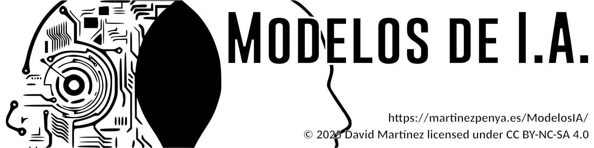

# Introducción

## Título del curso

AWS Academy: Primeros Pasos y Creación de Entornos en la Nube

## Objetivos Generales

Acercar la nube de Amazon a través de la plataforma AWS Academy para los docentes que nunca la han usado.

## Objetivos Específicos

- Acceder a la plataforma AWS Academy
- Gestionar el alta de docentes
- Crear cursos y entornos de aprendizaje (Learner labs)
- Conocer posibles aplicaciones a los ciclos de FP de Informática y comunicaciones.

## Contenidos

- ¿Qué es AWS Academy?
- Como inscribo a mi centro
- CPOC (¿Qué es y cuales son sus funciones?)
- Acceso de los docentes a AWS Academy
- Cursos en AWS Academy (conocer el entorno, crear y personalizar cursos y learner labs)
- Requisitos técnicos de acceso a la red
- Como monitorizar y hacer seguimiento del alumnado
- Aplicabilidad a los ciclos de FP de Informática y comunicaciones.

## Metodología

​	Para este curso aplicaremos una metodología práctica y activa, combinando breves explicaciones teóricas con demostraciones en vivo/grabadas en AWS Academy. Los docentes realizarán actividades prácticas para explorar la plataforma, crear cursos y configurar entornos de aprendizaje. Además, resolverán desafíos aplicados a sus áreas, permitiendo una experiencia formativa directa y útil para su labor educativa.

## Temporalización

El curso tiene una duración prevista de 30 horas, del 13/01/2025 al 23/02/2025

## Modalidad

Online.

## Dirigido a

Profesores de ciclos formativos de la familia de informática y comunicaciones

## Material Requerido para la formación

Ordenador con acceso a Internet.

## Datos de contacto con el Ponente

DAVID MARTINEZ PEÑA

d.martinezpena@edu.gva.es
