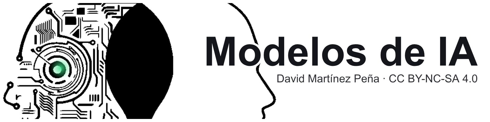

# 🚀 Información importante

## 📛 Denominación del curso

**📚 Curso de especialización de Inteligencia Artificial y Big Data**

🤖 Modelos de Inteligencia Artificial (MIA) · Código **5071** · **90 h** · 4 ECTS

!!! info "Curso 2026-2027"
    La docencia empieza el **1 de octubre de 2026** y el módulo termina el **28 de mayo de 2027**;
    junio se reserva a la **convocatoria ordinaria**. Las clases son de **lunes a jueves**: los
    viernes no hay clase y se aprovechan para las tareas y los talleres en casa.

    **Vacaciones**: Navidad del 22 de diciembre al 6 de enero · Pascua del 25 de marzo al 5 de
    abril.

    **Festivos que caen en día de clase**: 12 de octubre, 7 y 8 de diciembre, y **Fallas, 17 y 18 de
    marzo**. El 9 de octubre (Día de la Comunitat Valenciana) y el 19 de marzo caen en viernes, así
    que no afectan.

    Entre Fallas y Pascua, **marzo es el mes más interrumpido del curso**: tenlo en cuenta para
    planificar entregas.

## 📋 Contenidos y temporalización

Las unidades se imparten en este orden. El identificador `UDxx` va ligado a su resultado de
aprendizaje (UD05 es siempre RA5), no al orden en que se imparte.

<!-- AUTO:unidades inicio -->
| UD | Título | RA | Horas | Semanas | Fechas |
|---|---|---|---|---|---|
| UD00 | Presentación y curso rápido de Docker | — | 6 | 1-2 | 1 oct – 8 oct |
| UD01 | Caracterización de sistemas de IA | RA1 | 12 | 3-6 | 12 oct – 6 nov |
| UD02 | Modelos de IA y resolución de problemas | RA2 | 12 | 7-10 | 9 nov – 3 dic |
| UD05 | Sistemas expertos | RA5 | 12 | 11-15 | 7 dic – 14 ene |
| UD03 | Procesamiento del Lenguaje Natural | RA3 | 12 | 16-19 | 18 ene – 11 feb |
| UD04 | Análisis de sistemas robotizados | RA4 | 12 | 20-23 | 15 feb – 11 mar |
| UD06 | Principios legales y éticos de la IA | RA6 | 6 | 24-28 | 15 mar – 23 abr |
| UD07 | **Proyecto integrador (común al curso)** | RA7 | 15 | 29-33 | 26 abr – 28 may |
| Cierre | Presentaciones RA7 y prueba ordinaria (solo RA no superados) | — | 3 | 34-35 | 1 jun – 18 jun |
| | **Total** | | **90** | **30** nominales 33 con clase | |
<!-- AUTO:unidades fin -->

!!! note "Por qué este orden"
    La UD05 (sistemas expertos) se imparte justo después de la UD02 porque se construye sobre las
    reglas y la lógica difusa que se ven allí. Y la UD06 (ética) ocupa el tramo de Fallas y Pascua,
    el más fragmentado del curso, porque es la unidad con menos carga de laboratorio.

    El **contenido del módulo acaba a finales de abril**. Después viene el **proyecto intermodular
    (RA7)**, común a todo el curso de especialización: durante unas cinco semanas tu equipo trabaja
    el proyecto en las horas de todos los módulos.

## 🎯 Resultados de aprendizaje, pesos y calificación

<!-- AUTO:ra_pesos inicio -->
| RA | CE | Descripción | Nota mínima | Peso |
|---|---|---|---|---|
| **RA1** | 4 | Caracteriza sistemas de Inteligencia Artificial relacionándolos con la mejora de la eficiencia operativa de las organizaciones y empresas. | **5** | **13,33 %** |
| **RA2** | 6 | Utiliza modelos de sistemas de Inteligencia Artificial implementando sistemas de resolución de problemas. | **5** | **13,33 %** |
| **RA3** | 7 | Relaciona el procesamiento de lenguaje natural con sus aplicaciones determinando su potencial e identificando sus limitaciones. | **5** | **13,33 %** |
| **RA4** | 4 | Analiza sistemas robotizados, evaluando opciones de diseño e implementación. | **5** | **13,33 %** |
| **RA5** | 5 | Aplica sistemas expertos evaluando la influencia de los controladores inteligentes en el comportamiento del sistema. | **5** | **13,33 %** |
| **RA6** | 6 | Aplica principios legales y éticos al desarrollo de la Inteligencia Artificial integrándolos como parte del proceso. | **5** | **13,33 %** |
| **RA7** | 9 | Desarrolla un proyecto integrador que combine técnicas de IA y análisis de datos masivos para resolver un problema real o simulado, gestionando todo el ciclo de vida del proyecto. | **5** | **20 %** |
| | | | | **100 %** |

Cada RA se califica **1 a 10, sin decimales** (Orden 8/2025, art. 5.1): **40 %** tareas, talleres y ejercicios + **60 %** prueba escrita. Para superar el módulo hace falta **5 o más en cada RA**.
<!-- AUTO:ra_pesos fin -->

## 📝 Evaluación

- 🔍 La evaluación del módulo se realiza sobre los **Resultados de Aprendizaje (RA)** del currículo.
  Cada RA tiene asociados sus **criterios de evaluación (CE)**, que son los que determinan el grado
  de adquisición de las competencias del módulo.

- 📊 La nota final del módulo sale de la ponderación de los RA. Cada RA se evalúa de forma
  independiente, con **calificación de 1 a 10, sin decimales** (Orden 8/2025, art. 5.1).

- 📝 Cada RA tiene **una prueba en Moodle** al cerrar su unidad, con preguntas de test de cuatro
  opciones y preguntas de desarrollo. En las de test, una respuesta incorrecta **descuenta un
  tercio** del valor de la pregunta, así que responder al azar penaliza. Las preguntas se extraen
  aleatoriamente del banco: **cada alumno recibe un examen distinto**.

- ✅ Hay que obtener al menos un **5 en cada RA** para aprobar el módulo.

- 🔄 Si un RA queda por debajo de 5, se recupera con las actividades y pruebas diseñadas para **ese**
  resultado de aprendizaje. La convocatoria ordinaria de junio se dirige **solo a los RA no
  superados**: no hay prueba global del módulo.

- 🐳 La **UD00** (presentación y Docker) **no se califica**: el entorno de trabajo es un requisito.
  Sus tres entregables —los dos talleres y el notebook— se marcan como **hecho / no hecho**, sin
  nota pero **obligatorios**: son la prueba de que tienes el entorno operativo, y sin ellos no se
  pueden hacer las prácticas de la UD02.

!!! warning "Importante"
    - ❗ Aprobar las evaluaciones parciales **no garantiza** aprobar el módulo.
    - 📌 Puedes aprobar las dos evaluaciones con buena nota, tener **un solo RA suspendido** y
      suspender el módulo.

## 📜 Legislación vigente

- 📄 [RD 279/2021, de 20 de abril](https://www.boe.es/diario_boe/txt.php?id=BOE-A-2021-7686) — establece el curso de especialización y fija los **RA y CE** del módulo.
- 📄 [RD 497/2024, de 21 de mayo](https://www.boe.es/diario_boe/txt.php?id=BOE-A-2024-10682) — modifica determinados reales decretos de cursos de especialización.
- 📄 [Decreto 95/2026, de 9 de junio (DOGV)](https://dogv.gva.es/datos/2026/06/25/pdf/2026_21170_es.pdf) — currículo en la Comunitat Valenciana: fija el módulo en **90 h**.
- 🕒 [Horario y organización del curso (GVA)](https://ceice.gva.es/va/web/formacion-profesional/publicador-de-cursos-especialitzacio)
